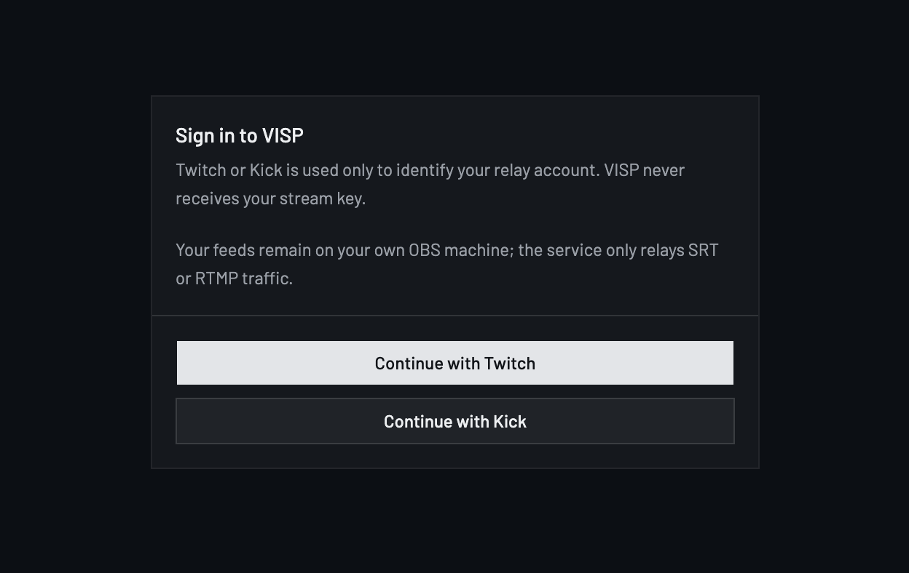
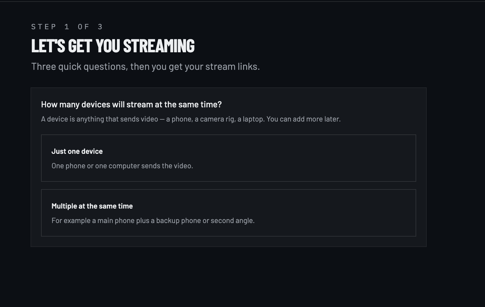
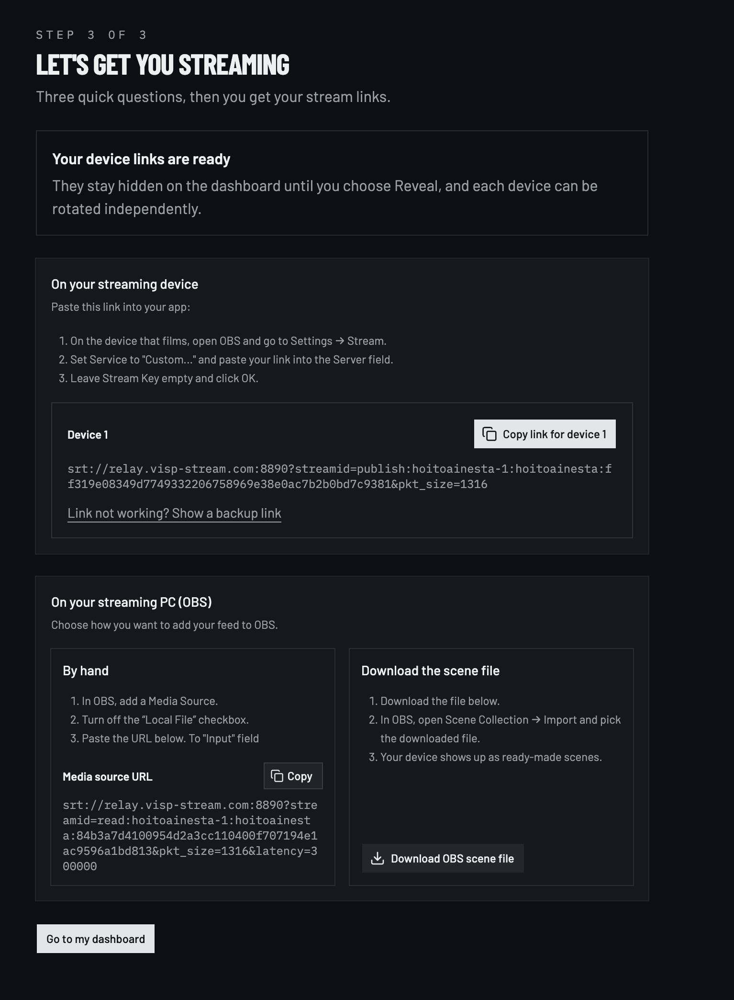
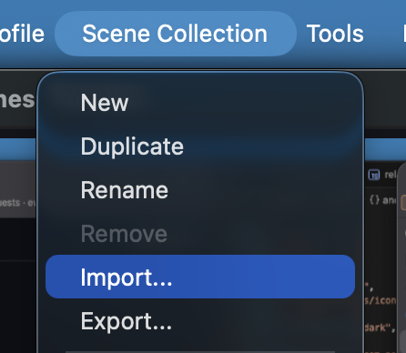
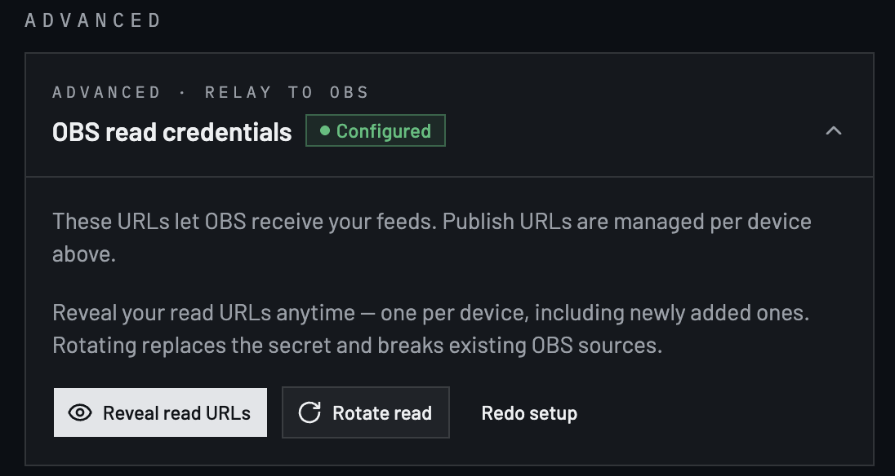
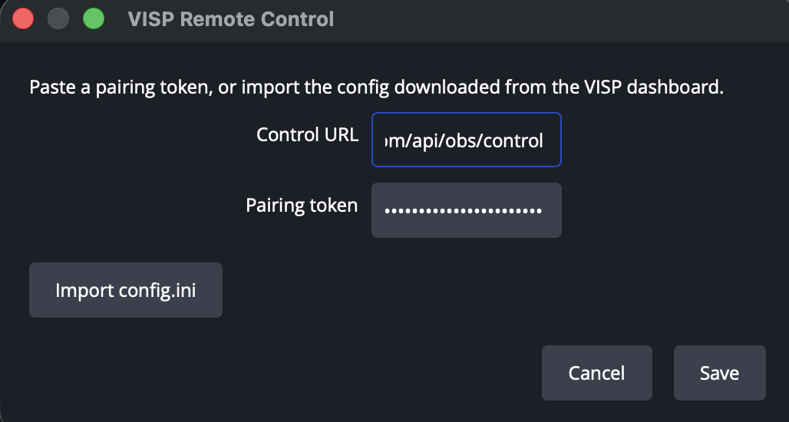
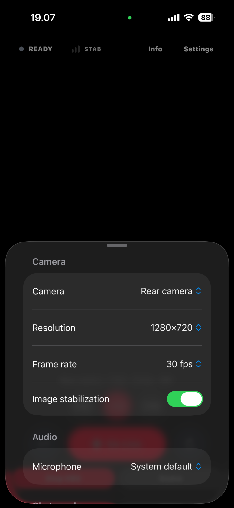
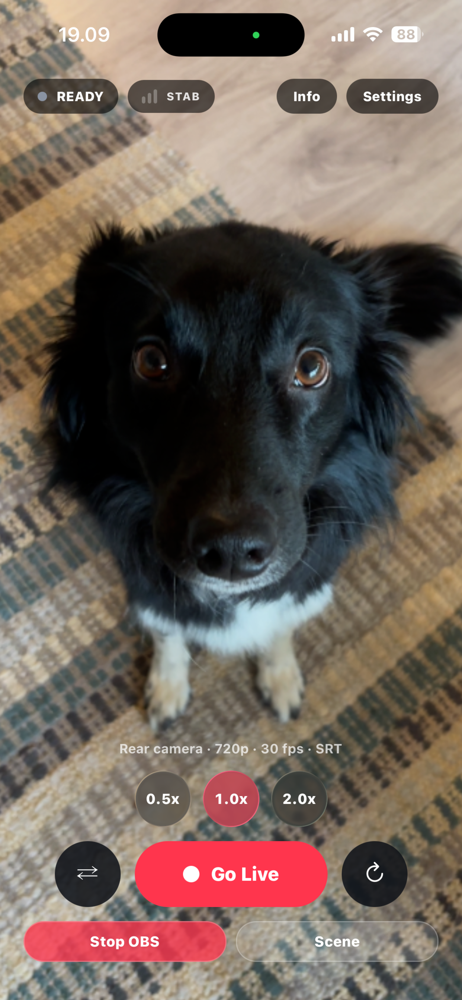
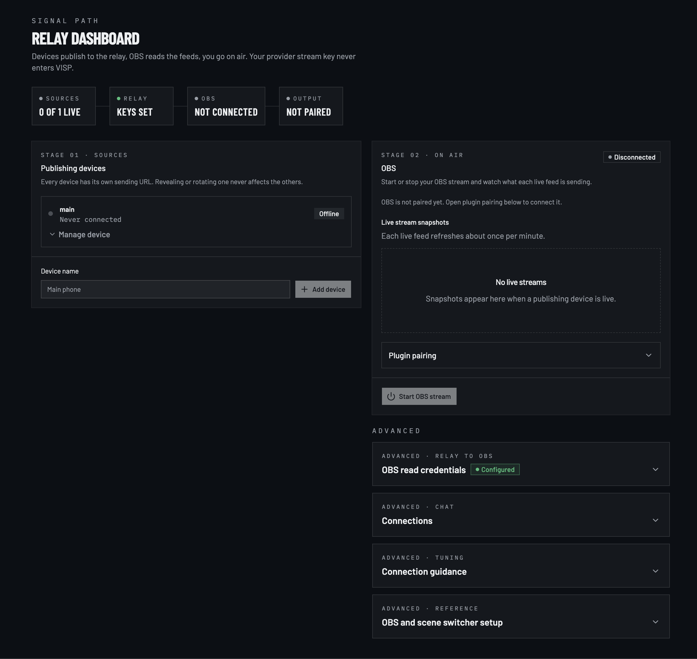
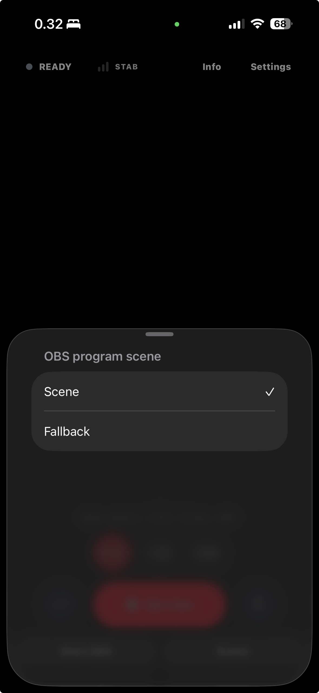

Your phone is the camera. Your existing OBS setup stays the studio. Follow
these steps once to reach first picture.

## 1. Sign in

Open [visp-stream.com](https://visp-stream.com), go to **Download & beta** if
you need client links, then sign in with Twitch or Kick. VISP uses that login
only to identify your account — it never receives your stream key.

## 2. Finish setup and download the OBS scene file

Answer the short setup questions (how many devices, what you stream with). When
credentials appear, download the **OBS scene file**. Keep that download — VISP
does not store the plaintext read secret for a later re-download.

## 3. Import the scenes into OBS

In OBS Studio, choose **Scene Collection → Import** and select the downloaded
JSON. You should see a **Fallback** scene plus one scene per publishing path,
each with a Media Source ready to reconnect automatically.

## 4. Pair the OBS plugin

Remote start, stop, and scene switching need the VISP plugin for OBS Studio 31.

1. Download the package for your OS from the project's
   [GitHub Releases](https://github.com/PohinaGroup/visp/releases), install it,
   and restart OBS.
2. In the VISP dashboard, open **OBS remote control** and generate a token.
3. In OBS, open **Tools → VISP Remote Control**, paste the token (or import
   `config.ini`), and save.

The dashboard should show **Connected** within a few seconds. OBS must already
have a streaming service and stream key configured — the plugin only presses
OBS's own start and stop.

## 5. Publish from a phone or browser

### Phone app

Install the iOS (TestFlight) or Android (Play internal) build from the
[download page](https://visp-stream.com/download). Sign in with the same Twitch
or Kick account. The app creates a publishing device for that phone
automatically — you do not paste a publish URL.

Pick the camera and microphone in settings, confirm **READY**, then tap
**Go Live**.

### Browser app

Prefer a quick test without installing? Open
[stream.visp-stream.com](https://stream.visp-stream.com) in current Chrome,
Edge, or Safari, sign in, and publish over WebRTC.

## 6. Confirm first picture

With the phone or browser live, select the imported device scene in OBS. The
Media Source should show your camera feed. If the preview is black, wait a few
seconds for SRT/WebRTC to connect, then check that the matching publishing
device is live in the dashboard.

## 7. Control OBS from your phone

When the plugin is paired, the phone app can switch scenes and start or stop
the home OBS stream. Open the OBS control UI, pick a scene (for example
**Scene** or **Fallback**), and confirm the change in OBS within about two
seconds.

A short signal drop does not end the destination broadcast by itself. Keep OBS
on a fallback scene while the phone reconnects — see
[Encoders and fallback](/docs/broadcaster-setup) for Advanced Scene Switcher
macros.

## What next

- [Phone and browser app](/docs/phone-app) — chat overlay, stream info, Watch
  companion, and troubleshooting.
- [OBS remote control](/docs/obs-remote-control) — security model and pairing
  recovery.
- [Encoders and fallback](/docs/broadcaster-setup) — Larix/Moblin, SRT latency
  probe, and automatic scene switching.
- [Self-hosting](/docs/self-hosting) — run your own relay instead of the hosted
  beta.
