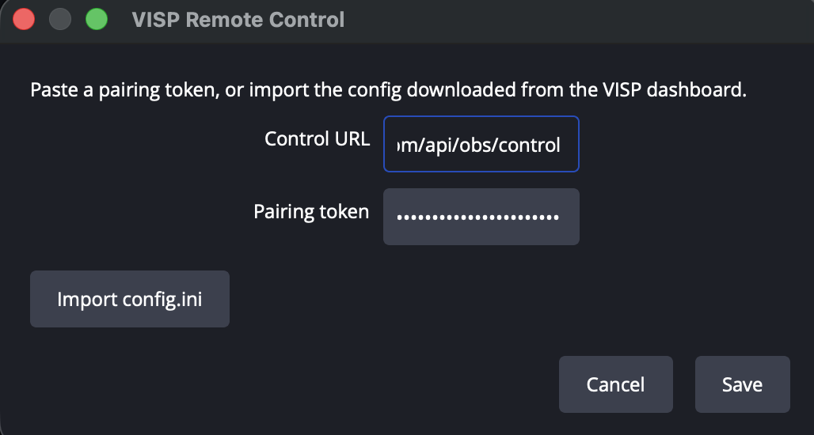

## 1. Sign in

Open [visp-stream.com](https://visp-stream.com), press **Try VISP free**, then sign in with Twitch, Kick, or Google. VISP uses that login
only to identify your account.

## 2. Authorize Direct

Choose Twitch, Kick, or YouTube, select your phone or browser source, and
authorize VISP to resolve the destination when output starts. Twitch and Kick
keys are never shown to the publisher or stored as separate values. YouTube
Direct creates a new public broadcast and uses its ingest destination.

The dashboard opens with Direct output first. Existing OBS-first users keep
their current behavior until they explicitly switch.

## 3. Publish from a phone or browser

Install the native app or open the browser publisher, sign in with the same
account, allow camera and microphone access, and press **Go Live**. VISP checks
provider authorization and relay encoder capacity before capture starts.

## 4. Verify Direct

Wait until every selected Direct output reports **Live**. A contribution
feed connected to the relay is not enough. You may skip this test, but the
setup remains marked unverified.

## 5. Optionally add OBS

After the Direct test succeeds, choose **Add this feed to OBS**. Install and
pair the OBS Studio 31 plugin for one-click Media Sources, or copy the provided
SRT read URL into an OBS Media Source manually. OBS receives the contribution
feed, not the distribution encode delivered to viewers.

1. Download the package for your OS from the project's
   [GitHub Releases](https://github.com/PohinaGroup/visp/releases), install it,
   and restart OBS.
2. In OBS, open **Tools → VISP Remote Control** and click **Sign in with
   browser**.
3. Sign in to VISP, approve the displayed code, and return to OBS.

## Publisher details

### Phone app

Install the iOS (TestFlight) or Android (Play internal) build from the
[download page](https://visp-stream.com/download). Sign in with the same Twitch,
Kick, or Google account. The app creates a publishing device for that phone
automatically.

Pick the camera and microphone in settings, confirm **READY**, then tap
**Go Live**.

### Browser app

Prefer a quick test without installing? Open
[stream.visp-stream.com](https://stream.visp-stream.com) in current Chrome,
Edge, or Safari, sign in, and publish over WebRTC.

### Confirm the optional OBS picture

With the phone or browser live, select the imported device scene in OBS. The
Media Source should show your camera feed. If the preview is black, wait a few
seconds for SRT/WebRTC to connect, then check that the matching video source is
live in the dashboard.

### Control optional OBS from your phone

When the plugin is paired, the phone app can switch scenes and start or stop
the home OBS stream. Open the OBS control UI, pick a scene (for example
**Scene** or **Fallback**), and confirm the change in OBS within about two
seconds.

You can also open
[remote.visp-stream.com](https://remote.visp-stream.com) in a browser for the
dedicated OBS Remote control surface.

A short signal drop does not end the destination broadcast by itself. Keep OBS
on a fallback scene while the phone reconnects — see
[Encoders and fallback](/docs/broadcaster-setup) for Advanced Scene Switcher
macros.

## What next

- [Phone and browser app](/docs/phone-app) — chat overlay, stream info, Watch
  companion, and troubleshooting.
- [OBS remote control](/docs/obs-remote-control) — security model and pairing
  recovery.
- [Encoders and fallback](/docs/broadcaster-setup) — Larix/Moblin, SRT latency
  probe, and automatic scene switching.
- [Self-hosting](/docs/self-hosting) — run your own relay instead of the hosted
  beta.
