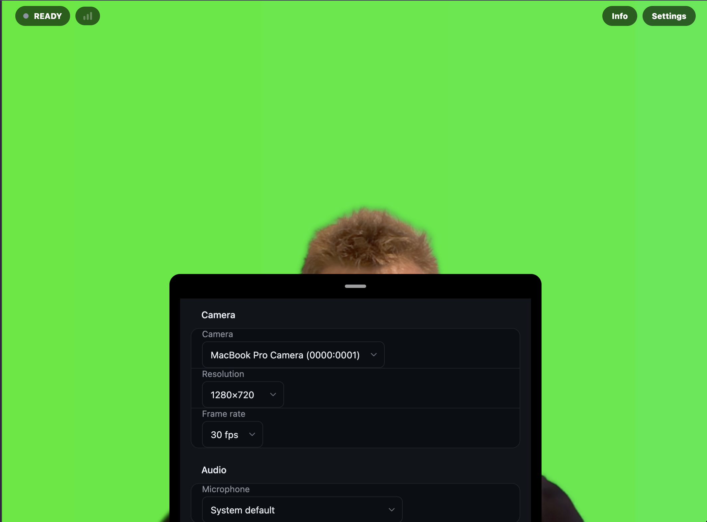
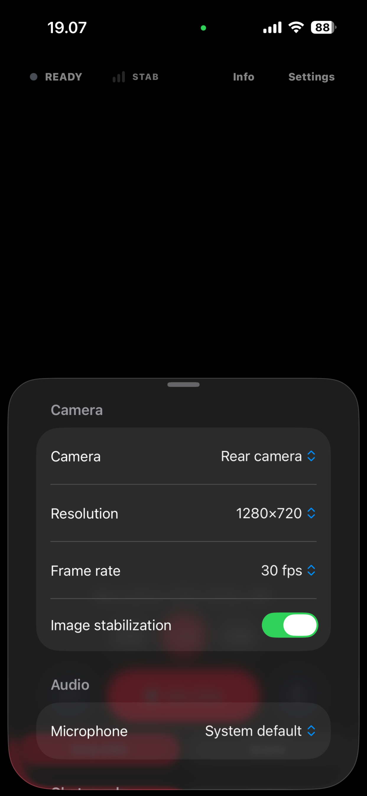
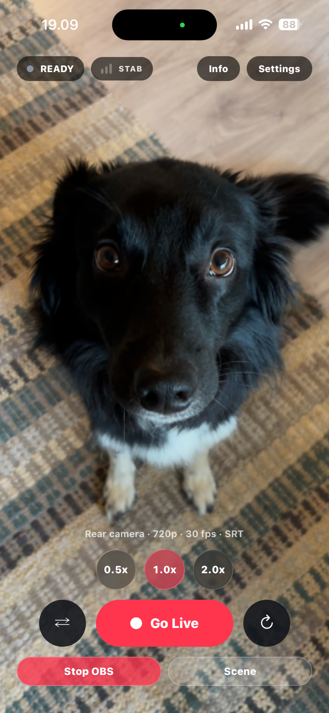
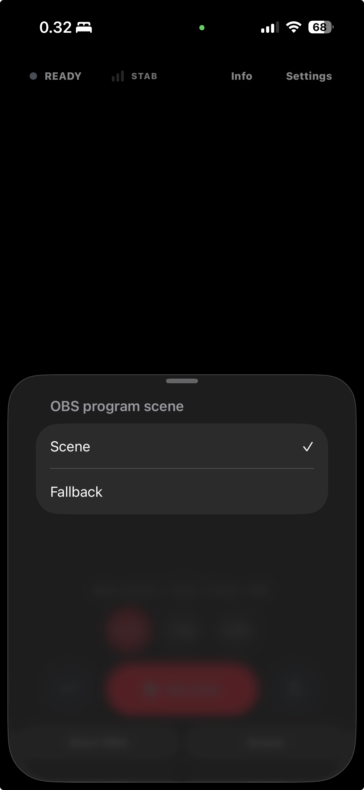

The VISP app publishes the selected camera and microphone over SRT to your
relay path. Direct sends that feed to Twitch or Kick. OBS can optionally read
the original contribution feed for monitoring, recording, and scenes.

For the first-run path — sign in, authorize Direct, go live, and optionally add
OBS — follow [Get started](/docs/get-started).

## Platforms

| Client | Requirement | Transport |
| --- | --- | --- |
| iOS app | iOS 16.4+, arm64 iPhone | SRT (H.264/AAC) |
| Android app | Android 7+ | SRT (H.264/AAC) |
| Browser app | Current Chrome, Edge, or Safari at `stream.visp-stream.com` | WebRTC (H.264/Opus) |

The iOS build ships through the `VISP Internal` TestFlight group and Android
through Play internal testing. Client links live on
[visp-stream.com/download](https://visp-stream.com/download). The browser app
is a static site served by the app host; it publishes over WHIP through the
relay's WebRTC port.

## Sign in and go live

1. Sign in with Twitch or Kick. The app creates a publishing device for this
   phone automatically and stores its publish URL in the platform's secure
   storage — you never copy credentials by hand.
2. Open settings to pick the camera, resolution, and frame rate, then go live.
   The stream appears in OBS as the corresponding relay path's Media Source.
3. Stopping releases the publisher and the media devices.

Each phone is its own publishing device: revoking or rotating one phone in the
portal never disconnects the others. Use two signed-in phones to feed two
scenes of the same broadcast, each with its own microphone.

A short signal drop does not end the broadcast. The home studio keeps the show
alive on its fallback scene (see
[Encoders and fallback](/docs/broadcaster-setup)) while the phone reconnects.

## Network bonding

The iOS and Android apps can send the same SRT packets over Wi-Fi and cellular
at the same time. The relay uses the first copy that arrives and discards
duplicates. This improves redundancy; it does not combine both links into a
faster connection.

Open **Settings → Network → Network bonding** to enable it. **Broadcast** is
the default and keeps both links active. Under **Advanced**, choose **Main +
backup** to prefer Wi-Fi and use cellular when the main link fails. The live
status shows Wi-Fi and cellular separately and marks the stream degraded when
only one remains.

Bonding can roughly double mobile data use. The app warns before the first
bonded stream. If bonding is off, publishing continues directly to UDP 8890
exactly as before.

## While live

- **Floating chat** overlays Twitch, Kick, and YouTube messages on the capture screen.
  Kick messages arrive through the server's webhook subscription, so they work
  without keeping a Kick tab open anywhere.
- **Viewer counts** show the current audience for each selected Direct output.
  A dash means the provider did not expose a current count.
- **Stream info sheet** edits the title and metadata on the provider without
  leaving the app.
- **OBS control** starts and stops the home OBS stream and switches scenes
  through the paired [OBS plugin](/docs/obs-remote-control). The control
  reflects whether OBS is currently connected.

## Apple Watch companion

The iPhone app forwards a live snapshot to the paired Apple Watch (watchOS 10+)
over WatchConnectivity: stream state and uptime, resolution and frame rate,
audio level tier, reconnect attempts, recent chat with provider status, and the
viewer counts for the selected Direct outputs, plus the OBS connection with its
scene list. Scene switching works from the wrist —
tapping a scene sends the command through the phone to the same OBS control
channel.

The Watch app is display-and-control only; it never holds credentials and
stops updating when the iPhone app is not running.

## Troubleshooting

- **Camera streaming needs a real device.** Simulators and Expo Go do not
  include the native SRT module; developers should build a development client
  as described in [Local development](/docs/development).
- **The browser app cannot connect.** WebRTC media uses UDP 8189 with a TCP
  fallback on the same port; a network that blocks both cannot publish from
  the browser.
- **OBS controls show disconnected.** Pair or re-pair the plugin — see
  [OBS remote control](/docs/obs-remote-control).
