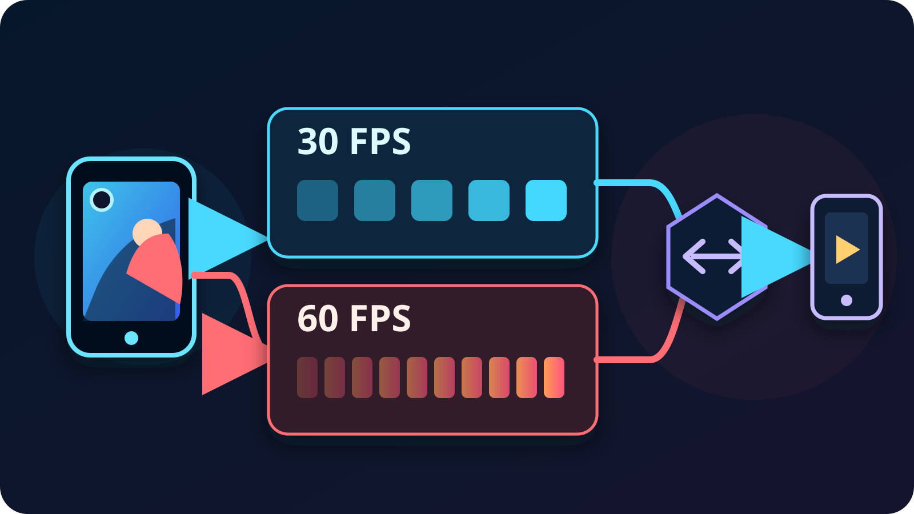

For most phone IRL streams, **start at 30 FPS**. It is the safer choice for
walking, chatting, travel, long sessions, cellular upload, and dim venues. Use
60 FPS when fast motion is central to the show—sports, cycling, rides, or quick
camera moves—and only after the phone, field connection, OBS computer, and
public Twitch or Kick output all pass a realistic test.

That choice is not about chasing the largest number. Frame rate is one part of
a complete phone-to-viewer path, and 60 FPS asks every part of that path to
handle twice as many frames.

## The short answer

| IRL stream | Start with | Why |
| --- | --- | --- |
| Walking, travel, Just Chatting, interviews | 30 FPS | Good motion with more room for mobile reliability and long sessions |
| Nightlife, indoor venues, or other dim scenes | 30 FPS | The camera has a longer frame interval to work with |
| Sports, cycling, fast rides, rapid pans | 60 FPS | Smoother motion can preserve action when the whole route is strong |
| Unstable cellular or an older phone | 30 FPS | Easier recovery step before lowering resolution or bitrate further |
| 60 FPS phone source but 30 FPS OBS output | 30 FPS | The final program cannot preserve the extra temporal detail |

Kick's current [mobile stream-quality
guide](https://help.kick.com/en/articles/15159752-settings-and-stream-quality-on-the-kick-go-live-app)
reaches the same practical conclusion: 30 FPS works well for most IRL content,
while 60 FPS is intended for fast motion and uses more bandwidth and battery.
Twitch's official [broadcasting
guidelines](https://help.twitch.tv/s/article/broadcasting-guidelines?language=en_US)
also publish separate 30 and 60 FPS profiles rather than treating 60 FPS as the
automatic default.

## What changes when you move from 30 to 60 FPS?

At 30 FPS, the camera produces 30 pictures each second. At 60 FPS, it produces
60. The higher rate makes motion steps shorter, so a fast subject or pan can
look smoother.

It does not automatically make the picture sharper. Resolution determines how
many pixels each frame contains, while bitrate limits how much compressed data
is available over time. If you keep the same bitrate and double the frame rate,
the encoder has more frames competing for that same data budget. A stable
720p30 contribution can therefore look cleaner than an underfunded 720p60 one.

The camera also has less time between frames. Apple exposes supported rates as
part of each camera format through
[`AVFrameRateRange`](https://developer.apple.com/documentation/avfoundation/avframeraterange),
including the minimum and maximum frame duration. Android exposes camera FPS
ranges through
[`CONTROL_AE_AVAILABLE_TARGET_FPS_RANGES`](https://developer.android.com/reference/android/hardware/camera2/CameraCharacteristics.html#CONTROL_AE_AVAILABLE_TARGET_FPS_RANGES).
Actual exposure remains device-managed, but the shorter 60 FPS frame interval
can make dim scenes a worse trade than daylight action.

## Why 30 FPS is the useful default for IRL

An IRL encoder is not sitting on a desk with fixed power and Ethernet. The
phone is simultaneously capturing, stabilizing, encoding, drawing a preview,
running chat, and sending over a connection that changes as you move.

Thirty FPS leaves more operating margin in the places that commonly fail:

- **Mobile upload:** Kick recommends lower bitrate ranges for 30 FPS than for
  equivalent 60 FPS formats. A lower sustainable target leaves room for cell
  changes and short congestion.
- **Phone workload:** Kick explicitly notes that 60 FPS uses more battery. Its
  troubleshooting order also includes dropping from 60 to 30 when a stream
  stutters.
- **Low light:** a longer frame interval gives the phone's automatic camera
  system more room than the shorter interval required by 60 FPS.
- **Long sessions:** less heat and battery pressure gives a walking stream a
  better chance of staying consistent. Use the [phone overheating
  guide](/blog/prevent-phone-overheating-irl-streaming) if temperature is
  already limiting the show.

Thirty FPS is not a low-quality mode. Interviews, city walks, food streams,
events, and conversational IRL content usually benefit more from a stable,
clean frame than from smoother motion during a few quick pans.

## When 60 FPS is worth testing

Choose 60 FPS because the content needs temporal detail, not because the phone
offers the switch. Good candidates include following a ball, filming a bike
route, moving through an amusement ride, or covering dance and other rapid
action.

Before keeping it, verify all four conditions:

1. The selected phone camera and resolution actually offer 60 FPS.
2. The real mobile route can sustain the higher contribution target with
   margin while moving.
3. OBS can render and encode the complete production at 60 FPS without lag.
4. The final Twitch or Kick program is also configured for 60 FPS.

OBS's [overview guide](https://obsproject.com/kb/obs-studio-overview) says its
common FPS value should match the desired output and warns that 60 FPS is much
more demanding than 30 FPS. Its official [encoding performance
guide](https://obsproject.com/kb/encoding-performance-troubleshooting) recommends
dropping from 60 to 30 when rendering or encoding cannot keep up.

If OBS outputs 30 FPS, feeding it 60 FPS from the phone does not make the public
program 60 FPS. Keep the phone at 30 unless another local use—such as a separate
recording—has been tested and genuinely needs the extra frames.

## How VISP handles frame rate

Open **Settings → Camera** in the VISP phone app while the stream is stopped.
Choose the camera and resolution first, then select one of the frame rates the
device reports for that exact combination. VISP does not invent a universal
60 FPS option: its native capture modules inspect camera formats and supported
rate ranges, and Android also checks hardware encoder support before showing a
choice.

The app prefers 1080p at 30 FPS when that combination exists. You must stop the
stream before changing resolution or frame rate. These details are visible in
the open-source [camera settings
logic](https://github.com/PohinaGroup/visp/blob/main/apps/native/src/lib/camera-settings.ts)
and the [phone app documentation](https://docs.visp-stream.com/docs/phone-app).

VISP then adapts the contribution bitrate to link health within a format
ceiling. The current [bitrate
logic](https://github.com/PohinaGroup/visp/blob/main/packages/api/src/link-stats.ts)
allows a higher ceiling for 1080p at 50/60 FPS than for 1080p30. That is a
ceiling, not a promise that a mobile connection can sustain it.

For the normal phone-to-OBS workflow, the relay does not transcode the feed.
OBS receives the H.264/AAC contribution the phone published. With VISP Direct,
the relay makes a separate distribution encode for each selected platform, so
the phone contribution and the public platform encode remain separate stages.

## Test 30 and 60 FPS on the route you will stream

Do not decide from the preview while standing beside Wi-Fi. Record two private
or low-stakes tests on the same route, at the same resolution, with the same
camera movement.

For each run:

1. Start with 30 FPS and use a conservative bitrate from the [IRL bitrate
   guide](/blog/best-bitrate-irl-streaming-phone-obs).
2. Walk the weak part of the route for at least ten minutes.
3. Watch VISP's live bitrate, RTT, and loss for the phone-to-relay checkpoint.
4. In OBS, inspect network dropped frames, rendering lag, and encoding lag
   separately.
5. Watch the public Twitch or Kick player from a muted second connection.
6. Repeat at 60 FPS without changing several other settings at once.

Keep 60 FPS only if motion looks meaningfully better and the stream stays
healthy after the phone warms up. If it fails, return to 30 FPS before buying
hardware or cutting the SRT recovery window. The [dropped-frames
guide](/blog/obs-dropped-frames-irl-streaming) helps identify whether the weak
checkpoint is the phone upload, relay-to-OBS read, OBS render, encoder, or home
upload.

## A practical setting order

When a mobile stream is unstable, change one variable at a time in this order:

1. lower the unsustainable bitrate;
2. switch 60 FPS to 30 FPS;
3. lower resolution if the route or phone still struggles;
4. keep a realistic SRT recovery window for measured RTT and loss;
5. re-test while moving and after the phone reaches normal stream temperature.

Do not turn off image stabilization merely to force an unsupported 60 FPS
combination. VISP shows stabilization only for camera, resolution, and frame-rate
combinations the device reports as compatible. If smooth walking footage is the
goal, compare the stable 30 FPS mode with the [phone stabilization
guide](/blog/stabilize-shaky-phone-irl-stream-obs) before sacrificing the
feature for a frame-rate number.

## Frequently asked questions

### Is 60 FPS always better for Twitch or Kick?

No. Both platforms support 30 and 60 FPS workflows. Sixty helps fast motion,
but 30 is usually the more resilient IRL choice on a phone and mobile network.

### Does 60 FPS use twice the data?

Not automatically. Data use follows the configured bitrate, not frame count
alone. However, 60 FPS generally needs a higher bitrate to preserve quality,
and Kick recommends higher bitrate ranges for its 60 FPS modes.

### Does 60 FPS reduce stream delay?

It shortens the interval between captured frames, but it does not remove SRT
recovery, OBS processing, platform delivery, or player buffering. Choose it for
motion, not as an end-to-end latency fix.

### Should the phone and OBS use the same frame rate?

Usually, yes. If the public OBS program is 30 FPS, a 30 FPS contribution avoids
spending phone and network resources on temporal detail the final output cannot
show. Test mixed-rate sources only when the production has a specific reason.

### Why does 60 FPS disappear at some resolutions?

Camera and encoder capabilities vary by phone, lens, and resolution. VISP lists
only combinations reported as supported by the current device.

## Sources and next steps

- [VISP phone app settings](https://docs.visp-stream.com/docs/phone-app)
- [VISP camera settings implementation](https://github.com/PohinaGroup/visp/blob/main/apps/native/src/lib/camera-settings.ts)
- [VISP adaptive bitrate ceilings](https://github.com/PohinaGroup/visp/blob/main/packages/api/src/link-stats.ts)
- [Twitch Broadcasting Guidelines](https://help.twitch.tv/s/article/broadcasting-guidelines?language=en_US)
- [Kick mobile stream quality](https://help.kick.com/en/articles/15159752-settings-and-stream-quality-on-the-kick-go-live-app)
- [OBS Studio Overview Guide](https://obsproject.com/kb/obs-studio-overview)
- [OBS Encoding Performance Troubleshooting](https://obsproject.com/kb/encoding-performance-troubleshooting)
- [Apple AVFrameRateRange](https://developer.apple.com/documentation/avfoundation/avframeraterange)
- [Android camera FPS ranges](https://developer.android.com/reference/android/hardware/camera2/CameraCharacteristics.html#CONTROL_AE_AVAILABLE_TARGET_FPS_RANGES)

If you want to test both modes on a real phone-to-studio route, [try
VISP](https://visp-stream.com), start with 30 FPS, and keep 60 only when the
motion improvement survives the whole Twitch or Kick preflight.
