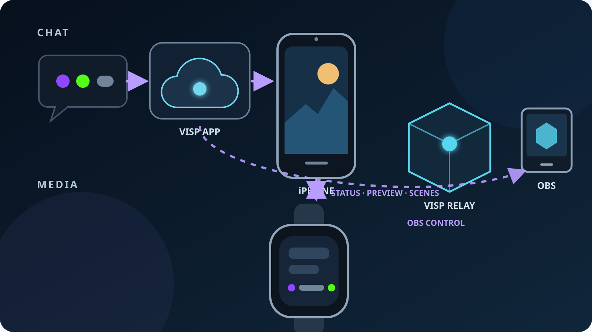

Apple Watchia voi käyttää Twitch- tai Kick-IRL-lähetyksen aikana, kun **VISP
pidetään auki paritetussa iPhonessa ja VISP avataan myös kellossa.** Kellon
näkymistä voi tarkistaa kameran esikatselun, chatin, lähetyksen kunnon ja OBS:n
kohtaukset. Näytöllä näkyvät kolme uusinta chat-viestiä, lähetyksen tila,
mikrofonitaso, videomuoto, Direct-katsojaluvut sekä paritetun OBS:n kohtaukset.

Kello on kenttämonitori ja pieni kohtausohjain, ei toinen enkooderi tai
täysimittainen OBS-kaukosäädin. iPhone kuvaa ja julkaisee lähetyksen edelleen.
Kello ei säilytä palveluiden tunnuksia, vastaa chatiin, moderoi katsojia eikä
käynnistä tai pysäytä OBS-lähetystä.

## Mitä Apple Watch -kumppanisovellus osaa?

| Kellon näkymä | Mitä se näyttää tai ohjaa? | Olennainen rajoitus |
| --- | --- | --- |
| Kamera | iPhonen kameran pienennetty esikatselu ja lähetyksen tila | Hitaan kuvataajuuden tarkistuskuva, ei tuotantomonitori |
| Chat | Kolme uusinta Twitch-, Kick- tai YouTube-viestiä lähettäjineen ja merkkeineen | Vain luku: ei vastaamista, hakua, moderointia tai historiaa |
| Kunto | Tila, kesto, mikrofonitaso, tarkkuus, kuvataajuus, yhteyden palautuminen ja Direct-katsojaluvut | Viiva tarkoittaa, ettei palvelu palauttanut ajantasaista lukua |
| OBS-kohtaukset | Nykyinen ohjelmakohtaus ja paritetun OBS-laajennuksen kohtausluettelo | Vain kohtausten vaihto; ei mikseriä, lähteitä, tallennusta tai lähetyksen käynnistystä |

Rajaus on tarkoituksellinen. Liikkuva kuvaaja voi vilkaista rajausta, havaita
uudelleenyhdistämisen, lukea tuoreen viestin tai vaihtaa OBS:n **BRB**-kohtaukseen
irrottamatta kättään pitkäksi aikaa kuvausrigistä. Tarkempi tuotantotyö tehdään
edelleen iPhonessa tai OBS:n ääressä.

Jos haluat ensisijaisesti chatin puhelimen näytölle, aloita oppaasta
[Twitch- ja Kick-chatin lukeminen yhdellä puhelimella](/fi/blog/twitch-kick-chat-phone-obs).
Jos ranneohjausta ei tarvita, puhelimessa on myös laajempi
[OBS-etäohjaus](/fi/blog/control-obs-phone-without-port-forwarding), jolla
lähetyksen voi käynnistää ja pysäyttää.

## Mitä tarvitset?

- VISPin natiivisovellusta käyttävän iPhonen ja siihen paritetun Apple Watchin,
  jossa on watchOS 10 tai uudempi
- Kelloon asennetun VISP-kumppanisovelluksen
- iPhonessa linkitetyn ja käyttöön otetun Twitch- tai Kick-chatin, jos haluat
  lukea viestejä
- Määritetyn VISP Direct -kohteen, jos haluat nähdä sen katsojaluvun
- OBS Studio 31:n ja paritetun VISP-laajennuksen, jos haluat vaihtaa kohtauksia
- Lyhyet, toisistaan erottuvat OBS-kohtausten nimet ja harjoitellun varakohtauksen

Apple Watch toimii tässä vain iPhonen kumppanina. Android-puhelin voi julkaista
VISPin kautta, mutta se ei voi toimia tämän watchOS-sovelluksen parina. Tarkista
nykyiset [puhelinsovelluksen vaatimukset](https://docs.visp-stream.com/fi/docs/phone-app)
ennen muun työnkulun rakentamista.

## 1. Valmistele iPhone-lähetys ensin

Tee iPhonen tavallinen käyttöönotto valmiiksi ennen kellon lisäämistä. Kirjaudu
sisään, valitse kamera, tarkkuus, kuvataajuus, mikrofoni ja kohde ja tee lyhyt
yksityinen testi. Kello peilaa käynnissä olevan sovelluksen hyödyllisiä tietoja;
se ei määritä kameraa tai lähetyskohdetta puolestasi.

Kotistudiotuotannossa seuraa
[puhelimesta OBS:ään -opasta](/fi/blog/use-phone-as-remote-camera-obs). iPhone
lähettää yhden H.264/AAC-syötteen VISPiin, relay välittää sen muuttamatta
enkoodausta ja OBS tuottaa Twitch- tai Kick-ohjelman. Ilman OBS:ää
[VISP Direct](/fi/blog/what-is-visp-direct) tekee relay-palvelimella erillisen
enkoodauksen jokaiseen valittuun kohteeseen.

Nämä kaksi reittiä selittävät Kunto-näkymän yhden yksityiskohdan: katsojaluvut
kuvaavat valittuja Direct-kohteita. Ne eivät mittaa erikseen jokaista OBS:n
lähetyskohdetta.

## 2. Ota Twitch- tai Kick-chat käyttöön iPhonessa

Avaa VISP-sovelluksessa **Settings → Advanced → Connections**. Linkitä kukin
seurattava palvelu ja ota sen chat erikseen käyttöön. Lähetä toisella tunnuksella
yksi testiviesti ja odota, että palvelun tila on yhdistetty, ennen kuin luotat
kelloon.

Twitch toimittaa lukuoikeuden
[`channel.chat.message`-EventSub-tilauksella](https://dev.twitch.tv/docs/eventsub/eventsub-subscription-types/#channelchatmessage),
joka edellyttää chatin lukuvaltuutusta. Kick dokumentoi vastaavan
[`chat.message.sent`-tapahtuman](https://github.com/KickEngineering/KickDevDocs/blob/main/events/event-types.md).
VISP välittää hyväksytyt viestit kirjautuneelle iPhonelle, joka sisällyttää
kolme uusinta kellolle lähetettävään tilannekuvaan.

Kellon chat on tarkoituksella tiivis. Se yhdistää viestin osat luettavaksi
tekstiksi, näyttää palvelun ja käyttäjämerkit ja rajaa viestin kahdelle riville.
Käytä vilkkaassa chatissa Twitchin tai Kickin omia moderointityökaluja. Kellolla
ei voi poistaa viestejä, antaa aikakatkaisua tai porttikieltoa, vastata eikä
palauttaa vanhempia viestejä.

## 3. Parita OBS ja yksinkertaista kohtausluettelo

Asenna VISP-laajennus OBS Studio 31:een ja parita se samaan VISP-tiliin, jotta
kohtauksia voi vaihtaa kellosta. Koko menettely löytyy
[OBS-etäohjauksen dokumentaatiosta](https://docs.visp-stream.com/fi/docs/obs-remote-control).
Laajennus raportoi nykyisen ohjelmakohtauksen ja kohtausten nimet suojatulla,
ulospäin avatulla yhteydellä, joten OBS:lle ei tarvita reitittimen saapuvaa
porttia.

OBS sisältää myös paljon laajemman WebSocket-ohjausjärjestelmän. Sen virallinen
[Remote Control Guide](https://obsproject.com/kb/remote-control-guide) kuvaa
rajapinnan ja suosittelee salasanasuojausta. Käytä sitä, kun tarvitset mikserin,
lähteiden, suodattimien, tallennuksen tai automaation ohjausta. VISPin
kellosovellus on rajatumpi kenttäratkaisu: se valitsee vain paritetun
VISP-laajennuksen ilmoittaman ohjelmakohtauksen.

Nimeä toimintokohtaukset uudelleen ennen harjoitusta. **Field**, **Wide**,
**BRB** ja **End** erottuvat pienellä näytöllä varmemmin kuin pitkät nimet,
joiden ero on vasta lopussa. Kello merkitsee nykyisen kohtauksen, estää uuden
pyynnön edellisen vaihdon aikana ja näyttää virheen, jos OBS ei ole verkossa tai
on varattu.

## 4. Avaa VISP molemmilla laitteilla

Käynnistä VISP iPhonessa ja avaa sitten kumppanisovellus Apple Watchissa.
Pyyhkäise sen neljän näkymän välillä:

1. **Kamera** varmistaa sommittelun pienennetyillä esikatselukuvilla.
2. **Chat** näyttää yhdistetyt palvelut ja kolme uusinta viestiä.
3. **Kunto** näyttää lähetyksen tilan ja keston, mikrofonitoiminnan,
   videomuodon, katsojaluvut ja yhteyden palautumistiedot.
4. **OBS-kohtaukset** merkitsee nykyisen ohjelmakohtauksen ja lähettää
   vaihtopyynnön.

Pidä iPhone-sovellus käynnissä etualalla, jotta kellon tiedot pysyvät
reaaliaikaisina. VISP siirtää pieniä tilannekuvia Applen Watch Connectivity
-kehyksen kautta ja lähettää esikatselukuvia vain kellosovelluksen ollessa
tavoitettavissa. Apple määrittelee
[`isReachable`](https://developer.apple.com/documentation/watchconnectivity/wcsession/isreachable)-tilan
vastasovellusten reaaliaikaisen viestinnän saatavuudeksi. Se ei lupaa
vuorovaikutteisen ohjausyhteyden jatkuvan kahden suljetun sovelluksen välillä.

Kumppanisovellus ei säilytä erillisiä Twitch-, Kick- tai OBS-tunnuksia. Apple
kuvaa Watch Connectivityn iOS-sovelluksen ja siihen paritetun watchOS-sovelluksen
kaksisuuntaiseksi tiedonsiirtokanavaksi. Tässä toteutuksessa kello vastaanottaa
iPhonelta tiiviitä tilannekuvia ja lähettää kohtauspyynnön takaisin saman
parilaitekanavan kautta.

## 5. Harjoittele ranteesta käytettävä työnkulku

Tee yksi päästä päähän -harjoitus ennen julkista lähetystä:

1. Käynnistä iPhonesta yksityinen tai muuten turvallinen testi.
2. Varmista, että Kamera-näkymä päivittyy ja vastaa aiottua rajausta.
3. Puhu normaalisti ja tarkista, että Kunto-näkymän mikrofonitaso liikkuu.
4. Lähetä yksi Twitch- ja yksi Kick-testiviesti, jos molemmat ovat käytössä.
5. Vaihda **Field**-kohtauksesta harmittomaan testikohtaukseen ja varmista
   ohjelmakuva OBS:ssä.
6. Katkaise iPhonen verkkoyhteys lyhyesti ja varmista, että yhteyden
   palautumistieto näkyy samalla, kun OBS pitää varakohtauksen lähetyksessä.
7. Sulje VISP iPhonessa ja opettele kellon **Open VISP on iPhone** -tila.

Kameran pieni esikatselu ei todista, että katsojat saavat terveen kuvan. Se
varmistaa paikallisen kuvausreitin. VISPin live-tila kuvaa puhelinjulkaisijaa,
kun taas OBS ja palvelun hallintapaneeli varmistavat ketjun myöhemmät osat.
Opas
[IRL-lähetyksen pudonneiden ruutujen paikantamiseen](/fi/blog/obs-dropped-frames-irl-streaming)
avaa nämä tarkistuspisteet.

## Käytä yhtä yksinkertaista live-rutiinia

Tee kellosta lähetyksen aikana nopea poikkeamamonitori, älä uutta
hallintapaneelia:

- Tarkista **Kunto**, kun puhelin värisee, kuva vaikuttaa viivästyvän tai chat
  kertoo ongelmasta.
- Tarkista **Chat**, kun tarvitset uusimman viestin peittämättä iPhonen
  kameraesikatselua.
- Käytä **OBS-kohtauksia** harjoiteltuun siirtymään **BRB**-, **Wide**- tai
  **Field**-kohtaukseen.
- Palaa iPhoneen tai ota yhteys kotituottajaan kaikkea monimutkaisempaa varten.

Kohtauskomento tarvitsee tavoitettavan kellon ja iPhonen välisen istunnon,
käynnissä olevan VISP-sovelluksen, VISP-palvelun, yhdistetyn OBS-laajennuksen ja
OBS-tietokoneen. Jos jokin lenkki puuttuu, lopeta komentojen toistaminen ja käytä
varasuunnitelmaa. VISP ei voi tehdä katkenneesta ohjausreitistä hätätakuuta.

## Usein kysyttyä

### Voiko Apple Watch lähettää yksin Twitchiin tai Kickiin?

Ei. Kumppanisovellus ei kuvaa eikä julkaise ohjelmaa. iPhone on enkooderi;
VISP välittää sen syötteen OBS:ään tai enkoodaa määritetyt Direct-kohteet.

### Voiko OBS-lähetyksen käynnistää tai pysäyttää kellosta?

Ei tällä hetkellä. Kellolla voi vaihtaa ohjelmakohtauksen. Käynnistä ja pysäytä
lähetys VISPin iPhone-ohjaimesta tai OBS:n äärestä.

### Miksi kello näyttää vain kolme chat-viestiä?

Kumppanisovellus on suunniteltu nopeisiin vilkaisuin kentällä, joten iPhone
lähettää sille vain kolme uusinta viestiä. Käytä historiaan ja moderointiin
puhelinta tai palvelun hallintapaneelia.

### Miksi katsojaluvun kohdalla on viiva?

Valittu Direct-palvelu ei palauttanut ajantasaista lukua. Viiva tarkoittaa
tuntematonta arvoa, ei nollaa. Vain OBS:n kautta kulkeva kohde ei kuulu tähän
Direct-laskentareittiin.

### Toimiiko kello, kun VISP on suljettu iPhonessa?

Vuorovaikutteista työnkulkua ei pidä rakentaa sen varaan. Kellolla voi olla
viimeisin sovellustilannekuva, mutta live-esikatselu ja kohtauskomennot
edellyttävät paritetun iPhone-sovelluksen tavoitettavuutta. VISP näyttää
**Open VISP on iPhone** sen sijaan, että vanha tieto esitettäisiin
reaaliaikaisena.

## Lähteet ja seuraava askel

- [VISP: Puhelin- ja selainsovellus](https://docs.visp-stream.com/fi/docs/phone-app)
- [VISP: OBS-etäohjaus](https://docs.visp-stream.com/fi/docs/obs-remote-control)
- [Apple: Watch Connectivity](https://developer.apple.com/documentation/watchconnectivity)
- [Apple: `WCSession.isReachable`](https://developer.apple.com/documentation/watchconnectivity/wcsession/isreachable)
- [Twitch: EventSub-tilaustyypit](https://dev.twitch.tv/docs/eventsub/eventsub-subscription-types/#channelchatmessage)
- [Kick: Tapahtumatyypit](https://github.com/KickEngineering/KickDevDocs/blob/main/events/event-types.md)
- [OBS: Remote Control Guide](https://obsproject.com/kb/remote-control-guide)

Jos haluat tarkistaa kenttätilanteen ranteesta siirtämättä tuotantoa puhelimeen,
[kokeile VISPiä](https://visp-stream.com/download), parita Apple Watch
-kumppanisovellus ja harjoittele yksi chat-viesti, yksi yhteyden palautuminen ja
yksi turvallinen OBS-kohtauksen vaihto ennen seuraavaa Twitch- tai Kick-lähetystä.
