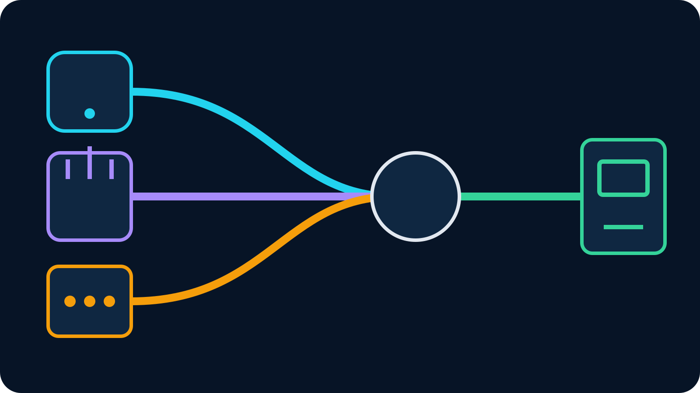

Paras BELABOX-vaihtoehto riippuu siitä, mitä olet oikeastaan korvaamassa. Jos
tarvitset pienen kenttäkameran kotona pyörivään OBS-studioon, puhelin ja VISP
voivat olla helpoin vastaus. Jos usean yhteyden kapasiteetti pitää yhdistää
yhdeksi lähetysyhteydeksi, tarvitset SRTLA-sovelluksen tai muun aidon
bondausratkaisun. Kun vaatimus on tuettu laite ja hallittu palvelu,
ammattimainen kenttäenkooderi on läheisempi korvaaja.

BELABOX yhdistää tehokkaan enkoodauksen, mukautuvan bittinopeuden, SRTLA:n,
yhteensopivan laitteiston ja pilvireleen. Yksikään vaihtoehto ei automaattisesti
ole parempi kaikissa näissä tehtävissä. Nimeä ensin vika, josta lähetyksen on
selvittävä, ja valitse pienin työn todella hoitava kokonaisuus.

## Pikavastaus: valitse tehtävän mukaan

| Tarve | Vahva lähtökohta | Miksi |
| --- | --- | --- |
| Puhelin toistuvaksi kenttäkameraksi koti-OBS:ään | Puhelin + VISP | Vähän lisäosia, pysyvä laitepolku ja striimiavaimet säilyvät OBS:ssä |
| Wi-Fi- ja mobiilikapasiteetin yhdistäminen | SRTLA-sovellus + yhteensopiva vastaanotin | Aito monitieyhteys voi käyttää molempia linkkejä |
| Oma säädettävä kenttäenkooderi | BELABOX tai muu DIY-enkooderi | Vaihdettavat osat ja yksityiskohtainen siirron hallinta |
| Integroitu ja tuettu laite | LiveU Solo tai vastaava | Laitteisto, bondauspalvelu ja tuki samassa paketissa |
| Vieras selaimella studioon | VDO.Ninja | Nopea selainliittyminen ja vuorovaikutteinen WebRTC sopivat paremmin |

Taulukko ei ole ominaisuuskilpailu. Puhelin voi olla ammattimainen valinta, jos
yksi yhteys tavallisesti riittää. Bondattu laite on perusteltu, kun reittitesti
osoittaa, ettei yksikään operaattori kanna valittua bittinopeutta yksin.

## Minkä ongelman BELABOX ratkaisee

Virallinen [BELABOX belacoder -projekti](https://github.com/BELABOX/belacoder)
kuvaa GStreamer-pohjaisen enkooderin, SRT-lähdön ja dynaamisen bittinopeuden.
Erillinen [SRTLA-projekti](https://github.com/BELABOX/srtla) jakaa yhden
SRT-striimin usealle verkkolinkille ja kokoaa sen yhteensopivassa
vastaanottimessa. Kyse on kapasiteetin yhdistämisestä ja redundanssista, ei vain
kaikkien pakettien lähettämisestä kahteen kertaan.

BELABOX sopii tekijälle, joka liikkuu vaihtelevissa mobiiliverkoissa ja haluaa
hallita kameraa, modeemeja, antenneja, virtaa ja jäähdytystä. Samalla käyttäjä
omistaa enemmän integraatiotyötä. Virallinen [DIY-ohje](https://github.com/BELABOX/tutorial)
käsittelee tuettuja kokoonpanoja ja kehottaa epävarmaa rakentajaa odottamaan sen
sijaan, että osat valitaan arvaten.

Kirjoita ennen vaihtoehdon etsimistä muistiin tärkein osa: erillinen
HDMI-kaappaus, SRTLA-bondaus, dynaaminen bittinopeus, hallittu vastaanotin vai
vain luotettava kuva OBS:ssä. Yhden todellisen tarpeen korvaaminen on yleensä
helpompi testata kuin koko järjestelmän kopioiminen.

## Vaihtoehto 1: puhelin ja VISP

Jos sinulla on jo hyvä puhelin ja OBS-kone kotona, VISP tekee puhelimesta
tunnistetun videolähteen. Puhelin julkaisee ulospäin VISP-releelle ja OBS lukee
erillistä vastaanotto-osoitetta. Twitch- tai Kick-kohde, scenet, alertit,
tallennus ja lopullinen enkoodaus jäävät OBS:ään.

Kentältä poistuvat kaappauskortti, yhden piirilevyn tietokone, USB-modeemihubi
ja erikoiskotelo. Ratkaisu sopii kaupunkikävelyihin, tapahtumiin ja satunnaisiin
IRL-lähetyksiin, joissa yksi testattu yhteys kantaa maltillisen bittinopeuden.
Katso koko polku [videolähteen ohjeesta](https://docs.visp-stream.com/docs/video-source)
ja [puhelin OBS-kamerana -oppaasta](/blog/use-phone-as-remote-camera-obs).

Raja on tärkeä. VISP Native voi lähettää paketeista kopiot Wi-Fi- ja
mobiiliyhteydellä vikasietoisuutta varten, mutta se ei laske linkkien
kapasiteetteja yhteen. Jos kumpikaan yhteys ei yksin kanna lähetystä,
päällekkäiset paketit eivät muodosta suurempaa putkea.

VISPin nykyinen kolmannen osapuolen enkooderipolku tarjoaa myös
SRTLA-vastaanoton. SRTLA-lähetin voi siis yhdistää puhelimen verkkolinkkejä
releelle. Tämä ei muuta VISP Nativen pakettien kahdennusta bondaukseksi: kyse on
kahdesta eri lähettimestä ja eri siirtotavasta.

## Vaihtoehto 2: Moblin tai IRL Pro SRTLA:lla

Sovelluspohjaisessa SRTLA-ratkaisussa puhelin pysyy kamerana ja enkooderina,
mutta mukaan tulee aito monitieyhteys. Moblin dokumentoi SRTLA:n sekä
mobiili-, Wi-Fi- ja Ethernet-yhteyksien yhtäaikaisen käytön. IRLToolkit
dokumentoi IRL Pron SRTLA-mobiilienkooderina. Yhteensopiva vastaanotin voi
jakaa kuvalähteen liikennettä käytettäville linkeille.

VISP näyttää laitteen Advanced-näkymässä SRTLA-julkaisuosoitteen. Rele kuuntelee
UDP-porttia 5000, kokoaa lähteen ja tarjoaa normaalin lukuosoitteen OBS:lle.
Ajantasaiset osoite- ja vastaanotintiedot ovat [enkooderi- ja varakuvauksen dokumentaatiossa](https://docs.visp-stream.com/docs/broadcaster-setup).
Androidilla jatka [IRL Prosta OBS:ään -ohjeeseen](/blog/irl-pro-obs-srt),
iPhonella [Moblin-oppaaseen](/blog/moblin-remote-camera-obs-srt).

Tämä on kevyt ja läheinen vaihtoehto, kun BELABOXissa kiinnostaa bondaus eikä
erillinen laitteisto. Puhelimen lämpö, akku, ergonomia, lisälaitteiden reititys
ja käyttöjärjestelmä jäävät silti testattaviksi. Kaksi verkkoikonia ruudulla ei
vielä todista kahden itsenäisen reitin kuljettavan hyödyllistä dataa.

## Vaihtoehto 3: pidä BELABOX mutta pienennä rakennetta

Jos sekä erillinen HDMI-kaappaus että SRTLA ovat kovia vaatimuksia, BELABOXin
poistaminen voi tarkoittaa saman järjestelmän rakentamista uudelleen heikommalla
dokumentaatiolla. Pienempi BELABOX-kokoonpano voi olla paras ratkaisu.

Aloita yhdellä tuetulla kaappauksella, yhdellä verkolla ja yhdellä
vastaanottimella. Todista vakaa kuva OBS:ssä. Lisää vasta sitten toinen
itsenäinen linkki, akku, kotelo ja oikea reitti yksi muuttuja kerrallaan.
[DIY BELABOX -opas](/blog/diy-belabox-setup-complexity) avaa päätökseen kuuluvan
Linux-, modeemi-, virta- ja reletyön.

BELABOX on vahvempi valinta, kun haluat erillisen säädettävän enkooderin ja olet
valmis ylläpitämään sitä. Puhelin on yksinkertaisempi, koska se tekee vähemmän,
ei siksi että se salaa korvaisi laatikon jokaisen tehtävän.

## Vaihtoehto 4: hallittu kenttälaitteisto

LiveU Solo ja vastaavat tuotteet sopivat tekijälle, joka haluaa integroidun
enkooderin ja hallitun bondauspalvelun DIY-järjestelmän sijasta. Virallinen
[Solo PRO -yleiskuvaus](https://solohelp.liveu.tv/hc/en-us/articles/16672822061339-Overview-of-the-Solo-PRO)
kuvaa siirrettävän laite-enkooderin, jota käytetään LiveUn pilvipalvelun kanssa.
Palvelumalli voi olla perusteltu, jos lähetyksellä on asiakkaita, määräaikoja
tai tuloja ja toimittajan tuki on arvokkaampi kuin osien vapaa säätö.

Kyse ei ole halvasta puhelinkorvikkeesta vaan eri toimintamallista. Vertaa
nykyiset laite-, palvelu- ja datavaatimukset suoraan toimittajalta, älä vanhaan
foorumihintaan. Laajempi [VISP-, BELABOX- ja LiveU Solo -vertailu](/blog/visp-vs-belabox-vs-liveu-solo)
auttaa roolien valinnassa.

## Entä VDO.Ninja tai suora puhelinsovellus?

VDO.Ninja on erinomainen vaihtoehto, kun oikea tehtävä on saada etävieras
nopeasti mukaan. Vieras avaa selainlinkin ja OBS vastaanottaa WebRTC-kuvan
Browser Sourcena. Se ei korvaa laitteistobondausta. Lue
[VDO.Ninja-vaihtoehto-opas](/blog/vdo-ninja-alternative-obs), jos vuorovaikutus
ja selainkäyttö ovat pysyvää kenttäenkooderia tärkeämpiä.

Alustan oma mobiilisovellus voi puolestaan olla pienin yhden kameran ratkaisu.
Se poistaa koti-OBS:n ja releen riippuvuudet, mutta puhelin omistaa
kohdeyhteyden. Kotistudion scenet, tallennus, paikallinen varakuva ja operaattori
jäävät pois. Suora lähetys ei ole huonompi, vaan erilainen tuotanto.

## Testaa reitti ennen ostosta

Tee harjoitus oikeassa paikassa oikealla kameralla, bittinopeudella,
kuvataajuudella, virtalähteellä ja kiinnityksellä. Toista samaan aikaan
vuorokaudesta kävellen suunniteltu reitti. Olohuoneen nopeustesti ei näytä
tukiasemavaihtoja, yleisöruuhkaa tai lämpökuristusta.

Etene tässä järjestyksessä:

1. Laske bittinopeutta, kunnes yhdellä yhteydellä on toistuva marginaali.
2. Lisää SRT-viivettä niin, että pakettihäviölle ja jitterille jää korjausaikaa.
3. Pidä OBS käynnissä paikallisella varascenellä lähteen yhdistäessä uudelleen.
4. Lisää toinen itsenäinen verkko, kun yhden operaattorin katoaminen on mitattu
   vika.
5. Siirry erilliseen laitteeseen, kun puhelimen lämpö, käyttöaika tai kaappaus on
   mitattu raja.

## Käytännön suositus

Valitse puhelin ja VISP, kun sinulla on OBS, haluat pysyvät nimetyt kamerapolut
ja yksi linkki riittää. Lisää SRTLA-sovellus ja vastaanotin, kun testi todistaa
yhdistämisen tarpeen. Rakenna BELABOX, kun säädettävä kenttäenkooderi on itse
tavoite. Valitse hallittu laite, kun tuki on osien omistamista tärkeämpää.

Jos puhelin–kotistudio-polku sopii, [kokeile VISPiä](https://app.visp-stream.com)
yhdellä lähteellä ja yhdellä realistisella reitillä. Testi kertoo, tarvitsetko
kevyemmän vaihtoehdon vai ratkaisiko BELABOX oikean ongelman alun perin.
