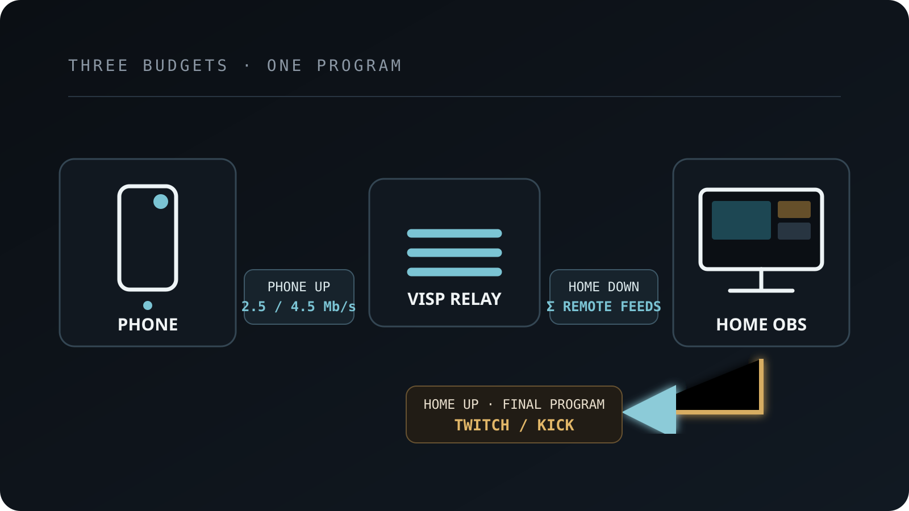

For most phone-to-OBS IRL streams, **start with 720p30 at about 2,500 kbps on
cellular. Move to 1080p30 at about 4,500 kbps only after the real route can hold
that rate with margin.** A stable 720p feed gives OBS more usable pictures than
a sharper feed that repeatedly stalls, reconnects, or arrives too late for SRT
to repair.

Those numbers describe the **contribution feed from the phone**, not the final
bitrate OBS sends to Twitch or Kick. The two internet legs have different
jobs, different bottlenecks, and separate bitrate settings. Keeping them
separate is the most important idea in this guide.

## The short answer: use the lowest format that preserves the content

Use this as a practical starting point for one remote phone:

| Phone network and content | Start with | Contribution video bitrate |
| --- | --- | ---: |
| Moving IRL stream on cellular | 720p30 | 2,500 kbps |
| Stable Wi-Fi, interviews, or detail that matters | 720p30 | 3,500 kbps |
| Tested strong cellular with useful upload margin | 1080p30 | 4,500 kbps |
| Tested stable Wi-Fi or wired encoder | 1080p30 | 6,000 kbps |
| Fast motion on a controlled connection | 1080p60 | 8,000 kbps |

These are starting points, not promises. They match VISP's current connection
guidance model: cellular gets a lower target, and 1080p60 is not recommended
there. The [open-source guidance
implementation](https://github.com/PohinaGroup/visp/blob/main/packages/api/src/relay.ts)
uses 2,500 kbps for cellular 720p30 and 4,500 kbps for cellular 1080p30. The
VISP phone app uses format ceilings of 3,500 kbps for 720p, 6,000 kbps for
1080p30, and 8,000 kbps for 1080p60, then adjusts to link conditions; its
[bitrate logic is public](https://github.com/PohinaGroup/visp/blob/main/packages/api/src/link-stats.ts).

The platform guidance points in the same direction. Twitch's official
[broadcasting guidelines](https://help.twitch.tv/s/article/broadcasting-guidelines?language=en_US)
list 3,000 kbps for 720p30 and 4,500 kbps for 1080p30. Kick's current
[mobile quality guide](https://help.kick.com/en/articles/15159752-settings-and-stream-quality-on-the-kick-go-live-app)
places 720p30 in a 2,500–4,500 kbps range, 1080p30 in a 4,500–6,000 kbps range,
and specifically recommends 720p for IRL streams with frequent movement
because it is more stable than 1080p.

Platform recommendations describe streams sent to those platforms, while the
VISP numbers describe a source sent into OBS. They are not interchangeable
rules, but they are useful independent checks that the starting points are
reasonable for H.264 live video.

## Contribution bitrate and destination bitrate are different

In a VISP workflow, the phone does not send directly to Twitch or Kick:

1. the phone encodes its camera and uploads that contribution feed to VISP;
2. VISP relays the same feed to the home OBS computer;
3. OBS decodes it, combines it with scenes, alerts, local cameras, and audio;
4. OBS encodes one finished program and uploads that program to Twitch or Kick.

The phone's upload budget therefore controls whether the remote camera reaches
OBS. The home connection needs enough **download** for every remote feed and
enough **upload** for the single final program. A 4,500 kbps phone feed does not
automatically force OBS to stream at 4,500 kbps, and a 6,000 kbps OBS output
does not give a 2,500 kbps phone source more detail.

For two phones publishing at 2,500 kbps each, the home studio should expect
roughly 5,000 kbps of incoming video payload before audio, protocol overhead,
and SRT retransmissions. OBS still sends only one final program to the
platform. See the [multi-phone IRL guide](/blog/multi-phone-irl-stream-obs) for
the separate-source and credential setup.

This is also why a speed test at the home studio cannot validate the field
phone. Test both locations. The path that fails is not necessarily the path
with the smaller headline speed.

## How much upload speed should the phone have?

Do not set the video bitrate equal to the best upload result you saw once.
Live video also carries audio and protocol overhead, and SRT may retransmit
lost packets. More importantly, cellular capacity changes as the phone moves,
hands off between cells, enters buildings, competes with other devices, and
heats up.

Kick's current mobile guide recommends keeping the bitrate below half of
available upload speed. That is a useful conservative test gate for a mobile
contribution feed too:

| Contribution target | Conservative tested upload target |
| --- | ---: |
| 2,500 kbps | At least 5 Mbps |
| 3,500 kbps | At least 7 Mbps |
| 4,500 kbps | At least 9 Mbps |
| 6,000 kbps | At least 12 Mbps |
| 8,000 kbps | At least 16 Mbps |

Treat "tested upload" as a repeatable result on the actual route and at the
actual time of day—not the phone's 5G icon, the carrier's advertised peak, or
one test beside a tower. If the route occasionally falls below the target,
adaptive bitrate can trade detail for continuity. If it falls to zero, no
bitrate setting can carry the picture.

The [OBS connection troubleshooting
guide](https://obsproject.com/kb/stream-connection-troubleshooting/) makes the
same underlying diagnosis for the final output leg: dropped network frames
mean the connection is unstable or cannot keep up with the configured bitrate.
Lowering bitrate is the first useful isolation step, even when a speed test
looks fast.

## 720p30 is usually the better mobile default

Resolution is only valuable when the encoder has enough bits to describe every
frame and the network delivers those bits on time. IRL footage is difficult:
walking creates motion across most of the image, leaves and crowds create fine
detail, and low light adds sensor noise that also consumes bitrate.

At the same network quality, 720p30 asks the encoder to describe fewer pixels
than 1080p30. It leaves more room for motion, audio, retransmissions, and sudden
capacity changes. It also reduces encoding work and usually helps a phone stay
cooler over a long session.

Choose 1080p30 when viewers genuinely benefit from the detail: a static remote
interview, readable physical objects, a wide venue shot, or a controlled
connection that has already passed a long test. Do not choose it only because
the camera menu offers it. OBS can scale a 720p source inside a 1080p canvas;
that does not invent detail, but it preserves a production layout while the
field feed uses the safer format.

Choose 60 fps only when motion clarity is central and the complete chain has
been tested. Doubling frame rate gives the encoder half as much time per frame
and needs more bitrate, processing, radio time, and battery. Kick's mobile
guide says 30 fps is suitable for most IRL and conversational streams, while
60 fps is most useful for genuinely fast motion.

## Data use: what the bitrate costs per hour

Bitrate also predicts mobile data use. For video payload alone:

| Video bitrate | Approximate data per hour |
| --- | ---: |
| 2,500 kbps | 1.1 GB |
| 3,500 kbps | 1.6 GB |
| 4,500 kbps | 2.0 GB |
| 6,000 kbps | 2.7 GB |
| 8,000 kbps | 3.6 GB |

The calculation is `kbps × 3,600 ÷ 8`, converted from kilobits to decimal
gigabytes. Real usage is higher because the stream also contains audio and
transport overhead. On a lossy SRT connection, retransmitted packets add more.
Haivision's [SRT socket
documentation](https://github.com/Haivision/srt/blob/master/docs/API/API-socket-options.md)
explains that the receiver's latency buffer gives missing packets time to be
retransmitted; that recovery consumes time and bandwidth, not free capacity.

For planning, use the table as a floor and check the phone's measured data use
after a rehearsal. Carrier accounting and app telemetry may round differently.

## Configure the phone source, then configure OBS separately

With the VISP phone app, choose the camera, resolution, and frame rate. The app
sets the format's bitrate ceiling and adapts its target from live link
conditions. While live, the phone and dashboard can show the measured bitrate,
round-trip time, and packet loss; the dashboard also flags a congested path.
Use those signals to decide whether the higher format is sustainable.

With Larix, Moblin, OBS as a sender, or another manual encoder:

- use H.264 video and AAC audio;
- use constant bitrate and a two-second keyframe interval;
- start with the table above;
- enable adaptive bitrate on cellular when the app supports it;
- publish over SRT by default, with RTMP as a fallback when UDP is blocked.

The exact URL steps are in [Add a video
source](https://docs.visp-stream.com/docs/video-source), while [Encoders and
fallback](https://docs.visp-stream.com/docs/broadcaster-setup) covers the
latency probe and automatic OBS fallback scenes. The [SRT versus RTMP
guide](/blog/srt-vs-rtmp-phone-camera-obs) explains why the protocol choice
does not reduce the media bitrate itself.

In OBS, configure the final Twitch or Kick output according to the platform
and the home uplink. Twitch's current table tops its listed examples at 6,000
kbps. Kick's [OBS setup
guide](https://help.kick.com/en/articles/7066931-how-to-stream-on-kick-com)
documents H.264, CBR, a two-second keyframe interval, and up to 8,000 kbps. Do
not copy a platform maximum into the phone encoder by reflex; the field link
still decides what it can sustain.

## The relay does not transcode or aggregate connections

The relay **does not transcode video or aggregate network capacity.** VISP
Native can duplicate packets over Wi-Fi and cellular, but the
codec, resolution, frame rate, and bitrate produced by the phone are the feed
OBS receives. The relay cannot turn a 1080p feed into a lower-rate 720p feed
when mobile upload degrades, and it cannot combine cellular and Wi-Fi into one
resilient uplink.

Adaptive bitrate belongs in the publishing app. Real bonding belongs in a
separate network or encoder layer, such as the options discussed in the
[mobile network resilience guide](/blog/keep-stream-live-bad-mobile-network).
SRT can retransmit packets inside its latency window, but retransmission cannot
create missing bandwidth.

That boundary is useful when troubleshooting: lower the source format at the
phone, not at the relay. If the route must survive one carrier failing, add a
genuine bonding system rather than raising SRT latency or bitrate.

## A 15-minute route test

Run this before choosing 1080p for a real event:

1. Start at 720p30 and the cellular or Wi-Fi bitrate from the table.
2. Run the VISP relay latency probe on the same network the encoder will use.
3. Publish for at least 15 minutes while walking the actual route.
4. Watch measured bitrate, RTT, packet loss, reconnects, phone temperature,
   battery, and the advancing picture in OBS.
5. Force one short interruption and confirm OBS switches to a local fallback
   while the phone reconnects.
6. Raise only one variable—resolution, frame rate, or bitrate—and repeat.

Do not raise all three together. If 1080p30 fails, return to the last stable
720p30 result rather than hiding the failure with a very large SRT latency
buffer. The [phone-as-remote-camera
walkthrough](/blog/use-phone-as-remote-camera-obs) covers the complete setup,
audio check, and go-live sequence.

## Frequently asked questions

### Is 2,500 kbps enough for a 720p IRL stream?

Yes, it is a sensible cellular starting point for 720p30. Detailed, fast-moving
scenes may look cleaner at 3,000–3,500 kbps if the route can sustain it. Stable
delivery matters more than reaching the top of the range.

### Should the phone and OBS use the same bitrate?

No. The phone bitrate describes one remote source. The OBS bitrate describes
the finished program sent to Twitch or Kick. Configure and test each internet
leg independently.

### Will OBS improve a low-bitrate phone feed?

OBS can scale, compose, and re-encode it, but it cannot restore detail already
lost in the phone's encode. A clean 720p source can still look intentional
inside a 1080p production.

### Is 1080p60 worth it for IRL streaming?

Usually not on ordinary cellular. Use it for fast motion only after a long route
test shows at least the required sustained upload margin, acceptable heat and
battery behavior, and stable delivery into OBS.

### Does SRT let me use a higher bitrate on the same connection?

No. SRT can recover some lost packets within a latency window. Those
retransmissions use additional bandwidth. It improves behavior under loss; it
does not increase link capacity.

### Can Wi-Fi and cellular add their speeds together?

Not through VISP alone. That requires real network bonding. Simply enabling
both radios does not make one VISP stream use both paths as a bonded uplink.

## Sources and next steps

- [VISP encoders, latency probe, and fallback](https://docs.visp-stream.com/docs/broadcaster-setup)
- [VISP video source setup](https://docs.visp-stream.com/docs/video-source)
- [VISP bitrate and adaptive-link logic](https://github.com/PohinaGroup/visp/blob/main/packages/api/src/link-stats.ts)
- [VISP connection guidance model](https://github.com/PohinaGroup/visp/blob/main/packages/api/src/relay.ts)
- [Twitch broadcasting guidelines](https://help.twitch.tv/s/article/broadcasting-guidelines?language=en_US)
- [Kick mobile stream quality and bitrate guide](https://help.kick.com/en/articles/15159752-settings-and-stream-quality-on-the-kick-go-live-app)
- [Kick OBS streaming settings](https://help.kick.com/en/articles/7066931-how-to-stream-on-kick-com)
- [OBS stream connection troubleshooting](https://obsproject.com/kb/stream-connection-troubleshooting/)
- [Haivision SRT socket options](https://github.com/Haivision/srt/blob/master/docs/API/API-socket-options.md)

If you want to test the safer phone-to-studio workflow, [try
VISP](https://visp-stream.com): start with one 720p30 source, measure the relay
path on the real mobile network, confirm the feed in OBS, and raise quality only
after the route proves it has room.
