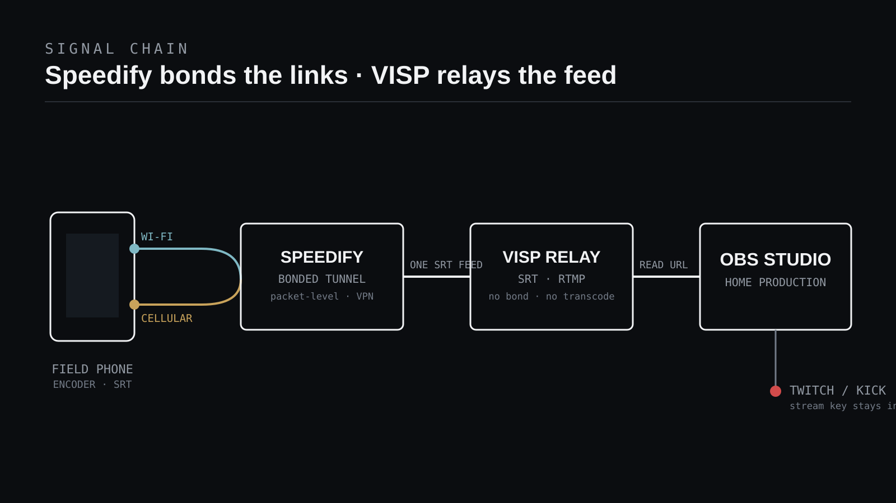

Kun haluat VISP-puhelinlähetyksen kestävän yhden heikon yhteyden, **aja
kentällä olevalla laitteella
[Speedifyn](https://speedify.com/irl-streaming-connection-bonding-software/)
niputettu tunneli ja julkaise VISP:iin tavallisella SRT:llä kuten ennenkin.**
Speedify yhdistää puhelimen Wi-Fi- ja mobiiliyhteyden yhdeksi vakaaksi
tunneliksi enkooderin alla, VISP autentikoi ja välittää yhden syötteen, ja OBS
pitää valmiin Twitch- tai Kick-lähetyksen hallinnassaan.

Tämä on tärkeää yhden rehellisen rajoituksen takia: **VISP ei niputa
verkkoyhteyksiä eikä transkoodaa videota.** VISP on itse ylläpidettävä
SRT/RTMP-rele ja ohjaustaso. Se antaa jokaiselle julkaisevalle laitteelle
peruutettavan pääsyn ja tuo sen syötteen OBS:ään, mutta se kuljettaa juuri sen
yhden virran, jonka enkooderi lähettää. Jos ongelmasi on epävakaa yhteys eikä
studion työnkulku, niputus kuuluu VISP:n alapuoliseen kerrokseen — ja Speedify
on yksi tapa lisätä se.

## Miksi VISP ei niputa, ja mitä se sinulle tarkoittaa

[VISP-rele](https://docs.visp-stream.com/docs/architecture) sijaitsee
julkaisevien laitteiden ja OBS:n välissä. Puhelin ottaa yhteyden ulospäin
VISP:iin, OBS ottaa yhteyden ulospäin VISP:iin, eikä kotiverkko tarvitse
sisääntulevaa porttia. Tämä rakenne pitää Twitch- tai Kick-avaimen OBS:ssä ja
antaa peruuttaa jokaisen laitteen erikseen. Sitä se **ei** tee, että
yhdistäisi kaksi internetyhteyttä yhdeksi kestäväksi linkiksi. Osoita yksi
SRT-virta VISP-videolähteeseen, ja saat täsmälleen yhden autentikoidun polun —
joka ei ole yhtään kestävämpi kuin sitä kuljettava yhteys.

Todellista niputusta voi lisätä kolmella yleisellä tavalla, ja ne elävät eri
kerroksissa:

- **Enkooderissa** SRTLA:n kautta. Sovellukset kuten
  [Moblin](/blog/moblin-remote-camera-obs-srt) ja BELABOX voivat levittää yhden
  SRT-virran useaan linkkiin, mutta
  [BELABOXin SRTLA-projektin](https://github.com/BELABOX/srtla) mukaan tämä
  vaatii vastaanottavan `srtla_rec`-pään, joka kokoaa linkit takaisin yhteen.
  VISP ei ole tuo vastaanotin.
- **Erillisessä laitteistossa**, kuten
  [LiveU Solossa](https://solohelp.liveu.tv/hc/en-us/articles/16672822061339-Overview-of-the-Solo-PRO),
  joka yhdistää enkooderin ja kaupallisen niputuspalvelun. Tämä valinta
  käsitellään artikkelissa
  [VISP vs BELABOX vs LiveU Solo](/blog/visp-vs-belabox-vs-liveu-solo).
- **Kaikkien sovellusten alla**, järjestelmätason niputus-VPN:n kuten Speedifyn
  kautta. Juuri tämä tapa antaa pitää nykyisen VISP-enkooderin
  ennallaan ja silti niputtaa uplinkin.

Speedify on houkutteleva juuri siksi, että se on sovellusriippumaton. Sinun ei
tarvitse vaihtaa enkooderia tai ajaa erillistä vastaanotinta; asennat sen
kenttälaitteeseen, ja jokainen puhelimesta lähtevä virta — VISP-SRT-syöte mukaan
lukien — kulkee niputetun tunnelin läpi.

## Miten Speedify paikkaa aukon

Speedify kuvaa itseään yhteyksien niputusohjelmistoksi, joka "yhdistää Wi-Fin,
4G/5G-mobiilin, Ethernetin, Starlinkin ja muut satelliittiyhteydet" ja "toimii
kaikkien suoratoisto-ohjelmistojen ja alustojen kanssa". Sen
[niputussivulla](https://speedify.com/features/channel-bonding/) selitetään
mekanismi: se "pilkkoo liikenteesi paketeiksi ja lähettää ne jokaisen yhteyden
yli yhtä aikaa", jolloin "kaikelle mitä käytät se näyttää yhdeltä nopealta,
vakaalta yhteydeltä". Olennaista on, että niputus tapahtuu yhteystasolla
läpinäkyvästi, ilman sovelluskohtaista määritystä.

Juuri tämä saa sen toimimaan VISP:n kanssa. SRT toimii yhä päästä päähän
enkooderisi ja VISP-releen välillä; Speedify vain kuljettaa tuon liikenteen
niputetun, salatun tunnelin yli ja kokoaa sen omalla Speed Server -palvelimellaan
ennen kuin se lähtee VISP:iin. Sekä enkooderi että VISP näkevät yhden yhteyden.
Speedifyssä on myös kaksi luotettavuustilaa, jotka kannattaa tuntea: **Redundant
Mode**, joka "lähettää jokaisen paketin jokaisen yhteyden yli samaan aikaan ja
säilyttää sen kopion, joka saapuu ensin", sekä oletuksena päällä oleva
**Streaming Mode**, joka vaihtaa reaaliaikaisen liikenteen automaattisesti
niputuksen (nopeus) ja monistuksen (luotettavuus) välillä. Speedify asentuu
iPhonelle, iPadille, Androidille, Windowsille, macOS:lle ja Linuxille, joten se
voi ajaa samalla puhelimella, joka julkaisee VISP:iin.

## Mitä tarvitset

- VISP-tili kirjautuneena Twitchiin tai Kickiin
- Tavallinen VISP-julkaisijasi puhelimessa: natiivisovellus tai enkooderi kuten
  [Larix Broadcaster](/blog/larix-broadcaster-obs-srt) tai Moblin
- Speedify asennettuna samaan kenttälaitteeseen, vähintään kaksi toimivaa
  yhteyttä (esimerkiksi Wi-Fi ja mobiili, tai kaksi mobiilimodeemia)
- OBS Studio tuotantokoneella
- Paikallinen OBS-varascene kenttäkatkoja varten
- Kuulokkeet äänen tarkistukseen ilman paluutien kaikua

Harjoittele samalla puhelimella, operaattoreilla, reitillä ja vuorokaudenajalla,
joita aiot käyttää livenä. Kahden yhteyden niputus, jotka molemmat ruuhkautuvat
samassa kohdassa, ei luo kaistaa, eikä nopea Wi-Fi-testi kotona koskaan vahvista
liikkuvaa mobiilituotantoa.

## 1. Asenna ja käynnistä Speedify kenttälaitteessa

Asenna Speedify puhelimeen, kirjaudu sisään ja varmista, että se näyttää kaksi
tai useampia aktiivisia yhteyksiä. Puhelimessa se tarkoittaa yleensä Wi-Fiä ja
mobiilia; molempien radioiden pitäminen päällä antaa Speedifylle jotain
niputettavaa. Koska Speedify toimii järjestelmätason tunnelina, et osoita
enkooderiasi siihen — kun se on aktiivinen, VISP-SRT-liikenne kulkee jo sen läpi.

## 2. Valitse oikea niputustila

Jätä Speedify oletustilaansa **Streaming Mode** useimpiin liveihin; se on
suunniteltu reaaliaikaiselle liikenteelle ja mukautuu virtakohtaisesti. Jos
ylität aluetta, jolla odotat tiheitä lyhyitä katkoja ja voit uhrata ylimääräistä
dataa, **Redundant Mode** lähettää kopion jokaisen linkin yli, jottei yhden polun
putoaminen keskeytä syötettä. Redundant Mode vaihtaa kaistan luotettavuuteen,
joten testaa se oikealla reitillä sillä bittinopeudella, jota todella lähetät.

## 3. Julkaise VISP:iin tavallisella SRT:llä

Mikään ei muutu VISP-asetuksissasi. Kirjaudu VISP:iin, avaa **Video sources**,
valitse **Add device** ja anna sille käytännöllinen nimi kuten "roaming phone".
Kopioi `srt://`-julkaisu-URL ja liitä se enkooderiisi, aivan kuten
[puhelin etäkamerana -oppaassa](/blog/use-phone-as-remote-camera-obs). Käsittele
koko URL:ää salasanana. Pidä SRT valittuna, ellei verkko estä UDP:tä; VISP
tarjoaa RTMP-varan **Advanced**-tilassa, ja
[videolähteen dokumentaatio](https://docs.visp-stream.com/docs/video-source)
näyttää tarkan kulun.

Käytä H.264-videota ja AAC-ääntä, koska **VISP ei transkoodaa**: koodekki,
resoluutio, ruutunopeus ja bittinopeus, jotka enkooderi lähettää, ovat juuri ne,
jotka rele välittää OBS:ään. Valitse bittinopeus, jonka niputettu yhteys jaksaa
marginaalilla, älä yksittäisen nopeustestin huippua. Vakaa 720p30 voittaa
nimellisen 1080p-syötteen, joka jatkuvasti jonottaa.

## 4. Aseta SRT-viive niputetulle polulle

SRT voi lähettää kadonneet UDP-paketit uudelleen niiden ollessa yhä
hyödyllisiä, ja sen viiveikkuna antaa uudelleenlähetyksille aikaa saapua.
[SRT-projekti](https://github.com/Haivision/srt) dokumentoi tämän automaattisen
uudelleenlähetyksen, ja
[SRT Alliancen yleiskatsaus](https://www.srtalliance.org/about-srt-technology/)
selittää, miksi viiveikkuna on sidottu edestakaiseen viiveeseen. Speedify lisää
Speed Server -hypyn ja oman kokoamisensa, joten todellinen edestakainen viive voi
olla hieman pidempi kuin suoralla mobiilipolulla. Aja VISP:n viivemittaus sillä
yhteydellä, jota todella käytät, valitse mobiiliprofiili ja jätä hieman
ylimääräistä pelivaraa sen sijaan, että pienentäisit arvoa pienemmän viiveen
mainostamiseksi. VISP muuttaa seitsemän edestakaisen mittauksen mediaanin
lähtösuosituksiksi:

| Profiili | Suositus | Vähimmäis |
| --- | ---: | ---: |
| Langallinen | 3× mitattu RTT | 120 ms |
| Wi-Fi | 4× mitattu RTT | 300 ms |
| Mobiili | 6× mitattu RTT | 600 ms |

[OBS:n SRT-opas](https://obsproject.com/kb/srt-protocol-streaming-guide) kuvaa
viivettä samalla tavalla; VISP vain soveltaa varovaisempia alarajoja
mobiilisyötteelle. Enkooderin puolen asetuksiin katso
[broadcaster-dokumentaatio](https://docs.visp-stream.com/docs/broadcaster-setup).

## 5. Tuo syöte OBS:ään ja harjoittele palautumista

Enkooderisi käyttää **julkaisu-URL:ää**; OBS käyttää erillistä **luku-URL:ää**.
Nopein OBS-asetus on parittaa VISP-liitännäinen, valita laite ja lisätä se
nykyiseen sceneen, kuten kuvattu
[VISP:n OBS-etähallinnassa](https://docs.visp-stream.com/docs/obs-remote-control).
Se luo autentikoidun Media Sourcen paljastamatta julkista ohjausporttia. Voit
myös tuoda valmiin scene-kokoelman, joka sisältää varascenen ja yhden
uudelleenyhdistyvän Media Sourcen laitetta kohden.

Aja sitten lyhyt vikaharjoitus kohde vielä offline-tilassa:

1. Vahvista liike ja ääni OBS:ssä usean minuutin ajan.
2. Katkaise toinen puhelimen yhteyksistä (pudota Wi-Fi, pidä mobiili).
3. Katso, että syöte jatkuu jäljellä olevalla niputetulla linkillä.
4. Palauta yhteys ja vahvista, että Speedify lisää sen takaisin.
5. Katkaise nyt molemmat yhteydet ja vahvista, että OBS näyttää varascenen.
6. Palauta verkko ja odota vakaata toistoa ennen kuin leikkaat takaisin.

Vaiheet 2–4 todistavat, että niputus tekee tehtävänsä; vaiheet 5–6 todistavat,
ettei niputuskaan voita täyskatkoa — juuri siksi pidät OBS-varascenen.
Tuotantoon, jonka pitää viihdyttää katsojia minkä tahansa katkon aikana, seuraa
[mobiiliverkon kestävyysopasta](/blog/keep-stream-live-bad-mobile-network).

## Speedify vs enkooderiniputus vs laitteisto

Speedify on vähiten tunkeileva vaihtoehto: se kulkee minkä tahansa
VISP-enkooderin alla ja niputtaa laitteen linkit. Sen kompromissit ovat
tilausmaksu, ylimääräinen Speed Server -hyppy ja riippuvuus Speedifyn
palvelimista kokoamisessa. Enkooderin **SRTLA** Moblinin tai BELABOXin kautta
niputtaa itse SRT-virran ilman kolmannen osapuolen relettä, mutta se tarvitsee
vastaavan SRTLA-vastaanottimen, jota VISP ei ole, joten päättäisit SRTLA:n
muualla ja välittäisit tavallisen SRT:n VISP:iin. Erillinen laitteisto kuten
LiveU Solo yhdistää enkooderin ja niputuspalvelun yhdeksi tuetuksi laitteeksi
korkeammalla hinnalla. Valitse Speedify, kun haluat pitää nykyisen
puhelintyönkulun ja vain kovettaa uplinkin; valitse SRTLA tai laitteisto, kun
tarvitset niputuksen, joka ei riipu kuluttajan VPN-palvelusta.

## Mitä tämä kokoonpano ei tee

VISP välittää autentikoidun syötteen; se ei niputa yhteyksiä eikä transkoodaa.
Speedify hoitaa niputuksen, mutta se ei voi keksiä kaistaa: jos molemmat linkit
ovat samassa kohdassa kyllästyneet tai kuolleet, mikään niputustila ei pidä
lähetystä hengissä — ja silloin OBS-varascene ansaitsee paikkansa. Vain yksi
julkaisija voi omistaa VISP-laitepolun kerrallaan, joten anna jokaiselle
puhelimelle oma laite ja OBS-lähde;
[monen puhelimen IRL-opas](/blog/multi-phone-irl-stream-obs) näyttää, miten nuo
itsenäiset lähteet asettuvat OBS:ään. Speedify ei myöskään ole osa VISP:iä, ei
ole VISP:lle pakollinen eikä VISP:n suosittelema — se on yksi kolmannen osapuolen
kerros, joka sattuu sopimaan releen alle.

## Vianetsintä

### Niputus on päällä, mutta lähetys yhä nykii

Vahvista, että molemmat yhteydet ovat aidosti aktiivisia Speedifyssä eivätkä
ruuhkaudu samassa paikassa. Laske enkooderin bittinopeutta, nosta SRT-viiveikkunaa
ja aja VISP:n viivemittaus uudelleen. Kahden heikon linkin niputus ei tee yhtä
vahvaa, kun molemmat heikkenevät yhtä aikaa.

### VISP ei koskaan näytä Live-tilaa

Tarkista, että koko nykyinen `srt://`-julkaisu-URL on liitetty, ettei toinen
enkooderi omista tuota laitepolkua ja ettei UDP:tä ole estetty. Jos tunnus on
kierrätetty, korvaa vanha URL. Tämä ei liity Speedifyyn.

### VISP on Live, mutta OBS on tyhjä

Varmista, että OBS:llä on luku-URL eikä julkaisu-URL, että **Local File** on pois
päältä, ja odota keyframea. Jos OBS:n luku-tunnus on kierrätetty, päivitä lähde.

### Viive tuntuu suurelta

Speedifyn Speed Server lisää hypyn. Valitse läheinen palvelin, jos sovellus
sallii, pidä Streaming Mode Redundant Moden sijaan datan salliessa ja hyväksy,
että niputettu, koottu polku vaihtaa hieman viivettä kestävyyteen.

## Tarkistuslista ennen lähetystä

- Speedify näyttää kaksi tai useampia aktiivisia yhteyksiä ja halutun tilan.
- Enkooderi julkaisee nykyisen VISP `srt://` -URL:n tavallisella SRT:llä.
- H.264, AAC, orientaatio, keyframe-väli ja bittinopeus on testattu reitillä.
- SRT-viive tulee mittauksesta oikealla niputetulla yhteydellä.
- OBS käyttää erillistä luku-URL:ää ja saa kuvan ja äänen.
- Yhden linkin pudotus pitää syötteen elossa; molempien pudotus näyttää varascenen.
- Kohteen stream-avain pysyy vain OBS:ssä.

## Usein kysytyt kysymykset

### Korvaako Speedify VISP:n?

Ei. Speedify on verkkokerros, joka niputtaa yhteyksiä; VISP on rele ja
ohjaustaso, joka autentikoi laitteet ja syöttää OBS:ää. Ne ratkaisevat eri
ongelmia ja toimivat yhdessä — Speedify kovettaa uplinkin, VISP hallitsee
syötettä.

### Pitääkö enkooderi määrittää käyttämään Speedifyä?

Ei. Speedify niputtaa yhteystasolla, joten kun se on käynnissä puhelimessa,
VISP-SRT-liikenteesi kulkee jo sen läpi. Julkaiset VISP:iin täsmälleen kuten
ilman sitä.

### Onko Speedify ainoa tapa niputtaa VISP:lle?

Ei. Voit niputtaa enkooderissa SRTLA:lla Moblinin tai BELABOXin kautta ja
välittää tavallisen SRT:n VISP:iin, tai käyttää erillistä niputuslaitteistoa.
Speedify on vaihtoehto, joka jättää nykyisen puhelintyönkulun ennalleen.

### Estääkö niputus lähetystäni koskaan putoamasta?

Ei. Niputus ja SRT-palautuminen selviävät lyhyistä katkoista ja yksittäisen
linkin vioista, mutta kumpikaan ei luo kaistaa. Pidä OBS-varascene täyskatkoa
varten.

## Lähteet ja seuraavat askeleet

- [Speedify IRL-suoratoiston yhteyksien niputus](https://speedify.com/irl-streaming-connection-bonding-software/)
- [Speedifyn niputus: miten se toimii ja sen tilat](https://speedify.com/features/channel-bonding/)
- [BELABOXin SRTLA-niputusprotokolla](https://github.com/BELABOX/srtla)
- [LiveU Solo -yleiskatsaus](https://solohelp.liveu.tv/hc/en-us/articles/16672822061339-Overview-of-the-Solo-PRO)
- [Haivisionin SRT-avoinlähdeprojekti](https://github.com/Haivision/srt)
- [OBS:n SRT-protokollaopas](https://obsproject.com/kb/srt-protocol-streaming-guide)
- [VISP: lisää videolähde](https://docs.visp-stream.com/docs/video-source)
- [VISP: enkooderit, SRT-viive ja vara](https://docs.visp-stream.com/docs/broadcaster-setup)

Jos tuotat jo OBS:ssä ja haluat, ettei epävakaa kenttäyhteys enää lopeta
lähetystäsi, [kokeile VISP:iä](https://visp-stream.com): luo yksi laite, julkaise
SRT:llä, lisää sen alle niputuskerros kuten Speedify ja aja vikaharjoitus ennen
seuraavaa livelähetystä.
