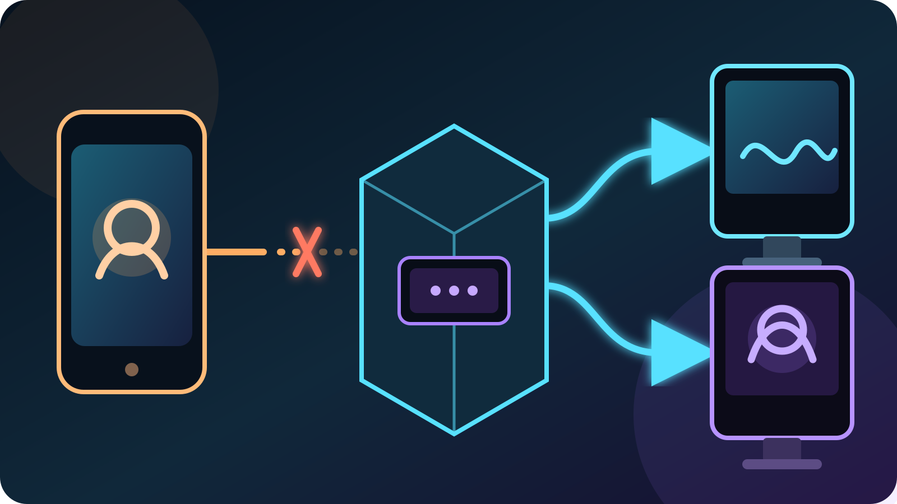

A **BRB screen** gives viewers something intentional to watch when a phone IRL
stream loses its mobile connection. The usual way to create one is to keep OBS
running at home or in the cloud. With VISP Direct, the relay can now hold the
Twitch or Kick output open and replace the missing phone feed with a simple BRB
card instead.

That distinction matters: the phone may be offline, but the encoder connected
to the platform is still running. When the phone reconnects, the live picture
replaces the card automatically. You can get that recovery layer without
leaving a PC on, although it does not repair the phone connection or make a bad
route reliable.

## Why a phone disconnect can end the public stream

Twitch describes a broadcast as an encoder sending video over RTMP to a Twitch
ingest server in its
[video broadcasting documentation](https://dev.twitch.tv/docs/video-broadcast/).
If a phone publishes straight to a platform, losing the phone's upload also
removes the platform-facing encoder.

The visible results vary by platform and by the length of the interruption.
Twitch offers its own
[Disconnect Protection](https://help.twitch.tv/s/article/Disconnect-Protection?language=en_US),
which can show a temporary message for up to 90 seconds and keep the recorded
VOD continuous if the encoder reconnects in time. Kick's official
[missing-VOD guide](https://help.kick.com/en/articles/14994284-my-vod-is-missing-or-not-appearing-after-my-stream)
notes that a disconnect and reconnect can split one broadcast into multiple
VODs.

A server-side BRB screen changes the path. The phone contributes one feed to
VISP, while Direct owns the outgoing Twitch or Kick connection. If the
contribution disappears after Direct is already live, the relay swaps its
distribution encode to a card instead of dropping the destination. The
platform continues receiving H.264 video and stereo AAC silence.

## What VISP shows while the phone is offline

Open **Never drop again** on the VISP dashboard to choose one of three BRB
backgrounds:

- **Latest snapshot** uses a recent frame from the live phone feed and softens
  it so the paused state looks deliberate.
- **Custom image** accepts a PNG or JPEG up to 5 MB. Use a clean 16:9 image
  whose important details are not near the edges.
- **Solid black** is the safest option when privacy matters or the last camera
  frame should not remain visible.

VISP draws your short message over the background. Keep the wording useful at
a glance: “Signal lost — reconnecting” tells viewers more than a joke that may
not make sense five minutes later.

The card has no program audio. If music, a host microphone, alerts, or a
fully produced fallback must continue, use OBS instead. The Direct card is a
continuity layer for a complete phone program, not a remote scene editor.

## Set up a BRB screen without OBS

First finish the normal
[VISP Direct setup](https://docs.visp-stream.com/docs/direct-output). Direct
must be authorized and enabled for Twitch, Kick, or both while the publishing
device is offline.

Then configure the card:

1. Sign in to the VISP dashboard and find **Never drop again**.
2. Turn on **Show a BRB card when my stream drops**.
3. Write a short message that works for an unplanned interruption.
4. Choose **Latest snapshot**, **Custom image**, or **Solid black**.
5. If you use a custom image, upload a PNG or JPEG and check the preview.
6. Start the phone stream and confirm that each Direct destination reaches its
   live state.

The switch must be enabled before the contribution disappears. A card can only
hold a Direct forwarder that is already running; it cannot rescue a destination
that never started because authorization failed or the relay was at capacity.

VISP keeps one independent forwarder per destination. A Twitch card and a Kick
card therefore consume the same Direct encoder slots that their live outputs
used. One destination can stop or fail without forcing the other one down.

## Test the failure before a real IRL stream

Do not make the event your first reconnect test. Use a low-stakes broadcast and
watch it from a second device with its audio muted.

1. Start the phone feed and wait until Twitch or Kick is visibly live.
2. Confirm the correct camera and audio on the public channel.
3. Disable both Wi-Fi and cellular on the publishing phone, or move it onto a
   deliberately blocked test network.
4. Verify that the public video changes to the chosen BRB card and that the
   VISP dashboard reports the held state.
5. Restore the phone connection and restart publishing if the client does not
   reconnect by itself.
6. Confirm that the camera replaces the card, audio returns, and the public
   broadcast remains the same session.
7. Stop from the dashboard if the phone will not return; a BRB card is a
   temporary recovery state, not an unattended channel.

Repeat the test for every selected platform. Watching the local camera preview
only proves that the phone can capture video. The public channel is the check
that covers the entire phone-to-relay-to-platform path.

## What a BRB card does not solve

**It does not create mobile bandwidth.** The card begins after the contribution
has already failed. Lower bitrate, route testing, and appropriate link
redundancy still reduce how often viewers need to see it. The
[bad-mobile-network guide](/blog/keep-stream-live-bad-mobile-network) covers
those earlier layers.

**It does not replace packet recovery.** SRT can recover packets while enough
connectivity remains. The BRB card handles the larger event in which the
publisher is no longer delivering a usable feed.

**It is for Direct output.** If OBS owns the Twitch or Kick broadcast, VISP
continues exposing the phone as an OBS source and OBS should own the fallback
scene. Do not enable Direct and send OBS to the same destination at the same
time.

**It cannot preserve live phone audio.** The card carries silence. A remote
host, playlist, or announcements require an output path that still has those
sources, usually OBS.

**It does not make every interruption invisible.** Viewers will see the card,
and the swap still depends on the relay, VISP app host, and platform connection
remaining healthy. A relay restart or destination failure is a different fault
from a lost phone ingest.

## When Direct is the right recovery layer

Use the Direct BRB card when one phone already contains the complete show and
you want the fewest moving parts. It pairs naturally with a walking stream, a
single-camera event, or a Twitch-and-Kick simulcast that should not depend on a
home computer. The [guide to streaming without a PC](/blog/stream-to-twitch-without-a-pc)
explains the rest of that setup.

Keep OBS when the fallback itself is part of the production: a host should keep
talking, music should continue, sponsors need a designed scene, or several
cameras must remain available.

The practical choice is simple. Put the recovery scene in the component that
still owns the platform output when the phone disappears. For VISP Direct,
that component is the relay. For a home-studio workflow, it is OBS.

If a no-PC BRB screen fits your IRL setup, [try VISP](https://visp-stream.com),
enable **Never drop again**, and rehearse one real disconnect before your next
Twitch or Kick broadcast.
