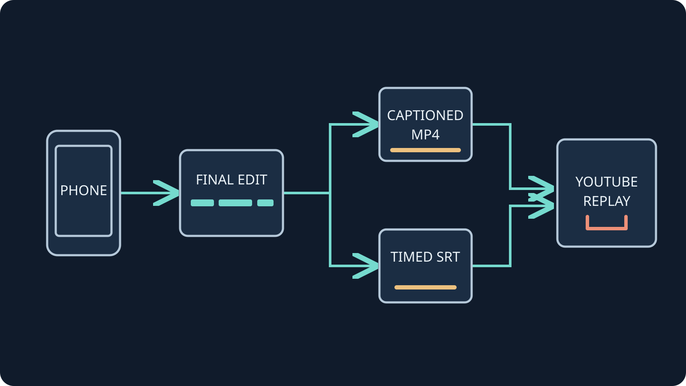

Viimeistele IRL-tallenteen videoleikkaus ennen tekstitystä. Päätä sitten,
haluatko tekstin osaksi kuvaa vai erilliseksi raidaksi, jonka katsoja voi
ottaa käyttöön tai poistaa käytöstä. VISP Typography litteroi ladatun videon,
antaa muokata sanakohtaista tekstitystä ja vie valmiin MP4-videon. Jos haluat
YouTubeen erillisen tekstitysraidan, tee ajoitettu tiedosto, kuten SRT, ja
lataa se YouTube Studioon.

Valinta korostuu, kun kahden tunnin Twitch- tai Kick-kävelystä tehdään vartin
YouTube-video. Haluat ehkä korjata kadunnimen, kääntää keskustelun tai antaa
katsojan valita tekstityksen. Tee työ valmiin leikkauksen, älä alkuperäisen
lähetyksen, aikajanan mukaan. Ohje käsittelee tallenteita, ei YouTuben
suoran lähetyksen tekstitysasetuksia.

## Valitse kuvaan poltettu tekstitys tai YouTube-raita

Kuvaan poltettu tekstitys on osa videokuvaa. Katsoja ei voi piilottaa sitä tai
valita toista kieliraitaa. Erillinen tekstitysraita pysyy omana kerroksenaan,
joten katsoja voi ottaa sen käyttöön. YouTube voi myös liittää sen videoon
omalla kielellään.

VISP Typography tekee MP4-videon, johon tekstitys on poltettu. Se ei vie SRT-
tiedostoa. Valitse se, kun haluat tekstin näkyvän pysyvästi tyyliteltynä
valmiissa videossa. Jos tarvitset YouTuben soittimen tekstitysvalinnat tai
erilliset kieliraidat, tee ajastettu tekstitystiedosto. Molempia tapoja voi
käyttää, mutta tarkista kumpikin kerros erikseen, jotta tekstit eivät peitä
toisiaan.

Myös VISPin puhelimen live-tekstitys poltetaan kamerakuvaan. Se jää kaikkiin
samasta lähteestä tehtyihin tallenteisiin. [Live-tekstityksen ohje](/fi/blog/live-captions-phone-irl-stream-obs)
kertoo tästä valinnasta. [VISPin media-arkkitehtuurin dokumentaatio](https://docs.visp-stream.com/docs/architecture)
kuvaa, miten kamerasyöte kulkee OBS:lle.

## Leikkaa video ensin valmiiksi

Tee ensin julkaistava versio. Poista odotusruudut, valitse kävelyn osuudet,
viimeistele äänimiksaus ja tee mahdolliset nopeutusmuutokset. Vie video
tiedostoksi ja käytä juuri tätä versiota tekstityksen pohjana.

Esimerkki: vieras alkaa puhua alkuperäisen lähetyksen kohdassa 12:00. Poistat
alusta kaksi minuuttia ja ennen vierasta vielä puolen minuutin tauon. Valmiissa
videossa puhe alkaa kohdassa 09:30. Alkuperäiseen tallenteeseen ajoitettu
tekstitys tulee nyt kaksi ja puoli minuuttia myöhässä. Yksi yleinen ajansiirto
ei korjaa myöhempiä leikkauksia tai nopeutusmuutoksia.

Säilytä tallenne, muokkausprojekti, lopullinen video ja mahdollinen
tekstitystiedosto yhdessä. Käytä niissä samaa versionumeroa, esimerkiksi
`harbor-walk-v3.mp4` ja `harbor-walk-v3.fi.srt`. Näin et vahingossa yhdistä
tekstitystä väärään videoversioon.

Kuuntele viedyn tiedoston ääni pelkän editorin esikatselun sijaan. Varmista,
että oma puhe, vieraat ja studiokommentointi kuuluvat. Jos puhe kuuluu
kahdesti tai mikrofoni laahaa jäljessä, käy läpi [puhelimen OBS-äänen
vianmääritys](/fi/blog/fix-phone-audio-obs) ennen seuraavaa lähetystä.
Tekstityksen muokkaus ei korjaa videon ääntä.

## Tee tekstitetty MP4 VISP Typographylla

VISP Typography hyväksyy MP4-, QuickTime MOV- ja WebM-videot. Se luo
sanakohtaisen tekstityksen englanniksi tai suomeksi. Voit korjata sanoja ja
niiden alku- ja loppuaikoja, valita tekstitystyylin, säätää sen sijaintia ja
viedä H.264 MP4 -videon, jonka kuvaan tekstit on renderöity.

Tarkista kuvasuhde ennen tämän tavan valitsemista: Typography vie videon
pystyformaatissa 1080 × 1920 (9:16). Vaakasuuntainen tallenne rajautuu.
Jos alkuperäisen laajakuvarajauksen pitää säilyä, käytä editointiohjelmaa,
joka säilyttää kuvasuhteen, ja lisää YouTube Studioon erillinen ajastettu
tekstitysraita.

1. Viimeistele tallenne videoeditorissa ja vie se tiedostoksi.
2. Avaa [VISP Typography](https://typography.visp-stream.com) ja kirjaudu sisään.
3. Lataa lopullinen MP4-, MOV- tai WebM-video ja valitse puhekieli.
4. Tarkista litterointi videota vasten. Korjaa nimet ja virheet sekä tarkista
   ajoitus leikkausten ympäriltä.
5. Säädä tyyliä ja sijaintia niin, ettei teksti peitä kasvoja, kylttejä tai
   muuta tärkeää sisältöä.
6. Vie MP4 ja katso valmis tiedosto alusta loppuun.

Puheentunnistus on lähtökohta, ei tarkistettu litterointi. Kuuntele erityisen
tarkasti katujen, vieraiden ja kanavien nimet, kiellot, numerot ja päällekkäin
puhutut kohdat. Älä täydennä sanoja, joita liikenne tai tuuli peittää.
Katso koko video normaalilla nopeudella myös muokkausten jälkeen. Litterointi
voi näyttää oikealta, vaikka sana näkyisi liian aikaisin, jatkuisi leikkauksen
yli tai hiljainen lause puuttuisi. Korjaa teksti ja ajoitus editorissa ja vie
video uudelleen. MP4 säilyttää valitsemasi tyylin kuvassa, joten tarkista
lopputulos pieneltä näytöltä sekä vaaleissa katu- ja tummissa yökohtauksissa.
Säilytä myös alkuperäinen vienti. Näin voit vaihtaa tekstityksen tyyliä
myöhemmin lisäämättä valmiin tekstikerroksen päälle uutta.

## Lisää erillinen tekstitysraita YouTube Studioon

Jos haluat, että katsoja hallitsee tekstitystä videokuvasta riippumatta, tee
ajoitettu tiedosto lopulliselle videoversiolle. YouTube tukee tavallista
SubRip- eli `.srt`-tiedostoa UTF-8-tekstinä. SRT:n tyylimerkintöjä ei
tunnisteta. Katso [YouTuben tukemat tekstitysmuodot](https://support.google.com/youtube/answer/2734698?hl=en),
jos editori tarjoaa useita vientitapoja.

Noudata [YouTuben tekstityksen latausohjetta](https://support.google.com/youtube/answer/2734796?hl=en):

1. Avaa YouTube Studio ja valitse **Tekstitykset**.
2. Valitse valmis video ja lisää haluamasi kieli.
3. Valitse kyseisen kielen kohdalla tekstitystiedoston lisääminen.
4. Valitse **Lataa tiedosto** ja ajastetulle SRT-tiedostolle **Ajoituksen kanssa**.
5. Valitse tiedosto ja tallenna se.

Jos käytät YouTuben automaattista tekstitystä luonnoksena, tarkista se ennen
julkaisua. YouTuben mukaan taustamelu, päällekkäinen puhe ja huono ääni voivat
heikentää tunnistusta. Valmiille suoran lähetyksen tallenteelle luodaan
automaattitekstitys uudelleen VOD-käsittelyssä, joten se voi erota liven
tekstityksestä. Katso [YouTuben automaattitekstityksen ohje](https://support.google.com/youtube/answer/6373554?hl=en).

## Tarkista jokainen leikkaus ja valmis video

Katso alku tekstityksen kanssa. Ensimmäisen lauseen pitää näkyä ensimmäisten
kuuluvien sanojen kohdalla, ei otsikon tai odotusruudun aikana. Tarkista sen
jälkeen jokainen leikkauskohta sekä osiot, joissa muutit nopeutta tai ääntä.

Jos tekstitys on koko videon ajan yhtä paljon myöhässä tai etuajassa, tarkista
alkuajastus. Jos alku täsmää mutta ajoitus pettää leikkauksen jälkeen, vertaa
tekstitystiedostoa videon oikeaan versioon. Jos virhe kasvaa muuttumattoman
osuuden aikana, selvitä, miten ajoitus on tehty. Älä ala siirtää rivejä
yksitellen ennen kuin tiedät, millaisesta ongelmasta on kyse.

Tarkista myös viimeinen puhuttu lause. Katso esimerkkikohta puhelimella
normaalilla nopeudella ja kerran ilman ääntä. Varmista, että teksti on luettavaa
ja puhuja tunnistettavissa. Erillisellä YouTube-raidalla poista tekstitys
käytöstä ja varmista, että kuvaan jäävät vain tarkoitetut grafiikat. Tarkista
kuvaan poltetusta versiosta, ettei vanha live-tekstitys muodosta toista
tekstikerrosta.

## Suunnittele seuraava tallenne jatkokäyttöön

Jos teet lähetyksistä videoita säännöllisesti, päätä tallennustapa ennen
seuraavaa lähetystä. Puhelimen tekstityskerros on osa kamerakuvaa. Puhdas
tallenne vaatii videolähteen ilman tätä kerrosta; saman tekstitetyn lähteen
tallentaminen muualla ei poista tekstiä.

Valmistele kamerasyöte [VISPin puhelinohjeen](https://docs.visp-stream.com/docs/phone-app)
avulla. Muokattua videota varten kokeile [VISP Typographya](https://typography.visp-stream.com)
lyhyellä tallenteella ja tarkista viety MP4 ennen kuin tekstität kokonaisen
iltapäivän IRL-materiaalia.
