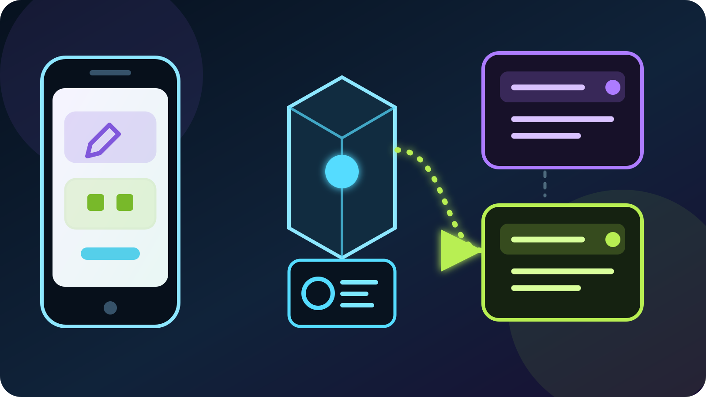

An IRL stream rarely stays in one neat category. You may begin by talking on a
train, move into a convention hall, and finish with a game at a friend's
apartment. The camera can stay live through every transition, but a title and
category written for the first stop quickly become misleading.

The awkward part is usually not deciding what to write. It is changing the
right fields while one hand holds a gimbal and the other phone screen is still
your camera, chat, connection monitor, and OBS remote. This guide shows the
native Twitch and Kick routes, then the shorter VISP route for updating linked
channels from the same phone that is publishing your IRL feed.

## The quick answer

If you stream to only one platform, its own creator dashboard is often the
simplest tool. Twitch lets creators change category during a stream, and
Kick's Streamer Dashboard has **Edit Stream Info**. Use those native controls
when they already fit your workflow.

The gap appears when a mobile encoder owns the camera but not the platform
metadata. Kick's current [mobile streaming guide](https://help.kick.com/en/articles/7135289-streaming-on-kick-from-your-mobile-phone)
says a Custom RTMP Streamlabs Mobile user must set the title and category on
the Kick website, not inside Streamlabs Mobile. A creator simulcasting to
Twitch and Kick may then have two dashboards to visit.

VISP puts one **Stream info** sheet in its signed-in phone app. Enter one title,
search the two category catalogs, choose a result, and submit. VISP sends the
title to every linked platform that has permission and sends each platform
only the category ID its own catalog returned. The camera contribution keeps
running on its existing path.

## Why the category should follow the actual stream

A category is not decoration. It is the browse shelf where the platform places
the live channel. Twitch describes categories as broad classifications and
says creators can [change category at any time during a stream](https://help.twitch.tv/s/article/about-twitch-categories?language=en_US).
Kick likewise tells creators to update a title as the stream evolves and warns
against leaving content in a misleading category in its official guide to
[titles, presentation, and timing](https://help.kick.com/en/articles/14994710-how-to-attract-new-viewers-titles-presentation-and-timing).

That leads to a practical IRL rule: write the title and category for what a new
viewer will see **now**, not for the route you planned hours ago. Set them
before going live, then change them only when the content genuinely changes.
Constant rewrites create work without making the stream clearer.

For example:

| What viewers see now | Useful action |
| --- | --- |
| Walking tour and conversation | Choose the current IRL or conversation category and name the place or activity without exposing private location details. |
| Scheduled event begins | Update the title to the event and choose its best matching category. |
| Long travel break or BRB card | Keep the current category unless the actual program has changed; explain the break on screen or in chat. |
| The stream switches to a game | Change both title and category when the game becomes the program. |

## Set the first title before you leave

Do the first edit on a stable connection. Kick explicitly recommends having
the title and category ready before going live. It also gives you time to
check spelling, avoid revealing a precise route or hotel, and confirm that the
same category exists on both platforms.

A useful title answers one concrete question: what is happening? "Saturday
IRL" says little. "Exploring the night market with chat" gives a viewer a
reason to understand the thumbnail. Keep promises literal; a title should not
claim a guest, venue, or activity that has not started.

VISP's shared title field accepts up to 140 characters. That matches Twitch's
documented 140-character ceiling in the
[Modify Channel Information API](https://dev.twitch.tv/docs/api/reference#modify-channel-information),
but shorter is easier to scan on a phone. Leave operational notes such as
bitrate or relay names out of the public title unless viewers genuinely need
them.

## Link Twitch and Kick with the narrow permission

Sign in to the VISP app and link the channels you want to manage. Linking a
channel for viewing chat is not automatically the same as allowing metadata
changes. In **Info**, a linked provider without the needed grant shows
**Allow VISP to edit stream info**. Tap **Authorize** and complete that
provider's own consent screen.

The permissions are specific:

- Twitch uses `channel:manage:broadcast`. Twitch documents that scope for
  changing channel properties such as `title` and `game_id`.
- Kick uses `channel:write`. Kick documents it for updating livestream
  metadata through its [Channels API](https://docs.kick.com/apis/channels).

Neither permission is a stream key. In the normal phone-to-OBS workflow, the
Twitch or Kick destination and key remain in OBS. VISP's relay still forwards
the H.264/AAC contribution without transcoding it. With
[VISP Direct](/blog/what-is-visp-direct), the relay owns the platform output,
but the metadata edit is still a separate authenticated API request rather
than a change to the video connection.

If the authorization prompt appears again after you previously approved it,
approve the current scope instead of assuming the camera is broken. Provider
consent and media publishing are separate. A missing metadata grant can block
the edit while the stream itself continues normally.

## Change both channels from the VISP phone app

The same steps work before or during a live phone stream:

1. Open VISP and tap **Info** at the top of the camera screen.
2. Enter the new **Stream title**.
3. Type at least two characters into **Search categories**.
4. Choose a result after checking its platform badges.
5. Tap **Update stream info**.
6. Read the result message. It reports which providers updated and which one
   needs authorization or failed.

VISP searches Twitch's category catalog and Kick's category catalog in
parallel. Twitch's official [Search Categories endpoint](https://dev.twitch.tv/docs/api/reference#search-categories)
returns category names and IDs; Kick exposes the corresponding IDs through its
[Categories API](https://docs.kick.com/apis/categories). VISP keeps those IDs
separate because a shared name does not imply a shared identifier.

The selected result shows **Twitch**, **Kick**, or both. That badge is an
important promise:

- **Twitch · Kick** means the exact category name was found in both catalogs,
  so the selection can update both.
- **Twitch** means the category change applies only to Twitch. Kick keeps its
  current category.
- **Kick** means the category change applies only to Kick. Twitch keeps its
  current category.

The title is different: the same non-empty title is sent to every linked,
authorized provider. If you need deliberately different titles or categories,
use each platform's native dashboard. The VISP sheet is designed for one
shared description of the same simulcast, not for managing two unrelated
programs.

## What happens while the camera stays live

The update does not stop or restart capture. VISP sends Twitch a channel
update containing the title and, when selected, Twitch's `game_id`. It sends
Kick a channel update containing the same title and, when selected, Kick's
`category_id`. Both providers document their update endpoints as metadata
operations.

Meanwhile the video keeps following whichever production path you already
chose:

- In a [phone-through-OBS Twitch workflow](/blog/twitch-phone-through-obs),
  the phone contribution continues through the VISP relay into home OBS, and
  OBS continues sending the finished program to Twitch.
- In the equivalent [Kick phone-through-OBS workflow](/blog/kick-phone-through-obs),
  OBS retains scenes, alerts, fallback, and the Kick destination.
- With Direct, VISP continues its existing destination encodes. Editing the
  title does not add an encode or move the feed.

This separation matters in troubleshooting. If the new title fails but video
is healthy, do not change SRT latency, bitrate, or the OBS Media Source. Check
the linked account and write permission. If video fails but the title updates,
the metadata API is not proof that the camera-to-relay path is healthy.

## Verify the public result, not just the button

An "Updated" message proves that the provider accepted the request. Your final
check should still be the public channel page on another device or account.
Confirm all of the following:

1. Twitch shows the intended title.
2. Kick shows the intended title.
3. Each platform shows the intended category.
4. The live preview still matches what the title promises.
5. OBS or Direct is still sending the expected program.

If one provider failed, leave the stream running and retry only that control
path. Open **Info**, authorize the named platform if requested, search the
category again, and submit. A category carrying only one platform badge is not
a partial failure; it means the other catalog did not return the same named
category.

For an operator-assisted show, VISP's relay-side chat bot offers another narrow
tool: the broadcaster or a moderator can use `!title <text>` to update the
shared title. It does not choose a category, so use it for a quick retitle and
keep the **Info** sheet for catalog changes. The setup and limits are covered
in the [IRL chat bot guide](/blog/irl-chat-bot-alerts-without-a-pc).

## A field-ready title-change checklist

Before the stream:

- link Twitch and Kick;
- authorize stream-info editing on both;
- choose a shared category with both badges when appropriate;
- set the first title on stable connectivity;
- verify both public channel pages.

When the program changes:

- wait until the new activity is actually on air;
- open **Info** without stopping the stream;
- change the title and category once;
- read the per-provider result;
- verify the public pages and return attention to filming.

If only one platform is in use, its native dashboard may remain the shortest
route. If Twitch and Kick are carrying the same IRL show, one carefully checked
VISP update removes a dashboard round trip while keeping the platform accounts,
media path, and OBS production in their proper places.

See the [VISP phone app documentation](https://docs.visp-stream.com/docs/phone-app)
for the current camera, chat, stream-info, and OBS controls. When you are ready
to rehearse the whole workflow, [try VISP](https://visp-stream.com): link both
channels, run a private test, change the title once while live, and confirm the
result from a viewer's screen before the next real IRL stream.
