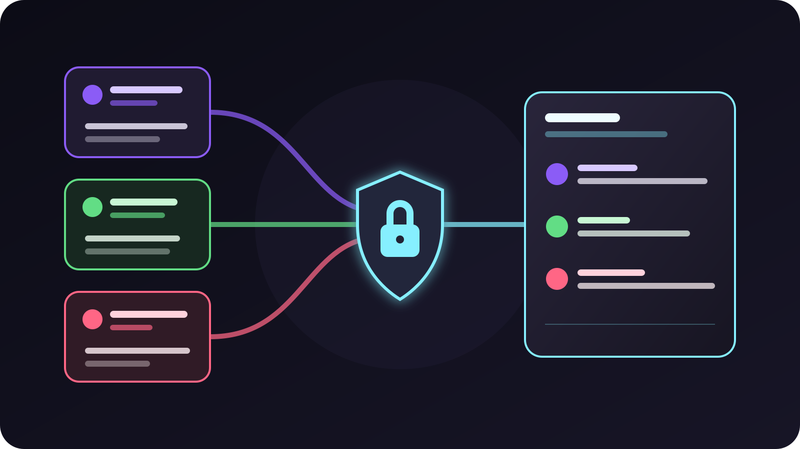

To combine Twitch, Kick, and TikTok LIVE chat in OBS, **open VISP Multi-chat,
save each public channel nickname, generate a private overlay URL, and paste
that URL into an OBS Browser Source**. VISP labels each message by platform and
keeps the newest eight messages in one compact feed.

The same feed can be private to the producer or visible to viewers. That choice
matters. Twitch allows combined chat tools for personal use, but its current
simulcasting rules restrict showing activity from other platforms in the
Twitch broadcast. Decide where the feed belongs before adding it to a live
scene.



## Choose a private monitor or an on-stream overlay

OBS can open the same web page in two different places:

| Goal | Put the Multi-chat URL here | Who sees it? |
| --- | --- | --- |
| Read all chats while producing | **Docks > Custom Browser Docks** | The OBS operator only |
| Show chat in the finished program | **Sources > Browser** inside a scene | Viewers, recordings, and clips |
| Check the feed before OBS | A normal browser window | The person testing it |

Start with a private dock. It lets the producer read Twitch, Kick, and TikTok
LIVE without putting unmoderated messages into the picture. It is also the
safe starting point for a Twitch simulcast. Twitch's official
[Simulcasting Guidelines FAQ](https://help.twitch.tv/s/article/simulcasting-guidelines)
says that tools combining chat from other services are allowed for personal
use. The underlying rule still restricts combining other-platform activity in
the Twitch broadcast itself.

If you want a viewer-facing chat box on a Twitch simulcast, do not send the
three-platform feed in that program. VISP currently saves one enabled source
list per account and does not create a different provider filter for each
overlay URL. Use the combined feed privately, or enable only the Twitch source
while that overlay is visible in the Twitch program.

Kick creators should also check the current
[Kick Partner multistreaming instructions](https://help.kick.com/en/articles/11091744-multistreaming-on-the-kick-partner-program)
when the program applies to their channel. The chat overlay does not enable
multistreaming, change a platform setting, or send video anywhere. It only
reads live messages.

## Know what VISP Multi-chat does

Multi-chat is deliberately smaller than a moderation dashboard. The current
version:

- reads new messages from one public Twitch channel, one public Kick channel,
  and one public TikTok LIVE channel;
- shows a platform label, the sender name, and plain message text;
- keeps up to eight newest messages while the overlay stays connected;
- reconnects Twitch and TikTok after temporary connection failures;
- uses a private overlay URL that can be rotated from the dashboard.

It does not load chat history. It does not render badges, emote images, gifts,
follows, or subscription alerts. It cannot reply, delete a message, time out a
viewer, or ban anyone. YouTube chat is not part of this Multi-chat page.

Those limits make the tool predictable, but they also make native platform
moderation essential. Keep Twitch Mod View, the Kick dashboard, or TikTok LIVE
Studio available to the person who moderates. The overlay is a shared reading
surface, not a replacement for those tools.

This is also separate from two older VISP chat paths. The
[phone chat guide](/blog/twitch-kick-chat-phone-obs) covers a private floating
view on the field phone. The [VISP chat bot documentation](https://docs.visp-stream.com/docs/chat-bot)
covers automatic stream alerts and commands such as `!bitrate`. Multi-chat
does neither job. It gives OBS one live, read-only web page.

## 1. Save the three channel nicknames

Open [VISP Multi-chat](https://visp-stream.com/chat) and sign in with your VISP
account. You can use Twitch, Kick, or Google for the VISP login. The sign-in
choice does not decide which chats appear.

Under **Channels**, enter the public nickname for each channel you want to
read. Use the name from the channel URL, with or without the leading `@`. For
example, enter the part after `twitch.tv/`, `kick.com/`, or `tiktok.com/@`.
Turn on the checkbox beside each finished entry, then select **Save channels**.

The entered channels stay separate from your linked VISP provider accounts.
VISP's server-side connectors read their public live messages. This means you
can sign in to VISP with Google and still configure Twitch, Kick, and TikTok
LIVE nicknames.

Use your own channels. A public nickname is not proof that you have permission
to rebroadcast another community's messages. If chat will be visible in the
program, tell moderators which communities can appear and remove a source when
the broadcast no longer uses it.

### Twitch needs valid bot authorization

VISP receives Twitch messages through the official
[`channel.chat.message` EventSub subscription](https://dev.twitch.tv/docs/eventsub/eventsub-subscription-types/#channel-chat-message).
The service connects with the VISP Twitch bot account. Twitch's current
[chatbot authentication guide](https://dev.twitch.tv/docs/chat/authenticating/)
requires the broadcaster to grant bot access or make that bot a moderator.

If the Twitch source reports an authorization error, open the main VISP
dashboard and authorize the VISP chat bot for that Twitch channel. Then return
to Multi-chat and save the source again. A wrong nickname and a channel that
has not granted the required bot access can both prevent the subscription.

### Kick uses signed chat webhooks

VISP resolves the Kick nickname and subscribes to Kick's official
[`chat.message.sent` event](https://github.com/KickEngineering/KickDevDocs/blob/main/events/event-types.md).
Kick sends each event to VISP by webhook. The app server checks the signature,
timestamp, and event identifier using Kick's
[webhook security model](https://github.com/KickEngineering/KickDevDocs/blob/main/events/webhook-security.md)
before it accepts the message.

You do not paste a Kick stream key into Multi-chat. The chat subscription and
the video destination are separate.

### TikTok LIVE is the less predictable source

TikTok does not provide a public official API for reading LIVE chat events.
VISP therefore uses the open-source
[TikTok-Live-Connector](https://github.com/zerodytrash/TikTok-Live-Connector),
which reads public Webcast data by channel nickname without a viewer login.
The project describes itself as unofficial and warns that it is a
reverse-engineering project rather than a production-ready API.

Treat TikTok as an optional feed, not the only way to monitor a critical
broadcast. TikTok can change the underlying Webcast protocol without notice.
The channel also needs to be live when the connector starts. Keep TikTok LIVE
Studio or the TikTok app nearby during an important show.

## 2. Generate and protect the overlay URL

After saving the channels, select **Generate browser-source URL**. VISP shows a
URL containing the overlay credential. Copy the complete value, including the
fragment after `#t=`.

Treat that URL like a password:

- do not show it in a stream setup video, screenshot, or support log;
- do not paste it into public chat;
- store it only in OBS or another trusted local browser;
- rotate it immediately if it becomes visible to someone else.

VISP stores a hash of the secret rather than the reusable plaintext secret.
The overlay exchanges the secret for a short-lived connection ticket, then
receives messages over a WebSocket. Selecting **Rotate browser-source URL**
creates a new secret and closes overlays using the old one. Replace the whole
URL in OBS after a rotation.

There is one active Multi-chat credential per VISP account. Generating another
one is a rotation, not a second independent overlay configuration.

## 3. Add the feed as an OBS Browser Source

To put the feed inside a scene:

1. Select **Sources > + > Browser**.
2. Name the source `VISP Multi-chat`.
3. Leave **Local file** off and paste the complete private URL.
4. Set the width to `720` and the height to `900` as a useful starting size.
5. Add the transparency CSS below in **Custom CSS**.
6. Select **OK**, then drag and resize the source in the preview.
7. Keep a duplicate clean scene without the chat source.

```css
html, body { background: transparent !important; overflow: hidden; }
```

The shared Multi-chat page uses a dark background for its dashboard. The CSS
removes that page background from the OBS source while leaving the individual
message cards readable. OBS's official
[Browser Source guide](https://obsproject.com/kb/browser-source) explains URL
sources, viewport dimensions, custom CSS, and source refresh behavior.

Place the source above the camera or program layer in the Sources list. Leave
enough room for long names and wrapped messages. The feed grows downward from
the top and keeps eight rows at most, so a tall narrow panel works better than
a short strip.

If the feed is only for the producer, add the same URL under **Docks > Custom
Browser Docks** instead. Do not also add it to a visible scene. A dock is not
captured in the program merely because it is inside the OBS window.

## 4. Test every platform separately

Do not send three test messages at once. A combined panel can hide which
connection failed.

1. Open the Browser Source or custom dock and wait for its status to change
   from connecting.
2. Send a fresh Twitch message from a second account.
3. Confirm the Twitch label, sender, and message text appear.
4. Repeat with Kick.
5. Start the TikTok LIVE channel, then send a TikTok comment and confirm it.
6. Send a long message on each platform to check wrapping.
7. Send a native emote and confirm the plain-text limitation is acceptable.
8. Hide and show the source, then confirm new messages still arrive.
9. Record a short OBS sample and check whether the chat is present only where
   intended.
10. Rotate the URL, refresh OBS, and confirm that the old URL stops working.

Earlier messages do not appear after a reload. The platform connectors start
when at least one valid overlay is connected and stop when no overlay remains.
That demand-driven behavior avoids keeping three chat listeners running when
nobody is reading them, but it also means the page is not a chat archive.

## Troubleshoot a silent feed

### The overlay says Connecting forever

Check that the whole URL was copied, including `#t=` and the secret after it.
If the URL was rotated, the old source cannot recover. Paste the newest URL and
refresh the Browser Source.

### Twitch shows an error

Confirm the channel nickname first. Then verify that the channel has granted
the VISP bot access required by Twitch. Save the source again after correcting
either problem.

### Kick messages do not appear

Confirm that the channel nickname resolves to the intended public channel.
Disable and re-enable the Kick source to create a fresh webhook subscription.
If Twitch or TikTok still works, the browser credential itself is valid.

### TikTok says the channel is offline

Start TikTok LIVE before testing the connector. If the channel is already live,
disable and re-enable the TikTok source. Keep the native TikTok monitor open
because the unofficial connector cannot promise uninterrupted delivery.

### OBS shows a dark rectangle

Add the `html, body` transparency rule from step 3. If the rectangle remains,
check for another color filter or source behind the chat layer. Test the URL in
a new Browser Source before changing the live scene.

### Messages are missing after a refresh

That is expected. Multi-chat forwards new live messages and keeps only the
eight messages already received by the current page. It does not replay a
stored history.

## Run a final preflight

Before going live, confirm all of these facts:

- every enabled nickname points to the intended channel;
- Twitch bot authorization works for the Twitch source;
- TikTok is treated as an unofficial, best-effort connection;
- the overlay URL is hidden from screenshots and recordings;
- the producer can open the native moderation tools;
- the clean OBS scene remains one action away;
- the combined chat stays private during a Twitch simulcast;
- a local recording proves the chosen source is either present or absent.

Multi-chat does not alter the phone-to-OBS video path. VISP still relays that
contribution without transcoding, and the chat overlay does not combine mobile
network capacity. If you also need one phone upload sent to several services,
use the separate [phone multistreaming guide](/blog/multistream-phone-twitch-kick-custom-rtmp).

## Sources and next steps

- [VISP Multi-chat](https://visp-stream.com/chat)
- [VISP self-hosting documentation](https://docs.visp-stream.com/docs/self-hosting)
- [VISP Multi-chat interface source](https://github.com/PohinaGroup/visp/blob/main/apps/multichat/src/App.tsx)
- [VISP platform connector source](https://github.com/PohinaGroup/visp/blob/main/packages/api/src/multichat/connectors.ts)
- [VISP overlay credential source](https://github.com/PohinaGroup/visp/blob/main/packages/api/src/multichat/overlay-token.ts)
- [OBS Browser Source](https://obsproject.com/kb/browser-source)
- [Twitch EventSub channel chat messages](https://dev.twitch.tv/docs/eventsub/eventsub-subscription-types/#channel-chat-message)
- [Twitch chatbot authentication](https://dev.twitch.tv/docs/chat/authenticating/)
- [Twitch Simulcasting Guidelines FAQ](https://help.twitch.tv/s/article/simulcasting-guidelines)
- [Kick event types](https://github.com/KickEngineering/KickDevDocs/blob/main/events/event-types.md)
- [Kick webhook security](https://github.com/KickEngineering/KickDevDocs/blob/main/events/webhook-security.md)
- [TikTok-Live-Connector](https://github.com/zerodytrash/TikTok-Live-Connector)

If separate Twitch, Kick, and TikTok LIVE windows are crowding your OBS
workspace, [try VISP Multi-chat](https://visp-stream.com/chat) as a private
dock first. Once every source passes the rehearsal, decide whether the same
feed belongs in the program or should stay with the producer.
