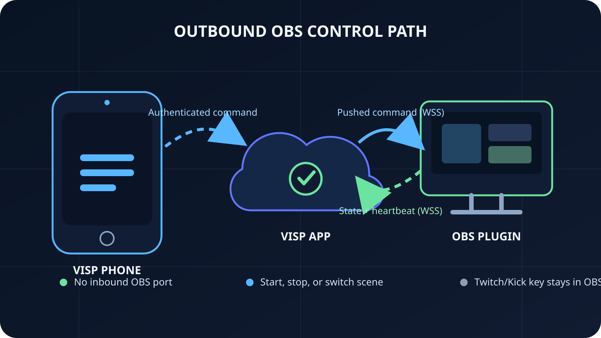

Voit ohjata OBS:ää puhelimella ilman porttiohjausta näin: **asenna VISP-lisäosa
OBS Studio 31:een, yhdistä se selaimella ja käytä VISP-puhelinsovelluksen
OBS-ohjaimia.** Puhelimella voi käynnistää tai pysäyttää aktiivisen
OBS-lähetyksen ja vaihtaa ohjelmassa näkyvää kohtausta. Lisäosa ottaa itse
todennetun WSS-yhteyden VISPiin, joten reitittimeen ei tarvitse avata OBS:lle
tulevaa porttia.

Ratkaisu sopii Twitch- tai Kick-sisällöntuottajalle, joka kantaa kameraa
kentällä samalla kun kotikone huolehtii kohtauksista, hälytyksistä,
tallennuksesta ja valmiista lähetyksestä. Ohjaus on tarkoituksella suppeampi
kuin OBS WebSocket: VISP tarjoaa kenttäkuvaajalle tavallisimmat
lähetyskomennot, ei kaikkien lähteiden, suodattimien, mikserien ja
studioasetusten hallintaa.

## Valitse ensin paikallinen tai internetin yli toimiva etäohjaus

OBS sisältää jo WebSocket-tuen. OBS Projectin mukaan ominaisuus on ollut
OBS Studiossa versiosta 28 lähtien, ja tavallisia käyttökohteita ovat ohjaus
puhelimella tai tabletilla, automaatio ja kohtausten vaihtaminen. Samassa
luotetussa lähiverkossa
[OBS WebSocket -asiakas](https://obsproject.com/kb/remote-control-guide) on usein
monipuolisin vaihtoehto. Sen kautta voi hallita huomattavasti useampia
OBS-toimintoja kuin VISPillä.

Verkkotilanne muuttuu, kun puhelin lähtee kodin ulkopuolelle. Lähiverkon
WebSocket-osoite ei sellaisenaan avaudu internetiin. Portin julkaiseminen
reitittimestä tekee tuotantoa ohjaavalle ohjelmistolle julkisen sisääntulon.
OBS [suosittelee siksi vahvasti salasanan käyttöä](https://github.com/obsproject/obs-websocket#using-obs-websocket),
ja nykyisen 5.x-palvelimen oletusportti on 4455.

Jos tarvitset laajaa WebSocket-etäohjausta internetin yli, sijoita asiakas ja
OBS-kone yksityiseen VPN-verkkoon tai vastaavaan rajattuun verkkoon sen sijaan,
että julkaisisit portin suoraan. Kun VISP-kenttäpuhelimesta tarvitsee vain
käynnistää tai pysäyttää lähetys ja valita ohjelmakohtaus, ulospäin muodostuva
lisäosayhteys poistaa reititinasetusten tarpeen.

| Tarve | Paras lähtökohta |
| --- | --- |
| OBS:n laaja automaatio samassa lähiverkossa | OBS WebSocket ja yhteensopiva asiakas |
| OBS:n laaja automaatio internetin yli | OBS WebSocket yksityisen VPN:n takana |
| Käynnistys, pysäytys ja kohtauksen vaihto VISP-kenttäpuhelimesta | VISP Remote Control -lisäosa |
| Koko lähetyksen yksityiskohtainen hallinta | OBS:n äärellä oleva tuottaja, tarvittaessa yllä olevien työkalujen tukemana |

VISP ei ole yleiskäyttöinen etätyöpöytä eikä korvaa operaattoria, jos tuotanto
vaatii tarkkaa äänen, lähteiden, suodattimien tai tallennuksen hallintaa.

## Mitä tarvitset?

- Kotikoneen, jolla on OBS Studio 31 ja aktiiviseen profiiliin valmiiksi
  määritetty Twitch- tai Kick-lähetyspalvelu
- Windowsille, macOS:lle tai Ubuntulle tarkoitetun VISP Remote Control
  -lisäosapaketin
- VISP-tilin ja samalla tilillä kirjautuneen VISP-puhelinsovelluksen
- Ulospäin toimivan HTTPS-yhteyden sekä puhelimesta että OBS-koneelta
- Kohtaukset, joiden nimet erottuvat toisistaan pienessä puhelinvalikossa
- Paikallisen varasuunnitelman siltä varalta, että puhelin tai ohjausyhteys
  katoaa

Puhelin ei tarvitse Twitchin tai Kickin lähetysavainta. Kohde säilyy OBS:ssä.
Yhdistäminen antaa lisäosalle rajatun VISP-konetunnuksen, mutta ei kopioi
palveluntarjoajan tunnusta VISPiin tai kenttäpuhelimeen.

Jos sama puhelin toimii myös kenttäkamerana, tee ensin
[puhelimen ja OBS:n välinen kamerayhteys](/fi/blog/use-phone-as-remote-camera-obs).
Etäohjaus ja kamerasyöte kulkevat eri reittejä, vaikka ne näkyvät samassa
sovelluksessa.

## 1. Asenna VISP-lisäosa OBS:ään

Lataa käyttöjärjestelmällesi sopiva paketti projektin
[GitHub Releases -sivulta](https://github.com/PohinaGroup/visp/releases), asenna
se ja käynnistä OBS uudelleen. VISPin nykyinen dokumentaatio koskee OBS Studio
31:tä.

Avaa **Tools → VISP Remote Control**. Samassa ikkunassa voi luetella VISPin
julkaisulaitteita ja lisätä niiden välityssyötteitä Media Source -lähteiksi,
mutta näitä laiteominaisuuksia ei tarvita jo määritetyn OBS-lähetyksen
etäohjaukseen.

Avaa ennen yhdistämistä oikea OBS-profiili ja tarkista sen lähetyspalvelu.
Etäkäynnistys käyttää juuri aktiivista profiilia. Lisäosa ei täytä puuttuvaa
Twitch- tai Kick-kohdetta eikä vaihda profiilia puolestasi.

## 2. Yhdistä OBS selaimen kautta

Valitse lisäosan ikkunasta **Sign in with browser**. Selain avaa VISPin
hyväksymisnäkymän. Kirjaudu samalla VISP-tilillä, jota käytät puhelimessa,
hyväksy näytetty laitekoodi ja palaa OBS:ään.

Hyväksyntä ei tallenna uudelleenkäytettävää Twitch- tai Kick-kirjautumista
OBS:ään. VISP käyttää lyhytikäistä selainvaltuutusta ja vaihtaa sen rajattuun
konetunnukseen. Tilapäinen istunto kumotaan vaihdon jälkeen. OBS tallentaa
syntyvän konetunnuksen, ja VISP tallentaa sen salaisuudesta vain SHA-256-tiivisteen.

Käsittele lisäosan asetustiedostoa silti tunnuksena. Sen saanut henkilö voi
pystyä ohjaamaan yhdistettyä OBS-instanssia. Jos tietokone tai asetustiedosto
paljastuu, kierrätä OBS-tunnus VISPissä ja tee yhdistäminen uudelleen. Kierrätys
katkaisee vanhojen lisäosa-asetusten yhteyden heti tai niiden seuraavalla tilaraportilla.

Hallintapaneelin pitäisi näyttää tila **Connected** muutamassa sekunnissa. Jos
näin ei käy, varmista, että OBS-kone pääsee VISP-sovelluksen julkiseen
osoitteeseen HTTPS:llä. Saapuvan yhteyden testiä tai reitittimen porttiskannausta
ei tarvita.

## 3. Avaa OBS-ohjaimet puhelimessa

Kirjaudu VISPin natiivisovellukseen samalla sisällöntuottajan tilillä. Kun
lisäosa on yhdistetty, live-näkymässä näkyy OBS-ohjaus. Tila kertoo, onko OBS
yhteydessä vai offline-tilassa ja onko OBS:n lähetys parhaillaan käynnissä.

Avaa kohtausvalikko. Luettelo tulee yhdistetystä OBS-instanssista, ja nykyinen
ohjelmakohtaus on merkitty. Valitse kohtaus vasta, kun sen nimi kertoo selvästi,
mitä katsojien pitäisi nähdä. Lyhyet toimintanimet, kuten **Kenttä**, **Tauko**,
**Studio** ja **Loppu**, erottuvat puhelimessa paremmin kuin useat lähes samat
kohtausnimet.

Komento vaihtaa ohjelmassa näkyvän kohtauksen, ei Studio Moden yksityistä
esikatselua. Jos tuottaja valmistelee parhaillaan siirtymää esikatselussa, sovi
puhelinohjauksesta etukäteen. Etäohjaus ei myöskään avaa OBS:n äänimikseriä,
joten testattujen kohtausten pitää jo tuottaa haluttu mikrofonitila.

## 4. Testaa käynnistys ja pysäytys harkitusti

Käytä kanavallesi sopivaa yksityistä alustatestiä, kaistan testaamiseen
tarkoitettua kohdetta tai listaamatonta harjoitusta ennen kuin luotat
etäkäynnistykseen. Ensimmäisellä kerralla OBS-näyttö kannattaa jättää kotona
olevan henkilön nähtäväksi, jos se on mahdollista.

1. Varmista, että VISP näyttää OBS:n olevan yhteydessä.
2. Valitse puhelimesta oikea aloituskohtaus.
3. Paina käynnistyspainiketta kerran ja odota, että odottava tila poistuu.
4. Tarkista OBS:stä ja palvelun hallintapaneelista, että lähetys todella alkoi.
5. Vaihda vaarattomaan testikohtaukseen ja tarkista ohjelmakuva.
6. Paina pysäytystä kerran ja varmista lopputulos sekä OBS:stä että palvelusta.

Älä napauta painiketta toistuvasti komennon odottaessa. Sovellus estää
päällekkäiset komennot, ja lisäosa saa uusimman odottavan tilan reaaliaikaisen
yhteyden kautta. VISP kertoo komennon välityksestä ja OBS:n tilasta, mutta se
ei voi luvata, että Twitch tai Kick hyväksyi lähtevän kuvan tai että katsojien
video on kunnossa. Pidä palvelun oma hallintapaneeli erillisenä tarkistuksena.

Etäpysäytys pysäyttää OBS:n aktiivisen lähetyslähdön. Se ei sulje OBS:ää tai
tietokonetta eikä pysäytä erillistä tallennusta. Jos lopetusrutiiniin kuuluu
tallenne, replay buffer, paikallinen ääni tai tiedostojen lähettäminen, tee ne
studiossa. Yksi etäpainike ei ole koko sammutuslista.

## Näin yhteys toimii ilman porttiohjausta

Ohjausreitti on tarkoituksella epäsuora:

1. Tunnistettu puhelin lähettää käynnistys-, pysäytys- tai kohtauspyynnön
   HTTPS:llä VISP-sovellukselle.
2. VISP tallentaa tilille halutun tilan.
3. Yhdistetty OBS-lisäosa hakee HTTPS:llä 30 sekuntia voimassa olevan
   kertakäyttölipun ja avaa ulospäin WSS-yhteyden.
4. Lisäosa raportoi lähetyksen tilan ja kohtaukset muutosten yhteydessä sekä
   viiden sekunnin sykkeellä. VISP lähettää uusimman komennon heti.
5. Lisäosa suorittaa komennon OBS:ssä ja kuittaa komentoversion vasta, kun OBS
   on saavuttanut pyydetyn tilan.

Koska OBS avaa yhteyden ulospäin, lisäosa ei avaa internetiin kuuntelevaa porttia
eikä tarvitse reitittimen porttiohjausta. Komennot välitetään heti, mutta
internetin ja OBS:n viiveet estävät silti kuvaruudun tarkan vaihtamisen.

Konetunnus on yleistä VISP-istuntoa rajatumpi: se tukee lisäosan laite- ja Media
Source -työnkulkua sekä reaaliaikaista ohjausyhteyttä, mutta ei anna pääsyä tilin tai
palveluntarjoajan muuhun hallintaan. Puhelin käyttää komentojen pyytämiseen omaa
tunnistettua käyttäjäistuntoaan.

## Varaudu ohjausyhteyden katkeamiseen

Mikään internet-etäohjaus ei ole hätätakuu. Komento ei saavu perille, jos
kenttäpuhelimen datayhteys katoaa, VISP-sovelluspalvelin ei vastaa, kotiyhteys
katkeaa, OBS sulkeutuu tai lisäosan WSS-yhteys katkeaa. **Offline** tarkoittaa,
että pitää siirtyä varasuunnitelmaan, ei painaa nappia uudelleen.

Pidä kriittinen toiminta paikallisena OBS-koneella:

- Käynnistä OBS oikeaan profiiliin ja kohtauskokoelmaan.
- Pidä tärkeissä lähetyksissä tuottaja, etätyöpöytäyhteys tai luotettu henkilö
  varalla.
- Käytä paikallista automaatiota varakohtaukseen siirtymiseen, jos kentän Media
  Source katoaa.
- Pidä Twitchin tai Kickin hallintapaneeli saatavilla kohteen tilaa ja alustan
  hätätoimia varten.
- Harjoittele tilanne, jossa puhelinkamera palaa mutta etäohjaus ei, ja myös
  päinvastainen tilanne.

[Mobiiliverkon katkosopas](/fi/blog/keep-stream-live-bad-mobile-network) kertoo,
miksi OBS kannattaa pitää käynnissä paikallisessa taukokohtauksessa kenttäsyötteen
katketessa. [Monen puhelimen tuotannossa](/fi/blog/multi-phone-irl-stream-obs)
sopikaa yksi kohtausten ohjaaja, jotta kaksi kuvaajaa ei vaihda ohjelmakuvaa
ristiin.

## Tunnista kuvan ja ohjauksen välinen raja

Etäohjaus ei muuta videon reittiä. VISP-puhelin voi julkaista H.264-videota ja
AAC-ääntä SRT:llä samalla kun ohjauspyynnöt kulkevat sovellusrajapinnan ja
OBS-lisäosan todennetun WSS-yhteyden kautta. OBS koostaa edelleen valmiit kohtaukset ja
lähettää ohjelman Twitchiin tai Kickiin.

VISP **ei transkoodaa videota eikä yhdistä verkkoyhteyksiä**. Se ei voi laskea
liian suurta kamerabittinopeutta välityspalvelimella, yhdistää mobiilidataa ja
Wi-Fiä yhdeksi vikasietoiseksi siirtotieksi tai viedä ohjauskomentoa täydellisen
katkoksen yli. Rajat eivät muutu, vaikka ohjaus ja kameralähetys näkyvät samassa
puhelinsovelluksessa.

Kohdepalvelun lähetysavain säilyy aktiivisessa OBS-profiilissa. VISP ei tarvitse
sitä kamerasyötteen välittämiseen tai yhdistetyn lisäosan ohjaamiseen. Tämän
erottelun ansiosta kenttäkuvaaja voi hallita kotistudiota saamatta haltuunsa
sen Twitch- tai Kick-julkaisutunnusta.

## Ongelmatilanteet

### Puhelin näyttää OBS:n olevan offline-tilassa

Avaa kotikoneella **Tools → VISP Remote Control** ja varmista, että lisäosa on
yhdistetty. Tarkista ulospäin toimiva HTTPS/WSS-yhteys ja se, ettei tietokone ole
siirtynyt lepotilaan. Jos tunnus on kierrätetty, yhdistä uudelleen. Vanhan
asetuksen kuuluukin silloin katkaista yhteys.

### Käynnistyspainike ei tee mitään

Avaa OBS paikallisesti ja varmista, että aktiivisessa profiilissa on toimiva
lähetyspalvelu ja avain. Lisäosa pyytää OBS:ää käynnistämään valmiiksi määritetyn
lähdön, mutta ei luo kohdetta. Sulje myös mahdollinen OBS-virheikkuna, joka
vaatii paikallista kuittausta.

### Kohtausluettelo on tyhjä tai vanhentunut

Pidä OBS käynnissä ja yhteydessä seuraavaan tilaraporttiin asti. Nimeä kohtaukset
OBS:ssä, ei puhelimessa. Jos yhdistäminen ei päivity, avaa lisäosaikkuna ja tee
paritus uudelleen vanhaan luetteloon luottamisen sijaan.

### Kohtaus vaihtui odotettua myöhemmin

Tarkista yhteyden laatu äläkä lähetä uutta komentoa edellisen odottaessa. Käytä
paikan päällä olevaa tuottajaa tai paikallista ohjausta, kun ajoituksen pitää
olla tarkka.

## Usein kysyttyä

### Pitääkö VISPiä varten avata portti 4455?

Ei. Portti 4455 on OBS WebSocket 5.x:n oletusportti. VISP-lisäosa käyttää omaa
todennettua ulospäin suuntautuvaa WSS-yhteyttään eikä avaa OBS:lle tulevaa ohjausporttia.

### Korvaako VISP OBS WebSocketin?

Ei. OBS WebSocket tukee paljon laajempaa ohjaus- ja automaatioympäristöä. VISP
on rajattu vaihtoehto lähetyksen käynnistämiseen ja pysäyttämiseen sekä
ohjelmakohtausten vaihtamiseen puhelimesta ilman tulevan ohjausportin
julkaisemista.

### Voiko puhelimella ohjata äänilähteitä ja suodattimia?

Ei. Nykyinen VISP-puhelinohjaus rajoittuu lähetyksen käynnistykseen tai
pysäytykseen ja ohjelmakohtauksen valintaan. Rakenna äänikäytös testattuihin
kohtauksiin tai käytä monipuolisempaa paikallista OBS-ohjausjärjestelmää.

### Voiko kohtauksia vaihtaa Apple Watchilla?

VISP Watch -kumppanisovellus näyttää OBS-yhteyden ja kohtausluettelon sekä voi
lähettää kohtausvalinnan yhdistetyn iPhonen kautta. Kello ei ole itsenäinen
internet-ohjain eikä säilytä VISP-tunnusta itse.

## Lähteet ja seuraavat vaiheet

- [VISPin OBS-etäohjauksen asennus ja turvallisuus](https://docs.visp-stream.com/fi/docs/obs-remote-control)
- [VISPin puhelin- ja selainsovellus](https://docs.visp-stream.com/fi/docs/phone-app)
- [VISPin arkkitehtuuri ja komentoreitti](https://docs.visp-stream.com/fi/docs/architecture)
- [VISPin aloitusopas](https://docs.visp-stream.com/fi/docs/get-started)
- [OBS Project Remote Control Guide](https://obsproject.com/kb/remote-control-guide)
- [Virallinen obs-websocket README](https://github.com/obsproject/obs-websocket)

Jos puhelimesi toimii jo kenttäkamerana ja tarvitset vain turvallisen,
harkitun tavan käynnistää tai pysäyttää kotistudion lähetys ja vaihtaa
kohtauksia, [kokeile VISPiä](https://visp-stream.com): yhdistä lisäosa,
harjoittele offline-tilanne ja pidä varsinainen Twitch- tai Kick-kohde OBS:n
hallinnassa.
