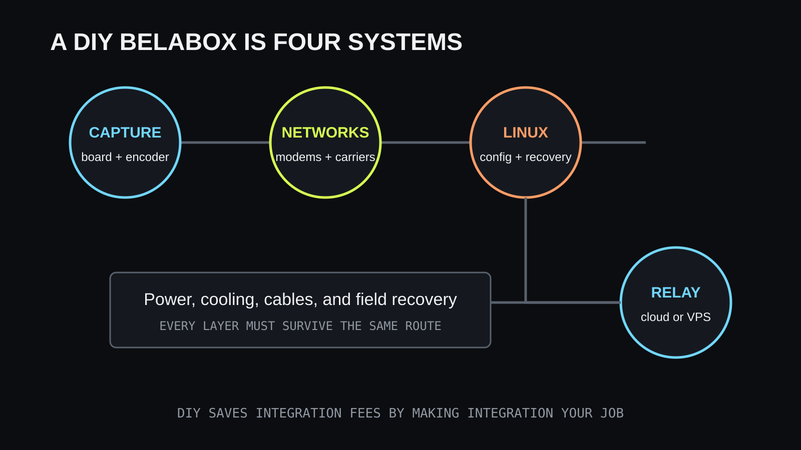

DIY-BELABOX voi ratkaista yhden IRL-striimauksen vaikeimmista ongelmista: se voi
pitää kenttäsyötteen käyttökelpoisena usean muuttuvan verkkoyhteyden avulla. Se
voi myös muuttaa ensimmäisen lähetyksen laite-, Linux-, modeemi-, verkko-, virta-
ja palvelinprojektiksi ennen kuin kamera on kertaakaan suorana.

Tämä ei ole perustelu BELABOXia vastaan. Se kertoo, kenelle ratkaisu sopii.
**Itse rakennettu bondattu enkooderi vaihtaa hallitun palvelun kuukausimaksun
koko teknisen polun omistamiseen.** Joustavuus on arvokasta, kun sitä haluaa. Se
on kitkaa, jos tavoitteena on vain lähettää puhelimesta jo tulevana viikonloppuna.

## Miksi DIY-BELABOX kiinnostaa

BELABOX yhdistää tuetulla laitteistolla tehokkaan kenttäenkoodauksen,
SRTLA-bondingin, dynaamisen bittinopeuden ja etähallinnan. Rakentaja voi valita
enkooderin, kaappauspolun, modeemit, operaattorit, virtajärjestelmän, kotelon ja
relay-työnkulun kaupallisen kokonaislaitteen sijaan.

Hallinta on hyödyllistä vaikeilla reiteillä. Useat riippumattomat yhteydet antavat
bondatulle enkooderille vaihtoehtoja, kun yksi operaattori ruuhkautuu tai menettää
kuuluvuuden. Dynaaminen bittinopeus voi vähentää vaatimusta kapasiteetin
pienentyessä. Erillinen enkooderi jättää myös puhelimen vapaaksi chatille,
navigoinnille ja tuotannon ohjaukselle.

Vetovoima on aito: kyvykäs kenttäsiirto ilman suoraa siirtymää perinteisen
lähetyslaitteen hintaan. “DIY” kertoo kuitenkin, kuka integroi ja tukee
järjestelmää. Työ ei katoa.

## Rakennelmassa on neljä yhteensopivuusongelmaa

Käsittele DIY-BELABOXia neljänä järjestelmänä, joiden pitää toimia yhdessä:

| Kerros | Omat päätökset | Tyypillinen vika |
| --- | --- | --- |
| Laskenta ja kaappaus | Tuettu kortti, kameratulo, enkooderi ja jäähdytys | Video ei käynnisty tai laite hidastaa kuormassa |
| Verkkolaitteet | Modeemit, USB, antennit, operaattorit ja kaapelit | Yhteys katkeaa, nollautuu tai käyttää samaa heikkoa verkkoa |
| Linux-ohjelmisto | Levykuva, asetukset, päivitykset, lokit ja laitetunnistus | Muutos toimii kerran mutta ei käynnistyksen jälkeen |
| Relay tai VPS | Saavutettava päätepiste, palomuuri, tunnukset ja kapasiteetti | Kenttäenkooderi toimii mutta syöte ei päädy OBS:ään |

Tuettu tietokone ei takaa kaappauslaitteen yhteensopivuutta. Linuxin tunnistama
modeemi ei takaa vakaata virtaa kuormitetusta USB-hubista. Kaksi aktiivista
SIM-korttia ei takaa riippumatonta kuuluvuutta. Saavutettava VPS ei takaa, että
paluusyöte ja OBS-asetukset ovat oikein.

Tarkista BELABOXin ajantasainen dokumentaatio ja tuettujen laitteiden ohje ennen
osia koskevia ostopäätöksiä. Toisen laiteversion tai modeemiohjelmiston
foorumiviesti on tutkittava vihje, ei valmis ostoslista.

## Linux-komentorivi kuuluu omistamiseen

Päivittäinen käyttöliittymä voi olla hallintapaneeli, mutta DIY-rakenne paljastaa
lopulta käyttöjärjestelmän. Ensiasennus, verkon vianhaku, laitteiden tunnistus,
lokit, päivitykset, palvelujen käynnistys ja epäonnistuneen muutoksen palautus
voivat kaikki johtaa Linux-komentoriville.

Dokumentoidun ja tuetun kokoonpanon rakentaminen ei vaadi Linux-ylläpitäjää.
Seuraavien tehtävien pitäisi silti onnistua:

- tarkista, näkeekö järjestelmä kaappauslaitteen tai modeemin;
- lue palvelun tila ja viimeisimmät lokit muuttamatta muuta;
- erota virtakatkos operaattoriyhteyden katkeamisesta;
- päivitä vain silloin, kun koko kokoonpanon ehtii testata uudelleen;
- palauta tunnetusti toimiva levykuva, kun kenttäkorjaus veisi liikaa aikaa;
- säilytä tunnukset ja asetusten varmuuskopiot muualla kuin enkooderissa.

Komentojen kopioiminen keskustelusta ei korvaa niiden vaikutuksen ymmärtämistä.
Eri Linux-kuvalle, laiteversiolle tai verkkoliitännälle kirjoitettu komento voi
vaikeuttaa vianhakua. Kirjaa jokaisen muutoksen lähde ja tarkoitus. Jos et osaa
selittää, mitä komento muuttaa, älä aja sitä ainoassa toimivassa kenttälaitteessa.

## Modeemiyhteensopivuus on muutakin kuin liitin

Ulkoiset modeemit tuovat useita toisiinsa kytkeytyviä kysymyksiä. Tunnistaako
käyttöjärjestelmä laitteen? Tarjoaako se odotetun verkkotilan? Riittävätkö kortin
ja hubin virta radion kulutuspiikeissä? Palaako yhteys lyhyen katkoksen jälkeen?
Kestävätkö liittymä ja operaattori jatkuvaa videon lähetystä? Auttaako antennien
sijoittelu oikeasti?

USB tekee laitteista fyysisesti vaihdettavia, ei toiminnallisesti samanlaisia.
Modeemiohjelmisto, alueelliset taajuudet, operaattoriasetukset, USB-tilat ja
virrankulutus voivat erota samannäköisten tuotteiden välillä.

Testaa jokainen modeemi yksin ennen bondingia. Nimeä yhteydet pysyvästi ja
varmista, mitä julkista reittiä kukin käyttää. Testaa yhdistelmät vasta tämän
jälkeen liikkeessä oikealla reitillä. Jos kolme modeemia on yhden alitehoisen
hubin varassa, lisäyhteydet voivat heikentää luotettavuutta.

Myös operaattorien riippumattomuus ratkaisee. Kaksi liittymää samassa taustaverkossa
voi hajota yhdessä. Eri operaattoritkin voivat jakaa ruuhkautuneen tukiaseman tai
menettää peiton samassa rakennuksessa. Bonding tarjoaa useita polkuja, mutta ei
luo radiokuuluvuutta tyhjästä.

## VPS lisää ylläpidettävän tietokoneen

Bondattu kenttäenkooderi tarvitsee toisen päätepisteen vastaanottamaan ja
kokoamaan liikenteen. Hallittu BELABOX-pilvi voi hoitaa tämän. Itse ylläpidetty
työnkulku voi käyttää virtuaalipalvelinta tai muuta internetistä saavutettavaa
konetta.

VPS-työ ei pääty tunnuksen luomiseen. Jonkun pitää valita alue, asentaa odotettu
ohjelmisto, rajata verkkoyhteydet, suojata tunnukset, seurata kapasiteettia ja
siirtomääriä, päivittää järjestelmä ja ymmärtää, miten vastaanotettu syöte päätyy
OBS:ään tai alustalle.

Sijainnissa on vaihtokauppa. Kenttäenkooderin lähellä oleva palvelin voi lyhentää
ensimmäistä verkkoväliä, kun taas kotistudion tai alustan lähellä oleva voi auttaa
seuraavaa. Mittaa koko polku kartan katsomisen sijaan. Halvin palvelin voi myös
tulla kalliiksi, jos liikennehinnoittelu tai resurssirajat eivät sovi jatkuvaan
videoon.

Tietoturva kuuluu tehtävään. Avaa vain tarpeelliset palvelut, käytä yksilöllisiä
tunnuksia ja pidä käyttöjärjestelmä ylläpidettynä. Älä liitä alustojen
lähetysavaimia julkisiin vianhakukuviin. Jos internet-palvelimen ylläpito ei
kiinnosta, laske hallitun relayn hinta mukaan vaihtoehtoon.

## Virta ja lämpö näyttävät ohjelmistovioilta

Täydellinen asetuskin hajoaa, kun enkooderin jännite putoaa tai laite hidastaa
lämmön vuoksi. Kortti, kaappauslaite, modeemit, hubi, jäähdytys ja ohjauslaitteet
kuluttavat kaikki virtaa. Modeemien kulutus voi vaihdella radio-olosuhteiden
mukaan. Akun lataaminen suljetussa repussa enkoodauksen aikana lisää lämpöä.

Rakenna virtabudjetti mitatusta huippukulutuksesta, ei vain etiketeistä. Testaa
kaikki modeemit aktiivisina, oikea videotila käynnissä ja kotelo suljettuna.
Kiinnitä kaapelit niin, ettei liike aiheuta ajoittaista vikaa, joka näyttää
ohjelmisto-ongelmalta.

Kentän palautussuunnitelman pitää olla Linuxin uudelleenasennusta helpompi: toimiva
levykuva, nimetty varakaapeli, dokumentoitu porttikartta ja mahdollisuus vaihtaa
puhelinlähetykseen. Paras kenttäkorjaus on usein varajärjestelmään vaihtaminen ja
varsinaisen vian tutkiminen myöhemmin.

## Budjetoi osien lisäksi asennusaika

DIY:n piilokulu on integraatiokierros:

1. valitse tuettu yhdistelmä;
2. kokoa ja asenna se;
3. määritä kaappaus, yhteydet ja relay;
4. testaa jokainen yhteys yksin;
5. testaa bonding liikkeessä ja ruuhkassa;
6. testaa virta, lämpö ja käyttöaika;
7. dokumentoi palautus;
8. toista merkittävien päivitysten jälkeen.

Työ voi olla hauskaa ja opettavaista. Se voi myös viivästyttää kanavan varsinaista
työtä: reitin suunnittelua, äänen parantamista, yleisön kohtaamista ja säännöllistä
julkaisemista. Laske oma aika mukaan DIY:n, hallitun palvelun ja puhelinratkaisun
vertailuun.

## Ratkaise ensin, onko bonding vaatimus

Älä aloita tuotemerkistä vaan viasta. Jos yksi hyvä mobiili- tai Wi-Fi-yhteys
kantaa maltillisen bittinopeuden koko reitillä, puhelin voi riittää. VISP voi
välittää syötteen OBS:ään tai suoraan alustalle. Pakettien monistus voi auttaa
varayhteytenä, mutta ei yhdistä kahden heikon linkin kapasiteettia.

Jos yksikään yhteys ei kanna lähetystä mutta useat riippumattomat yhteydet yhdessä
kantavat, oikea bonding on olennainen. DIY-BELABOX on silloin uskottava vastaus
operaattorille, joka arvostaa hallintaa ja osaa ylläpitää kokonaisuuden. Katso
tuoteroolit [VISP-, BELABOX- ja LiveU Solo -vertailusta](/fi/blog/visp-vs-belabox-vs-liveu-solo).

Jos kenttäsyöte saa kadota hetkeksi mutta katsojille voidaan näyttää BRB-ruutu,
jatkuvuus voi ratkaista yleisöongelman vähemmällä kenttälaitteistolla. Lue
[heikon mobiiliverkon opas](/fi/blog/keep-stream-live-bad-mobile-network) ennen
kuin oletat, että livekuvan pitää selvitä jokaisesta katveesta.

## Rakenna ensin pienin toimiva polku

Jos DIY-BELABOX on edelleen oikea valinta, älä kokoa lopullista reppua yhdellä
kertaa. Aloita pöydällä yhdestä tuetusta kuvalähteestä, yhdestä verkkoyhteydestä ja
tarkoitetusta relaysta. Varmista vakaa kuva OBS:ssä. Lisää toinen yhteys ja testaa
bonding. Lisää vasta sen jälkeen akku, kotelo, liike ja oikea reitti yksi muuttuja
kerrallaan.

Tämä on hitaampaa kuin kaikkien osien kytkeminen kerralla ja paljon nopeampaa
kuin kuuden toisiinsa vaikuttavan vian selvittäminen. Tallenna toimiva asetus
jokaisen vaiheen jälkeen. Tuloksena ei ole vain kerran lähettänyt laatikko vaan
järjestelmä, jonka pystyt palauttamaan katsojan odottaessa.

DIY-BELABOX kannattaa, kun bonding on mitattu tarve ja järjestelmän omistaminen on
osa vetovoimaa. Jos Linux-komennot, modeemiyhteensopivuus ja VPS-asetukset tuntuvat
esteiltä eivätkä hyödylliseltä hallinnalta, valitse pienempi tai hallittu polku.
Luotettava kokoonpano on se, jonka käyttäjä ymmärtää, testaa ja palauttaa — ei se,
jossa on pisin osaluettelo.
