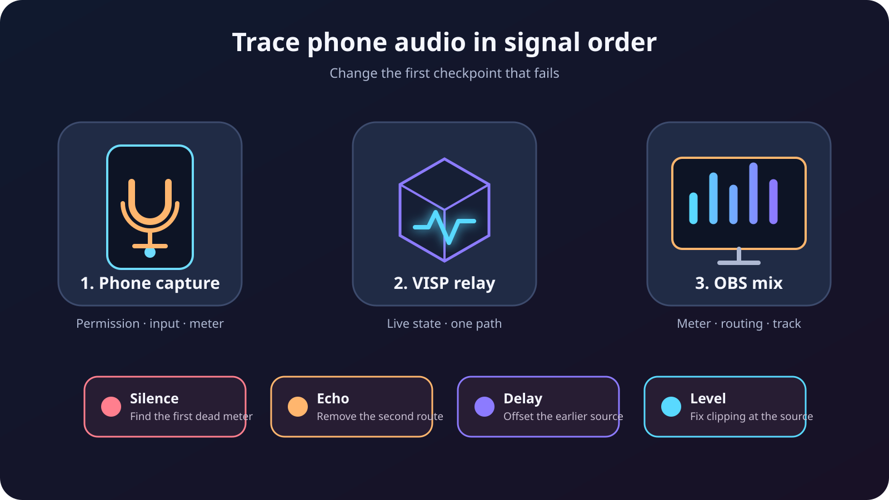

Kun etäpuhelimen kuva näkyy OBS:ssä oikein mutta ääni ei toimi, älä aloita
muuttamalla kaikkia ääniasetuksia. Selvitä ensin, onko ongelma **täysi
hiljaisuus, äänen kahdentuminen, vakio viive vai väärä taso**. Jokaiseen
oireeseen on eri korjaus.

VISP-työnkulussa puhelin lähettää yhden kamera- ja mikrofonisyötteen relayhin,
ja OBS vastaanottaa sen medialähteenä. Lopullinen Twitch- tai Kick-miksaus
tehdään edelleen OBS:ssä. Siksi signaaliketjussa on useita selviä
tarkistuspisteitä: puhelimen mittari, VISP-laitteen tila, OBS-mikseri,
paikallinen tallenne ja julkinen alustalähetys.

## Aloita oireesta, älä arvatusta korjauksesta

Valitse lyhin testi, joka erottaa yhden vian toisesta:

| Havainto | Tarkista ensin |
| --- | --- |
| Puhelimen mikrofonimittari ei liiku | Mikrofonilupa ja valittu äänitulo |
| Puhelimen mittari liikkuu, mutta VISP-laite ei ole Live | Puhelimen ja relayn välinen yhteys |
| Laite on Live, mutta OBS-mittari ei liiku | Oikea medialähde ja voimassa oleva lukuosoite |
| OBS-mittari liikkuu, mutta tallenne tai lähetys on hiljainen | Mykistys, monitorointitila ja käytössä oleva ääniraita |
| Sama ääni kuuluu kahdesti | Kahdennettu tallennus- tai monitorointireitti |
| Ääni on aina saman verran liian aikaisin | Viivästä aikaisemmin saapuvaa lähdettä OBS:ssä |
| Synkroni muuttuu lähetyksen aikana | Yhdistä lähde uudelleen ja tutki kuormitus ennen kiinteää korjausta |
| Voimakkaat sanat säröytyvät | Laske vahvistusta ketjun ensimmäisessä leikkaavassa kohdassa |

Tee jokaisen muutoksen jälkeen noin 20 sekunnin paikallinen tallenne. Pelkkä
live-monitoroinnin kuuntelu voi johtaa harhaan, koska monitoroinnilla on oma
reitityksensä ja viiveensä.

## Ymmärrä puhelimesta OBS:ään kulkeva äänireitti

VISPin natiivisovellus tallentaa valitun puhelinmikrofonin, näyttää sen tason
suorassa mittarissa, enkoodaa äänen AAC-muotoon H.264-videon rinnalle ja
lähettää molemmat SRT:llä. Relay tunnistaa yhteyden ja välittää
kuvalähdesyötteen. Tavallisella relaysta OBS:ään kulkevalla reitillä se ei
erottele, miksaa, normalisoi tai transkoodaa ääntä.

VISPin OBS-lisäosa lisää laitteen FFmpeg-medialähteenä, jonka syöttömuoto on
MPEG-TS. Lähde käyttää mahdollisuuksien mukaan laitteistopurkua, pientä
puskuria ja automaattista uudelleenyhdistystä. Sen ääni ilmestyy OBS:n Audio
Mixer -paneeliin.
[Puhelinsovelluksen ohje](https://docs.visp-stream.com/fi/docs/phone-app)
kattaa kameran ja mikrofonin valinnan.
[OBS-lisäosan ohje](https://docs.visp-stream.com/fi/docs/obs-remote-control)
selittää medialähteen lisäämisen yhdellä painalluksella.

Ensimmäinen epäonnistuva tarkistuspiste kertoo yleensä, missä korjaus tehdään.
Jos puhelimen mittari on hiljaa, OBS-suodin ei voi palauttaa ääntä, jota ei
koskaan tallennettu. Jos OBS-mittari liikkuu, puhelimen SRT-osoitteen vaihto ei
korjaa väärää ulostuloraitaa.

## 1. Varmista, että puhelin tallentaa oikeaa mikrofonia

Pysäytä kuvalähdelähetys ennen mikrofonin vaihtamista. Avaa VISP-sovelluksen
asetukset ja valitse **System default** tai haluamasi nimetty äänitulo.
Langallinen mikrofoni, USB-ääniliitäntä tai Bluetooth-kuulokemikrofoni voi
muuttua järjestelmän oletukseksi yhdistämisen yhteydessä. Älä siis oleta, että
puhelin käyttää yhä sisäistä mikrofoniaan.

Puhu samalla äänenvoimakkuudella ja etäisyydellä kuin oikeassa lähetyksessä.
Puhelimen mikrofonimittarin pitää reagoida selvästi jäämättä jatkuvasti
voimakkaimmalle tasolle. Peitä tai irrota sitten hetkeksi se mikrofoni, jota
luulet käyttäväsi. Jos mittari jatkaa reagointia tavalliseen tapaan, aktiivinen
tulo on jokin muu.

Jos mittari ei liiku:

1. varmista käyttöjärjestelmän asetuksista, että VISPillä on edelleen
   mikrofonilupa;
2. irrota ulkoinen äänitulo ja yhdistä se uudelleen;
3. valitse **System default** ja sen jälkeen nimetty tulo uudelleen;
4. pysäytä ja käynnistä kameran tallennusistunto;
5. testaa kerran sisäisellä mikrofonilla, jotta erotat sovellusvian
   lisälaiteviasta.

Käytä tässä testissä kuulokkeita. Aktiivisen puhelinmikrofonin vieressä oleva
kaiutin voi kierrättää ohjelmaäänen tai puhelun paluuäänen takaisin syötteeseen.

## 2. Varmista, että OBS vastaanottaa vain yhden kopion

Käynnistä puhelimen syöte ja varmista VISP-hallintapaneelista, että laite
näkyy **Live**-tilassa. Valitse sitten puhelimen sisältävä OBS-kohtaus ja puhu
samalla, kun seuraat Audio Mixer -paneelia.

Lisäosa käyttää uudelleen tai päivittää kyseisen VISP-laitteen medialähteen.
Jos olet luonut saman lukuosoitteen sisältävän medialähteen myös käsin, poista
tai mykistä ylimääräinen lähde. Kaksi samaa mikrofonia hieman eri aikaan
purkavaa lähdettä kuulostaa kaiulta, vaikka kumpikaan signaali ei itsessään
sisällä elektronista kaikua.

Tee erottelutesti näin:

1. mykistä kaikki OBS-äänilähteet puhelinta lukuun ottamatta;
2. tallenna yksi puhuttu lause ja käsien taputus;
3. kuuntele tallenne kuulokkeilla;
4. poista muiden lähteiden mykistys yksi kerrallaan.

Se lähde, jonka avaaminen palauttaa toisen äänen, paljastaa kaksoisreitin.
Tyypillisiä pareja ovat puhelimen mikrofoni ja samaa tilaa kuuleva
studiomikrofoni, kaksi samaan puhujaan suunnattua puhelinta, VISP-lähteen
toinen käsin tehty kopio tai desktop-äänenä uudelleen tallentuva
monitorointisignaali.

Älä yritä peittää kahta reittiä kohinaportilla. Portti saattaa sulkeutua
sanojen välissä, mutta molemmat kopiot avautuvat yhä aina puhuttaessa.

## 3. Korjaa tilanne, jossa mittari liikkuu mutta katsojat eivät kuule

Liikkuva OBS-mittari todistaa, että purettu ääni on saapunut mikseriin. Tarkista
sen jälkeen ulostuloreitti:

- puhelinlähdettä ei ole mykistetty Audio Mixerissä;
- sen liukusäädin ei ole pienimmällä arvolla;
- **Audio Monitoring** ei ole tilassa **Monitor Only (mute output)**, kun äänen
  on tarkoitus kuulua lähetyksessä;
- lähde on valittu sille ääniraidalle, jota lähetys käyttää;
- sisäkkäinen kohtaus tai kohtauskohtainen lähde ei ole mykistetty muualla.

OBS:n virallinen
[usean ääniraidan ohje](https://obsproject.com/kb/multiple-audio-track-recording-guide)
näyttää raitavalinnat **Advanced Audio Properties** -ikkunassa. Ohje muistuttaa
myös, että tavallinen toisto-ohjelma saattaa toistaa tallenteesta vain yhden
raidan. Testaa siis oikean ulostulon käyttämää raitaa sen sijaan, että
olettaisit kaikkien valittujen raitojen kuuluvan.

Jos lisäosan luoma lähde ei enää yhdistä, päivitä se kohdasta **Tools → VISP
Remote Control**. Tilin lukutunnuksen kierrättäminen mitätöi kaikki vanhat
VISP-medialähteet. Käytä silloin juuri luotua lähdettä äläkä yritä täydentää
peitettyä osoitetta käsin.

## 4. Poista kaiku poistamalla toinen reitti

Kaiku on tavallisesti reititysongelma, ei syy lisätä kaiunpoistosuodinta. Piirrä
yksi viiva jokaiselle reitille, jota pitkin sama ääni päätyy OBS:ään. Jätä
käyttöön yksi tarkoitettu reitti ja mykistä muut.

Pidä puhelinlähteen monitorointi tavallisessa lähetyksessä tilassa **Monitor
Off**, ellei tuottajan todella tarvitse kuulla sitä valitusta
monitorointilaitteesta. Monitor Off ei mykistä lähetysääntä. Se vain estää
OBS:ää toistamasta kyseistä lähdettä monitorointilaitteeseen.

Kun teet väliaikaisen äänitarkistuksen, ohjaa monitorointi kuulokkeisiin äläkä
kaiuttimiin. OBS:n ajantasainen
[Audio Mixer -ohje](https://obsproject.com/kb/audio-mixer-guide) neuvoo
kuuntelemaan signaalia ensin alkuperäisellä laitteella ja uudelleen OBS:ssä
Audio Monitoring -toiminnolla. Sen jälkeen kannattaa tehdä tavallinen tallenne
ja kuunnella se ennen lähetystä.

Mykistä myös julkinen Twitch- tai Kick-esikatselu jokaisella samassa tilassa
olevalla tietokoneella ja puhelimella. Kaiuttimesta kuuluva viivästetty
alustalähetys voi päätyä puhelimen tai studion mikrofoniin ja palata lähetykseen
pitkänä kaikuna.

## 5. Korjaa vakio viive rikkomatta toimivaa puhelinsyötettä

Päätä ensin, mitkä signaalit pitäisi kohdistaa toisiinsa.

Puhelimen kamera ja mikrofoni enkoodataan samaan kuvalähdesyötteeseen. Jos
niiden taputustesti on jo kohdallaan paikallisessa OBS-tallenteessa, jätä
lähteen viivekorjaus nollaan. SRT-viive antaa kadonneille paketeille aikaa
saapua uudelleen. Haivisionin
[SRT-socket-dokumentaatio](https://github.com/Haivision/srt/blob/master/docs/API/API-socket-options.md#srto_rcvlatency)
määrittelee sen vastaanottajan vähimmäispuskurointiviiveeksi. Se ei ole
pelkästään ääneen vaikuttava viivesäädin. OBS:n
[SRT-ohje](https://obsproject.com/kb/srt-protocol-streaming-guide) kuvaa
osoitteen viivearvon mikrosekunteina, ja
[VISPin enkooderiohje](https://docs.visp-stream.com/fi/docs/broadcaster-setup)
selittää, miten suositus lasketaan mitatun yhteyden perusteella.

Kiinteä korjaus on hyödyllinen, kun **erillinen** äänireitti saapuu ennen
puhelimen videota. Tällainen voi olla esimerkiksi toisella laitteella kotiin
lähetetty tapahtumamiksaus tai studiomikrofoni, jota käytetään keskustelussa
etäkameran kanssa.

Tallenna näkyvä ja kuuluva synkronointitapahtuma, jonka molemmat vertailtavat
reitit havaitsevat. Avaa OBS:ssä **Edit → Advanced Audio Properties** ja lisää
positiivinen **Sync Offset** aikaisemmin saapuvalle äänilähteelle. Muuta yhtä
arvoa kerrallaan, tallenna uusi testi ja käytä pienintä arvoa, jolla tapahtuma
kohdistuu. Älä kasvata SRT-viivettä vain yhden mikserikanavan siirtämiseksi,
sillä muutos vaikuttaa koko kuvalähdereitin viiveeseen ja häiriönsietoon.

Jos puhelinsyöte on aluksi synkronissa mutta alkaa vähitellen ajautua, kiinteä
korjaus on väärä ensimmäinen ratkaisu. Pysäytä ja käynnistä puhelinlähetys,
päivitä medialähde ja tee tallenne uudelleen. Tarkista OBS:n renderöinti- ja
enkoodauskuormitus sekä testaa oikea kenttäverkko. Vakioarvo ei korjaa
jatkuvasti muuttuvaa viivettä.

## 6. Säädä puhdas taso ja oikea kanavajako

Säädä vahvistus signaalin kulkusuunnassa: ensin mikrofoni tai ääniliitäntä,
sitten puhelimen tallennus ja viimeisenä OBS:n liukusäädin. Jos mikrofoni
leikkaa jo ennen enkoodausta, OBS-tason laskeminen tekee säröytyneestä äänestä
vain hiljaisempaa.

OBS:n Audio Mixer -ohje selittää mittarin värialueet ja huippuarvon. Käytä niitä
varoituksiin ja lähteiden vertailuun, mutta arvioi lopputulos kuulokkeilla ja
tavallisilla kaiuttimilla kuunnellusta tallenteesta. Puheelle, väkijoukolle,
musiikille ja IRL-ympäristöäänelle ei kannata tavoitella yhtä yleispätevää
mittarilukemaa.

Jos kolmannen osapuolen enkooderi syöttää monomikrofonin vain stereolähteen
vasempaan tai oikeaan kanavaan, ota kyseiselle lähteelle käyttöön **Downmix to
Mono** Advanced Audio Properties -ikkunassa. VISPin natiivisovellukset
määrittävät oman mikrofonisyötteensä yksikanavaiseksi puhesignaaliksi, mutta
Larix, Moblin, ulkoiset ääniliitännät ja sovitinkaapelit voivat tuottaa erilaisia
kanavajakoja. Tarkista tallenteesta molemmat puolet.

## Tee koko lähetyksen ääniharjoitus

Ennen seuraavaa Twitch- tai Kick-lähetystä:

1. valitse mikrofoni puhelinlähetyksen ollessa pysäytetty;
2. varmista, että puhelimen mittari reagoi oikeaan tuloon;
3. aloita lähetys ja varmista laitteen olevan **Live**;
4. varmista yhden puhelinlähteen liikuttavan yhtä OBS-mittaria;
5. mykistä muut samaa tilaa tallentavat mikrofonit;
6. käytä väliaikaiseen monitorointiin kuulokkeita;
7. tallenna puhetta, hiljaisuutta, voimakas kohta ja taputus;
8. korjaa vain mitattu kiinteä ajoitusero;
9. katkaise puhelimen yhteys ja varmista äänen palaavan yhdistämisen jälkeen;
10. tee lyhyt yksityinen tai muuten vähäriskinen alustatesti ja tarkista se
    toisesta, mykistetystä laitteesta.

Säilytä paikallinen tallenne. Jos alustalähetys kuulostaa väärältä mutta
paikallinen tiedosto on puhdas, kuvalähde ja OBS-miksaus on jo rajattu pois.
Tutki silloin lopullisen ulostulon määritystä.

## Tiedä, mitä VISP ei korjaa

VISP antaa puhelimelle peruutettavan julkaisupolun, välittää sen syötteen
OBS:ään ja pitää Twitch- tai Kick-kohteen kotistudiossa. Tavallisella
puhelimesta OBS:ään kulkevalla reitillä se **ei** transkoodaa syötettä, miksaa
mikrofoneja, poista huonekaikua, normalisoi äänenvoimakkuutta eikä niputa
mobiili- ja Wi-Fi-yhteyttä yhdeksi yhteydeksi.

Tämä raja helpottaa vianetsintää: tallennusongelmat kuuluvat puhelimeen,
siirto-ongelmat kuvalähdereitille ja lopullisen miksauksen ongelmat OBS:ään.

Jos haluat hallitun puhelinlähteen nykyiseen tuotantoosi, seuraa
[VISPin aloitusohjetta](https://docs.visp-stream.com/fi/docs/get-started),
lisää puhelin testikohtaukseen ja tee yllä kuvattu erottelutallenne ennen
seuraavaa lähetystä. Laajempi
[puhelin etäkamerana -opas](/fi/blog/use-phone-as-remote-camera-obs) kattaa koko
videotyönkulun. [Heikon mobiiliverkon
opas](/fi/blog/keep-stream-live-bad-mobile-network) puolestaan käsittelee
uudelleenyhdistämistä ja varakuvaa kenttäyhteyden katketessa.
