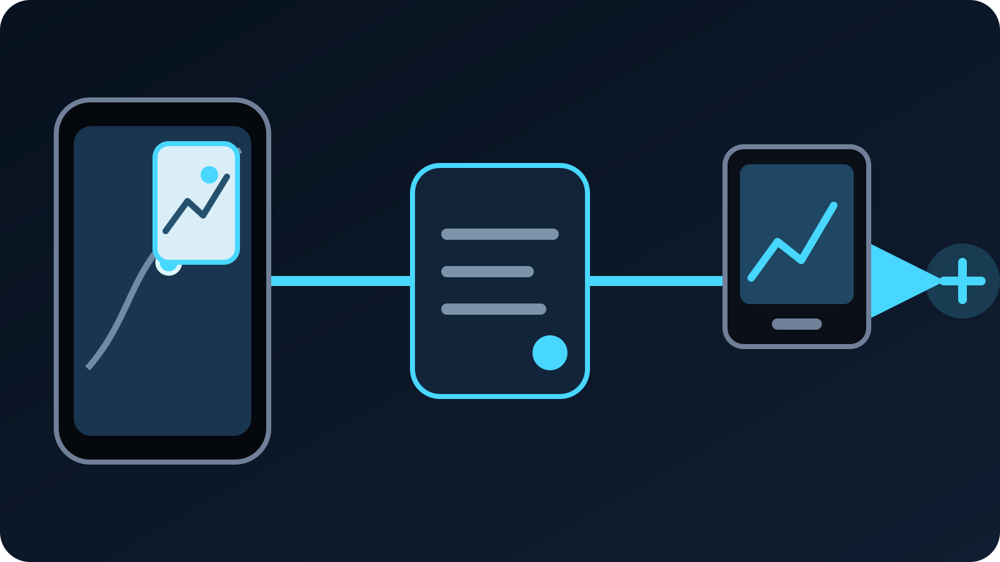

Et tarvitse aina toista puhelinta kartan tarkistamiseen tai tuottajan viestin
avaamiseen kesken iPhonella tehdyn IRL-lähetyksen. Tuetulla iPhonella VISP voi
pitää aktiivisen kameran näkyvissä **Picture in Picture- eli PiP-ikkunassa**,
kun toinen sovellus on etualalla. Käynnistä kamerasyöte VISPissä, varmista se
OBS:stä, pyyhkäise Koti-valikkoon ja odota, että pieni suora esikatselu tulee
näkyviin ennen toisen sovelluksen avaamista.

Raja on tärkeä: **sovellusta voi vaihtaa aktiivisen PiP-ikkunan kanssa, mutta
puhelimen lukitseminen, PiP-ikkunan sulkeminen tai VISPin pakkosulkeminen ei ole
turvallinen taustatyönkulku.** Jos iOS ei pysty jatkamaan kameraa PiP-tilassa,
VISP pysäyttää julkaisun sen sijaan, että se näyttäisi jäätynyttä kuvaa suorana.

## Mitä Picture in Picture pitää käynnissä

VISP kaappaa valitun iPhone-kameran ja mikrofonin, enkoodaa H.264-videon sekä
AAC-äänen ja julkaisee kuvalähteen SRT:n kautta. Tavallisessa
kotistudiotyönkulussa VISP-relay tunnistaa syötteen ja välittää sen OBS:n
medialähteeseen. OBS lisää kohtaukset, hälytykset, paikallisen äänen ja
varasisällön ennen valmiin ohjelman lähettämistä Twitchiin tai Kickiin.

Kun PiP toimii, kameran kuvalähde jatkuu toisen iPhone-sovelluksen täyttäessä
päänäytön. Pieni PiP-ikkuna näyttää suoran kamerakuvan, joten kuvaajalla säilyy
näkyvä merkki aktiivisesta kaappauksesta. Apple antaa siirtää ikkunan toiseen
kulmaan, muuttaa sen kokoa tai työntää sen hetkeksi näytön reunan taakse.

Tämä on **kameran moniajoa, ei näytön jakamista**. PiP-ikkunan taakse avattu
reitti, yksityisviesti tai tilisivu ei muutu VISPin kamerasyötteeksi tai
OBS-lähteeksi. Kamera osoittaa edelleen fyysiseen ympäristöön. PiP ei siksi ole
tapa näyttää mobiilipeliä tai esitellä sovellusta; siihen tarvitaan tarkoituksella
rakennettu näytönkaappaustyönkulku.

Sama puhelinkaappaus voi syöttää myös [VISP Directiä](/fi/blog/what-is-visp-direct),
mutta epäonnistumisen seuraus on erilainen. Kun OBS on kotona, tuottaja voi
vaihtaa paikalliseen varakohtaukseen puhelimen pysähtyessä. Pelkässä
Direct-lähetyksessä ei ole kotistudion OBS-kerrosta peittämässä epäonnistunutta
siirtymää taustalle.

## Tarkista tuki oikealla iPhonella

VISPin iPhone-sovellus vaatii iOS 16.4:n tai uudemman, mutta käyttöjärjestelmän
vähimmäisversio ei yksin lupaa kameran taustakäyttöä. Sovellus kysyy aktiiviselta
kaappaussessiolta, ilmoittaako iOS moniajon kameratuen kyseisellä laitteella.
PiP valmistellaan vain, kun järjestelmä kertoo polun olevan tuettu.

Apple dokumentoi
[`isMultitaskingCameraAccessSupported`](https://developer.apple.com/documentation/avfoundation/avcapturesession/ismultitaskingcameraaccesssupported)
-ominaisuuden tukitarkistukseksi ja
[`isMultitaskingCameraAccessEnabled`](https://developer.apple.com/documentation/avfoundation/avcapturesession/ismultitaskingcameraaccessenabled)
-asetuksen kameran moniajon käyttöönotoksi. VISP ottaa session käyttöön vasta
tukitarkistuksen jälkeen. Nykyinen
[PiP-koordinaattori](https://github.com/PohinaGroup/visp/blob/main/apps/native/modules/visp-srt/ios/PictureInPictureCoordinator.swift)
syöttää sitten suorat kameraruudut iOS:n PiP-ikkunaan.

Älä muuta toteutuksen yksityiskohtaa verkosta kopioiduksi puhelinmallilistaksi.
Luotettava testi tehdään sillä iPhonella ja VISP-versiolla, joita oikeassa
lähetyksessä käytetään. Käyttöjärjestelmäpäivitys, laitteen kyvyt ja
kaappaustila vaikuttavat kaikki. Kokeile taustalle siirtymistä harjoituksessa ja
arvioi OBS:ssä etenevää kuvaa, älä pelkkää PiP-kuvaketta.

Android on eri tapaus. Tässä kuvattu nykyinen VISPin PiP-julkaisupolku on vain
iPhonelle. Android-käyttäjän kannattaa pitää VISP etualalla ja käyttää tarvittaviin
tietoihin sisäistä chattia, toista laitetta tai tuottajaa, kunnes vastaava
taustakameratyönkulku on dokumentoitu.

## Käytä toista sovellusta menettämättä kamerasyötettä

Rakenna koko polku valmiiksi ennen VISPistä poistumista:

1. Avaa VISP ja valitse kamera, mikrofoni, tarkkuus sekä kuvataajuus.
2. Käynnistä puhelinsyöte ja odota, että VISP ilmoittaa sen olevan suorana.
3. Avaa puhelimen medialähde OBS:ssä koko ruudulle ja varmista ajantasainen kuva
   sekä ääni.
4. Pyyhkäise iPhonen Koti-valikkoon. Älä lukitse laitetta.
5. Odota, että suora kameraesikatselu ilmestyy pieneksi PiP-ikkunaksi.
6. Avaa tarvitsemasi kartta-, muistiinpano-, chat- tai tuottajasovellus.
7. Siirrä PiP-ikkunaa tai muuta sen kokoa, jos se peittää tärkeän säätimen,
   mutta älä sulje sitä.
8. Pyydä OBS-tuottajaa varmistamaan, että lähde etenee ja äänimittari reagoi.
9. Palaa VISPiin PiP-ikkunan paluupainikkeella tai sovelluksenvaihtajalla ennen
   kamerasyötteen lopettamista tai asetusten muuttamista.

Applen nykyinen [iPhonen PiP-ohje](https://support.apple.com/fi-fi/guide/iphone/iphcc3587b5d/ios)
kuvaa ikkunan eleet: koon muuttamisen, siirtämisen, reunaan piilottamisen,
sulkemisen ja koko näyttöön palaamisen. Suorassa VISP-kuvalähteessä sulkeminen
ei ole sama asia kuin piilottaminen. Työnnä ikkuna reunaan, kun tarvitset tilaa,
ja palaa VISPiin ennen PiP:n sulkemista.

OBS-tarkistus on välttämätön. Pieni esikatselu todistaa iOS:n avanneen
PiP-ikkunan, mutta tuotanto tarvitsee koko kamera–relay–OBS-polun. Seuraa
liikkuvaa kohdetta tai puhelimen ulkopuolella näkyvää kelloa useita sekunteja ja
kuuntele lyhyt puhuttu lause. Liikkumaton näkymä voi saada jäätyneen lähteen
näyttämään terveeltä.

## Valitse chattiin ja navigointiin oikea työkalu

Jos tarvitset vain Twitch- tai Kick-chatin, sovelluksen vaihtaminen voi olla
turhaa. VISP tarjoaa kelluvan chatin suoraan kameran päälle, joten kuvaaja voi
lukea viestejä koko julkaisunäkymässä. [Puhelimen chat-opas](/fi/blog/twitch-kick-chat-phone-obs)
selittää yksityisen kuvaajanäkymän ja sen eron katsojille näkyvään
OBS-chatpeitteeseen.

PiP auttaa enemmän, kun tieto on muualla:

- seuraavan kävelyosuuden kartassa;
- muistiinpanoissa tai lähetyksen ajolistassa;
- yksityisellä tuottajakanavalla;
- tapahtumapaikan tai liikenteen päivityksessä;
- selaimessa hetkellisesti tarvittavalla sivulla.

Pidä käynnit lyhyinä. PiP-esikatselu on VISPin koko kameranäkymää pienempi,
joten tarkennusta, horisonttia, valotusta ja kuvaan saapuvia sivullisia on
vaikeampi arvioida. Palaa VISPiin ennen vaativaa kameraliikettä tai osuutta,
jossa rajaus on erityisen tärkeä.

Käytä puhuttuja navigointiohjeita varoen. Puhelimen kaiuttimesta kuuluva opastus
voi päätyä saman mikrofonin kautta lähetykseen, vaikka navigointisovelluksen
näyttöä ei kaapata. Testaa oikea mikrofoni, kaiuttimen voimakkuus ja reitin
ohjeet. Mykistetty opastus, huomaamaton kuuloke tai toinen navigointilaite voi
tuottaa siistimmän lähetyksen.

## PiP ei tee taustalähetyksestä ehdotonta

Picture in Picture ratkaisee yhden rajatun ongelman: se antaa tuetulle
aktiiviselle kaappaussessiolle iOS:n hyväksymän näkyvän taustaesityksen toisen
sovelluksen ollessa etualalla. Se ei poista puhelimen tai verkon muita
häiriötapoja.

Älä luota PiP:hen näissä tilanteissa:

- **Näytön lukitseminen.** Lukittu puhelin ei vastaa etualan sovellusta, jonka
  päällä näkyy PiP-ikkuna. Pidä laite lukitsematta julkaisun aikana.
- **PiP-ikkunan sulkeminen.** Jos VISP jää taustalle ja PiP päättyy, sovellus ei
  voi turvallisesti luvata kamerakaappauksen jatkumista.
- **VISPin pakkosulkeminen.** Sovelluksen poistaminen sovelluksenvaihtajasta
  lopettaa sen julkaisuprosessin.
- **Kuolleen verkkoyhteyden palauttaminen.** PiP ei luo lähetyskaistaa, korjaa
  operaattorikatkoa tai muuta SRT-viivettä.
- **Yhteyksien aito yhdistäminen.** VISPin valinnainen natiivin kaksilinkin tila
  kahdentaa paketit Wi-Fiin ja mobiiliyhteyteen; PiP ei yhdistä kapasiteettia.
- **Kamera-asetusten muuttaminen taustalla.** Palaa VISPiin ennen kameran,
  kuvamuodon, äänitulon, vakautuksen tai lähetystilan vaihtamista.

VISPin nykyinen
[taustatilan käytäntö](https://github.com/PohinaGroup/visp/blob/main/apps/native/modules/visp-srt/ios/StreamState.swift)
pitää yhdistävän, suoran tai uudelleenyhdistävän session käynnissä vain PiP:n
ollessa aktiivinen tai käynnistymässä. Jos PiP ei voi jatkaa, natiivinäkymä
pysäyttää lähetyksen ja näyttää taustavideovirheen sovellukseen palattaessa.
Ratkaisu on tarkoituksellinen: näkyvä virhe on turvallisempi kuin vanhan kuvan
lähettäminen huomaamatta.

## Rakenna OBS-varakohtaus epäonnistumista varten

Testattu PiP-siirtymäkin voi epäonnistua myöhemmin, jos kaappaussessio
keskeytetään tai käyttöjärjestelmä ei pysty jatkamaan sitä. Kodin OBS-tuotannon
kannattaa olettaa puhelinlähteen voivan kadota ja pitää paikallinen kohtaus
valmiina.

Käytä luotua medialähdettä ja varakohtaustyönkulkua
[VISPin lähettäjän ohjeesta](https://docs.visp-stream.com/fi/docs/broadcaster-setup).
Varakohtauksessa voi olla odotuskuva, paikallinen mikrofoni, musiikkia jonka
käyttöön sinulla on lupa tai toinen kamera. Sen tehtävä on pitää katsojien
lähetys ymmärrettävänä sillä aikaa, kun kuvaaja palaa VISPiin.

Jos syöte pysähtyy sovelluksesta poistumisen jälkeen:

1. vaihda OBS paikalliseen varakohtaukseen;
2. palaa iPhonella VISPiin;
3. lue näytön tila äläkä pyyhkäise sovellusta heti uudelleen taustalle;
4. käynnistä puhelimen kuvalähde uudelleen, jos VISP on pysäyttänyt sen;
5. varmista OBS:stä tuore liike ja ääni;
6. palaa kenttäkohtaukseen vasta lähteen vakauduttua.

Älä yritä peittää taustakameran epäonnistumista kasvattamalla SRT-viivettä.
SRT-viive antaa myöhästyneille tai uudelleenlähetetyille paketeille enemmän
aikaa, mutta ei pidä iOS:n kamerakaappausta käynnissä.
[Mobiiliverkon palautumisopas](/fi/blog/keep-stream-live-bad-mobile-network)
käsittelee siirtoyhteyden häiriöt erikseen.

## Tee viiden minuutin PiP-harjoitus

Testaa ominaisuus samalla iPhonella, iOS-versiolla, VISP-versiolla,
mikrofonilla ja verkolla, joita aiot käyttää lähetyksessä. Tallenna OBS-lähde,
jotta voit tutkia jokaisen siirtymän täsmällisen hetken.

| Aika | Kuvaajan toiminta | Mitä OBS-tuottaja varmistaa |
| --- | --- | --- |
| 0:00 | Käynnistä VISP etualalla | Ajantasainen liike, puhdas ääni ja oikea lähde |
| 1:00 | Pyyhkäise Kotiin ja odota PiP:tä | Ei jäätymistä, uudelleenyhdistämistä tai äänikatkoa |
| 2:00 | Avaa tarvittu kartta tai chat | Kameran liike ja mikrofoni jatkuvat |
| 3:00 | Siirrä PiP:tä ja piilota se hetkeksi reunaan | Syöte jatkuu PiP:n pysyessä aktiivisena |
| 4:00 | Palaa VISPiin | Suora tila ja tilastot ovat ajan tasalla |
| 5:00 | Lopeta normaalisti VISPistä | Lähde päättyy tarkoituksella ja varakohtaus toimii |

Toista testi kerran näytön tallennus pois päältä ja ilmoitukset hiljennettyinä,
kuten oikeassa lähetyksessä. Jos ensimmäinen taustalle siirtyminen pysäyttää
syötteen, käsittele PiP:tä kyseisellä yhdistelmällä ei-tuettuna. Pidä VISP
etualalla ja käytä toista laitetta sen sijaan, että julkinen lähetys olisi
seuraava koe.

Testaa myös palautuminen tarkoituksella: sulje PiP yksityisessä harjoituksessa
VISPin ollessa taustalla ja varmista, että tuottaja havaitsee virheen, vaihtaa
varakohtaukseen ja odottaa tuoretta lähdettä. Häiriöpolun tunteminen on yhtä
arvokasta kuin onnistuneen siirtymän näkeminen.

## Usein kysyttyä

### Näkevätkö katsojat PiP:n takana olevan kartan tai chatin?

Eivät. VISP julkaisee valitun kameran ja mikrofonin, ei iPhonen näyttöä. Toinen
sovellus pysyy paikallisena. Sen näyttämiseen lähetyksessä tarvittaisiin
erillinen näytönjakotyönkulku.

### Voinko lukita iPhonen kameran jatkaessa PiP-tilassa?

Älä luota siihen. PiP on tarkoitettu pysymään näkyvissä toisen sovelluksen
käytön aikana, ja lukitusnäyttö on eri tila. Pidä puhelin lukitsematta ja testaa
automaattinen lukitus ennen lähetystä.

### Miksi VISP pysähtyi, kun poistuin sovelluksesta?

iPhone ei ehkä ilmoittanut moniajon kameratukea, PiP ei käynnistynyt tai
aktiivinen kaappaussessio keskeytyi. Palaa VISPiin ja lue virhe. Jos sama laite
epäonnistuu kahdessa harjoituksessa, pidä VISP etualalla oikeassa lähetyksessä.

### Toimiiko PiP, kun VISP Direct lähettää Twitchiin tai Kickiin?

PiP suojaa samaa aktiivista iPhone-kaappausta, joten se voi jatkaa Directin
ollessa käytössä tuetulla laitteella. Pelkässä Direct-lähetyksessä ei kuitenkaan
ole OBS-varakohtausta kaappauksen pysähtymisen varalle. Testaa kohdealusta ja
palautuminen, älä vain puhelimen esikatselua.

### Heikentääkö PiP lähetyksen laatua tai bittinopeutta?

PiP-ikkuna on aktiivisen kaappauksen paikallinen esikatselu, ei toinen
alustaenkoodaus. Valittu kameramuoto ja VISPin kuvalähdeasetukset määräävät yhä
puhelinsyötteen. Varmista oikea lopputulos OBS:stä, sillä laitteen kuorma ja
verkkotilanne voivat muuttua moniajon aikana.

## Lähteet ja seuraavat vaiheet

- [Apple: Picture in Picture -moniajo iPhonella](https://support.apple.com/fi-fi/guide/iphone/iphcc3587b5d/ios)
- [Apple: AVCaptureSessionin kameran moniajo](https://developer.apple.com/documentation/avfoundation/avcapturesession/ismultitaskingcameraaccessenabled)
- [Twitch: mobiililähetyksen aloittaminen](https://help.twitch.tv/s/article/getting-started-on-twitch?language=en_US)
- [VISP-puhelin- ja selainsovellus](https://docs.visp-stream.com/fi/docs/phone-app)
- [VISP-enkooderit ja varakohtaus](https://docs.visp-stream.com/fi/docs/broadcaster-setup)

Jos haluat pitää iPhonen hallittuna kenttäkamerana ja Twitch- tai Kick-tuotannon
kotistudion OBS:ssä, [kokeile VISPiä](https://visp-stream.com/download). Aloita
yksityisellä viiden minuutin PiP-harjoituksella, pidä paikallinen varakohtaus
valmiina ja käytä toista laitetta aina, kun oikea iPhone ei pidä taustakameraa
luotettavasti käynnissä.
