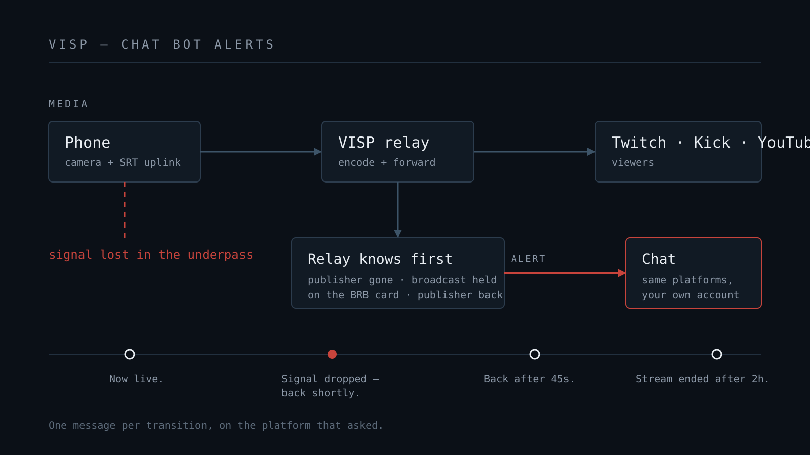

Jokainen IRL-striimaaja tuntee ne yhdeksänkymmentä sekuntia. Puhelin menettää
yhteyden alikulussa, lähetys jäätyy ja chat alkaa kirjoittaa. "Onks se kuollu?"
"Mullaki pätkii." "F." Kun palaat, joku on jo ehtinyt kysyä loppuiko lähetys,
kolme on vastannut väärin ja moderaattori pyytelee anteeksi puolestasi.

Turhauttavinta on se, että *jokin* tiesi. Puhelimesi tiesi menettäneensä
yhteyden. Relay tiesi, että paketit loppuivat. Ainoa osapuoli joka ei tiennyt,
oli chat — se joka nimenomaan kysyi.

Tämä kirjoitus kertoo, miten aukko kurotaan umpeen chatbotilla, joka lukee
lähetyksen tilan signaalipolulta sen sijaan että arvailisi sitä.

## Miksi tavallinen chatbotti ei tiedä katkosta

Nightbot, StreamElements ja Fossabot ovat erinomaisia siinä mitä ne tekevät, ja
ne tekevät sen alustan sisällä. Juuri siksi ne ovat väärä työkalu tähän yhteen
tehtävään.

**Ne näkevät alustan käsityksen "offlinesta", eivät sinun.** Twitch ei merkitse
kanavaa offlineksi sillä sekunnilla kun puhelin menettää yhteyden. Se odottaa.
Jos polulla on pilvi-OBS tai relay, alusta ei ehkä koskaan merkitse sinua
offlineksi, koska jokin lähettää sille edelleen kuvaa — BRB-kortti, ylläpidetty
koodaus tai jäätynyt ruutu. Alustan mielestä olet koko ajan suorassa. Chatin
mielestä olet ollut jumissa minuutin.

**Ne eivät erota katkosta lopetuksesta.** Alustan rajapintaa katsovalla botilla
on vain yksi bitti: live tai ei. Se ero josta IRL-yleisö oikeasti välittää —
"kävelee katvealueen läpi, odota" vastaan "lähetys loppui, hyvää yötä" — ei ole
siinä bitissä.

Pilvi-OBS-palvelut ratkaisevat tämän toisin: laittamalla polulle tietokoneen,
jota moderaattori voi ohjata. Se toimii, ja [IRLToolkit](https://irltoolkit.com/)
veloittaa siitä 129 dollaria kuussa. Vertailun siitä mitä rahalla saa
kirjoitimme erikseen: [IRLToolkitin vaihtoehdot](/blog/irltoolkit-alternative).
Mutta pilvikoneen maksaminen siksi, että chat saisi tiedon katkosta, on iso
ratkaisu pieneen ongelmaan.

## Mitä relay jo tietää

VISP on puhelimen ja alustan välissä. Se saa tietää ensimmäisenä, ja se saa
tietää tarkasti:

- **Julkaisija yhdistyi.** Laite alkoi lähettää — se on todellinen hetki jolloin
  menit suoraan, ennen kuin alustan oma merkintä ehtii perässä.
- **Lähde katosi.** MediaMTX raportoi julkaisijan katoamisen sekunneissa, ja
  tasausajo nappaa senkin minkä koukku ohittaa.
- **Pidetäänkö lähetystä yllä.** Jos
  [Älä koskaan katkea](https://docs.visp-stream.com/fi/docs/direct-output) on
  päällä, VISP pitää lähtevän lähetyksen elossa BRB-kortilla sen sijaan että
  purkaisi alustalähdön. Relay tietää kumpi tapahtui.
- **Julkaisija palasi.** Ja kuinka pitkä katko oli, sekunnilleen.

Viimeinen pari on koko juju. "Signaali katkesi, lähetystä pidetään yllä" ja
"lähetys päättyi" ovat aidosti eri tapahtumia, ja VISP on ainoassa paikassa
jossa ero on yksiselitteinen. Siksi botti lähettää niistä eri viestit:

| Mitä tapahtui | Mitä chat näkee |
| --- | --- |
| Laite aloitti julkaisun | Now live. |
| Lähde katosi, lähetystä pidetään BRB-kortilla | Signal dropped — the stream is held on the BRB card, back shortly. |
| Lähde palasi | Back — the signal recovered after 45s. |
| Lähde katosi, lähdöt purettiin | Stream ended after 2h 5min. Thanks for watching! |

Jokainen rivi on muokattavissa ja jokaisella on oma kytkin, koska moni haluaa
vain katkosilmoituksen eikä mitään muuta.

## Ei tietokonetta polulla

Botti pyörii palvelinpuolella. Relay huomaa lähteen ilmestymisen tai
katoamisen ja raportoi sen; VISPin sovelluspalvelin lähettää viestin. Ei
puhelimessa, ei kotikoneella, ei selainvälilehdessä jonka pitäisi muistaa
jättää auki.

Sillä on enemmän väliä kuin miltä kuulostaa. Puhelimessa pyörivä botti kuolee
sovelluksen mukana, joka pysähtyi kun otit puhelun. Kotikoneella pyörivä botti
vaatii koneen päällä. Se ilmoitus lähetyksen katkeamisesta on kaikista
ilmoituksista todennäköisimmin sellainen, jonka lähettäjä kaatui samalla —
joten sen ei pitäisi pyöriä lähelläkään sitä mikä hajosi.

Koska ilmoitukset lähtevät lähetyksen tilasta, ne lähtevät myös silloin kun et
ole näytön lähelläkään. Puhelin taskussa, käsi gimbaalilla, kävelemässä. Chat
saa silti tiedon.

## Käyttöönotto

1. Avaa VISPin hallintapaneeli ja etsi **Chat-botti**.
2. Kytke päälle **Anna VISPin kirjoittaa chattiini**.
3. Valitse alustat: Twitch, Kick, YouTube. Jos kirjoituslupaa ei vielä ole,
   näkyy **Anna kirjoituslupa**, joka avaa alustan oman lupanäkymän.
4. Paina **Lähetä testiviesti**. Oikea viesti oikeaan chattiin on ainoa todiste
   jolla on merkitystä.

Oikeudet ovat kapeat. Twitch tarvitsee `user:write:chat`, Kick `chat:write` ja
YouTube käyttää samaa `youtube.force-ssl` -oikeutta jonka annoit jos käytät
Directiä tai muokkaat otsikkoa VISPistä. VISP pyytää samalla kaikki aiemmin
myöntämäsi oikeudet, joten botin valtuutus ei hiljaisesti katkaise chatin
lukemista tai Directiä.

Yksi asia on hyvä tietää etukäteen: **viestit lähetetään omalla tililläsi**, ei
erillisenä bottikäyttäjänä. Twitchissä ilmoitukset näkyvät siis nimelläsi ja
merkilläsi. Osa striimaajista pitää siitä — ilmoitus tulee lähettäjältä
itseltään. Jos haluaisit chattiin erillisen botti-identiteetin, sitä ei ole
vielä.

## Komennot, koska botti kuuntelee jo

Kun botti on kerran yhteydessä chattiin, se voi yhtä hyvin vastata kysymyksiin.
Valmiit komennot ovat niitä joita IRL-yleisö oikeasti kysyy:

- `!bitrate` — luku suoraan yhteydeltä: bittinopeus, vasteaika, pakettihävikki.
  Kun chat sanoo "näyttää palikkaiselta", tämä ratkaisee asian.
- `!uptime` — kuinka kauan lähetys on ollut käynnissä.
- `!viewers` — katsojamäärät jokaiselta linkitetyltä alustalta, mikä on aidosti
  hyödyllistä kun lähetät monelle alustalle etkä näe yhtäkään niistä.
- `!commands` — lista.
- `!title <teksti>` — sinulle ja moderaattoreille, päivittää otsikon kaikkialle
  kerralla. Moderaattori voi vaihtaa otsikon suunnitelman muuttuessa ilman että
  kukaan koskee hallintapaneeliin.

Omat komennot ovat tekstivastauksia: `!discord`, `!reitti`, `!kamera`, ne
tavalliset. Samanniminen oma komento ohittaa valmiin, joten voit korvata
`!uptime`-vastauksen omalla vitsilläsi.

Vastaukset menevät sille alustalle jolta kysymys tuli. Yhden katsojan kysymys
Kickissä ei tuo vastausta myös Twitch-chattiisi.

## Tylsät osat, jotka pitävät tilisi kunnossa

Chatbotti on kone jolla on lupa kirjoittaa sinun nimissäsi, ja siinä kannattaa
olla varovainen. Rajat ovat tarkoituksellisia:

- **Yksi rivi, 200 merkkiä.** Pidemmät vastaukset katkaistaan, ei pilkota.
- **20 viestiä minuutissa alustaa kohden** ja vähintään puolitoista sekuntia
  viestien välissä. Silmukassa jauhava botti on se, joka johtaa porttikieltoon.
- **Katsojilla on jäähy, sinulla ja moderaattoreilla ei.** Oletuksena kymmenen
  sekuntia omissa komennoissa, jottei yksi henkilö saa bottia tulvimaan.
- **Jokainen ilmoitus lähtee kerran tilanmuutosta kohden.** Katkoskoukku ja
  jaksoittainen tasaus raportoivat saman katkon, ja botti varaa jokaisen
  tapahtuman kerran kaikkien palvelininstanssien kesken. Kahdesti minuutissa
  pätkivä yhteys mainitaan kerran.
- **Botti kuuntelee vain kun jokin julkaisee** tai kun BRB-kortti on pystyssä.
  Offline-tilassa se ei ole yhteydessä chattiisi lainkaan.

## Mitä se ei tee

Rehellisyys on halvempaa kuin tukipyyntö:

- **Ei erillistä bottitiliä.** Ilmoitukset tulevat omalta tililtäsi.
- **Ei `!location`-, `!speed`- tai `!battery`-komentoja.** Ne vaatisivat
  telemetriaa jota VISP-sovellus ei vielä raportoi. Kun raportoi, ne ovat pieni
  lisäys.
- **Ei ajastimia eikä toistuvia viestejä.** Ei mitään ajastettua, vain reagoivaa.
- **Ei moderointitoimia.** Botti ei anna porttikieltoja eikä poista viestejä.
- **Ei yhteyksien niputusta.** Tämä on chat-ominaisuus; jos tarvitset useamman
  mobiiliyhteyden yhdistämistä, se on
  [eri keskustelu](/blog/bond-cellular-wifi-visp-speedify).

## Mihin tämä jättää sen 129 dollaria

Jos tarvitset pilvi-OBS-palvelulta kohtauksia, grafiikoita ja moderaattorin joka
ajaa tuotantoasi kun olet ulkona, maksa siitä. Se on oikea tuote oikeaan
ongelmaan.

Jos tarvitsit vain sen, että chat saa tiedon signaalin katkeamisesta, sen ei
pitäisi maksaa kuukausimaksua eikä vaatia kotona hereillä olevaa tietokonetta.
VISPin beetassa se on ilmainen, samoin kuin
[BRB-kortti joka pitää lähetyksen elossa](/blog/keep-stream-live-bad-mobile-network)
sillä aikaa kun kävelet ulos katvealueelta.

Täydellinen viiteopas — jokainen ilmoitus, komento ja oikeus — löytyy
[chat-botin dokumentaatiosta](https://docs.visp-stream.com/fi/docs/chat-bot).
