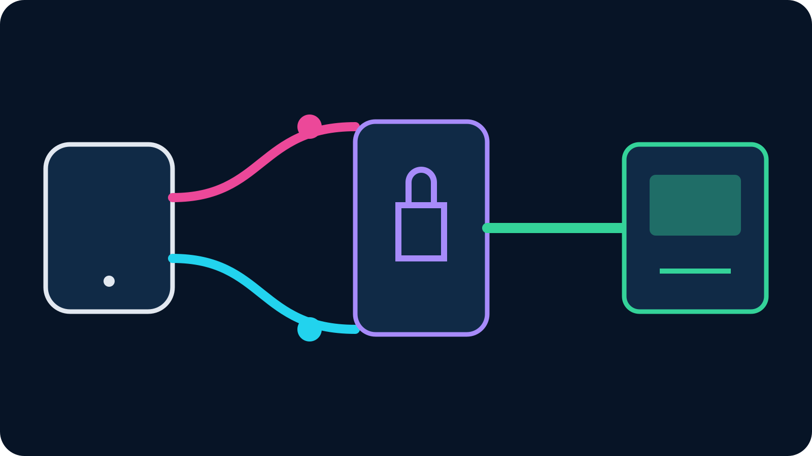

To use IRL Pro with OBS, create a video source in VISP, copy its publishing URL
into IRL Pro, and add the separate reading URL to OBS as a Media Source. Choose
plain SRT for one network connection or VISP's SRTLA URL when IRL Pro should use
multiple available links through a compatible receiver.

IRL Pro handles camera capture and mobile encoding on Android. VISP receives the
authenticated contribution and makes it readable by home OBS. OBS keeps the
Twitch or Kick stream key, scenes, alerts, local recording and final output.

## What IRL Pro contributes to the workflow

The official [IRL Pro Google Play listing](https://play.google.com/store/apps/details?id=app.irlpro.android)
describes it as an Android app for IRL streaming. IRLToolkit's official
[IRL Pro setup article](https://kb.irltoolkit.com/nodrop/3-streaming-devices/1-irlpro)
documents it as an SRTLA encoder and shows both an automatic deep-link setup and
a manual settings import.

Those sources establish the important role: IRL Pro is the field encoder. It
does not replace OBS's production tools or the receiving endpoint required by
SRTLA. The complete path has three independently testable parts:

1. IRL Pro captures and encodes the Android camera and microphone.
2. VISP accepts SRT or reconstructs SRTLA, then exposes the device read path.
3. OBS decodes the source, mixes the show and sends the final program.

If the phone preview works but VISP never shows the device as live, diagnose the
publishing URL and network. If VISP is live but OBS is black, diagnose the read
URL, codec and Media Source. Keeping the stages separate prevents random setting
changes.

## SRT or SRTLA: choose before copying the URL

Both options carry an SRT media stream, but their network behavior differs.

| Mode | Use it when | Network behavior |
| --- | --- | --- |
| SRT | One Wi-Fi or cellular path has enough sustained upload | One connection carries the contribution |
| SRTLA | You have multiple independent usable links and need aggregation or redundancy | The sender spreads traffic and a compatible receiver reconstructs one SRT stream |

The official [BELABOX SRTLA project](https://github.com/BELABOX/srtla) explains
the architecture: the sender distributes one SRT stream across links, and the
receiver rebuilds the coherent stream for a normal SRT application. SRTLA is
not merely two complete simultaneous uploads.

VISP's current relay accepts SRTLA on UDP 5000. This is separate from VISP
Native's optional dual-link mode, which duplicates packets without combining
capacity. IRL Pro using the SRTLA URL is the true multipath case covered here.

Start with plain SRT if one connection already has comfortable margin. SRTLA
adds value when a second independent route addresses measured congestion,
handoffs or carrier failure. It cannot manufacture coverage where every active
link is unavailable.

## What you need

- an Android phone with IRL Pro installed;
- an active VISP account and one video source;
- OBS Studio on the home production computer;
- one tested network for SRT, or two genuinely independent paths for SRTLA;
- enough home download for the contribution and upload for the finished stream;
- headphones and a local OBS fallback scene;
- time to run a full off-air route and recovery rehearsal.

Update IRL Pro, VISP and OBS before the rehearsal rather than immediately before
the broadcast. Keep a record of the last known-good source settings so a field
operator can restore them without exposing credentials.

## 1. Create a dedicated IRL Pro source

Sign in to VISP, open **Video sources**, choose **Add device**, and use a stable
name such as “Android roaming camera.” One device equals one publishing path.
Do not share that path with a second phone: only one publisher can own it at a
time, and separate devices are easier to revoke and monitor.

For plain SRT, copy the default value beside **Add this to video source**. For
SRTLA, switch the dashboard to **Advanced**, open the device, and reveal the
SRTLA URL. The current [encoder documentation](https://docs.visp-stream.com/docs/broadcaster-setup)
shows the format and UDP 5000 receiver port.

Treat the complete URL as a password. Its stream ID includes the device's
publishing authority. Do not show it on stream, include it in a public QR code
or send it through an untrusted chat. If it leaks, rotate that one device's
publish access.

## 2. Add the publishing settings to IRL Pro

IRLToolkit's documented hosted workflow generates an import QR code that opens
IRL Pro with the connection configuration. Its manual alternative copies a
Larix-compatible settings URL, then in IRL Pro uses **Settings → Import/Export
Settings → Import settings**. This demonstrates the app's supported settings
import, but an IRLToolkit ingest link is not a VISP credential.

For VISP, add or edit the stream in IRL Pro and use the complete VISP publishing
URL for the destination. If your installed IRL Pro version offers a compatible
settings import or URL-opening action, you may use it; otherwise paste the URL
into the stream destination field. App labels can change, so confirm the current
IRL Pro screen rather than forcing a stale menu sequence.

Do not split the generated URL unless the app explicitly presents separate host,
port and stream-ID fields. Do not change srt:// to srtla:// by hand. Copy the
plain SRT or SRTLA value that VISP generated for the mode you intend to use.

## 3. Set a mobile contribution profile

Use H.264 video and AAC audio, constant bitrate and a two-second keyframe
interval for a predictable VISP-to-OBS source. Start with a resolution, frame
rate and bitrate that one real field link can sustain. Even in SRTLA mode, a
conservative source is easier to recover than an encoder constantly demanding
the combined peak speed of every interface.

VISP relay-to-OBS does not transcode. The resolution, codec and bitrate IRL Pro
sends are what OBS must decode. If the feed is too large or incompatible, fix it
in IRL Pro instead of expecting the relay to convert it.

Test heat and battery with the screen, camera, encoder and intended interfaces
active. Phone performance can change during a long outdoor stream, especially
while charging. The [phone overheating guide](/blog/prevent-phone-overheating-irl-streaming)
shows how to rehearse a thermal budget without assuming a setting works for the
whole event.

## 4. Tune SRT recovery latency

SRT retransmits missing packets only while they can still arrive inside its
latency window. Too little time produces corruption or dropped frames on a
jittery link. Too much adds avoidable phone-to-studio delay.

Run VISP's latency probe on the network the phone will use, then select the
matching profile. The current VISP starting points are three times median RTT
with a 120 ms floor for wired, four times RTT with a 300 ms floor for Wi-Fi, and
six times RTT with a 600 ms floor for cellular. For SRTLA, size the recovery
window so the weakest intended path can still be useful.

The official [OBS SRT guide](https://obsproject.com/kb/srt-protocol-streaming-guide)
also explains the relationship between SRT latency and round-trip time. Treat
the probe result as a starting point, then watch motion and recovery along the
real route. Do not reduce latency only to make a dashboard number look better.

## 5. Verify the SRTLA links

With plain SRT, confirm the selected connection remains stable. With SRTLA,
verify each link independently before combining them:

1. Publish on cellular alone and confirm video reaches VISP.
2. Publish on Wi-Fi alone and repeat the check.
3. Enable both and watch the real contribution for several minutes.
4. Disable one path without stopping IRL Pro.
5. Confirm the source continues and traffic moves to the surviving link.
6. Restore it, then repeat with the other path.

Use independent networks. A phone's Wi-Fi connected to a hotspot on the same
carrier as its SIM may share the same coverage failure. Two interfaces do not
guarantee two independent routes.

Also check the data model. SRTLA distributes packets; usage will not necessarily
split evenly. The goal is a healthy coherent stream, not identical counters.

## 6. Add the IRL Pro source to OBS

IRL Pro uses the publish URL. OBS uses the separate read URL. Reveal the OBS
address in VISP or download the generated scene collection. To configure it
manually:

1. Add a **Media Source** in OBS.
2. Clear **Local File**.
3. Paste the VISP read URL into **Input**.
4. Set **Input Format** to **mpegts** when needed.
5. Start IRL Pro and wait for a decodable keyframe.
6. Confirm movement and microphone audio in a local recording.

The generated scene collection adds reconnecting device scenes and a Fallback
scene. The VISP OBS plugin can also add the source without exposing an inbound
home control port. Neither method gives IRL Pro the Twitch or Kick stream key.

Keep only one phone-audio path active. Duplicate audio captures create echo.
Use headphones while monitoring, and check the final platform or recording
before trusting the mixer meters.

## 7. Test interruption and return

Do not make the first disconnect test during a live show. With OBS recording
locally, disable cellular, leave Wi-Fi, then reverse the test. Finally disable
every path long enough to make the source stop. OBS should stay open and switch
to a local BRB scene while IRL Pro reconnects.

When the source returns, wait for stable motion and audio before cutting back.
SRTLA can survive one path failing when another remains viable. It cannot keep a
live picture when every route is a complete dead zone. The
[bad mobile network guide](/blog/keep-stream-live-bad-mobile-network) covers
bitrate, recovery and OBS fallback as separate layers.

## Common setup mistakes

**VISP never shows Live:** confirm IRL Pro has the publish URL, the selected
network permits the required UDP port, and no other publisher owns the device.

**Plain SRT works but SRTLA does not:** use the generated SRTLA URL and UDP 5000,
not a renamed SRT address. Confirm both sender and receiver support SRTLA.

**VISP is Live but OBS is black:** verify OBS has the read URL, Local File is
off, MPEG-TS is selected where required, and IRL Pro sends H.264/AAC.

**The feed works on Wi-Fi but fails outdoors:** lower the source bitrate, use a
cellular recovery window and test on the real route. A protocol cannot replace
missing sustained upload.

**Two links still fail together:** confirm carrier diversity and coverage. The
links may share the same upstream network or dead zone.

## The recommended first test

Begin with one phone, plain SRT, one VISP source and one OBS Media Source. Once
that path records cleanly, switch to the generated SRTLA URL, add the second
network and run the one-link-at-a-time failure drill. This order gives every
failure a clear cause.

If IRL Pro is your preferred Android encoder, [try VISP](https://app.visp-stream.com)
with a named test source and keep the Twitch or Kick destination in OBS. You
will know from the rehearsal whether plain SRT is already enough or whether
SRTLA is solving a measured mobile-network problem.
