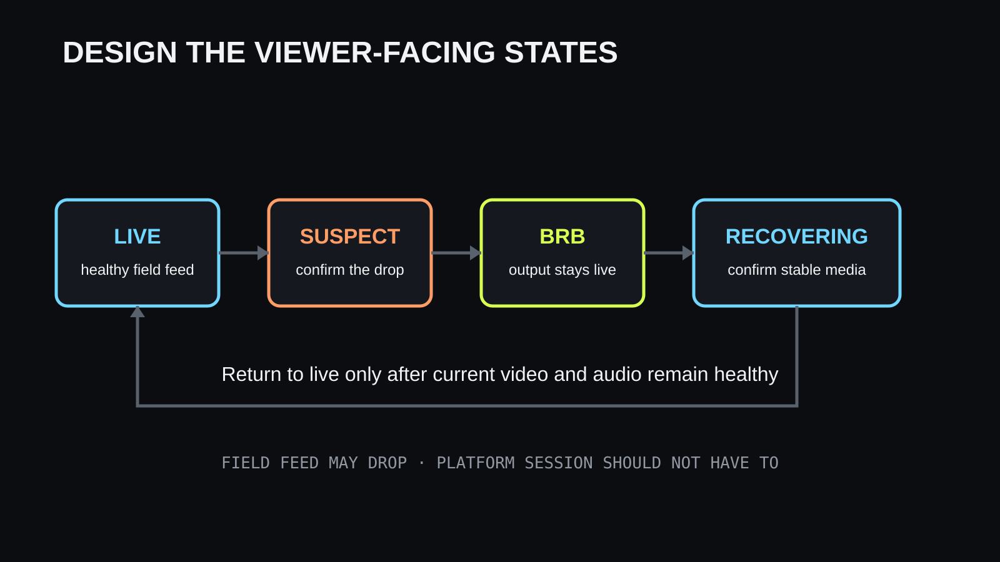

IRL-lähetyksen kuvan ei tarvitse olla täydellinen pitääkseen huomion. Lähetyksen
pitää kuitenkin pysyä ymmärrettävänä. Kun video jäätyy, ääni kiertää, soitin
puskuroi ja lähetys päättyy yllättäen, katsoja ei tiedä, kestääkö ongelma kaksi
sekuntia vai loppupäivän. Poistuminen on silloin järkevä reaktio.

Siksi luotettavuus ei ole taustalle piilotettu infrastruktuurimittari. Se kuuluu
ohjelmaan. **Kestävä IRL-työnkulku kertoo katsojille, mitä tapahtuu, pitää
alustalähetyksen käynnissä kun mahdollista ja palaa livekuvaan pyytämättä kaikkia
etsimään uutta lähetystä.**

## Katsoja kokee epävarmuuden, ei pakettihävikkiä

Operaattori näkee bittinopeuden, viiveen, uudelleenlähetykset, enkooderin tilan ja
relayn lokit. Katsoja näkee lyhyemmän listan:

- liikkuvan kuvan ja ymmärrettävän äänen;
- jäätyneen tai puskuroivan soittimen;
- selkeän väliaikaisen varatilan;
- päättyneen lähetyksen.

Tekninen kunto ratkaisee, miten tilojen välillä liikutaan. Onnistuneita
uudelleenyhdistämisiä näyttävä hallintapaneeli ei kuitenkaan auta jäätynyttä
kuvaa katsovaa ihmistä. Suunnittele luotettavuus valmiista alustasoittimesta
taaksepäin.

Ei ole yhtä yleistä sekuntimäärää sille, milloin katsoja lähtee. Päätös riippuu
yleisöstä, sisällöstä, alustasta ja siitä, onko keskeytys ymmärrettävä. Turvallinen
johtopäätös on rajatumpi: selittämätön puskurointi ja toistuvasti päättyvät
lähetykset tarjoavat helpon poistumisreitin, kun taas selkeä välitila antaa syyn
odottaa.

## Erota alustalähetys kenttäsyötteestä

Tärkein rakenteellinen ero on **kentältä tulevan syötteen** ja **katsojille
näkyvän lähetyksen** välillä.

Kenttäsyöte on puhelimen tai enkooderin videota kohti relayta, OBS:ää tai
pilvituotantoa. Mobiiliverkko voi katkaista sen. Katsojille näkyvä lähetys on
valmis ohjelma Twitchiin, Kickiin, YouTubeen tai muulle alustalle. Se voi joissain
rakenteissa pysyä yhteydessä, vaikka kenttäkamera katoaa.

Kun puhelin lähettää suoraan alustalle, molemmat voivat hajota samalla kertaa.
Kun relay, koti-OBS tai pilvituotanto omistaa alustayhteyden, se voi vaihtaa
puuttuvan kenttäsyötteen paikalliseen BRB-tilaan uudelleenyhdistämisen ajaksi.

Tämä on käytännön arvo lupauksessa näyttää mukautettu “palaan pian” -ruutu
ingestin katketessa ja pitää lähetys käynnissä. Varatila ei palauta puuttuvaa
videota. Se suojaa jatkuvuutta ja selittää katkon.

## Määritä tilat ennen automaatiota

Luotettava lähetys tarvitsee erilliset tilat yhden yleisen “offline”-lipun sijaan.

| Tila | Mitä järjestelmä tietää | Mitä katsojan pitäisi nähdä |
| --- | --- | --- |
| Live | Tuore kentän ääni ja kuva saapuvat | Liveohjelma |
| Epävarma | Toimitus on hetkeksi myöhässä tai heikentynyt | Yleensä viimeinen vakaa ohjelma lyhyesti |
| BRB | Kenttäsyöte on poissa lyhyttä rajaa pidempään | Selkeä varatila ilman väärää lupausta |
| Palautuu | Julkaisija palasi mutta syöte ei ole vielä vakaa | BRB, kunnes kuva ja ääni ovat käyttökelpoisia |
| Päättynyt | Tekijä lopetti tarkoituksella tai palautusaika umpeutui | Alustalähetys päättyy siististi |

Epävarma- ja palautumistilat estävät nopean edestakaisen vaihdon. Mobiiliverkossa
on kohinaa. Yksi myöhästynyt paketti ei saa väläyttää BRB-ruutua, eikä yhden
videoruudun paluu saa vaihtaa ohjelmaa heti liveksi.

Käytä siirtotielle ja viiveelle sopivaa lyhyttä varmistusikkunaa. Tarkka raja pitää
testata reitillä. Periaate pysyy: siirry BRB:hen merkittävän katkon jälkeen ja
palaa vasta, kun syöte on ollut riittävän pitkään terve.

## BRB-ruutu on jatkuvuustyökalu

Hyödyllinen varatila vastaa kolmeen kysymykseen lupaamatta sellaista, mitä
järjestelmä ei tiedä:

1. Onko lähetys yhä käynnissä?
2. Onko katkos havaittu?
3. Kannattaako odottaa vai palata myöhemmin?

Pidä viesti lyhyenä. “Signaali katkesi — yhdistetään uudelleen” on rehellisempi
kuin “palaamme 30 sekunnissa”, jos reitti voi olla pitkässä katveessa. Sovita
ulkoasu kanavaan mutta varmista, että tila näkyy puhelimen ruudulla. Vältä pientä
tekstiä, tiheitä ohjeita ja turhaa kaistaa kuluttavaa liikettä.

Myös äänellä pitää olla suunnitelma. Jäätynyt katkelma tai puolikkaan sanan
toisto on hiljaisuutta huonompi. Paikallinen musiikki voi tuoda lisenssi- tai
äänenvoimakkuusongelman. Käytä hiljaisuutta tai omaa testattua vararaitaa ja
varmista, mitä valmis alustasoitin vastaanottaa.

VISP Direct voi pitää alustalähdön relaylla ja näyttää BRB-kortin julkaisijan
kadotessa. Koti-OBS voi tehdä saman paikallisella varakohtauksella. Ratkaisuja
verrataan [BRB-ruutu ilman OBS:ää -oppaassa](/fi/blog/brb-screen-phone-irl-without-obs).

## Kerro chatille ennen kuin chat kysyy

Videon varatila näkyy vain soitinta katsovalle. Chat voi olla eri näkymässä, eikä
pelkkää ääntä kuunteleva näe ruutua. Lyhyt bottiviesti voi vahvistaa, että
järjestelmä havaitsi katkon, ja toinen voi ilmoittaa paluun.

Älä lähetä viestiä jokaisesta yhdistämisyrityksestä. Ilmoita merkittävistä
tilanvaihdoista: livestä BRB:hen, BRB:stä palautuneeksi tai siisti lopetus. Rajoita
viestejä, jos yhteys sahaa edestakaisin. Kuvaa katsojavaikutus sisäisten
virhekoodien sijaan.

[IRL-chatbotin ilmoitusopas](/fi/blog/irl-chat-bot-alerts-without-a-pc) käsittelee
relay-ohjattua työnkulkua Twitchille, Kickille ja YouTubelle. Sama periaate toimii
moderaattorin ajamassa tuotannossa: viesti kerran ja selkeästi järjestelmästä,
joka tuntee oikean tilan.

## Yhdistä uudelleen synnyttämättä toista vikaa

Automaattinen uudelleenyhdistäminen on tarpeellinen mutta ei riittävä. Julkaisijalla,
relaylla, tuotantokerroksella ja alustalähdöllä on omat yhteystilansa. Kenttäsovelluksen
onnistunut yhteys ei todista, että video purkautuu vakaasti, äänen aikaleimat ovat
oikein tai valmis lähtö on palautunut.

Turvallinen palautusjärjestys on:

1. pidä alustalähtö ja BRB-tila käynnissä;
2. hyväksy palaava julkaisijayhteys;
3. odota purettavaa videota ja käyttökelpoista ääntä;
4. varmista kunto lyhyen ajan;
5. vaihda takaisin livekohtaukseen;
6. ilmoita palautumisesta kerran.

Varo vanhoja videoruutuja uudelleenyhdistämisen jälkeen. Uusin kuva on tärkeämpi
kuin vanhan jonon tyhjentäminen. Pitkä puskuri voi palauttaa lähetyksen menneeseen
hetkeen. Oikeat siirto- ja viiveasetukset riippuvat reitistä, mutta jokaisen
kokoonpanon pitää varmistaa paluu nykyhetkeen.

## Estä vältettävissä oleva puskurointi ensin

Varatila ei oikeuta epävakaata bittinopeutta. Aloita videonopeudesta, jonka yksi
yhteys kestää liikkeessä, ei paikallaan tehdyn nopeustestin huipusta. Jätä varaa
radio-olosuhteille, protokollalle ja puhelimen muulle liikenteelle. Käytä
dynaamista bittinopeutta, jos enkooderi ja työnkulku tukevat sitä.

SRT voi lähettää kadonneita paketteja uudelleen viiveikkunan sisällä ja käsitellä
värinää paremmin kuin siirtotie ilman palautusta. Se ei lähetä täydellisen katveen
läpi. Rajaton viiveen kasvatus hidastaa vuorovaikutusta ja voi vain siirtää vian
näkymistä myöhemmäksi.

Testaa oikea reitti oikeaan aikaan. Väkijoukot, tukiaseman vaihdot, rakennukset ja
liike muuttavat lähetyskaistaa. [Mobiilibittinopeuden opas](/fi/blog/best-bitrate-irl-streaming-phone-obs)
antaa lähtöarvot; kenttätesti määrää lopullisen asetuksen.

## Tiedä, milloin jatkuvuus ei riitä

BRB säilyttää ohjelman mutta ei tapahtumaa. Jos yleisön on nähtävä kilpailun
maali, uutistilanne, maksullinen esitys tai muu ainutkertainen hetki, kenttäkuvan
pitää ehkä selvitä yhden yhteyden hajoamisesta.

Silloin riippumattomat linkit ja oikea bonding muuttuvat vaatimuksiksi. Useat
yhteydet vähentävät riippuvuutta yhdestä operaattorista, vaikka yhteinen peitto,
ruuhka, laitteet, virta ja relay voivat edelleen hajota. Bonding on kerros, ei
takuu.

Jos lyhyt katkos hyväksytään, hallittu varatila voi antaa paremman kustannus- ja
monimutkaisuussuhteen. Kirjaa tavoite ennen laitehankintaa: “alustalähetys pysyy
käynnissä” ja “kenttäkuva pysyy jatkuvasti livenä” ovat eri vaatimuksia.

## Harjoittele vikaa, älä vain onnistumista

Normaalisti käynnistyvä ja päättyvä testi ei todista palautumista. Luo yksityinen
tai matalan riskin lähetys ja aiheuta hallittuja vikoja:

- poista Wi-Fi käytöstä mobiiliyhteyden jäädessä;
- kulje reitin tunnetun katveen läpi;
- katkaise julkaisija tarpeeksi pitkäksi aikaa BRB:n käynnistämiseksi;
- yhdistä ja varmista, että paluu on nykyhetkessä ja synkronoitu;
- käynnistä kenttäsovellus uudelleen alustalähdön pysyessä auki;
- tarkista chat-ilmoitukset ja niiden rajoitus;
- lopeta tarkoituksella ja varmista, ettei lähetys jää pysyvästi BRB:hen.

Pyydä toista henkilöä katsomaan oikeaa alustasoitinta eri verkkoyhteydellä.
Puhelimen esikatselu ja relayn hallintapaneeli eivät sisällä jokaista lähtövikaa.
Kirjaa tilanvaihtojen ajat ja vertaa niitä testeistä saatuihin lokeihin.

## Mittaa katsojille näkyvä luotettavuus

Hyödylliset mittarit kuvaavat kokemusta:

- puskurointi- tai BRB-jaksojen määrä ja yhteiskesto;
- aika ingestin katoamisesta selkeään varatilaan;
- aika vakaasta yhteydestä palautettuun livekuvaan;
- turhien varatilavaihtojen määrä;
- lähetykset, jotka päättyivät ja vaativat uuden alustasession;
- chat-viestien määrä oikeaa katkoa kohden;
- palasivatko ääni ja kuva synkronoituna ja nykyhetkessä.

Yhdistä näihin bittinopeus, pakettihävikki, yhdistämiskerrat ja polun kunto.
Kokemusmittari kertoo mitä tapahtui; siirtomittari auttaa selittämään miksi.

Älä lupaa “nollakatkosta”, jos kamera oli BRB-ruudun takana poissa. Kerro tarkasti,
mitä rakenne suojaa: alustayhteys säilyy soveltuvien ingest-katkojen ajan, katsoja
saa varatilan ja kenttäsyöte palautetaan terveenä. Rehellinen kieli tuottaa
parempia testejä ja vähemmän yllätyksiä.

## Luotettavuus on tuotepäätös

Sisällöntuottajat huomaavat luotettavuusominaisuudet, koska ne ratkaisevat
lähetyksen haavoittuvimman hetken. Mukautettu varatila, jatkuva alustasessio,
selkeä chat-ilmoitus ja ennustettava palautuminen tekevät järjestelmästä
operoidun eivätkä hylätyn tuntuisen.

Rakenna tämä ennen koristeellista monimutkaisuutta. Käytä maltillista
bittinopeutta, palautuvaa siirtotietä, automaattista yhdistämistä, erillisiä live-,
BRB- ja palautumistiloja sekä yhtä testattua varatilaa. Lisää bonding, kun itse
kenttäkuvan pitää selvitä yhteysviasta. Lisää hallittu tuotanto, kun operaattori
tai tukivaatimus ansaitsee sen.

Katsojan ei tarvitse ymmärtää verkkoa. Ohjelman pitää säilyä ymmärrettävänä,
kun verkko hajoaa. Siinä on luotettavuusvaatimus: vähennä estettävät katkot,
selitä väistämättömät ja palaa pakottamatta yleisöä aloittamaan alusta.
