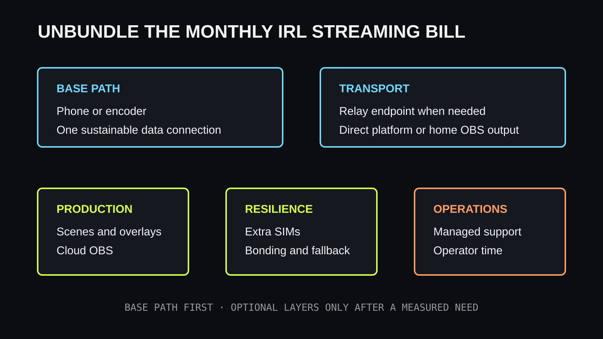

The hardest IRL streaming expense is often not a camera or a backpack. It is the
bill that returns every month before the first minute of video reaches a viewer.
A recurring piece of community sentiment captures the problem plainly:

> “I looked into IRLToolkit, but $129 per month is out of my budget right now.”

That quotation is presented as community sentiment from the research behind this
article, not as an attributed or independently verified customer review. The
budget problem is still real. A fixed subscription can be reasonable for a
full-time show and impossible for someone testing IRL streaming on weekends.

The useful question is not whether $129 is universally expensive. It is **which
job that monthly fee performs, whether your show needs that job, and what the
smallest reliable alternative looks like.**

## Why IRL streaming becomes a monthly expense

An IRL stream crosses more systems than a webcam stream at a desk. The field
encoder needs mobile data. The contribution feed may pass through a relay. A
production computer or cloud OBS instance may add scenes and overlays. A bonding
service may combine several connections. The finished show still needs to reach
Twitch, Kick, YouTube, or another destination.

Vendors often bundle several of those jobs into one product. That is convenient,
but it makes the purchase look indivisible. A creator who only needs transport
may end up comparing a complete cloud studio with doing nothing at all.

Separate the bill before comparing products:

| Cost layer | What it buys | Always required? |
| --- | --- | --- |
| Phone or encoder | Captures and compresses video | Yes, but you may already own it |
| Mobile data | Carries the field upload | Yes |
| Relay transport | Gives the field feed a reachable endpoint | Depends on the workflow |
| OBS production | Scenes, overlays, alerts, mixing, and recording | No |
| Cloud compute | Runs production away from your home computer | No |
| Network bonding | Uses several links for more resilience or capacity | No |
| Managed support | Gives the production an escalation path | No |

The first two rows are the minimum field path. Every later row should answer a
named requirement. If it does not, it is a recurring cost waiting for a reason.

## The $129 decision is about production, not status

A cloud OBS service can earn its fee. It may provide a remote studio, scene
control for moderators, overlays, ingest, drop protection, and support in one
place. A creator who broadcasts for a living may value that package more than
the time required to operate separate systems.

The same package can be excessive for a phone-only walk-and-talk stream. If the
finished program is simply the phone camera and microphone, a remotely hosted
OBS instance may sit between the creator and the destination without doing much.
Paying for unused scene switching does not improve the radio connection.

This is why monthly price comparisons need a workflow beside them. The
[IRLToolkit alternatives guide](/blog/irltoolkit-alternative) compares complete
service roles. Use it after deciding whether you need cloud production at all.

## Start with the smallest reliable path

The lowest fixed-cost setup uses equipment and infrastructure already available:

1. publish from the phone you own;
2. choose a bitrate one real connection can sustain;
3. send the feed through a relay only when the destination or OBS workflow needs
   one;
4. keep production on an existing home computer, or send directly to the
   platform when scenes are unnecessary;
5. add a fallback before adding more production features.

VISP is free during beta and can deliver a phone feed directly to a connected
platform or make it available to OBS. Direct delivery removes the home computer
from a simple one-camera show. An existing home OBS studio remains useful when
you already need graphics, recording, or an operator.

The [cheapest IRL streaming setup guide](/blog/cheapest-irl-streaming-setup-2026)
covers the hardware side. Its central rule applies to subscriptions too: buy the
next layer after a repeatable failure identifies it.

## Do not confuse a lower bill with a free stream

Removing a cloud subscription does not remove every cost. Mobile plans, power,
replacement cables, microphones, mounts, and the creator’s time still count.
A home OBS computer uses electricity and depends on home upload. Self-hosting a
relay creates maintenance work even when the software has no license fee.

Build a monthly total that includes:

- field data plans and hotspot plans;
- cloud compute, relay, or production subscriptions;
- bonding service and additional SIMs;
- a reasonable share of annual domains or server charges;
- replacement and repair allowance for field equipment;
- the time spent updating, testing, and recovering the system.

This total prevents two bad comparisons. “Free” software running on an
unreliable server is not free when every broadcast needs repair. A managed
service is not automatically overpriced when it replaces hours of operations
work and protects paid broadcasts.

## Pay for the failure you cannot accept

Every reliability purchase should name the failure it reduces.

**If one carrier loses coverage**, lower bitrate may help with congestion but
cannot create coverage. A second independent link, packet duplication, or true
bonding may be justified. The distinction is explained in the
[cellular and Wi-Fi bonding guide](/blog/bond-cellular-wifi-visp-speedify).

**If the field feed disappears but the platform broadcast must remain live**, a
relay or OBS fallback can show a BRB state while the publisher reconnects. That
is a continuity requirement, not necessarily a cloud OBS requirement.

**If a moderator must run scenes while the streamer moves**, remote production
controls have a real operator and a real job. This is where a hosted studio can
be easier to justify.

**If downtime has contractual or revenue consequences**, managed support may be
the valuable part of the subscription. Compare response expectations, not only
feature lists.

If none of those failures describe the show, keep the path small until testing
reveals one.

## Compare cost over the life of the experiment

A monthly service feels different at one month, three months, and one year. Use
the period you are genuinely willing to fund.

| Trial length | Cost at $129 per month | Decision to make |
| --- | ---: | --- |
| One month | $129 | Is this a focused trial with a success criterion? |
| Three months | $387 | Is the service used often enough to beat simpler options? |
| Six months | $774 | Which owned equipment or existing computer could do the job? |
| Twelve months | $1,548 | Does the workflow produce enough value to remain fixed? |

This table is arithmetic using the community’s $129 example, not a statement of
current vendor pricing. Check the provider’s own site before buying.

Set a test outcome before starting a paid trial. Examples include fewer ended
broadcasts, successful moderator operation, less setup time, or enough new paid
work to cover the service. “It felt professional” is harder to evaluate than a
recorded operational result.

## Reduce fixed cost without creating a fragile system

The cheapest design is not the one with the fewest invoices. It is the one that
meets the reliability target with the fewest moving parts.

A phone publishing straight to a platform is inexpensive and simple, but a feed
drop may end the broadcast. A phone publishing through VISP Direct can keep the
platform connection and BRB behavior in the relay without a home computer. A
phone feeding home OBS can preserve a full local production, but adds home power,
upload, and remote-access dependencies. A cloud OBS service removes those home
dependencies while restoring a monthly bill.

Choose the shortest path that survives the failure you care about. Removing a
necessary fallback to save money is false economy. Adding cloud production to a
show that never changes scenes is the opposite mistake.

## Keep an exit path

Recurring costs become harder to challenge when the workflow cannot move. Keep
copies of scene assets, document encoder settings, and know where platform
credentials live. Prefer a contribution format that another compatible relay or
OBS instance can receive. Test cancellation and export assumptions before the
show depends on them.

An exit path does not mean changing services every month. It means a price
change or product outage does not force the channel offline.

## When the subscription is worth keeping

Keep paying when the service performs work the show actively uses:

- a remote moderator operates the hosted production;
- the channel depends on cloud scenes, alerts, and overlays while no home
  computer is available;
- integrated bonding or managed ingest survives routes that a single link does
  not;
- support response is part of the production plan;
- the saved operating time is worth more than the monthly fee.

Otherwise, start with the phone, one measured connection, and the smallest
transport path. Test a real route, watch the final platform broadcast, and note
what fails. The result will tell you whether the next dollar belongs in data,
power, audio, bonding, fallback, or cloud production.

The community sentiment behind “$129 per month is out of my budget” is not a
request for a cheaper copy of every feature. It is a request to unbundle the
problem. Once transport, production, bonding, and support are separate decisions,
IRL streaming can begin without committing to the full monthly stack.
