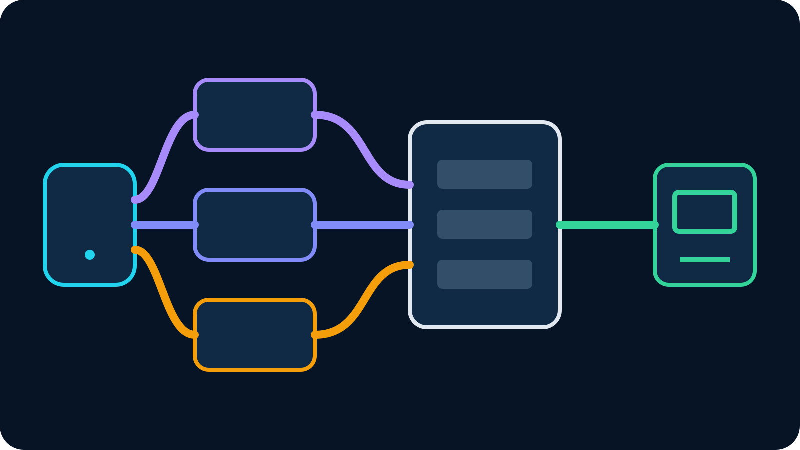

As of August 23, 2026, IRLToolkit lists its Standard cloud OBS plan at **$129
per month** and Advanced at **$179 per month**. Standard includes a dedicated
cloud OBS environment, one generic ingest and multistreaming to two
destinations. Advanced removes the listed resolution and output-bitrate caps,
offers additional ingests by request and raises multistreaming to five
destinations.

Those numbers come from the official [IRLToolkit pricing page](https://irltoolkit.com/pricing).
Plans can change, so verify the current page before buying. The useful question
is not only “how much does IRLToolkit cost?” It is whether your show needs cloud
OBS, remote production and managed support—or only a reliable way to move a
phone camera into an OBS studio you already operate.

## IRLToolkit prices at a glance

| Plan | Listed monthly price | Production limits and highlights |
| --- | ---: | --- |
| Standard | $129/month | 1080p60, 7,500 Kbps output, one generic RTMP/SRT/SRTLA ingest, up to two destinations, standard support |
| Advanced | $179/month | Uncapped listed resolution and output bitrate, multiple generic ingests by request, up to five destinations, priority support |
| Custom | Contact IRLToolkit | Customized resources and requirements |

The official page also lists no setup fee for Standard and Advanced. Both paid
tiers include a web dashboard, Twitch chat bot, dedicated NVIDIA Turing-or-newer
GPU resources, RTMP/SRT output, scenes, text, images, media files and browser
sources. That is why comparing the subscription with a bare relay is misleading:
IRLToolkit is selling a hosted production environment, not only transport.

Prices and included limits above were checked on the publication date. They are
not a promise that a future invoice will match this article. Taxes, payment
terms, data plans and any separately purchased encoder hardware are outside
this table.

## What Standard buys for $129 a month

Standard is the entry cloud OBS plan. Its listed 1080p60 ceiling and maximum
7,500 Kbps output cover many conventional Twitch and Kick productions. One
generic ingest accepts RTMP, SRT or SRTLA contribution. The finished cloud
production can leave through RTMP or SRT and multistream to as many as two
destinations.

The more important value is operational. Scenes and browser sources live in the
cloud environment rather than on a computer at the creator's home. A moderator
can use the web dashboard. The service includes a Twitch chat bot, drop
protection features and standard support. A creator does not have to keep a
home OBS PC powered, reachable and healthy for the field broadcast.

Standard fits when one main field ingest is enough and the show actively uses
cloud production. For example, a roaming streamer may need a remote moderator
to switch BRB content, update overlays and send the same finished program to two
platforms. In that workflow, the subscription performs visible work every
stream.

It is harder to justify when the show is one camera sent to one destination
with no operator, scenes or browser graphics. The plan still works, but much of
the purchased production layer may remain unused.

## What Advanced adds for $179 a month

Advanced is $50 more per month at the prices checked for this article. The
pricing page lists uncapped resolution and output bitrate rather than Standard's
1080p60 and 7,500 Kbps limits. It also offers multiple generic ingests by
request, raises multistreaming from two to five destinations, and changes
support from standard to priority.

“Uncapped” should not be read as infinite. Source encoders, cloud resources,
decoders, destination platforms and the viewer path still have technical
limits. Confirm any unusual resolution, codec, bitrate or destination plan with
IRLToolkit before treating it as supported production design.

Advanced makes sense when the additional capacity has a named use: several
field cameras, more than two simultaneous outputs, a high-resolution production,
or a support expectation tied to paid work. Paying the difference only for a
higher tier label does not improve a stream.

## What the monthly price does not include

The subscription is one layer of the IRL budget. The field camera still needs a
phone or encoder, power, mounts, audio and mobile data. True network bonding may
need several independent connections. The streamer still needs a fallback plan
when all field networks disappear.

Budget these separately:

- the phone, dedicated encoder or BELABOX hardware;
- SIMs, mobile plans and any tethered router;
- batteries, charging, cooling and replacement cables;
- microphones, mounts and weather protection;
- the producer's time and any remote moderator;
- platform-specific services that are not included in the chosen plan.

The [IRL streaming monthly-cost guide](/blog/irl-streaming-monthly-cost) explains
how to separate transport, production, bonding and support. That separation is
more useful than multiplying $129 by twelve and assuming every other workflow
is free.

## How VISP compares

VISP is not a hosted copy of full cloud OBS. It is a self-hosted SRT/RTMP relay
and control plane. A phone, browser or third-party encoder publishes to an
authenticated device path. Existing OBS at home reads that feed, keeps the
Twitch or Kick key, and continues to own scenes, alerts, recording and final
encoding.

VISP is free during beta. That makes it appealing for a creator who already owns
the phone and home computer and does not need a managed cloud production
environment. It can also use Direct delivery for a smaller phone-to-platform
show, with one encode per destination, when home OBS is unnecessary.

The tradeoffs are real:

| Workflow | You gain | You still own |
| --- | --- | --- |
| IRLToolkit cloud OBS | Hosted production, web control, integrated features and support | Subscription, field hardware, data and show configuration |
| VISP to home OBS | Persistent device paths and existing studio reuse | Home power, OBS health, home download/upload and operations |
| VISP Direct | No home OBS for a simple output | Relay configuration, destination setup and a simpler production ceiling |

VISP relay-to-OBS does not transcode the contribution feed. VISP Native's
dual-link mode sends duplicate packets and does not add network capacities.
Third-party SRTLA encoders can use the current SRTLA ingest when true multipath
transport is needed. None of these paths includes a remote cloud OBS operator
or replaces the support model in a paid service.

The full [IRLToolkit alternative guide](/blog/irltoolkit-alternative) compares
the workflows beyond price.

## Compare annual cost only after comparing the jobs

At the current listed rates, twelve months of Standard is $1,548 and twelve
months of Advanced is $2,148. That arithmetic is useful for budgeting but not a
verdict. A hosted studio that saves several production hours each week or keeps
paid broadcasts running may earn more than it costs. A cloud studio that only
passes one unchanged camera may be an unnecessary fixed expense.

Use a trial period with measurable outcomes:

1. Count how many broadcasts use cloud scenes, overlays or browser sources.
2. Record whether a moderator operates the dashboard remotely.
3. Measure how often drop protection or multiple ingests change the result.
4. Note the hours saved compared with running and recovering home OBS.
5. Decide whether support response is part of the show's risk plan.

If none of those produces value, test a smaller path. If several do, the
subscription is paying for production rather than existing as an expensive
relay.

## Which plan should you choose?

Choose Standard when one generic ingest, up to two destinations and the listed
1080p60/7,500 Kbps output are enough. It is the natural starting point for a
single roaming feed with a remotely operated cloud production.

Choose Advanced when you have confirmed the need for multiple ingests,
additional destinations, output beyond the Standard caps or priority support.
Ask IRLToolkit to confirm the exact requested ingest and output configuration
before committing the show.

Choose a home OBS or direct workflow when cloud production is not performing a
necessary job. Existing hardware is not costless, but reusing it can remove a
large fixed subscription from a new or occasional IRL channel.

## A simple decision checklist

IRLToolkit is easier to justify when you answer yes to several of these:

- OBS must run even when no dependable home computer is available;
- a remote moderator actively switches scenes and manages overlays;
- SRTLA ingest and cloud drop protection are central to the route;
- the program must reach two or more destinations from one production;
- vendor support has measurable value to the channel;
- the saved operating time exceeds the monthly cost.

A smaller VISP workflow is worth testing when you already have OBS, only need a
remote phone source, want independent device credentials, or plan a simple
Direct output. Follow the [getting-started documentation](https://docs.visp-stream.com/docs/get-started)
and test the complete route before moving a live show.

The headline answer remains simple: IRLToolkit currently lists $129 and $179
monthly plans, but those prices buy cloud production, not merely a video pipe.
If that production is the missing part of your show, compare the tiers. If it
is not, [try VISP](https://app.visp-stream.com) with the OBS setup you already
own and pay for additional infrastructure only when a measured requirement
appears.
