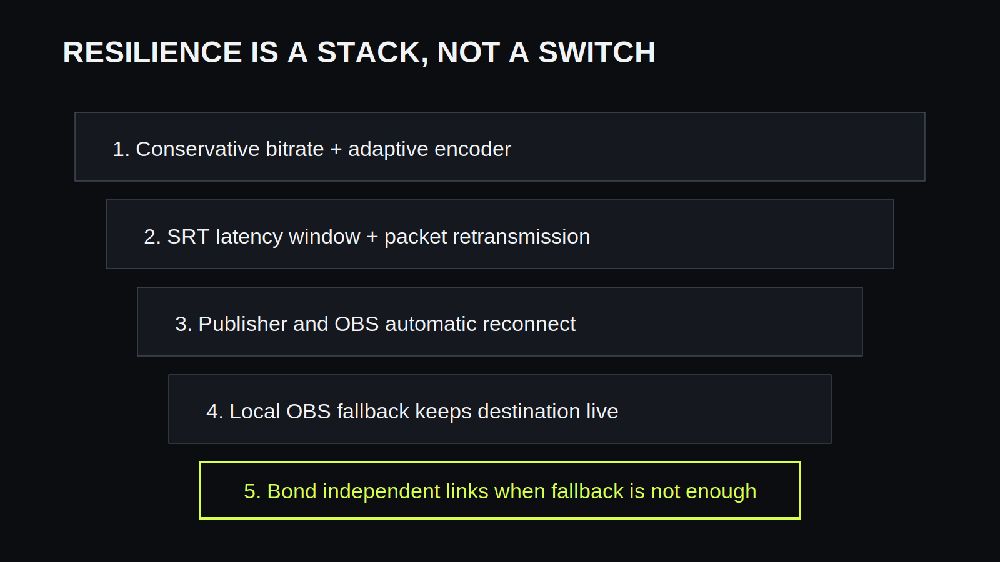

You cannot make a mobile stream literally impossible to drop. You can keep a
brief field outage from ending the viewer-facing broadcast by using several
layers together: **leave the destination stream running in OBS, send the field
feed over SRT, use a conservative adaptive bitrate, tune the recovery window,
reconnect automatically, and switch OBS to a local fallback scene.** Add real
network bonding when live field video must survive one connection failing.

That distinction prevents a common disappointment. A resilient production is
not one perfect protocol setting. It is a system that fails gracefully and
recovers without forcing the audience to refresh or find a new broadcast.

## First identify which connection is failing

An IRL workflow often contains two separate internet legs:

1. the phone or field encoder sends video to the relay or home studio;
2. OBS sends the finished program to Twitch, Kick, YouTube, or another
   destination.

VISP separates those legs. The phone publishes to the VISP relay, OBS reads the
feed, and OBS publishes the final production. If the phone loses coverage, the
second leg can remain healthy. OBS can keep sending local graphics, music, a
BRB scene, or another camera.

If OBS itself reports dropped frames to the destination, troubleshoot the home
uplink instead. The [OBS connection troubleshooting
guide](https://obsproject.com/kb/stream-connection-troubleshooting/) explains
that dropped network frames normally mean the connection cannot sustain the
configured bitrate or is unstable between OBS and the ingest server. A field
fallback cannot repair a failing home connection.

## Give the bitrate room to breathe

A mobile speed test is a snapshot, not a safe streaming bitrate. Upload
capacity changes as the phone moves between cells, enters a building, competes
with other users, or heats up. A stream configured near the best observed
upload rate has no margin when conditions change.

Start below the repeatable worst-case upload rate on the actual route. A stable
720p feed is more useful than a 1080p feed that continually overruns the
connection. Keep the keyframe interval at two seconds so decoders and fallback
logic do not wait too long for a clean recovery point.

Enable adaptive bitrate when the publishing application supports it. [Larix
Broadcaster](https://softvelum.com/larix/faq/) documents modes that lower the
target bitrate in response to delivery problems and then cautiously restore
quality. Adaptation preserves continuity by sacrificing detail before the
encoder's queue becomes unmanageable. It still needs a sensible minimum;
video cannot remain intelligible after available bandwidth collapses to zero.

## Use SRT for recovery, not miracles

SRT sends media over UDP and can retransmit missing packets. The receiver holds
packets inside a latency buffer, giving retransmissions time to arrive before
the video is decoded. This is valuable on mobile networks where loss and jitter
occur in bursts.

The latency value is a trade. Too little latency means a retransmitted packet
may arrive after its playback deadline. Too much adds unnecessary delay and
can make remote direction awkward. VISP's dashboard probe uses measured
round-trip time and a network profile to recommend a starting point. Run it on
the same connection and in conditions similar to the real stream.

For cellular use, VISP applies a larger multiplier and minimum than it does for
wired or Wi-Fi networks because cellular jitter is less predictable. Treat the
recommendation as a safe starting point, then test motion, audio, and recovery.
Do not tune latency downward only to advertise a smaller number.

The [OBS SRT guide](https://obsproject.com/kb/srt-protocol-streaming-guide)
describes OBS's SRT input behavior. VISP generates the authenticated URL and
scene collection so creators do not need to construct stream IDs by hand.

## Reconnect both ends automatically

SRT can recover packet loss while a connection exists. It cannot transmit
during a complete outage. The publisher and OBS source must therefore recover
when the network returns.

The VISP phone app reports a reconnecting state and retries after a loss. The
generated OBS media sources use automatic reconnection. Third-party encoders
such as Larix or Moblin should be configured to reconnect to the same VISP
publishing URL rather than create a new path.

Only one publisher can own a VISP path at a time. Do not run a second encoder
against the same device URL as a hot standby; the first connection remains the
owner and the later publisher is rejected. Use a separate publishing device
and OBS source if a second camera is genuinely needed.

## Keep OBS live with a fallback scene

The field feed disappearing does not require the destination stream to end.
Create a local fallback scene containing something the home computer can
render without the phone: a branded slate, schedule, music, studio camera, or
recap video. Then switch to it when the media source stops playing.

VISP's scene collection includes a fallback scene. With the Advanced Scene
Switcher plugin, use a **Media** condition for the remote source, not merely a
scene-visibility condition. A practical starting configuration is:

- require the media source to be playing for two seconds before returning to
  the live scene;
- require it to be stopped for three seconds before switching to fallback.

Those delays prevent scene flapping while SRT reconnects or the decoder changes
state. Tune them only after observing real failures. A one-frame interruption
should not make the program cut back and forth.

## Monitor the right signals

The field operator needs information they can act on. Watch encoder bitrate,
reconnect attempts, audio level, battery, temperature, and which network is
active. The producer should watch the OBS media state and destination health.

Do not use the phone's preview as proof that video reached OBS. A camera can be
capturing locally while the uplink is stalled. Confirm the relay path is live
and the OBS source is advancing. Before a long route, intentionally disable the
phone's connection and verify this sequence:

1. the field feed freezes or stops;
2. OBS switches to fallback without ending the broadcast;
3. the phone reports reconnection attempts;
4. the feed returns when connectivity is restored;
5. OBS waits for stable playback before switching back.

That five-minute failure drill is more valuable than another hour adjusting
settings on a perfect home Wi-Fi connection.

## Know when you need bonding

SRT, adaptive bitrate, and fallback handle degradation and recovery. They do
not keep field video moving through an area where the active connection has no
usable route. If continuous field pictures are mandatory, add multiple truly
independent connections and a system that combines them at the far end.

[BELABOX](https://belabox.net/) uses SRTLA to bond supported modem, Wi-Fi, and
wired links toward its relays. [LiveU
Solo](https://solohelp.liveu.tv/hc/en-us/articles/16672822061339-Overview-of-the-Solo-PRO)
uses dedicated hardware with LiveU Reliable Transport. [Speedify](https://speedify.com/irl-streaming-connection-bonding-software/)
is a software network layer that can combine available connections for
applications above it.

Choose bonding when the content cannot tolerate a fallback, the route crosses
known weak coverage, or one carrier failure must be invisible. Otherwise, a
simple phone, honest bitrate, and well-produced fallback may be the more
reliable system because there is less hardware to power and operate.

## A pre-stream resilience checklist

- Test the real route and time of day.
- Set bitrate below repeatable available upload, not peak upload.
- Enable adaptive bitrate and a two-second keyframe interval.
- Run the VISP latency probe on the field network.
- Verify publisher and OBS reconnection.
- Prepare a fallback scene that works without the field feed.
- Test a forced outage before viewers arrive.
- Keep the home OBS destination connection independent and monitored.
- Add bonding only when the failure requirement demands it.

## Frequently asked questions

### Will SRT stop every stream drop?

No. SRT can retransmit lost packets within its latency window. A complete or
long outage still interrupts the field feed.

### Should I increase SRT latency as high as possible?

No. Use enough for the measured round-trip time and jitter. Excess latency
slows production communication and recovery without creating bandwidth.

### Does adaptive bitrate reduce video resolution?

Behavior depends on the encoder. Many implementations reduce video bitrate,
and some can also reduce frame rate. Test the lowest acceptable output before
the live event.

### Why does OBS stay live when the phone disconnects?

OBS is still connected to the destination and can render local sources. Only
the remote media source is unavailable.

### What is the next upgrade after fallback scenes?

If viewers must continuously see the field, add network bonding. If a short
branded fallback is acceptable, improve monitoring and recovery before adding
hardware.

## Sources and further reading

- [VISP encoders and fallback](https://docs.visp-stream.com/docs/broadcaster-setup)
- [SRT Alliance: SRT overview](https://www.srtalliance.org/about-srt-technology/)
- [Larix adaptive bitrate FAQ](https://softvelum.com/larix/faq/)
- [OBS connection troubleshooting](https://obsproject.com/kb/stream-connection-troubleshooting/)

