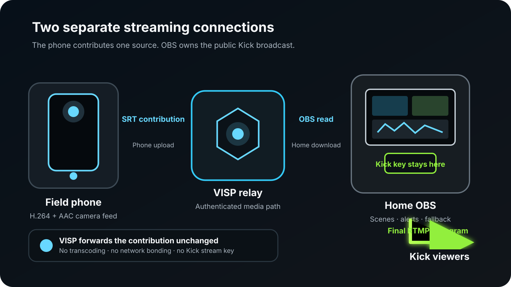

To stream on Kick from your phone **through OBS**, use the phone as a remote
camera rather than as the final Kick encoder. Sign in to VISP with Kick, bring
the phone's feed into OBS, configure Kick only in OBS, and start the finished
broadcast from the home computer.

That extra stage is useful when the stream needs existing OBS scenes, alerts,
local microphones, recordings, or a fallback picture. It also keeps the Kick
stream key at home. If you only need one phone camera and want the fastest
route live, Kick's own mobile app or a direct mobile encoder is simpler.

## Choose the direct route or the OBS route first

[Kick's official mobile guide](https://help.kick.com/en/articles/7135289-streaming-on-kick-from-your-mobile-phone)
describes two practical direct options: the Kick - Go Live app and mobile
encoders that send the phone straight to Kick. Those workflows are good when
the phone is the whole production.

The VISP route solves a different problem. The phone contributes one camera
and microphone to an OBS studio that remains responsible for the public
broadcast.

| Production need | Better starting route |
| --- | --- |
| One phone, minimal setup, no home computer | Kick - Go Live or another direct mobile encoder |
| Existing OBS scenes, alerts, graphics, and audio | Phone → VISP → OBS → Kick |
| Local fallback while the phone reconnects | Phone → VISP → OBS → Kick |
| Kick stream key must stay off the field phone | Phone → VISP → OBS → Kick |
| Several independent field cameras | One VISP device per phone, mixed in OBS |

The OBS route is not automatically more reliable. It adds a home computer,
home internet connection, and relay to the production. Use it because those
pieces provide production control you need, not because a longer signal path
is inherently better.

## Understand the two separate streams

The workflow contains two encoder connections:

1. **Contribution:** the phone encodes its camera and microphone as H.264/AAC
   and publishes over SRT to its authenticated VISP path.
2. **Distribution:** OBS reads that feed, composes the final scene, encodes the
   program, and sends it to Kick with the Kick server URL and stream key.

VISP only handles the first connection. Its relay carries the phone feed into
OBS and its control plane manages device access. It does **not** receive or
proxy the Kick stream key. The key belongs in OBS under **Settings → Stream**.

The two connections also have separate bitrate budgets. A phone can reach VISP
successfully while the OBS-to-Kick upload is dropping frames, or OBS can have a
healthy Kick connection while the field feed is reconnecting. The
[phone-to-OBS bitrate guide](/blog/best-bitrate-irl-streaming-phone-obs)
explains how to budget those legs independently.

## What you need

- An iPhone or Android phone supported by the
  [VISP phone app](https://docs.visp-stream.com/docs/phone-app)
- OBS Studio 31 on the home computer for the current VISP plugin, or a manual
  OBS Media Source created from the dashboard
- A VISP account signed in with Kick
- Access to the Kick Creator Dashboard
- Stable phone upload, home download for the phone feed, and home upload for
  the final Kick program
- Headphones and a second muted device for the preflight check

Keep the roles clear while setting up. The VISP publish URL is a private
credential for one camera path. The Kick stream key is a broader credential
that can broadcast to the channel. Neither belongs in screenshots, chat, or a
guest's notes.

## Step 1: Sign in with Kick and create the phone source

Open the VISP app on the field phone and choose **Continue with Kick**. The app
claims a publishing device for that installation and stores its SRT publish
URL in secure platform storage. You do not normally copy the URL.

Give the device a name that will still make sense inside OBS, such as
“roaming phone” or “venue camera.” Each phone should have its own device and
credential. Sharing one device between phones makes revocation harder and
does not create a backup: only one publisher can own a VISP path at a time.

If you use Larix, Moblin, or another encoder instead of the VISP app, create a
device in the dashboard and copy its sending URL into that encoder. The
[video-source documentation](https://docs.visp-stream.com/docs/video-source)
covers the manual SRT and RTMP paths.

## Step 2: Add the phone to OBS

For the plugin route, open **Tools → VISP Remote Control** in OBS and choose
**Sign in with browser**. Approve the device code, select the phone device, and
add it to the intended scene. The plugin creates the Media Source with its
authenticated read URL and reconnect settings.

The plugin makes outbound HTTPS and WSS connections. It does not require an
inbound router rule. Its machine token is scoped to device and OBS-control
work rather than general account access; the
[OBS remote-control documentation](https://docs.visp-stream.com/docs/obs-remote-control)
describes the pairing and revocation model.

The manual alternative is to download the generated scene collection from the
VISP dashboard and import it with **Scene Collection → Import**. It includes a
fallback scene and one Media Source per current path. If you reveal and paste a
read URL yourself, protect it like a password. Rotating the account-wide read
credential invalidates every existing VISP Media Source in OBS.

## Step 3: Set the phone contribution quality

Choose the phone camera, orientation, resolution, frame rate, and microphone
before starting the destination broadcast. For moving IRL video on cellular,
720p30 is a sensible first test. Increase quality only after the actual route
holds the contribution bitrate with margin.

These are contribution settings, not Kick output settings. VISP does not
transcode the phone feed to another resolution or bitrate. It also does not
bond cellular, Wi-Fi, and Ethernet connections. If one carrier or access point
cannot carry the selected feed, VISP cannot manufacture missing bandwidth.

Start the phone feed and wait for the device to show **Live** in the dashboard.
In OBS, inspect motion for several minutes, speak into the real microphone,
and check the mixer. If the field and studio both capture the same room, mute
one path or align it deliberately; two copies at different delays sound like
an echo.

## Step 4: Configure OBS for Kick

Open the Kick Creator Dashboard and find **Channel → Stream URL and Key**. In
OBS, open **Settings → Stream**, choose **Custom**, then paste the server URL
and stream key from Kick. Do not paste the Kick key into the VISP phone app or
VISP dashboard.

Kick's current
[OBS setup guide](https://help.kick.com/en/articles/7066931-how-to-stream-on-kick-com)
requires an H.264-compatible encoder, constant bitrate, and a two-second
keyframe interval. It currently supports up to 1920×1080, 60 fps, and
8,000 kbps, but a supported maximum is not a target. Choose an output bitrate
the home upload can sustain continuously, and recheck Kick's guide whenever
you rebuild the OBS profile.

Remember that OBS now has two decoding and encoding jobs: it decodes the
remote contribution, renders the scene, and encodes the final Kick output.
Watch CPU/GPU load during the test. If rendering or encoding lags while network
dropped frames stay at zero, reducing network bitrate alone is unlikely to fix
the actual bottleneck.

## Step 5: Set the Kick title and category

Set the title and category before the public start. Kick warns that a stream
may not start correctly when those fields are missing.

You can edit them in the Kick Creator Dashboard. The VISP phone app can also
search Kick categories and update the title and category after you authorize
the channel-write permission. That permission changes stream metadata; it
does not expose the Kick stream key to VISP.

If you also follow Twitch and Kick chat on the phone, use the private
**Floating** view so messages stay with the operator. The
[combined mobile-chat guide](/blog/twitch-kick-chat-phone-obs) explains the
difference between a private floating view and chat deliberately embedded in
the outgoing phone video.

## Step 6: Run the preflight in the right order

Use this order so every boundary is visible before viewers arrive:

1. Start the phone's VISP contribution.
2. Confirm the device is **Live** in VISP and visible in the correct OBS scene.
3. Check phone audio in the OBS mixer with headphones.
4. Record a short local OBS sample and inspect motion, framing, and sync.
5. Stop or disconnect the phone once and confirm the fallback scene appears.
6. Reconnect the phone and confirm the Media Source recovers.
7. Set the Kick title and category.
8. Start the Kick output from OBS, or use the paired VISP control only after
   the preview is healthy.
9. Check the public channel from a second muted device.

The [encoders and fallback documentation](https://docs.visp-stream.com/docs/broadcaster-setup)
includes a practical Advanced Scene Switcher recipe. It waits for a source to
remain playing before cutting to it and waits again before switching to
Fallback, which avoids rapid scene flapping during a reconnect.

## Troubleshoot the stage that is actually failing

**The phone says live, but OBS is blank:** check whether the device is Live in
the VISP dashboard. If it is not, troubleshoot the phone-to-relay connection.
If it is, verify that OBS uses the current read URL and that no second
publisher is trying to take the same path.

**OBS preview works, but Kick stays offline:** the VISP leg is already healthy.
Recheck the Kick server URL and key in OBS, then confirm the title, category,
H.264 encoder, CBR, and two-second keyframe interval against Kick's current
guide.

**OBS reports dropped network frames:** that points to the home-to-Kick upload,
not the phone's SRT latency. Lower the final output bitrate or fix the home
uplink.

**The phone feed freezes or reconnects while Kick remains live:** that points
to the contribution leg. Lower the phone bitrate, use the dashboard latency
probe, and test the actual field network. The
[mobile-network resilience guide](/blog/keep-stream-live-bad-mobile-network)
shows how SRT recovery, reconnects, and an OBS fallback work together.

**Chat or metadata controls are unavailable:** link Kick in VISP and grant the
requested permission for that feature. Media publishing, channel metadata,
chat, and the Kick destination key are separate access paths.

## Know what VISP does not replace

VISP is an authenticated SRT/RTMP relay and control plane for contribution
feeds. It does not host OBS, mix scenes on the server, send the finished
program to Kick, transcode video, or bond network connections. The phone still
encodes the field feed, OBS still builds and encodes the show, and Kick still
receives the final output directly from OBS.

That separation is the reason to use this workflow: a field phone becomes a
managed camera inside the production without becoming the owner of the Kick
channel.

If that is the production you want, follow the
[VISP getting-started guide](https://docs.visp-stream.com/docs/get-started),
add the phone to a test scene, and prove the full reconnect path before your
next Kick stream.
