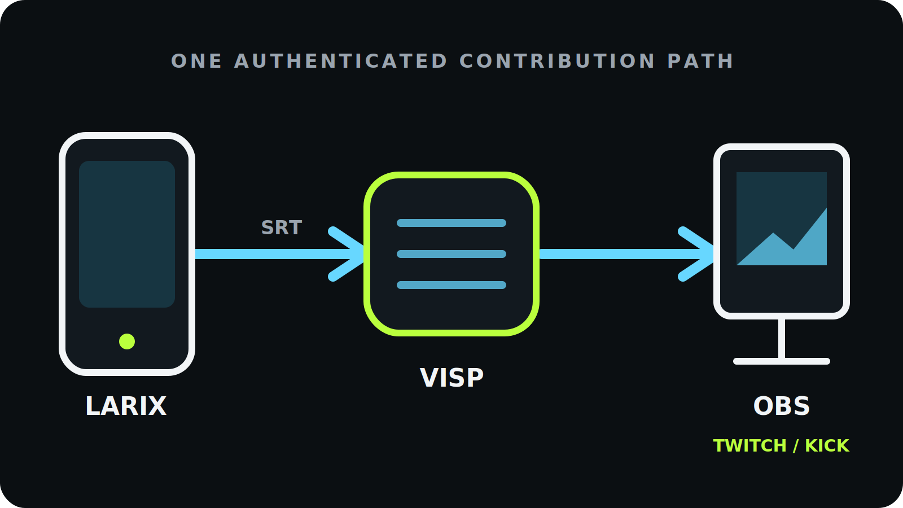

To send Larix Broadcaster into OBS over the internet, **create a video source in
VISP, paste its SRT publishing URL into a Larix connection, and add the separate
OBS reading URL as a Media Source.** Larix handles capture and mobile encoding,
VISP authenticates and relays the contribution feed, and OBS keeps control of
the finished Twitch or Kick broadcast.

This relay-based route avoids opening an inbound SRT port on the home network.
It also keeps the Twitch or Kick stream key off the field phone. The phone is a
camera for the production, not the owner of the destination broadcast.

## Why use Larix with VISP instead of sending straight to OBS?

Larix Broadcaster can send SRT directly to an OBS listener when the receiving
computer has a reachable address and UDP port. That is useful on a controlled
LAN. Across the public internet, it normally means arranging port forwarding,
firewall rules, and a stable address for the home computer.

VISP puts the reachable relay in the middle. Larix and OBS both make outbound
connections to it. Each field device gets an independently revocable publish
credential, while OBS uses a separate read credential. A producer can replace
one lost phone's access without rebuilding every other camera source.

The relay does not replace Larix's camera controls or OBS's production tools.
Larix remains the encoder; OBS remains the mixer, graphics system, recorder,
and final broadcaster. If you want the simpler VISP-native camera flow instead,
start with the [phone-as-an-OBS-camera guide](/blog/use-phone-as-remote-camera-obs).

## What you need

- Larix Broadcaster on the field phone
- OBS Studio on the production computer
- A VISP account signed in with Twitch or Kick
- Enough sustained upload capacity for Larix and download capacity for OBS
- Headphones for checking audio without creating a return-path echo
- A local OBS fallback scene for a field interruption

Test with the same phone, carrier, route, and time of day you expect to use.
A fast Wi-Fi rehearsal does not validate a moving cellular production.

## 1. Create a Larix video source in VISP

Sign in to VISP and choose **Larix Broadcaster** as the publisher during setup.
If the account is already configured, open **Video sources**, choose **Add
device**, and give it a practical name such as “roaming Larix” or “finish-line
camera.” One VISP device represents one publishing path.

Choose **Copy** beside **Add this to video source**. The value begins with
`srt://` and includes the path's publishing credential. Treat the whole URL as
a password: do not paste it into screenshots, chat, stream overlays, or a
public troubleshooting post.

VISP shows SRT by default. Keep it unless the sending network blocks UDP. The
dashboard exposes an RTMP fallback in **Advanced** mode, but changing protocols
does not improve a connection that simply lacks enough upload capacity.

For the exact dashboard flow, see the VISP documentation for [adding a video
source](https://docs.visp-stream.com/docs/video-source).

## 2. Add the SRT connection in Larix

In Larix Broadcaster, open **Settings → Connections → New connection**. Give
the connection a recognizable name, paste the complete VISP publishing URL
into the **URL** field, and save it. Back in the connections list, make sure the
new destination is selected before returning to the camera preview.

These steps follow Larix's current connection model: a saved destination must
also be active for the main broadcast button to send to it. Softvelum's [Larix
documentation reference](https://softvelum.com/larix/docs/) includes the
current iOS and Android connection walkthroughs if a menu label has moved in
your installed version.

Do not split the VISP URL into server, stream ID, username, and password fields.
The generated value already carries the SRT stream ID and authentication data
in the format the relay expects. Paste it as one URL.

## 3. Choose settings the mobile connection can sustain

Use H.264 video and AAC audio for the predictable VISP-to-OBS path. Set a
two-second keyframe interval and begin with constant target bitrate. Select the
camera orientation before composing the source in OBS; changing from landscape
to portrait later may break an existing crop or scene layout.

Do not choose bitrate from a single speed-test peak. Measure the real route and
leave margin below the repeatable upload result. A stable 720p30 picture is
more useful than a nominal 1080p feed that continually queues, freezes, or
reconnects.

| Network behavior | Better first adjustment |
| --- | --- |
| Bitrate repeatedly approaches available upload | Lower target bitrate |
| Short bursts of loss or jitter | Increase SRT latency |
| Capacity changes while moving | Enable Larix adaptive bitrate |
| Long dead zone or total carrier outage | Use OBS fallback or add real bonding |

Larix offers multiple adaptive-bitrate strategies. Its [official
FAQ](https://softvelum.com/larix/faq/) explains how logarithmic, ladder, and
hybrid modes reduce and later restore bitrate. The best choice depends on the
phone and route, so test the mode at the lowest acceptable picture quality
before relying on it live. Adaptive bitrate can trade detail for continuity;
it cannot send video when the active connection has no usable route.

VISP does **not transcode** the incoming feed. The codec, resolution, frame
rate, keyframe interval, and bitrate Larix sends are what the relay passes
toward OBS. Fix an incompatible or oversized contribution at the encoder
instead of expecting the relay to convert it.

## 4. Tune SRT latency from the field network

SRT can retransmit missing UDP packets while they are still useful. Its latency
window gives those retransmissions time to arrive, so lower is not always
better. Too small a window produces visible loss; an unnecessarily large one
slows the field-to-studio path.

Run VISP's latency probe on the connection Larix will actually use and select
the correct network profile. VISP turns the median of seven round-trip samples
into these starting recommendations:

| Profile | Recommendation | Minimum |
| --- | ---: | ---: |
| Wired | 3× measured RTT | 120 ms |
| Wi-Fi | 4× measured RTT | 300 ms |
| Cellular | 6× measured RTT | 600 ms |

Enter the recommended millisecond value in the saved Larix connection's SRT
latency setting. Cellular gets more headroom because its jitter is often
bursty. Do not reduce the value only to advertise a smaller delay; watch motion
and recovery on the real route first.

The [OBS SRT guide](https://obsproject.com/kb/srt-protocol-streaming-guide)
likewise describes latency as the main recovery option and explains its
round-trip-time relationship. VISP uses more conservative profile-specific
floors for this mobile contribution workflow.

## 5. Bring the Larix feed into OBS

Larix uses the **publishing URL**. OBS must use the separate **reading URL**.
They are intentionally different credentials.

The quickest OBS setup is to pair the VISP plugin, select the Larix device, and
add it to the current scene. The plugin creates the authenticated Media Source
without exposing a public control port. Alternatively, download the generated
scene collection and choose **Scene Collection → Import** in OBS. It includes a
Fallback scene and one reconnecting Media Source scene per active VISP device.

For a manual source:

1. Reveal or copy the device's OBS URL in VISP.
2. In OBS, add a **Media Source**.
3. Clear **Local File**.
4. Paste the OBS reading URL into **Input**.
5. Set **Input Format** to `mpegts` if it is not already supplied.
6. Confirm the source reconnects after Larix stops and starts again.

Those Media Source steps match OBS's official SRT guidance. VISP's generated
source also uses low buffering and automatic reconnection. Rotating the OBS
read credential invalidates every existing OBS source for that account, so do
it only when you intend to replace them. Rotating one Larix device's publish
credential affects only that device.

## 6. Test recovery before the real broadcast

Start Larix before sending OBS to Twitch or Kick. The matching VISP device
should change to **Live**, and the OBS source should begin moving after the
SRT connection and a decodable keyframe arrive.

Run this short failure drill:

1. Confirm motion and audio in OBS for several minutes.
2. Disable the phone's active network.
3. Verify OBS remains connected to Twitch or Kick and shows local fallback.
4. Re-enable the phone network and watch Larix reconnect.
5. Confirm the same OBS Media Source resumes without a new URL.
6. Wait for stable playback before cutting back to the field camera.

Use Larix's advanced connection settings to choose a practical reconnect
timeout. On supported versions, the network-presence option can also allow
retry behavior when the device temporarily reports no network. The exact
controls differ between iOS and Android, so confirm the behavior on the phone
you will carry rather than copying someone else's timer.

For a production that should keep entertaining viewers while the camera is
offline, follow the [mobile-network resilience guide](/blog/keep-stream-live-bad-mobile-network)
and configure a Media-state condition in Advanced Scene Switcher.

## What this setup does not do

VISP relays the authenticated feed; it does not transcode it and it does not
bond Wi-Fi and cellular into one connection. Larix can publish to multiple
destinations, but simultaneous outputs are not network bonding: each output
still travels over the phone's available network path.

If one carrier must fail without interrupting the field picture, add a genuine
bonding layer or a bonded encoder system. If a short interruption is acceptable,
SRT recovery, Larix adaptive bitrate, automatic reconnect, and a good OBS
fallback scene are the smaller and easier setup.

Only one publisher can own a VISP device path at a time. A second phone cannot
wait pre-connected on the same URL as a seamless standby. Give every phone or
encoder its own VISP device and OBS source.

## Troubleshooting

### Larix starts, but VISP never shows Live

Check that the saved connection is active, the full current publishing URL was
pasted, and another encoder is not already using that device path. If its
credential was rotated or revoked, replace the old Larix URL.

### VISP is Live, but OBS is blank

Make sure OBS has the reading URL, not the Larix publishing URL. Confirm the
Media Source has **Local File** disabled and wait for a keyframe. If the OBS
read credential was rotated, download a fresh scene collection or update the
source URL.

### The picture freezes while moving

Lower the target bitrate, enable and test Larix adaptive bitrate, and rerun the
VISP latency probe on the field connection. More latency helps recover bursts
of loss, but it cannot compensate for sustained upload below the encoded
bitrate.

### Video works, but OBS has no audio

Confirm Larix is sending video and audio, the selected microphone has
permission, and the contribution uses AAC. Then check that the OBS Media Source
is not muted and its mixer monitoring does not create feedback on the phone.

### SRT is blocked on the venue network

Switch VISP to **Advanced**, copy that device's RTMP publishing URL, and create
an RTMP connection in Larix. Keep OBS on its generated reading path. RTMP is a
compatibility fallback over TCP, not a cure for insufficient bandwidth.

## Pre-stream checklist

- Larix connection uses the current VISP publishing URL and is active.
- H.264, AAC, orientation, keyframe interval, and bitrate are tested.
- SRT latency comes from a probe on the real field network.
- Adaptive bitrate is enabled and tested when mobile capacity varies.
- OBS uses the separate reading URL and receives both picture and audio.
- The destination stream key remains only in OBS.
- A forced outage switches to fallback and the same source recovers.
- Every additional camera has its own VISP device and credentials.

## Frequently asked questions

### Does Larix send directly to Twitch or Kick in this workflow?

No. Larix sends a contribution feed to VISP, OBS receives it, and OBS sends the
finished production to Twitch or Kick. That keeps scenes, alerts, recording,
and the destination stream key at the studio.

### Should I use SRT or RTMP from Larix?

Use SRT by default for recovery on an unpredictable network. Use RTMP when the
sending network or encoder path cannot use UDP. Neither protocol creates
bandwidth, transcodes video, or bonds connections.

### Can I reuse one Larix URL on several phones?

Not at the same time. Create one VISP device per phone. That keeps source names,
status, revocation, and OBS scenes independent.

### Is Larix required for VISP?

No. Larix is a strong option when its camera, encoding, adaptive-bitrate, and
advanced connection controls fit the shoot. The VISP native and browser apps
cover simpler publishing workflows.

## Sources and next steps

- [VISP: add a video source](https://docs.visp-stream.com/docs/video-source)
- [VISP: encoders, latency, and fallback](https://docs.visp-stream.com/docs/broadcaster-setup)
- [Larix documentation reference](https://softvelum.com/larix/docs/)
- [Larix adaptive bitrate FAQ](https://softvelum.com/larix/faq/)
- [OBS SRT protocol guide](https://obsproject.com/kb/srt-protocol-streaming-guide)
- [SRT Alliance technology overview](https://www.srtalliance.org/about-srt-technology/)

If you already produce in OBS and want Larix to become a managed field camera,
[try VISP](https://visp-stream.com): create one device, paste its SRT URL into
Larix, and verify the complete path before your next live show.
