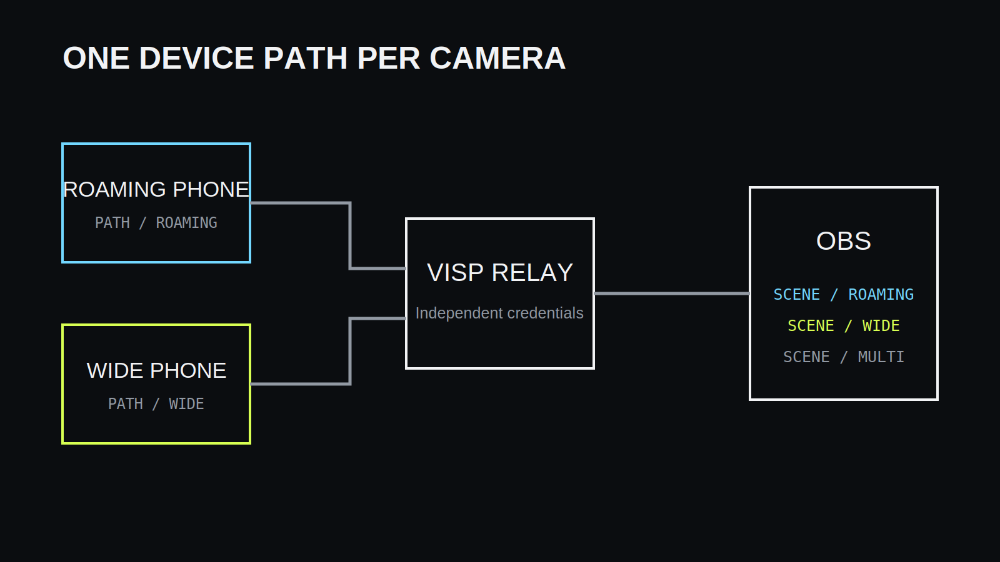
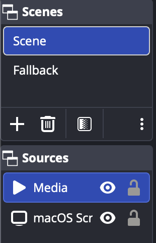

Usean puhelimen tuotannossa jokainen kamera julkaisee omaan VISP-laitteeseensa,
OBS lukee syötteet erillisinä lähteinä ja tuottaja vaihtaa niiden välillä kuten
minkä tahansa studiokameran kanssa.

## Suunnittele tuotanto ennen laitteiden lisäämistä

Päätä kameroiden tehtävät, kuvasuhteet, äänen pääasiallinen lähde ja se, kuka
vaihtaa kohtauksia. Nimeä kamerat tehtävän mukaan, esimerkiksi “juontaja”,
“liikkuva” ja “lava”, jotta sama nimi näkyy VISPissä ja OBS:ssä.

## Luo yksi VISP-laite jokaiselle puhelimelle

Yhtä julkaisupolkua voi käyttää vain yksi lähettäjä kerrallaan. Erillinen laite
antaa jokaiselle puhelimelle oman tunnuksen, tilan ja peruutusmahdollisuuden.
Yhden puhelimen tunnuksen kierrättäminen ei silloin katkaise muita kameroita.

Älä jaa samaa julkaisuosoitetta usealle kuvaajalle. Tallenna osoite vain sitä
tarvitsevaan sovellukseen ja käsittele sitä salaisuutena.

## Lisää jokainen syöte OBS:ään

VISP OBS -lisäosa voi luoda medialähteet automaattisesti. Lisää kukin lähde
omaan peruskohtaukseensa ja käytä näitä sisäkkäisinä lähteinä varsinaisissa
ohjelmakohtauksissa. Näin rajaus, värikorjaus ja ääniasetukset pysyvät yhdessä
paikassa.

## Määritä puhelimet itsenäisesti

Verkot ja laitteet eivät ole samanlaisia. Mittaa kunkin puhelimen yhteys ja
valitse sille oma bittinopeus sekä SRT-viive. Yhden kameran ei pidä pakottaa
kaikkia käyttämään heikoimman laitteen asetuksia, mutta ohjelman kuvasuhde ja
kuvataajuus kannattaa pitää johdonmukaisina.

## Hallitse ääntä tietoisesti

Useiden puhelinten mikrofonit samassa tilassa aiheuttavat helposti vaihevirheitä
ja kaikua. Valitse yksi päämikrofoni tai avaa vain kulloinkin käytettävän kameran
ääni. Jos kamerat ovat eri paikoissa, säädä niiden tasot ja viiveet erikseen.

## Vaihda kameroita paljastamatta kohdeavainta

Puhelimet julkaisevat vain VISPiin. OBS omistaa Twitchin, Kickin tai muun
kohdepalvelun lähetysavaimen ja lähettää valmiin ohjelman. Etäohjausta tarvitseva
kuvaaja voidaan valtuuttaa VISP-lisäosan kautta ilman kohdeavaimen jakamista.

Nimeä kohtaukset lyhyesti ja yksiselitteisesti. Etäkäyttäjän pitää nähdä, onko
valittavana kamera, varakohtaus vai valmiiksi rakennettu monikameranäkymä.

## Varaudu yhden kameran katkeamiseen

Yhden syötteen häiriö ei saa peittää toimivaa kameraa. Tee jokaiselle kameralle
oma varatila ja lisäksi koko tuotannon paikallinen varakohtaus. Harjoittele
kameran poistuminen, palautuminen ja tunnuksen vaihto ennen lähetystä.

## Kaistanleveys ja skaalautuminen

Jokainen puhelin tarvitsee oman lähetyskaistansa ja relay sekä OBS oman
vastaanottokapasiteettinsa. OBS:n dekoodauskuorma kasvaa lähteiden määrän,
tarkkuuden ja kuvataajuuden mukana. Lisää kameroita yksi kerrallaan ja mittaa
CPU-, GPU- ja verkkokuorma.

VISP ei synkronoi itsenäisiä puhelinkameroita ruuduntarkasti eikä yhdistä niiden
verkkoyhteyksiä. OBS:ssä voi lisätä viivettä lähteisiin, jos tuotanto tarvitsee
lähempää ajallista kohdistusta.

## Kahden puhelimen harjoitus

1. Luo kaksi nimettyä VISP-laitetta.
2. Lisää molemmat syötteet erillisiin OBS-peruskohtauksiin.
3. Valitse pää-ääni ja mykistä päällekkäiset mikrofonit.
4. Käynnistä molemmat puhelimet ja seuraa niitä vähintään 15 minuuttia.
5. Katkaise toinen yhteys ja varmista, että toinen kamera sekä OBS-lähetys jatkuvat.
6. Palauta kamera ja varmista, ettei lähdettä tarvitse luoda uudelleen.
7. Testaa kohtausvaihdot paikan päältä ja etäohjauksella.

## Usein kysyttyä

### Kuinka monta puhelinta voin lisätä?

VISP voi hallita useita laitteita, mutta todellinen raja määräytyy relayn
kaistan, OBS-koneen dekoodauskyvyn ja tuotannon hallittavuuden perusteella.

### Ovatko kamerat täydellisesti synkronissa?

Eivät. Erilliset verkot ja enkooderit tuottavat eri viiveet. Säädä tarvittaessa
lähdekohtaisia viiveitä OBS:ssä.

### Yhdistävätkö useat puhelimet verkkonsa?

Eivät. Jokainen puhelin käyttää omaa yhteyttään omaan syötteeseensä; tämä ei ole
verkkobondingia.

## Lisätietoja

- [Puhelin- ja selainsovellus](https://docs.visp-stream.com/fi/docs/phone-app)
- [OBS-etäohjaus](https://docs.visp-stream.com/fi/docs/obs-remote-control)
