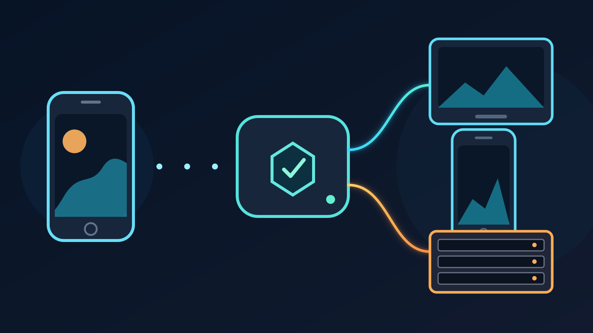

You can send one phone IRL feed to Twitch, Kick, or YouTube and a custom
streaming endpoint without making the phone upload a separate copy for every
destination. VISP Direct receives the phone contribution once, then creates an
independent output for each selected destination.

The custom destination can be an RTMP or RTMPS ingest supplied by another live
platform, an event service, or your own public media server. It can also be an
SRT receiver. OBS does not need to own the public output, although it can still
read the original phone feed for monitoring or recording.

This setup is useful when the phone already contains the complete show and you
want wider distribution. It is not a replacement for OBS scenes, local audio,
or a producer who needs to change the program before it goes public.

## What the custom output changes

The phone sends one H.264 and AAC contribution to VISP. Direct decodes that
contribution and creates a separate H.264 and stereo AAC distribution encode
for every enabled output. RTMP and RTMPS destinations use an FLV container.
SRT destinations use MPEG-TS.

This distinction matters for capacity planning:

- adding a destination does not add another upload from the phone;
- every destination consumes relay CPU, outbound bandwidth, and one forwarder
  slot;
- one destination can fail or retry without stopping the others; and
- OBS reads the original contribution, not any distribution encode sent by
  Direct.

VISP Direct therefore differs from a service that copies an already
platform-ready stream unchanged. The phone still encodes its contribution, and
the relay performs one distribution encode per destination. The [VISP Direct
guide](https://docs.visp-stream.com/docs/direct-output) explains that boundary
and the relay capacity check that runs before publishing starts.

## When to use a built-in or custom destination

Use the built-in Twitch, Kick, and YouTube destinations when one of those
accounts is the target. VISP requests the required provider permission, obtains
the publish destination at stream start, and keeps the stream key away from the
phone and browser.

Use a custom destination when the receiving service gives you a complete RTMP,
RTMPS, or SRT publisher URL and does not have a built-in VISP connection. Common
examples include:

- a second live platform that accepts a custom RTMP publisher;
- a private event or ticketed broadcast service;
- a public SRT gateway run by a production partner; or
- a media server that records, monitors, or redistributes the program.

Do not add Twitch or Kick manually just because they also use RTMPS. Their
built-in VISP destinations handle provider authorization and current ingest
details. Kick's official [mobile streaming
guide](https://help.kick.com/en/articles/7135289-streaming-on-kick-from-your-mobile-phone)
shows why a manual workflow is more fragile: the app needs both the exact
server URL and the channel stream key.

## Pick RTMP, RTMPS, or SRT from the receiver's instructions

Do not convert one protocol URL into another by changing its prefix. Use the
exact publisher URL supplied by the receiver.

**RTMPS is the normal choice for a compatible public platform.** It protects
the connection with TLS. The URL usually contains a server path and a stream
key. Treat the whole value as a secret.

**RTMP is accepted when the receiver requires it.** It does not add TLS to the
connection, so prefer RTMPS when the same service offers both.

**SRT is useful for a production-controlled receiver.** SRT supports caller and
listener roles, packet recovery, latency settings, stream IDs, and optional
passphrases. The receiving operator must give you a complete URL with the
correct public host, port, and options. Haivision documents the [SRT URI
format](https://github.com/Haivision/srt/blob/master/docs/apps/srt-live-transmit.md)
and the role of [Stream ID in access
control](https://github.com/Haivision/srt/blob/master/docs/features/access-control.md).

VISP accepts an SRT destination only when the URL has an explicit port and
either a path or a `streamid` parameter. It forwards an MPEG-TS program to that
URL. VISP does not discover the receiver's preferred latency, passphrase, or
Stream ID, so copy those values from the receiver instead of guessing.

## Add the custom destination in VISP

Create and change endpoint credentials in the web dashboard. The phone app can
then enable a saved destination for its own publishing device. Stop the device
before adding an output or changing its endpoint. An enabled output can be
stopped while the device remains live.

1. Stop the publishing device so you can add the new output safely.
2. Get the complete publisher URL from the receiving service. If the service
   shows a server and key separately, follow its documentation to construct the
   final URL.
3. Open **Direct output** in the VISP dashboard.
4. Under **Custom destinations**, choose **Add custom destination**.
5. Enter a short name and the complete RTMP, RTMPS, or SRT URL.
6. Save the destination, then enable it for the correct publishing device.
7. Enable the built-in Twitch, Kick, or YouTube outputs needed for the same
   session.
8. Start a short test and watch every destination state independently.

VISP validates the host before storing the destination. The host must resolve
to a public IP address. Loopback, private, link-local, multicast, and reserved
addresses are rejected, so `localhost`, `127.0.0.1`, and a home address such as
`192.168.1.20` cannot be custom Direct targets. Put a receiver on a properly
secured public endpoint if VISP must reach it over the internet.

The current [destination validation
code](https://github.com/PohinaGroup/visp/blob/main/packages/api/src/direct-custom-destination.ts)
also rejects credentials in the URL authority and requires an RTMP path. Use
the path or query format documented by the destination service.

## What VISP stores and what it shows later

A publish URL often contains the stream key, an SRT passphrase, or another
credential. VISP encrypts the complete custom URL at rest. After saving, the
dashboard and phone show only the destination name, protocol, host, and explicit
port. The secret path and query string are not returned to those clients.

That display is intentionally insufficient for recovering a lost key. To rotate
the credential, get a new URL from the receiving service and enter it as the
replacement URL in the dashboard.

VISP validates the destination again when the output starts. If DNS later
resolves the host to a private address, the output fails instead of connecting.
The [custom Direct output
implementation](https://github.com/PohinaGroup/visp/blob/main/packages/api/src/direct.ts)
decrypts the URL only while resolving the relay destination and reports a
generic start error rather than returning the secret.

The custom URL configures media delivery only. VISP does not know the title,
category, visibility, scheduled event, or chat rules of an arbitrary endpoint.
Set that metadata at the receiving service and verify its public page there.

## Multistream without overloading the relay

Every Direct output uses one forwarder slot. Twitch plus Kick plus one custom
RTMPS endpoint needs three slots. A separate portrait output needs another
slot. The phone still sends one contribution, but the relay performs more
encoding and sends more outbound data.

If the relay cannot reserve all required slots, VISP blocks the new publish or
marks an individual output unavailable rather than pretending that every
destination started. The exact capacity belongs to the relay deployment, so do
not plan around a fixed number from a screenshot or an old article.

Start with the outputs that matter. A destination added for a hypothetical
future use still consumes real resources when enabled. Add it only after the
receiver and the audience need it.

For a no-PC production, read [How to Stream to Twitch Without a PC at
Home](/blog/stream-to-twitch-without-a-pc). If OBS scenes, alerts, a local host,
or a final recording matter, use the [phone as a remote camera in
OBS](/blog/use-phone-as-remote-camera-obs) instead and let OBS own the public
program.

## Check Twitch and Kick rules before the simulcast

A working output does not grant permission to ignore platform policy. Review
the rules again before each new destination mix.

Twitch's current [Simulcasting Guidelines
FAQ](https://help.twitch.tv/s/article/simulcasting-guidelines) says the Twitch
experience cannot be degraded compared with another service. It also prohibits
using Twitch to direct viewers to another concurrent live stream and prohibits
combined cross-platform activity, such as merged chat, in the Twitch program.
A private chat view on the creator's phone is different because viewers do not
see it.

Kick's current [Partner Program multistreaming
guide](https://help.kick.com/en/articles/11091744-multistreaming-on-the-kick-partner-program)
requires partners to enable Kick's Multistreaming toggle when they also stream
to another long-form live platform. The guide also describes the current payout
effect. VISP cannot switch that account setting for you.

These rules can change independently of VISP. The linked provider pages, not a
saved checklist, are the source to review before going live.

## Test the complete destination path

The VISP state proves that its forwarder connected or failed. It does not prove
that the destination made the stream public with the correct metadata and
player behavior.

Run this preflight before an event:

1. Use a private, unlisted, or low-stakes test where the receiving service
   offers one.
2. Confirm the selected phone, camera, orientation, microphone, bitrate, and
   frame rate.
3. Start with one built-in destination and the custom destination.
4. Watch both public players from muted devices on a separate connection.
5. Confirm audio, aspect ratio, captions or burned-in graphics, and title at
   each destination.
6. Disconnect and reconnect the phone once to test recovery.
7. Stop the custom receiver or revoke its key, then confirm that the other
   destination stays live.
8. Rotate the test credential if it appeared in a screenshot, log, or message.

If one output fails, read its state before changing the phone bitrate. A bad
custom URL, expired key, blocked receiver, or full relay slot is not a mobile
upload problem. Changing several settings at once makes the next failure harder
to identify.

## Sources and next steps

- [VISP Direct output documentation](https://docs.visp-stream.com/docs/direct-output)
- [VISP phone app documentation](https://docs.visp-stream.com/docs/phone-app)
- [VISP custom destination validation](https://github.com/PohinaGroup/visp/blob/main/packages/api/src/direct-custom-destination.ts)
- [VISP Direct destination resolution](https://github.com/PohinaGroup/visp/blob/main/packages/api/src/direct.ts)
- [Twitch Simulcasting Guidelines FAQ](https://help.twitch.tv/s/article/simulcasting-guidelines)
- [Kick Partner Program multistreaming](https://help.kick.com/en/articles/11091744-multistreaming-on-the-kick-partner-program)
- [Kick mobile streaming with custom RTMP](https://help.kick.com/en/articles/7135289-streaming-on-kick-from-your-mobile-phone)
- [Haivision SRT URI syntax](https://github.com/Haivision/srt/blob/master/docs/apps/srt-live-transmit.md)
- [Haivision SRT Stream ID guidance](https://github.com/Haivision/srt/blob/master/docs/features/access-control.md)

If one phone feed already contains your complete show, [try
VISP](https://visp-stream.com), add one custom destination, and rehearse the
Twitch or Kick simulcast before relying on it in the field.
