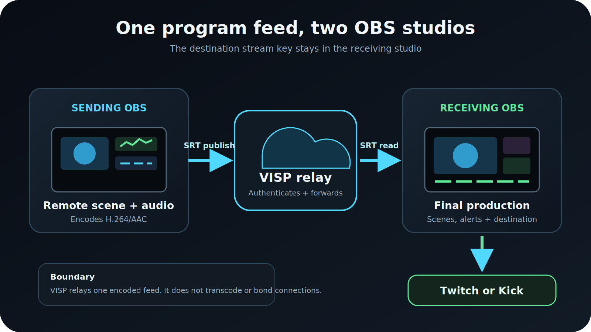

To send one OBS production to another OBS over the internet, **make the first
OBS a publishing device in VISP, then add that device as a Media Source in the
second OBS.** The first computer composes and encodes the remote program, VISP
authenticates and relays its SRT feed, and the second computer adds that feed to
the final Twitch or Kick production.

Both OBS computers connect outward to the relay, so the receiving studio does
not need an inbound SRT port or router port forwarding. The Twitch or Kick
stream key stays in the receiving OBS profile.

## When an OBS-to-OBS feed is the right tool

This workflow is useful when the remote location needs to deliver more than one
raw camera. The sending OBS can combine a game capture, camera, presentation,
scoreboard, local microphones, or other sources into one finished contribution
feed. The receiving OBS can place that feed beside studio cameras, commentary,
alerts, and graphics before sending the final program to viewers.

Typical examples include:

- a tournament observer sending a clean game feed to a remote producer;
- a venue operator delivering a local camera mix to a home studio;
- a co-streamer contributing a prepared scene instead of exposing every source;
- a second production computer handling capture while the main OBS handles the
  destination broadcast.

There is an important limit: the receiving OBS gets the sending OBS program as
one flattened video-and-audio source. It cannot separately move the remote
camera, game capture, and lower third after they have been composed upstream.
If the producer needs independent cameras, create a separate VISP device for
each encoder. If participants need a natural two-way conversation and return
video, a browser call workflow such as the one discussed in
[VDO.Ninja vs VISP](/blog/vdo-ninja-vs-visp) may fit better.

## What you need

- OBS Studio on the sending and receiving computers
- A VISP account signed in with Twitch or Kick
- The VISP OBS plugin on each computer for the shortest setup, or access to the
  dashboard URLs for manual configuration
- Enough sustained upload at the sending location for the contribution bitrate
- Enough download at the receiving location for the feed, plus upload for the
  final Twitch or Kick broadcast
- Headphones or a deliberate audio-monitoring plan to prevent feedback
- A local fallback scene on the receiving OBS

Name the computers clearly before starting. This guide calls them **sending
OBS** and **receiving OBS**. The sending OBS creates the remote program. The
receiving OBS owns the final broadcast.

## 1. Create a VISP device for the sending OBS

The quickest path uses the VISP plugin. Install the package for OBS Studio 31,
restart OBS, and open **Tools → VISP Remote Control** on the sending computer.
Choose **Sign in with browser**, approve the displayed code, and return to OBS.

Enter a practical device name such as “venue OBS” or “game observer,” then
choose **Create and use as OBS output**. Confirm the warning. The plugin creates
an independently revocable publishing device and replaces the current OBS
profile's streaming service and key with its SRT publishing URL.

Stop streaming before doing this. The plugin refuses to change the destination
while OBS is live, and the confirmation matters: the selected profile no
longer points directly to Twitch or Kick after the change. VISP does not receive
or preserve the provider key that was replaced.

The full plugin behavior and pairing model are documented in
[VISP OBS remote control](https://docs.visp-stream.com/docs/obs-remote-control).

### Manual alternative

If you do not use the plugin on the sending computer:

1. Open the VISP dashboard and create one device for this OBS installation.
2. Copy **Add this to video source**. Treat the complete URL as a password.
3. In the sending OBS, open **Settings → Stream**.
4. Set **Service** to **Custom**.
5. Paste the SRT publishing URL into **Server**.
6. Leave **Stream Key** empty and save.

These are also the sending steps in the
[official OBS SRT guide](https://obsproject.com/kb/srt-protocol-streaming-guide).
Do not paste the receiving URL into the sender, split the SRT stream ID into
separate fields, or publish the URL in a screenshot. VISP's
[video-source documentation](https://docs.visp-stream.com/docs/video-source)
explains where to copy the current publishing value.

## 2. Set the contribution quality in the sending OBS

Configure the sending OBS for the connection between the two studios, not for
the best result from one speed test. Start with H.264 video, AAC audio, and a
two-second keyframe interval. Choose a resolution, frame rate, and bitrate that
the sending connection can sustain continuously with margin.

The remote contribution and the destination broadcast are separate encodes on
separate network legs. The sending OBS decides the quality that reaches VISP.
The receiving OBS then encodes its complete program for Twitch or Kick. Avoid
making the contribution needlessly larger than the finished broadcast, but do
not starve text, game motion, or fine detail that the studio must preserve.

VISP **does not transcode** the contribution. It does not resize the picture,
change the codec, repair an overloaded encoder, or create a second quality
ladder. If the receiving OBS cannot decode the feed reliably, correct the
sending OBS settings.

Record a short local sample from the sending scene before testing over the
network. Check motion, small text, microphone levels, and sync. This separates
capture or encoding problems from transport problems.

## 3. Start the sending OBS and verify VISP

Choose **Start Streaming** on the sending OBS. In this profile, that button
starts the VISP contribution; it does not start the Twitch or Kick broadcast.

The matching device should change to **Live** on the VISP dashboard. If it does
not, confirm that the profile uses the current publishing URL and that another
OBS instance or encoder is not already connected to the same device. Only one
publisher can own a VISP path at a time.

Give every sending OBS its own device. Separate paths keep names, status,
credentials, revocation, and receiving sources independent.

## 4. Add the feed to the receiving OBS

Pair the VISP plugin on the receiving computer through **Tools → VISP Remote
Control → Sign in with browser**. Select the sending device and choose **Add to
scene**. The plugin creates the authenticated Media Source in the currently
selected scene.

For manual setup:

1. Reveal or copy the device's OBS reading URL in VISP.
2. Add a **Media Source** in the receiving OBS.
3. Clear **Local File**.
4. Paste the reading URL into **Input**.
5. Enter `mpegts` as **Input Format** if it is not already supplied.
6. Confirm the source reconnects after the sender stops and starts.

The publishing URL belongs only in the sending OBS. The reading URL belongs
only in the receiving OBS. A device publish credential can be rotated without
changing other devices; rotating the account-wide OBS read credential
invalidates every existing VISP Media Source for that account.

Frame the new source as you would any other OBS input. Decide whether its remote
audio should be active, monitored, or muted before it reaches Program. If the
sending location listens to the receiving program, build a return mix that does
not send its own delayed audio back to its speakers.

## 5. Keep Twitch or Kick in the receiving OBS

Configure the destination service and stream key only in the receiving OBS
profile. Add alerts, local commentary, overlays, recording, and fallback there,
then use **Start Streaming** on that computer when the complete show is ready.

The signal chain is now:

1. sending OBS encodes one contribution;
2. VISP authenticates and relays it;
3. receiving OBS decodes it as a Media Source;
4. receiving OBS composes and encodes the final program;
5. Twitch or Kick receives that final program.

This separation lets the receiving OBS stay live when the remote computer
disconnects. The producer can cut to a local scene instead of ending the
destination broadcast.

## Tune SRT latency for the real route

SRT can request retransmission of missing packets while they are still useful.
Its latency buffer gives recovery time, which is why the smallest possible
number is not always the best number. The
[SRT project](https://github.com/Haivision/srt) documents automatic repeat
requests and latency-controlled delivery, while OBS documents its SRT URL
options in microseconds.

Run VISP's dashboard latency probe from the sending network and start with the
recommendation for wired, Wi-Fi, or cellular use. Test the real path at the
time and place it will run. More latency can absorb bursts of loss and jitter;
it cannot compensate for a contribution bitrate that remains above available
upload capacity.

For fixed studio links, prioritize stable playback over a headline delay
number. For a remote conversation, remember that the SRT contribution is only
one part of the round trip; talkback needs its own tested return path.

## Test failure and recovery before going live

Run this drill with the destination broadcast still offline:

1. Start the sending OBS and confirm stable motion and audio in the receiver.
2. Stop the sending OBS and verify the receiving Media Source stops.
3. Switch the receiving OBS to its local fallback scene.
4. Start the sender again and verify the same source reconnects.
5. Disconnect the sending network briefly, then restore it.
6. Confirm the receiver recovers without a new device or URL.
7. Check audio sync again after reconnection.

For automatic cuts, follow the
[stream resilience guide](/blog/keep-stream-live-bad-mobile-network). Its
Advanced Scene Switcher setup watches Media Source playback state and debounces
the transition so a short decoder change does not flap between scenes.

## What VISP does not add to OBS-to-OBS streaming

VISP is the authenticated relay and control plane in this workflow. It does not
transcode the feed and it does not bond network connections. SRT retransmission
can recover some packet loss, but it cannot combine two ISPs or keep sending
through a total outage. Use a genuine bonding layer when one connection must be
able to fail without interrupting the contribution.

VISP also does not turn one-way program contribution into a video call, create
mix-minus audio, synchronize unrelated remote feeds, or separate a flattened
OBS program back into its original sources. Those are production-design tasks
around the relay.

## Troubleshooting

### The sending OBS starts, but VISP stays offline

Check that **Service** is Custom, the full current SRT publishing URL is in
**Server**, and **Stream Key** is empty. Stop any other encoder using the same
device. If the publish credential was rotated, replace the old URL.

### VISP is live, but the receiving OBS is blank

Confirm that the receiver uses the reading URL, **Local File** is cleared, and
the Input Format is `mpegts`. Wait for the next keyframe. If the account-wide
read credential was rotated, refresh the plugin source or paste a new reading
URL.

### Video arrives, but audio is missing

Verify that the sending OBS mixer is moving and the output includes an AAC
track. In the receiving OBS, confirm the Media Source is not muted and is routed
to the intended track. Check monitoring with headphones before changing gain.

### The feed freezes or breaks up

Lower the sending bitrate first. Then test a larger SRT latency window for
bursty loss. More buffering does not fix an encoder overload or a sustained
bandwidth shortage.

### The sender replaced the wrong stream destination

Stop streaming and restore the correct service on that OBS profile. For a
repeatable production, dedicate and clearly name one sending profile for VISP
instead of reusing the profile that normally publishes directly to a platform.

## Pre-stream checklist

- The sending OBS profile publishes to its own VISP device.
- H.264, AAC, keyframe interval, resolution, frame rate, and bitrate are tested.
- The device appears Live and no second publisher shares its path.
- The receiving OBS uses the separate reading URL.
- Remote audio is routed without feedback.
- The Twitch or Kick key exists only in the receiving OBS profile.
- A local fallback works while the sender is offline.
- A forced interruption recovers on the same Media Source.
- The team understands that VISP neither transcodes nor bonds connections.

## Frequently asked questions

### Do I need to open an SRT port on the receiving computer?

No. With VISP, both OBS computers connect to the reachable relay. The home
router does not need to forward an inbound SRT listener port to OBS.

### Can the receiving OBS edit the sender's individual sources?

No. It receives the sending OBS program as one Media Source. Publish sources on
separate VISP devices when the receiving producer must control them separately.

### Does Start Streaming on both computers go to Twitch or Kick?

No. On the sending profile, Start Streaming sends to VISP. On the receiving
profile, Start Streaming sends the complete program to Twitch or Kick.

### Should I use SRT or the RTMP fallback?

Use SRT by default for this internet contribution path. Use VISP's RTMP
fallback when the sending network blocks UDP. Neither choice transcodes the
feed, creates bandwidth, or bonds connections.

## Sources and next steps

- [VISP: add a video source](https://docs.visp-stream.com/docs/video-source)
- [VISP: OBS remote control and publishing devices](https://docs.visp-stream.com/docs/obs-remote-control)
- [VISP: encoders, SRT latency, and fallback](https://docs.visp-stream.com/docs/broadcaster-setup)
- [OBS SRT protocol streaming guide](https://obsproject.com/kb/srt-protocol-streaming-guide)
- [Haivision SRT open-source project](https://github.com/Haivision/srt)

If two locations already use OBS and you want a managed SRT path between them,
[try VISP](https://visp-stream.com): create one sending device, add it to the
receiving scene, and run the failure drill before the next show.
