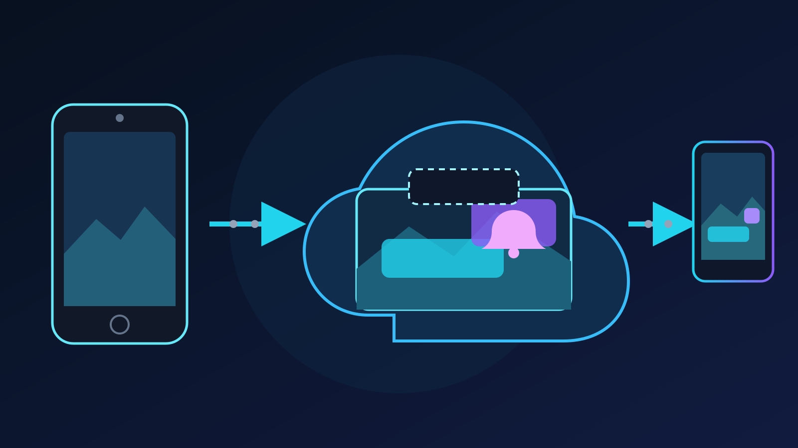

Twitchin ajantasainen
[mobiililähetysohje](https://help.twitch.tv/s/article/mobile-game-broadcasting)
vastaa yleiseen kysymykseen suoraan: Twitchin oma mobiililähetys ei tue
grafiikkakerroksia. Twitchin laajempi
[mobiilistriimauksen opas](https://help.twitch.tv/s/article/getting-started-on-twitch)
ohjaa siksi sovelluksiin, joissa on kohtauksia, hälytyksiä ja web-grafiikoita.

IRL-striimaajan pitää siis valita, missä valmis ohjelma rakennetaan. Koko
ohjelman voi tehdä puhelimessa, OBS:n voi pitää käynnissä tai puhelimen ja
alustan väliin voi lisätä kevyemmän compositorin. **VISP Cloud Studio käyttää
kolmatta reittiä.** Puhelin lähettää yhden kamerasyötteen VISPille. Cloud Studio
lisää valitut kuvakerrokset, ja VISP Direct lähettää tallennetun ohjelman
Twitchiin, Kickiin, YouTubeen tai omaan kohteeseen.

Kotona ei tarvitse olla käynnissä tietokonetta. Cloud Studion pitää kuitenkin
olla käytössä omassa VISP-ympäristössäsi. Jos hallintapaneelissa ei näy **Open
Studio** -painiketta, käytä puhelimessa tuotantosovellusta tai pidä OBS reitillä.

## Mitä Cloud Studio muuttaa?

Ilman compositoria VISP Direct vastaanottaa puhelimen H.264- ja AAC-syötteen ja
tekee jokaiselle kohteelle erillisen alustakoodauksen. Kamerakuva on samalla
valmis ohjelma.

Cloud Studio lisää yhden koostamisvaiheen ennen kohdekoodauksia:

1. Puhelin kuvaa kameran ja mikrofonin sekä lähettää yhden SRT-syötteen.
2. Cloud Studio käyttää kamerakuvaa 1920×1080-pohjakankaana.
3. Se asettaa aktiivisen kohtauksen teksti-, PNG-, selain- ja hälytyskerrokset
   kamerakuvan päälle.
4. Se säilyttää kameran äänen ja koodaa sen stereo-AAC:ksi. Cloud Studio ei
   miksaa muita äänilähteitä.
5. Direct tekee jokaiselle valitulle kohteelle oman lähdön.

Puhelin lähettää edelleen vain yhden syötteen, vaikka valitset useita alustoja.
Jokainen kohde käyttää edelleen yhden Direct-paikan ja relayn suoritintehoa.
Cloud Studio ei poista koodausta. Se siirtää visuaalisen koostamisen pois
puhelimesta ja poistaa kotona olevan OBS-koneen tarpeen.

## Tunne rajat ennen rakentamista

OBS tukee monia lähdetyyppejä, suodattimia, lisäosia, ääniväyliä, paikallista
tallennusta ja useiden kameroiden leikkausta. Virallinen
[OBS Sources Guide](https://obsproject.com/kb/sources-guide) näyttää, kuinka
paljon kameran ja grafiikan yhdistelmää laajemmaksi OBS-tuotanto voi kasvaa.

Cloud Studio ratkaisee tarkoituksella pienemmän tehtävän:

| Tarve | Cloud Studion tuki |
| --- | --- |
| Teksti kamerakuvan päällä | Kyllä |
| Läpinäkyvä grafiikka tai sponsorimerkki | PNG, enintään 10 Mt |
| Web-pohjainen tila tai kevyt grafiikka | Julkinen HTTPS-selainlähde |
| Seuraaja-, tilaus- tai lahjoitushälytys | Yksi VISP-hälytyskerros |
| Kohtausten vaihto | Enintään kolme kohtausta, leikkaus tai häivytys |
| Kerrosten järjestys ja sijoittelu | Enintään kahdeksan kerrosta kohtauksessa |
| Valmiin ohjelman paikallinen tallennus | Ei |
| Lisämikrofonien tai musiikin miksaus | Ei |
| OBS-lisäosat, uusinnat tai useiden kameroiden miksaus | Ei |

Koko Studiossa voi olla enintään kaksi selainlähdettä ja yksi hälytyskerros.
Rajat koskevat kaikkia kohtauksia yhteensä. Niitä ei saa jokaiseen kohtaukseen
erikseen. Rajat pitävät relayn compositorin toiminnan ennakoitavana. Jos
lähetys tarvitsee enemmän, OBS tai pilvessä toimiva OBS-palvelu sopii paremmin.

## Rakenna ensimmäiseen kohtaukseen yksi hyödyllinen grafiikka

Aloita pienemmästä kokonaisuudesta kuin ensin suunnittelit. Kamerakohtaus, yksi
PNG ja yksi hälytys riittävät koko reitin todentamiseen.

1. Kirjaudu VISPiin ja tee puhelimen tavallinen Direct-käyttöönotto loppuun.
2. Valtuuta testattavat alustakohteet.
3. Avaa hallintapaneeli ja valitse Direct-tuotantotavaksi **Cloud Studio**.
4. Valitse **Open Studio**. Puhelinsovelluksen **Edit on web** avaa saman
   kirjautuneen editorin.
5. Luo **Main**-niminen kohtaus.
6. Valitse **Add source → PNG overlay** ja lähetä enintään 10 Mt:n kokoinen
   läpinäkyvä PNG-kuva.
7. Valitse kerros ja määritä sen sijainti, leveys ja korkeus. Korjaa pinoamisjärjestys
   komennoilla **Move forward** ja **Move backward**.
8. Valitse **Save**.

Tallentaminen on olennainen vaihe. Editorissa muutokset pysyvät luonnoksena,
kunnes tallennat ne. Direct käyttää viimeksi tallennettua ohjelmaa myös silloin,
kun käynnistät lähetyksen myöhemmin puhelimesta. Editorista poistuminen
tallentamatta ei muuta live-kuvaa.

Käytä esikatseluita eri tarkoituksiin. **Camera ingest** näyttää puhelimesta
saapuneen kuvan. **Program** näyttää valmiin koosteen. Jos ensimmäinen on kunnossa
ja toinen ei, pysy Studiossa ja tarkista kerrokset. Jos molemmat ovat väärin,
tarkista ensin puhelin ja kuvalähteen asetukset.

## Käsittele selainlähteitä tilannekuvina

OBS Browser Source ajaa verkkosivua OBS:n sisällä. Virallinen
[Browser Source -ohje](https://obsproject.com/kb/browser-source) kuvaa jatkuvasti
toimivan selaimen sekä sen ääni-, käyttöoikeus-, päivitys- ja CSS-asetukset.

Cloud Studion selainlähde on rajatumpi. Se avaa julkisen HTTPS-sivun eristetyssä
selaimessa, tallentaa renderöidyn kerroksen kuvaksi ja päivittää kuvan noin
viiden sekunnin välein. Tämä sopii tulostauluun, aikatauluun, staattiseen
sponsoripaneeliin tai hitaasti muuttuvaan tilasivuun. Se ei sovi videolle,
äänelle, nopealle animaatiolle tai sekunnintarkalle laskurille.

Osoitteen pitää käyttää HTTPS:ää ja ratketa julkiseen verkko-osoitteeseen. Cloud
Studio hylkää URL-osoitteeseen upotetut tunnukset, localhostin, paikalliset
isäntänimet ja yksityiset verkko-osoitteet. Älä liitä editoriin hallintapaneelin
osoitetta, jossa on tilitunnus. Julkaise sitä varten vain katseluun tarkoitettu
grafiikkasivu.

Jos selainkerros epäonnistuu, Studio ohittaa kerroksen kameran ohjelmaa
lopettamatta. Editori merkitsee lähteen epäonnistuneeksi, jotta voit vaihtaa tai
piilottaa sen. Testaa täsmälleen sama julkinen osoite ennen tapahtumaa. Varmista
myös, ettei sivu jää tyhjäksi ilman evästettä tai kirjautunutta selainistuntoa.

## Lisää hälytykset polttamatta chattia kuvaan

Lisää yksi hälytyskerros valinnalla **Add source → VISP alert**. Valitse
seuraaja-, tilaus- tai lahjoitustapahtuma ja aseta hälytys kuten mikä tahansa
kuvakerros. VISP ryhmittelee tuetut alustatapahtumat näihin kolmeen ryhmään.
Hälytysteksti näkyy kymmenen sekuntia.

Tämä ei ole sama asia kuin yhdistetyn chatin näyttäminen jokaisella alustalla.
Hälytys on lyhyt tapahtumakortti. Chat-grafiikka on jatkuva viestivirta, joka voi
tuoda monilähetykseen alustan sääntöihin tai moderointiin liittyviä ongelmia.
Jos vain kentällä oleva kuvaaja tarvitsee viestit, käytä
[chatin tekstistä puheeksi -opasta](/blog/twitch-kick-chat-text-to-speech) sen
sijaan, että lisäät chatin julkiseen ohjelmaan.

Lähetä oikea testihälytys ennen liveä. Kerros voi olla oikeassa kohdassa, vaikka
tapahtumia tarjoava tililiitäntä puuttuu tai sen oikeus on vanhentunut.
Kuvaeditori ei yksin todista alustayhteyttä.

## Tee toisesta kohtauksesta oikea varavaihtoehto

Cloud Studio tukee enintään kolmea kohtausta. Hyödyllinen ensimmäinen pari on:

- **Main**, jossa kamera ja tavallinen kulmagrafiikka näkyvät.
- **Low signal**, jossa on lyhyt tekstirivi ja vähemmän grafiikkaa.

Valitse **Cut**, kun vaihdon pitää tapahtua heti. **Fade** tekee puolen sekunnin
häivytyksen. Pidä molemmat kohtaukset samalla 1920×1080-pohjakankaalla.
Kun valitset **Save**, kohtauksen vaihto päivittää Direct-ohjelman. Editori ei
ole paikallinen, viiveetön videomikseri. Katso **Program**-esikatselua ja tarkista
julkinen kanava toisella mykistetyllä laitteella.

Älä sekoita Studio-kohtausta VISPin kuvalähteen katoamisen varatoimintoon.
Studio-kohtaus tarvitsee edelleen puhelimen syötteen. Jos puhelin katoaa kokonaan
ja **Never drop again** on käytössä, Direct pitää alustalähdön käynnissä
BRB-toiminnolla. [Heikon mobiiliverkon opas](/blog/keep-stream-live-bad-mobile-network)
selittää, miksi SRT-palautus, uudelleenyhdistäminen ja varasisältö ovat edelleen
eri osia luotettavaa lähetystä.

## Varaudu pelkkään kamerakuvaan palaamiseen

Cloud Studio palaa vikatilanteessa yksinkertaisempaan ohjelmaan. Jos compositor
ei ole toimintakunnossa, Direct näyttää puhelimen kamerasyötteen ja yrittää
palauttaa tallennetun Studio-ohjelman. Tallennetut kohtaukset säilyvät.

Pelkkä kamerakuva on koko lähetyksen katkeamista turvallisempi vika, mutta
katsojille näkyvä kuva muuttuu. Älä sijoita turvallisuuden kannalta tarpeellista
tietoa vain grafiikkaan. Älä myöskään luota sponsorikuvan peittävän kameran
yksityistä sisältöä. Oleta, että puhdas kamerakuva voi tulla julkiseksi milloin
tahansa.

Tee yksi harjoitus, joka todistaa palautumisen:

1. Käynnistä puhelin, Cloud Studio ja yksi alustalähtö.
2. Tarkista kamerasyöte, Studio-ohjelma ja julkinen kanava.
3. Vaihda kohtausta ja tallenna yksi muutos liven aikana.
4. Piilota yksi kerros ja palauta se.
5. Katkaise puhelimen yhteys niin pitkäksi aikaa, että valitsemasi BRB-toiminto
   käynnistyy.
6. Yhdistä uudelleen ja varmista kameran, grafiikoiden, äänen ja hälytysten
   palautuminen.

[VISP Directin dokumentaatio](https://docs.visp-stream.com/fi/docs/direct-output)
sisältää Cloud Studion ajantasaiset ohjaimet, rajat ja vikatilanteet.
[Puhelinsovelluksen dokumentaatio](https://docs.visp-stream.com/fi/docs/phone-app)
kattaa kuvalähteen asetukset.

Cloud Studio sopii väliin, kun puhelimella tehtävä IRL-lähetys tarvitsee muutaman
kohtauksen ja grafiikan, mutta täysi OBS-kone lisäisi tarpeetonta ylläpitoa. Jos
tämä vastaa omaa tuotantoasi, [kokeile VISPiä](https://visp-stream.com/fi),
rakenna yksi pieni kohtaus ja testaa paluu pelkkään kamerakuvaan ennen seuraavaa
julkista lähetystä.
