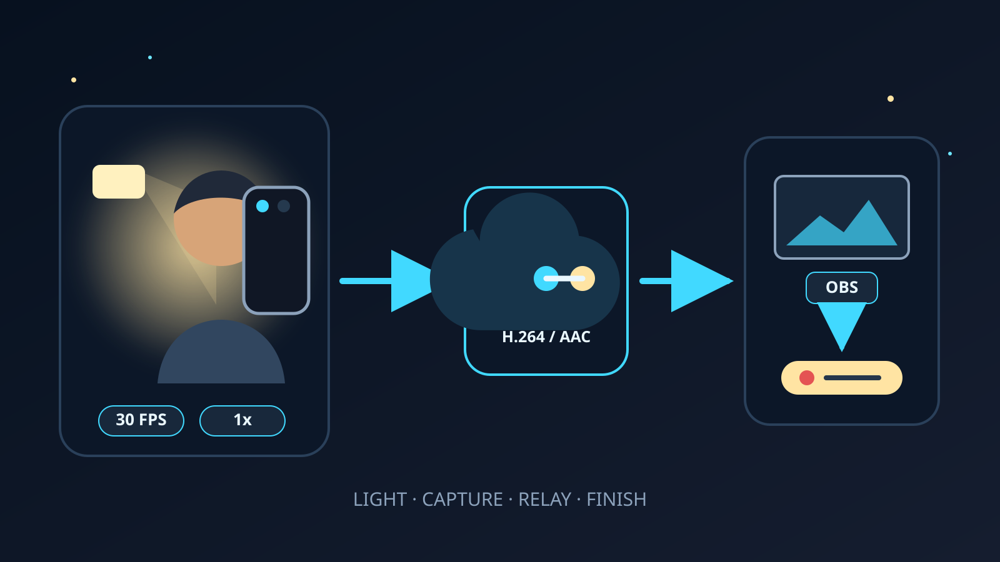

A phone can make a good Twitch or Kick IRL stream after dark, but night video
punishes the wrong setting quickly. Fast frame rates leave less time for each
frame. A dark, noisy picture is harder to compress. Digital brightening can
turn that noise into gray mush without restoring any missing detail.

The useful starting point is simple: **add a little light, use the rear 1x
camera, select 30 FPS, and keep the bitrate conservative enough for the real
mobile route.** Test the public stream after sunset, not just the preview in a
bright room.

## The short answer

Start with these settings in the VISP phone app:

| Setting | Night starting point | Change it when |
| --- | --- | --- |
| Camera | Rear camera at 1x | Another reported lens wins a side-by-side test |
| Frame rate | 30 FPS | Use 60 only for fast action in genuinely good light |
| Resolution | 720p for uncertain cellular, 1080p for a proven route | The connection or final viewing test supports the higher format |
| Stabilization | On when VISP shows support and you are walking | Turn it off on a tripod or if the low-light test is cleaner without it |
| Light | Small diffused light near the phone | Move or soften it if faces clip or glasses reflect it |
| OBS correction | Small gamma or brightness adjustment | Stop when noise and compression blocks become more visible |

VISP currently exposes the camera, resolution, frame rate, device-reported
zoom levels, and supported image stabilization. It does not expose manual
shutter speed, ISO, white-balance lock, or a torch control. That boundary is
visible in the [phone app documentation](https://docs.visp-stream.com/docs/phone-app)
and the open-source [camera capability model](https://github.com/PohinaGroup/visp/blob/main/apps/native/modules/visp-srt/src/VispSrt.types.ts).

## Add light before adding bitrate

The best night-stream setting is often a light, not another encoder option. A
small diffused LED close to the phone can light a face while streetlights and
signs keep the location recognizable. It does not need to turn the pavement
into daytime. It only needs to give the camera a clean subject to expose.

Mount the light close to the phone but slightly above or to one side of the
lens. That angle is usually kinder to faces than a bare light pointed straight
forward. If the subject wears glasses, move the light until its reflection
leaves the lenses. Keep brightness low enough that skin retains detail.

Run one comparison with the light off and one with it on. Watch the resulting
Twitch or Kick stream at normal player size. The phone preview can hide noise
and compression damage because it is small and bright. The public encode is
the result viewers get.

Clean the camera glass before the test. Kick's current [mobile quality
guide](https://help.kick.com/en/articles/15159752-settings-and-stream-quality-on-the-kick-go-live-app)
includes a clean lens in its blurry-picture troubleshooting, and Apple advises
[cleaning front and rear camera lenses with a microfiber
cloth](https://support.apple.com/102514) when images look blurred. Grease around
point lights creates haze that no bitrate setting fixes.

## Start with the rear 1x camera

Open **Settings > Camera** while the VISP stream is stopped. Pick the rear
camera and start at 1x. This is a baseline, not a promise that every phone's 1x
lens beats every other lens. Phones have different sensors, apertures, and
processing, so the final choice belongs to a recorded comparison on the actual
device.

Avoid zooming merely to make a person larger. Move closer when it is safe. If
VISP lists 0.5x, 1x, 2x, or other levels, those are the levels the device
reports through its native camera system. The iOS and Android implementations
derive the choices from the available cameras and zoom ranges rather than
inventing a generic list. See the [iOS camera
implementation](https://github.com/PohinaGroup/visp/blob/main/apps/native/modules/visp-srt/ios/VispSrtView.swift)
and [Android camera
implementation](https://github.com/PohinaGroup/visp/blob/main/apps/native/modules/visp-srt/android/VispSrt.kt).

Test the front camera separately if the streamer needs to see the screen while
walking. Convenience may matter more than a small image-quality gain. Keep the
camera that produces the cleaner public stream without making the operator
miss chat, framing, traffic, or hazards.

## Select 30 FPS for the capture

Thirty FPS is the useful night default. Apple says its Camera app can improve
low-light video by automatically reducing frame rate to 24 FPS. Kick recommends
30 FPS for most IRL streams and reserves 60 FPS for fast motion. Both pieces of
guidance point to the same tradeoff: more frames are not free when light is
scarce.

VISP configures native streaming with the selected frame rate. On iOS it sets
the minimum and maximum active frame duration to the chosen value. On Android
it checks the rate against both camera and H.264 encoder capabilities, then
passes that rate into stream preparation. The phone's Camera-app-only
low-light modes should not be treated as VISP streaming controls.

Choose 60 FPS only when the subject is fast, the scene is well lit, and the
complete stream looks better after a long test. The [30 FPS versus 60 FPS
guide](/blog/30-vs-60-fps-irl-streaming) covers the motion, heat, bandwidth,
and OBS output tradeoffs in more detail.

## Match resolution and bitrate to the route

Low light is not a reason to push the phone to its highest resolution. Start
at 720p30 on uncertain cellular. Try 1080p30 after the route holds a stable
720p test and the extra detail survives the public platform encode.

VISP's native app sets a bitrate ceiling for the chosen format and adjusts the
target from live link conditions. The live display reports bitrate, round-trip
time, and packet loss. Use those numbers to diagnose the phone-to-relay leg.
They do not prove that OBS, Twitch, or Kick is healthy after that checkpoint.

Do not raise bitrate until the dark picture looks clean. More bits can preserve
more of the captured signal, but they cannot add light or recover detail the
camera never captured. A higher target can also make a cellular stream less
stable. The [IRL bitrate guide](/blog/best-bitrate-irl-streaming-phone-obs)
starts at about 2,500 kbps for 720p30 on cellular and explains how to test the
phone and home connections separately.

## Test stabilization with the exact night setup

Keep image stabilization on for a walking stream when VISP offers it for the
selected camera, resolution, and frame rate. The app only shows the active
state for combinations the device reports as supported. Kick also recommends
stabilization for walking and notes that stabilization can crop the picture
slightly.

Low-light behavior still varies by phone. Record the same short walk with
stabilization on and off. Compare face detail, motion, crop, and bright point
lights in the public stream. On a tripod or fixed mount, turn stabilization off
unless the test shows a benefit.

Do not trade away a stable 30 FPS mode just to force a shakier 60 FPS option.
If walking motion is the main problem, follow the [phone stabilization
guide](/blog/stabilize-shaky-phone-irl-stream-obs) after the lighting and frame
rate are settled.

## Know which phone camera features do not carry into a live app

The built-in Camera app can advertise impressive night features, but a live
publisher is a different capture path. Apple's Auto FPS guidance describes the
iPhone Camera app. VISP explicitly fixes the selected streaming frame rate.

Google's [Pixel Video Boost
documentation](https://support.google.com/pixelcamera/answer/14257322?hl=en)
says the phone records a temporary file, uploads it to Google Photos, and waits
for cloud processing before the boosted version is ready. That can improve a
recorded clip, but it cannot process a Twitch or Kick frame that is already
being sent live.

Judge VISP by its own preview, relay feed, and public output. Do not assume that
a Night mode photo, a boosted gallery video, or a manufacturer demo describes
what a third-party live capture session will produce.

## Use OBS correction as a finishing step

If the phone feeds a home OBS studio, right-click the phone source, open
**Filters**, and add **Color Correction**. OBS documents gamma, contrast,
brightness, saturation, hue, and color controls for that filter.

Make one small adjustment at a time. A slight gamma lift may make a face easier
to read. Too much brightness lifts the dark noise too, and aggressive
contrast can crush the little shadow detail that remains. Toggle the filter off
and on while watching the program output, not only the source preview.

OBS receives the H.264/AAC contribution that the VISP relay forwards. The
normal relay path does not transcode or denoise it. With VISP Direct, the relay
makes a separate distribution encode for the selected destination, but that
encode still cannot reconstruct missing capture detail. Fix the light and
camera choice first. Grade the usable picture last.

## Run an after-dark rehearsal

Use the same phone, mount, light, route, and mobile connection planned for the
real stream. A useful rehearsal takes at least 15 minutes and includes the
brightest sign, darkest street, and fastest walking section on the route.

1. Clean the lens and start with the rear 1x camera at 720p30.
2. Set the portable light to its lowest useful level.
3. Walk from a bright area into the darkest expected section.
4. Watch VISP bitrate, RTT, packet loss, reconnects, temperature, and battery.
5. Check the advancing picture in OBS, if used.
6. Watch the public Twitch or Kick stream from a muted second connection.
7. Change one variable, such as camera, light level, resolution, or
   stabilization, then repeat the same section.

Keep the setting that survives transitions. A night stream rarely stays at one
brightness. Storefronts, vehicle lights, dark parks, and indoor entrances make
the automatic camera react. The winner is the setup that stays watchable while
those conditions change, not the one frame that looks best under a lamp.

## Frequently asked questions

### Should I use 60 FPS for a night IRL stream?

Usually no. Start at 30 FPS. Keep 60 only for fast action when a well-lit,
full-route test shows a clear motion benefit without worse noise, heat, or
network stability.

### Should I raise bitrate when the stream looks dark?

No. Bitrate does not brighten the scene. Add or reposition light, choose the
cleaner camera, and use 30 FPS first. Raise bitrate only when the route has
margin and compression damage remains in an otherwise clean capture.

### Can OBS fix a noisy phone picture?

OBS can change gamma, brightness, contrast, and color. It cannot recover detail
that the phone did not capture. Large corrections often make noise and blocks
more obvious.

### Does iPhone Auto FPS work in VISP?

VISP's current iOS capture implementation fixes the stream to the selected
frame rate. Choose 30 FPS in VISP for the night test rather than relying on the
Camera app's Auto FPS behavior.

### Does Pixel Video Boost improve a live Twitch or Kick stream?

No. Google documents Video Boost as a recorded-file workflow that uses Google
Photos and cloud processing. It is not a live third-party camera effect.

## Sources and next steps

- [VISP phone app settings](https://docs.visp-stream.com/docs/phone-app)
- [VISP camera settings implementation](https://github.com/PohinaGroup/visp/blob/main/apps/native/src/lib/camera-settings.ts)
- [VISP native camera capability model](https://github.com/PohinaGroup/visp/blob/main/apps/native/modules/visp-srt/src/VispSrt.types.ts)
- [Apple iPhone video recording settings](https://support.apple.com/en-euro/guide/iphone/iphc1827d32f/ios)
- [Google Pixel Video Boost](https://support.google.com/pixelcamera/answer/14257322?hl=en)
- [Kick mobile stream quality](https://help.kick.com/en/articles/15159752-settings-and-stream-quality-on-the-kick-go-live-app)
- [OBS Color Correction filter](https://obsproject.com/kb/color-correction-filter)

If you want to test these settings on a repeatable phone-to-studio path, [try
VISP](https://visp-stream.com), begin with a little light and 30 FPS, then keep
only the changes that improve the public Twitch or Kick stream.
