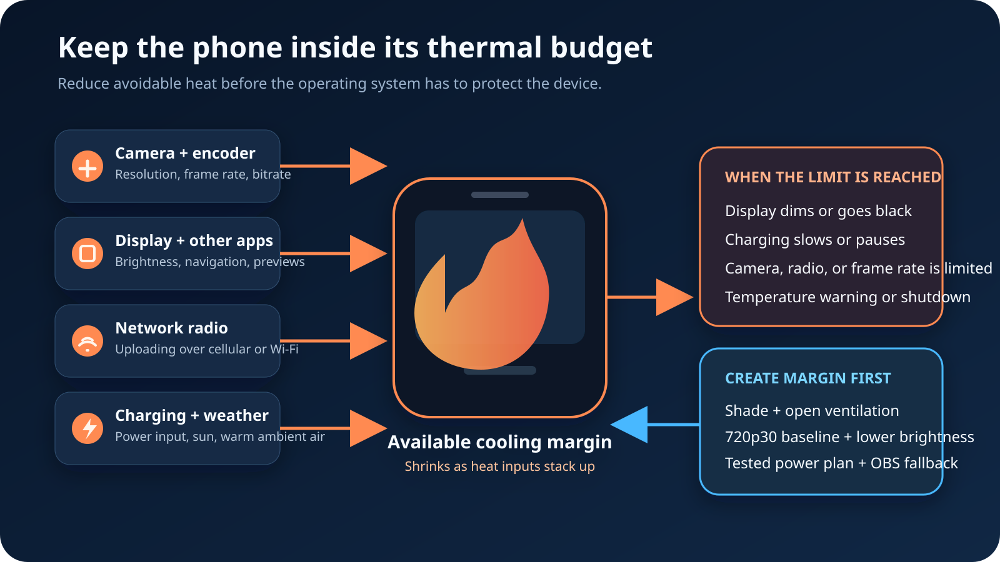

Jos puhelin ylikuumenee lähettäessään IRL-kameraa OBS:ään, korjaa koko
**lämpöbudjetti** äläkä yhtä mystistä asetusta. Aloita 720p30-kuvalla, pidä
puhelin varjossa ja ilmavasti, laske näytön kirkkautta, vältä muiden raskaiden
tehtävien ajamista samalla laitteella ja testaa lataussuunnitelma koko
lähetyksen pituisella harjoituksella. Valmistele OBS:ään paikallinen
varakohtaus, jotta voit pysäyttää kameran turvallisesti, jos käyttöjärjestelmä
antaa lämpötilavaroituksen.

Lämmin puhelin ei vielä tarkoita vikaa. Applen mukaan kamerasovellukset,
korkealaatuisen videon suoratoisto ja langaton lataus voivat lämmittää iPhonea
normaalisti. Google mainitsee Pixelin lämpenemisen syiksi muun muassa
teräväpiirtovideon tallentamisen, suuren datamäärän lähettämisen, mobiilidatan
käytön ja näiden tehtävien tekemisen latauksen aikana. Tuotanto-ongelma alkaa,
kun laite joutuu suojaamaan itseään rajoittamalla latausta, suorituskykyä,
kameraa, näyttöä tai verkkoyhteyttä.

## Ymmärrä, mitä puhelin tekee

Tavallisessa VISPistä OBS:ään kulkevassa työnkulussa kenttäpuhelin tekee
edelleen ensimmäisen videoenkoodauksen. VISP-sovellus tallentaa valitun kameran
ja mikrofonin, enkoodaa H.264-videon ja AAC-äänen sekä lähettää yhden
kuvalähdesyötteen SRT:llä. Relay tunnistaa ja välittää syötteen. OBS purkaa sen,
rakentaa lopullisen ohjelman ja lähettää Twitch- tai Kick-lähetyksen
kotitietokoneelta.

Näin OBS-kohtaukset, selainlähteet, hälytykset, tallennus ja alustan
lähetysavain pysyvät poissa puhelimesta. Kameran käyttäminen ei silti muutu
ilmaiseksi. Ulkolähetyksessä sama laite voi:

- käyttää kameraa ja laitteistopohjaista videoenkooderia jatkuvasti;
- pitää kirkkaan esikatselun ja chatin näkyvissä;
- lähettää kuvalähdesyötettä mobiiliradion kautta;
- ajaa karttaa, Bluetooth-ääntä tai muuta tuotantosovellusta;
- latautua varavirtalähteestä;
- vastaanottaa lämpöä auringosta ja lämpimästä ilmasta.

Jokainen tehtävä voi toimia yksin. Lämpö muuttuu ongelmaksi, kun ne yhdessä
tuottavat sitä nopeammin kuin puhelin pystyy luovuttamaan sitä ympäristöön.

Applen ajantasainen
[lämpötilaohje](https://support.apple.com/fi-fi/118431) kuvaa laitteen
suojatoimet: lataus voi hidastua tai pysähtyä, näyttö himmentyä tai sammua,
mobiilisignaali heiketä radioiden siirtyessä virransäästötilaan, kameratoiminnot
poistua käytöstä ja kuvataajuus laskea. Googlen
[Pixelin lämpöohje](https://support.google.com/pixelphone/answer/3333708?hl=fi)
kertoo vastaavasti, että kuuma puhelin voi rajoittaa suorittimen ja latauksen
tehoa, poistaa kameran käytöstä, rajoittaa mobiilidataa tai Wi-Fiä, siirtyä
virransäästötilaan tai sammua.

Nämä ovat turvatoimintoja. Älä yritä kiertää niitä kesken lähetyksen.

## Aloita viileämmästä kuvamuodosta

Käytä pienintä tuotannon tarpeet täyttävää kuvamuotoa ja nosta asetuksia vasta
koko lähetyksen pituisen testin jälkeen. VISP-puhelinsovellus suosii
**720p-kuvaa 30 ruudulla sekunnissa**, kun valittu kamera tukee sitä. Se on
hyvä IRL-lähtötaso: kamera ja enkooderi käsittelevät vähemmän pikseleitä ja
ruutuja kuin 1080p60-kuvassa, mutta OBS voi silti sijoittaa syötteen tavalliseen
kohtaukseen.

Älä nosta tarkkuutta, kuvataajuutta ja bittinopeutta yhdellä kertaa. Muuta yhtä
arvoa, käytä puhelinta suunnitellun ohjelmaosuuden ajan ja seuraa laitteen
vakautta. Kymmenen minuutin sisätesti ei todista, että kahden tunnin kävely
iltapäivän auringossa toimii.

Etene tässä järjestyksessä:

1. aloita 720p30-kuvasta;
2. valitse bittinopeus, jonka oikea kenttäyhteys jaksaa lähettää reservin kanssa;
3. testaa liike, pienet yksityiskohdat ja rajaus OBS:ssä;
4. nosta tarkkuutta vain, jos kuva todella tarvitsee sitä;
5. testaa uusi asetus ulkona koko suunnitellun lähetyksen ajan.

Pelkkä bittinopeuden laskeminen ei varmasti ratkaise lämpöä kaikissa
puhelimissa. Kameran tallennus, skaalaus, kuvataajuus, näytön kirkkaus, radiot,
ympäristön lämpötila ja lataus jäävät edelleen osaksi budjettia. Käsittele joka
muutosta mitattuna kokeena, älä yleispätevänä ihmeratkaisuna.

[Mobiilin IRL-bittinopeusopas](/fi/blog/best-bitrate-irl-streaming-phone-obs)
auttaa valitsemaan kuvalähteen asetuksen sekoittamatta sitä OBS:n erilliseen
Twitch- tai Kick-ulostuloon.

## Suojaa suoralta lämmöltä ja päästä lämmin ilma pois

Varjo on arvokkain fyysinen muutos, koska se poistaa ulkoisen lämmönlähteen
heikentämättä kuvaa. Sijoita kuvaaja, teline tai pieni aurinkosuoja niin, ettei
puhelimen runko ole suorassa auringossa. Älä jätä laitetta otosten välissä
auringon kuumentamaa ikkunaa tai auton kojelautaa vasten äläkä tummaan
suljettuun laukkuun.

Apple ilmoittaa iPhonen ympäristön käyttölämpötilaksi 0–35 °C ja varoittaa,
että kameran pitkä käyttö kuumissa oloissa tai suorassa auringossa voi muuttaa
laitteen toimintaa. Myös Google kehottaa pitämään Pixelin poissa suorasta
auringosta sekä suljetuista tai huonosti ilmastoiduista paikoista.

Rakenna kuvauspaketti ilmankierron ehdoilla:

- jätä puhelimen tausta ja reunat avoimiksi äläkä paina niitä kangasta vasten;
- älä kääri puhelinta ja varavirtalähdettä samaan eristävään taskuun;
- pidä varavirtalähde erillään, jotta sen lämpö ei siirry puhelimeen;
- varmista, ettei pidike peitä koko takapintaa;
- testaa lopullinen kuvauspaketti, ei paljasta puhelinta pöydällä.

Tarkoitukseen tehty pidike voi olla turvallisempi kuin tiivis itse rakennettu
sadesuoja. Jos sateensuoja on välttämätön, huomioi sen heikentämä ilmanvaihto
ja testaa kokonaisuus samoissa sää- ja latausoloissa.

## Vähennä näytön ja muiden sovellusten kuormaa

Esikatselun ei tarvitse olla varjossa täydellä kirkkaudella. Laske kirkkautta,
kunnes kuvaaja näkee edelleen rajauksen, tilan ja chatin turvallisesti. Google
suosittelee nimenomaan näytön kirkkauden vähentämistä liian lämpimässä
Pixelissä.

Poista myös vältettävissä oleva etualan työ. Älä toista julkista Twitch- tai
Kick-lähetystä samalla puhelimella vain varmistaaksesi OBS:n olevan suorassa
lähetyksessä. Se lisää videon purkamista ja latausliikennettä laitteeseen, joka
jo kuvaa ja lähettää. Käytä kamerapuhelimessa VISPin lähetyksen tilaa ja
chattia. Tarkista julkinen ohjelma mahdollisuuksien mukaan toisella mykistetyllä
laitteella.

Navigointi voi olla IRL-lähetyksessä välttämätöntä, mutta se kuuluu silti
lämpöbudjettiin. Applen ohje mainitsee pitkän GPS-navigoinnin kuumissa oloissa.
Jos reitti tarvitsee karttaa, testaa kamera, navigointi, näytön kirkkaus,
Bluetooth ja lataus yhdessä. Yksittäisten sovellusten erilliset testit eivät
todista lopullisen kokonaisuuden toimintaa.

## Käsittele latausta yhtenä lämmönlähteenä

Varavirtalähde ratkaisee käyttöajan, ei jäähdytystä. Lataus tuottaa lisää
lämpöä samaan aikaan, kun puhelin kuvaa ja lähettää. Apple listaa langattoman
latauksen normaaliksi lämpenemisen syyksi. Google nostaa esiin paljon resursseja
käyttävien toimintojen ajamisen latauksen aikana ja kehottaa irrottamaan liian
kuuman puhelimen virtalähteestä.

Tee käytännöllinen virtasuunnitelma:

1. aloita täydellä tai lähes täydellä akulla sen sijaan, että puhelin yrittää
   ladata lähes tyhjää akkua nopeasti kesken ohjelman;
2. käytä laitteelle sopivaa, toimivaksi testattua kaapelia ja laturia;
3. pidä varavirtalähde fyysisesti erillään puhelimesta;
4. harjoittele latauksen aikana, sillä pelkällä akulla tehty testi todistaa eri
   kokonaisuuden;
5. seuraa latauksen keskeytymisestä tai lämpötilasta kertovia ilmoituksia;
6. jos laite ilmoittaa liiallisesta lämmöstä, vaihda varakohtaukseen, pysäytä
   kamera, irrota lataus, siirrä puhelin viileämpään varjoon ja anna sen jäähtyä.

Älä lupaa keskeytyksetöntä ohjelmaa pakottamalla puhelinta latautumaan. Apple ja
Google kuvaavat latauksen rajoittamisen osaksi laitteen lämpösuojausta. Sen
kunnioittaminen on turvallisempaa kuin käynnissä olevan otoksen suojeleminen.

## Erota lämpö huonosta verkkoyhteydestä

Sekä kuumuus että verkon ruuhka voivat näyttää nykivänä etäkamerana, mutta
ensimmäiset tarkistukset ovat erilaiset.

| Oire | Tarkista ensin |
| --- | --- |
| Koko puhelin on kuuma, näyttö himmenee, lataus keskeytyy tai järjestelmä varoittaa | Pysäytä kamera ja jäähdytä laite |
| VISP näyttää kasvavaa pakettihävikkiä tai RTT-arvoa, mutta puhelin toimii muuten normaalisti | Laske bittinopeutta tai paranna reittiä |
| Kamera tai kuvataajuus rajoittuu pitkän lämpimän jakson jälkeen | Käsittele tilannetta lämpösuojauksena |
| OBS pudottaa ruutuja alustayhteydellä puhelinsyötteen pysyessä vakaana | Tutki OBS-kotiyhteyttä |
| Syöte katkeaa heti sovelluksen siirtyessä taustalle | Palaa VISP-sovellukseen ja pidä se aktiivisena |
| Puhelinsyöte pysähtyy, mutta OBS ja paikalliset lähteet toimivat | Näytä varakohtausta puhelimen palautumisen ajan |

Älä kasvata SRT-viivettä ratkaistaksesi kuumaa laitetta. SRT-viive antaa
uudelleen lähetetyille paketeille aikaa saapua. Se ei jäähdytä kameraa tai
enkooderia.
[VISPin enkooderiohje](https://docs.visp-stream.com/fi/docs/broadcaster-setup)
selittää, miten verkon palautumisikkuna säädetään mitatun meno-paluun perusteella.

## Harjoittele vika, älä vain onnistumista

Tee lämpöharjoitus ennen tärkeää Twitch- tai Kick-lähetystä:

1. kokoa täsmälleen oikea pidike, suojakuori, kaapeli, varavirtalähde,
   mikrofoni ja kuulokemikrofoni;
2. valitse 720p30 ja suunniteltu bittinopeus;
3. käynnistä puhelinsyöte ja vastaanota se OBS:ään;
4. käytä samaa chattia, karttaa ja Bluetooth-varustusta kuin lähetyksessä;
5. sijoita kokonaisuus varjoon todellisuutta vastaavassa lämpötilassa;
6. anna sen käydä vähintään suunnitellun ohjelmaosuuden ajan;
7. kirjaa näytön himmeneminen, latauksen muutokset, kameran nykiminen ja
   käyttöjärjestelmän varoitukset;
8. pysäytä ja käynnistä puhelinsyöte ja varmista saman OBS-lähteen palautuvan;
9. aiheuta yksi hallittu katkos ja varmista OBS:n vaihtavan paikalliseen
   varakohtaukseen;
10. säilytä viileimmät asetukset, joilla kuva on yhä riittävän hyvä.

VISPin luoma OBS-medialähde yhdistää samaan laitepolkuun uudelleen, kun puhelin
palaa. OBS:n kotilähetys voi pysyä käynnissä ja näyttää paikallista taulua,
studiokameraa, koostevideota tai muuta suunniteltua kohtausta.
[Heikon mobiiliverkon opas](/fi/blog/keep-stream-live-bad-mobile-network)
kattaa koko varakohtaus- ja uudelleenyhdistämistyönkulun.

## Toimi näin lämpötilavaroituksen aikana

Käsittele varoitusta pysäytysmerkkinä:

1. vaihda OBS paikalliseen varakohtaukseen;
2. pysäytä VISP-kameralähetys, jos käyttöliittymä toimii vielä;
3. irrota lataus;
4. siirrä puhelin pois auringosta viileämpään ja ilmavaan paikkaan;
5. anna sen jäähtyä ennen uudelleenkäynnistystä;
6. jatka pienemmällä kuvamuodolla tai vähemmillä samanaikaisilla tehtävillä;
7. varmista vakaa kuva ja ääni OBS:ssä ennen kuin palaat kameralähteeseen.

Apple kehottaa lämpötilavaroituksen saavaa käyttäjää sammuttamaan laitteen,
siirtämään sen viileämpään ympäristöön pois suorasta auringosta ja antamaan sen
jäähtyä. Google neuvoo vastaavasti irrottamaan liian kuuman puhelimen
virtalähteestä, siirtämään sen viileämpään ja lopettamaan käytön jäähtymisen
ajaksi. Noudata oman laitteen näyttämää ohjetta, älä suoran lähetyksen
oikotietä.

## Tiedä, mitä VISP muuttaa ja mitä ei

VISP pitää puhelimen kuvalähteenä ja siirtää lopullisen tuotannon OBS:ään.
Kenttäpuhelimen ei tarvitse renderöidä OBS-kohtauksia, selainhälytyksiä tai
alustan lopullista enkoodausta. Twitch- tai Kick-lähetysavain pysyy OBS:ssä.

Tavallisella relaysta OBS:ään kulkevalla polulla VISP **ei transkoodaa**
kuvalähdettä. Jos puhelin lähettää tarpeettoman raskasta kuvamuotoa, relay ei
muuta sitä viileämmäksi. Vaihda tarkkuus, kuvataajuus ja bittinopeus puhelimesta.

Relay **ei myöskään niputa verkkoyhteyksiä tai yhdistä niiden kapasiteettia
nopeammaksi lähetykseksi**. Natiivisovelluksen monilinkkinen redundanssitila voi
lähettää samoja SRT-paketteja Wi-Fi- ja mobiiliyhteydellä, mutta redundanssi ei
jäähdytä laitetta eikä yhdistä siirtokapasiteettia. Se voi lisätä radioiden
työtä ja datankäyttöä. Jätä se pois ensimmäisestä lämpötestistä ja testaa se
erikseen vain, jos reitti tarvitsee lisäsietoa.

Koko lähdeasetuksen löydät
[VISP-puhelinsovelluksen ohjeesta](https://docs.visp-stream.com/fi/docs/phone-app)
ja [puhelin etäkamerana -oppaasta](/fi/blog/use-phone-as-remote-camera-obs).

## Usein kysyttyä

### Onko puhelimen lämpeneminen lähetyksessä normaalia?

On. Jatkuva kameran käyttö, enkoodaus, verkkolähetys, näyttö ja lataus voivat
lämmittää laitetta. Toiminnan muuttuminen tai käyttöjärjestelmän varoitus on
selvä raja: näyttö himmenee, lataus keskeytyy, kamera tai radio rajoittuu,
suorituskyky laskee tai laite sammuu.

### Laskenko ensin bittinopeutta vai tarkkuutta?

Aloita kokonaisesta 720p30-lähtötasosta ja yhteyden kestämästä bittinopeudesta.
Tarkkuus ja kuvataajuus muuttavat kameran ja enkooderin työtä. Bittinopeus
muuttaa enkooderin tavoitetta ja verkkokuormaa. Lämpövaikutus vaihtelee
puhelimittain, joten muuta yhtä asetusta ja toista sama täyspitkä testi.

### Onko Wi-Fi aina mobiilidataa viileämpi?

Ei aina, mutta Google suosittelee Wi-Fiä mobiilidatan sijaan, jos liian lämpimän
Pixelin käyttötilanne sallii sen. Liikkuvassa IRL-lähetyksessä myös vakaus ja
peitto ratkaisevat. Testaa oikea radio, signaali ja reitti sen sijaan, että
päättelet lämpötilan verkkotyypin nimestä.

### Poistaako kameran lähettäminen OBS:ään ylikuumenemisen?

Se voi vähentää työtä verrattuna koko ohjelman rakentamiseen ja jakeluun
puhelimesta, sillä OBS hoitaa kohtaukset ja lopullisen ulostulon kotona.
Puhelin tallentaa, enkoodaa, näyttää ja lähettää kuvalähteensä edelleen, joten
se tarvitsee yhä lämpösuunnitelman.

### Voinko jatkaa lämpötilavaroituksen jälkeen?

Älä jatka. Vaihda OBS varakohtaukseen, noudata laitteen varoitusta, irrota virta
ohjeen mukaan ja anna puhelimen jäähtyä ennen uudelleenkäynnistystä.

## Lähteet ja seuraavat vaiheet

- [Apple: Jos iPhone tai iPad kuumenee tai kylmenee liikaa](https://support.apple.com/fi-fi/118431)
- [Google: Näin estät Pixel-puhelinta kuumenemasta liikaa](https://support.google.com/pixelphone/answer/3333708?hl=fi)
- [VISP-puhelin- ja selainsovellus](https://docs.visp-stream.com/fi/docs/phone-app)
- [VISP-enkooderit ja varakohtaus](https://docs.visp-stream.com/fi/docs/broadcaster-setup)

Jos haluat pitää puhelimen hallittuna kuvalähteenä ja Twitch- tai Kick-tuotannon
kotistudion OBS:ssä, [kokeile VISPiä](https://visp-stream.com/download), aloita
yllä olevasta 720p30-tasosta ja tee koko lämpöharjoitus ennen seuraavaa pitkää
ulkolähetystä.
