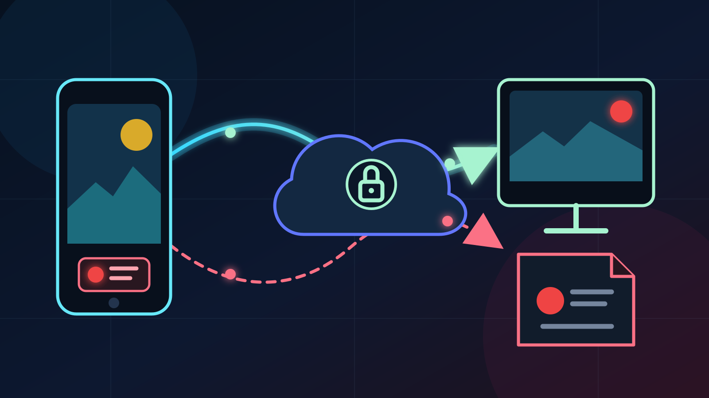

Voit tallentaa IRL-lähetyksen OBS:llä puhelimesta käsin näin: **lähetä
puhelinkamera kotikoneen OBS:ään, yhdistä VISP OBS -lisäosa ja lisää
tallennuspainike VISP OBS Remoteen.** Puhelin toimii ohjaimena. OBS kirjoittaa
tiedoston edelleen kotikoneelle.

Ero on tärkeä. Etäohjaimen punainen tallennusvalo ei tarkoita, että puhelin
tallentaisi toista kopiota. Se kertoo yhdistetyn OBS:n ilmoittaneen paikallisen
tallennuksen olevan käynnissä.

## Päätä ensin, mikä kuva pitää säilyttää

VISPissä on kaksi tuotantotapaa, joista syntyy erilainen paikallinen tallenne.

| Lähetyksen reitti | Mitä OBS voi tallentaa | Mitä tiedosto ei todista |
| --- | --- | --- |
| Puhelin → VISP → OBS → Twitch tai Kick | Valmiin OBS-ohjelman kohtauksineen, grafiikoineen ja miksattuine äänineen | Että alusta sai jokaisen kuvaruudun |
| Puhelin → VISP Direct → Twitch tai Kick, ja OBS lukee samalla syötettä | OBS:ään saapuvan alkuperäisen puhelinsyötteen | Directin jakeluenkoodausta tai Cloud Studio -ohjelmaa |

Kun OBS lähettää julkisen ohjelman, sen ohjelmatallenne on hyödyllinen
pääversio. Jos lähetyksestä vastaa [VISP Direct](/fi/blog/what-is-visp-direct),
OBS voi silti tallentaa alkuperäisen puhelinsyötteen. Tarkista alusta erikseen,
kun haluat varmistaa täsmälleen sen kuvan, jonka katsojat saivat.

VISP ei säilytä jatkuvaa pilvitallennetta. Tiedoston omistaa OBS, ja se jää
kohtaan **Settings → Output → Recording Path** määritetylle tietokoneelle.

## 1. Määritä tallennus OBS-koneella

Tee asetukset kotona ennen kuin kenttäkuvaaja lähtee.

1. Avaa OBS:stä **Settings → Output → Recording**.
2. Valitse tallennuskansio levyltä, jolla on riittävästi vapaata tilaa koko
   suunnitellulle lähetykselle.
3. Käytä MKV-muotoa, ellei testattu editointityönkulku vaadi muuta säiliötä.
4. Tee minuutin tallenne oikealla kohtauskokoelmalla ja äänimiksauksella.
5. Pysäytä tallennus, avaa tiedosto ja tarkista kuva, ääni ja synkronointi.

OBS suosittelee MKV:tä, koska keskeytynyt tallenne säilyy palautettavana. Jos
editointiohjelma tarvitsee MP4:n, käytä lähetyksen jälkeen toimintoa **File →
Remux Recordings** tai ota automaattinen muunnos käyttöön. OBS:n [virallinen
tallennusopas](https://obsproject.com/kb/standard-recording-output-guide)
kuvaa molemmat vaihtoehdot. Nykyiset OBS-versiot tukevat myös palautettavia
Hybrid MP4- ja Hybrid MOV -muotoja, mutta MKV on eri OBS-versioissa toimiva
tylsä ja turvallinen oletus.

Pidä ensimmäinen asetus yksinkertaisena. Erillinen tallennusenkooderi tai
laadukkaampi esiasetus voi lisätä kotikoneen kuormaa. Vaihda asetusta vasta,
kun realistinen testi osoittaa enkoodausvaran riittävän. Jos tarvitset oman
mikrofoniraidan tai musiikittoman editointiraidan, seuraa OBS:n [usean
ääniraidan ohjetta](https://obsproject.com/kb/advanced-recording-guide-and-multi-track-audio)
ja testaa tiedosto sillä editorilla, jota aiot käyttää.

## 2. Tuo puhelinsyöte OBS:ään

Tee [puhelimen ja OBS:n välinen asennus](/fi/blog/use-phone-as-remote-camera-obs)
ja lisää julkaisulaite oikeaan kohtaukseen VISP-lisäosalla. Relay välittää
puhelimen lähetyssyötteen OBS:ään transkoodaamatta sitä.

Tarkista paikallisesta testitallenteesta neljä asiaa:

- puhelimen kuva täyttää sille tarkoitetun alueen;
- puhelimen mikrofoni menee oikealle OBS-ääniraidalle;
- kotimikrofoni ja musiikki käyttävät oikeaa raitaa ja voimakkuutta;
- käsien taputus näyttää ja kuulostaa samanaikaiselta.

Jos Direct on käytössä puhelimella, älä lähetä OBS:stä samaan Twitch- tai
Kick-kohteeseen. OBS voi lukea ja tallentaa VISP-syötettä Directin julkaistessa,
mutta vain yhden pitää hallita kutakin alustalähtöä. [Directin
dokumentaatio](https://docs.visp-stream.com/fi/docs/direct-output) selittää
tämän rajan.

## 3. Yhdistä VISP OBS -lisäosa

Asenna VISP-lisäosa OBS-koneelle. Avaa sitten **Tools → VISP Remote Control** ja
valitse **Sign in with browser**. Hyväksy koodi samalla VISP-tilillä, jota
kenttäkuvaaja käyttää.

Lisäosa avaa todennetun yhteyden ulospäin. OBS WebSocket -porttia ei tarvitse
ohjata kotireitittimen läpi. [VISPin OBS-etäohjauksen
dokumentaatio](https://docs.visp-stream.com/fi/docs/obs-remote-control) kattaa
asennuksen, yhdistämisen ja tunnuksen uusimisen.

Yhdistäminen antaa ohjata OBS-instanssia. Se ei siirrä tallennuskansiota,
enkooderia tai tiedostoja VISPiin. Ne pysyvät OBS:n paikallisina asetuksina.

## 4. Lisää tallennuspainikkeet OBS Remoteen

Avaa kenttäpuhelimella
[remote.visp-stream.com](https://remote.visp-stream.com) ja kirjaudu samalla
VISP-tilillä. Etäohjaimessa pitää lukea **OBS ONLINE**, ennen kuin painikkeeseen
voi luottaa.

Valitse **EDIT** ja lisää tarvitsemasi ohjaimet:

| Painikkeen toiminto | Käyttötarkoitus | Tärkeä raja |
| --- | --- | --- |
| Toggle recording | OBS:n koko tallennuksen käynnistys tai pysäytys | Paikallisen lähdön virhe voi vaatia toimia tietokoneella |
| Pause recording | Suunnitellun tauon jättäminen pois samasta avoimesta tiedostosta | Ei käynnistä pysäytettyä tallennusta |
| Replay buffer | OBS:n jatkuvan replay bufferin käynnistys tai pysäytys | Leikkeen tallentamiseen tarvitaan edelleen paikallinen **Save Replay Buffer** -pikanäppäin |

Anna painikkeelle seurauksen kertova nimi, kuten **RECORD**. Painike vaihtaa
OBS:n yhtä tilaa, joten tarkista sen **REC**- tai **IDLE**-ilmaisin ennen uutta
napautusta.

VISPin nykyinen [OBS Remote
-toteutus](https://github.com/PohinaGroup/visp/blob/main/apps/obs-remote/src/app/index.tsx)
tarjoaa tallennukselle, tallennustauolle ja replay bufferille omat painikkeet.
Yhdistetty [OBS-lisäosa toteuttaa nämä
tilat](https://github.com/PohinaGroup/visp/blob/main/apps/obs-plugin/src/plugin-main.cpp)
OBS:n omilla ohjaustoiminnoilla.

## 5. Käytä lyhyttä kenttätarkistuslistaa

Tee tämä ennen jokaista Twitch- tai Kick-lähetystä:

1. Varmista, että OBS Remotessa lukee **OBS ONLINE**.
2. Käynnistä puhelinsyöte ja tarkista oikea OBS-kohtaus.
3. Napauta tallennuspainiketta kerran.
4. Odota, että sen tilaksi vaihtuu **REC**.
5. Pyydä ensimmäisissä harjoituksissa kotona olevaa käyttäjää tarkistamaan
   ensimmäinen tiedosto.
6. Pysäytä lopuksi alustalähetys ja tallennus kahtena eri toimintona.
7. Varmista ennen OBS:n sulkemista, että tallennuspainike palaa tilaan **IDLE**.

Twitch- tai Kick-lähetyksen pysäyttäminen ei päätä erillistä OBS-tallennusta.
Se on hyödyllistä, jos tarvitset puhtaan minuutin lähetyksen jälkeen. Samalla se
on helppo tapa täyttää levy yön aikana. Lisää molemmat pysäytykset
lopetusrutiiniin.

Myös käänteinen tilanne pätee. Tallennuksen pysäytys ei päätä julkista
lähetystä.

## Koko tallenne vai replay buffer?

Käytä koko tallennusta, kun koko kävely, tapahtuma tai haastattelu voi olla
myöhemmin tärkeä. Käytä replay bufferia, jos haluat vain yksittäisiä viime
hetkien pätkiä ja joku OBS-koneella voi tallentaa ne.

OBS tarvitsee **Save Replay Buffer** -pikanäppäimen, jotta puskuroitu hetki
kirjoitetaan tiedostoon. [OBS Studio
-yleisohje](https://obsproject.com/kb/obs-studio-overview) luettelee replay
bufferin käynnistykselle, pysäytykselle ja tallennukselle erilliset
pikanäppäimet. VISP OBS Remote käynnistää ja pysäyttää tällä hetkellä puskurin,
mutta siinä ei ole tallennustoimintoa. Älä lupaa kenttäkuvaajalle
etäleikkaamista, ennen kuin viimeiselle toiminnolle on testattu paikallinen
laukaisin.

Yksin kentällä työskentelevälle koko tallenne on yleensä turvallisempi. Se
kuluttaa enemmän levytilaa, mutta oikean hetken huomaaminen ja tallentaminen ei
riipu toisesta henkilöstä.

## Mitä tapahtuu, jos etäohjaus katkeaa?

Ohjausyhteys ja tallennuslähtö ovat erillisiä. Jos puhelin menettää yhteyden
OBS Remoteen tallennuksen käynnistyttyä, OBS jatkaa paikallista tallennusta,
ellei OBS tai sen tallennuslähtö vikaannu. Puhelin menettää vain mahdollisuuden
muuttaa tilaa.

Tila **OBS OFFLINE** kertoo ohjauksen viasta, ei tallennuksen pysähtymisestä.
Ota yhteys kotioperaattoriin tai käytä sovittua etätyöpöytäyhteyttä. Toistuva
naputtaminen ei auta, koska komennot eivät pääse offline-tilassa olevaan
lisäosaan.

Etäohjain voi pyytää tilan muutosta. Se ei voi tyhjentää täyttä levyä, valita
uutta kansiota, sulkea enkooderin virheilmoitusta tai korjata katkennutta
medialähdettä. Jätä nämä tehtävät OBS:lle.

## Usein kysytyt kysymykset

### Tallentaako VISP OBS-tiedoston puhelimeen?

Ei. OBS kirjoittaa tallenteen kotikoneelle. Puhelin lähettää kamerasyötteen ja
etäkomennon.

### Voiko OBS tallentaa, kun VISP Direct lähettää Twitchiin tai Kickiin?

Kyllä. OBS voi lukea ja tallentaa alkuperäistä lähetyssyötettä Directin
julkaistessa. OBS-tiedosto ei sisällä Directin enkoodausta eikä todista, mitä
katsojat saivat.

### Voiko tallennuksen asettaa tauolle OBS Remotesta?

Kyllä, kun tallennus on jo käynnissä. Lisää **Pause recording** -painike ja
testaa sekä tauko että jatkaminen ennen lähetystä.

### Voiko OBS:n replay buffer -leikkeen tallentaa VISP OBS Remotesta?

Ei tällä hetkellä. Etäohjain voi käynnistää tai pysäyttää replay bufferin.
Puskurin tallentaminen tarvitsee edelleen paikallisen OBS-pikanäppäimen tai muun
testatun paikallisohjauksen.

### Kannattaako tallentaa suoraan MP4-muotoon?

OBS suosittelee useimpiin tallennuksiin palautettavaa säiliötä, kuten MKV:tä.
Muunna valmis tiedosto MP4:ksi, kun editointi- tai julkaisutyönkulku tarvitsee
sen.

## Tallenna ensimmäinen harjoitus

Määritä OBS:n kansio ja tiedostomuoto, yhdistä lisäosa ja rakenna yksi
tallennuspainike. Tee sitten [IRL-lähetyksen testi ilman
yleisöä](/fi/blog/test-irl-stream-before-going-live). Onnistunut testi päättyy
kotikoneelta avautuvaan tiedostoon ja etäohjaimen **IDLE**-tilaan.

Kun reitti on todistettu, [kokeile VISPiä](https://visp-stream.com/fi)
kenttäkamerana ja tallennuksen etäohjaimena. Anna OBS:n vastata tiedostosta.
Selkeä vastuunjako tekee vioista paljon helpompia selvittää.

## Lähteet

- [OBS: Standard Recording Output Guide](https://obsproject.com/kb/standard-recording-output-guide)
- [OBS: Audio/Video Formats Guide](https://obsproject.com/kb/audio-video-formats-guide)
- [OBS: Advanced Recording Guide and Multi-Track Audio](https://obsproject.com/kb/advanced-recording-guide-and-multi-track-audio)
- [OBS: OBS Studio Overview](https://obsproject.com/kb/obs-studio-overview)
- [VISP: OBS-etäohjaus](https://docs.visp-stream.com/fi/docs/obs-remote-control)
- [VISP: Direct-lähtö](https://docs.visp-stream.com/fi/docs/direct-output)
