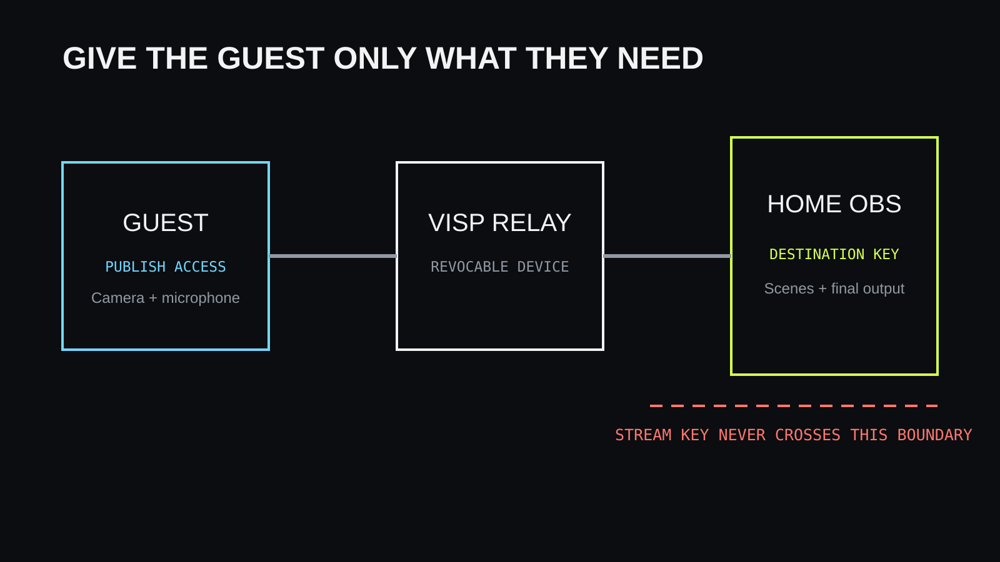

Etävieras tarvitsee oikeuden lähettää oma kameransa tuotantoosi, mutta ei
oikeutta Twitch- tai Kick-tiliisi. Luo vieraalle erillinen VISP-laite, anna
hänen julkaista siihen selaimella ja peruuta laitteen tunnus striimin jälkeen.

## Erota vieraan feedi striimin lähetyksestä

Vieraan selain lähettää kameran ja mikrofonin VISP-relaylle. OBS lukee suojatun
syötteen, yhdistää sen kohtauksiin ja striimaa valmiin videon Twitchiin, Kickiin, YouTubeen tai muuhun palveluun.
Vieraan ei tarvitse nähdä OBS:n tunnuksia, muita scenejä tai muita kameroita.

Tämä pienimmän oikeuden malli rajaa virheen tai vuodon yhteen vieraaseen. Sen
tunnus voidaan vaihtaa vaikuttamatta muuhun tuotantoon.

Malli olettaa, että lähetyksen tekee OBS. VISPin oletusulostulo on Suora, jossa
relay lähettää laitteen syötteen suoraan yhdistettyihin palveluihin ja uusin
julkaiseva laite voi ottaa ulostulon itselleen. Avaa ennen vieraan kutsumista
hallintapaneelin **Tila**-valikko ja valitse **Puhelimesta omaan OBS:ään**,
jotta vieraan syöte päätyy vain OBS:ään.

## Luo vieraalle julkaiseva laite

Avaa VISP-hallintapaneelin **Laitteet**-välilehti, kirjoita **Videolähteet**-kohdan
**Laitteen nimi** -kenttään vieraan tai striimiosuuden mukainen nimi ja valitse
**Lisää laite**. Älä käytä vakituisen kuvaajan polkua tilapäiselle vieraalle.
Lähetä vieraalle vain kyseisen laitteen julkaisuosoite kohdasta **Lisää tämä
videolähteeseen**.

Sovi samalla käyttöaika ja kerro, että oikeus poistetaan esiintymisen jälkeen.
Älä lähetä salaisia osoitteita julkisessa chatissa tai kalenterikutsun avoimessa
kuvauksessa.

## Käytä selainsovellusta

Selain on vieraalle helpoin vaihtoehto, koska asennusta ei tarvita. Vieras avaa
selainsovelluksen osoitteessa `stream.visp-stream.com`, liittää saamansa
osoitteen käsin kirjautumatta, sallii kameran ja mikrofonin, valitsee oikeat
laitteet ja aloittaa lähetyksen. Älä pyydä vierasta kirjautumaan omalla
Twitch-, Kick- tai Google-tilillään: silloin laitteet syntyvät hänen tililleen,
eivät sinun.

Pyydä vierasta käyttämään kuulokkeita ja sulkemaan muut kameraa käyttävät
sovellukset. Tee tekninen testi samalla laitteella ja verkolla, jota vieras
käyttää striimissa. Yritysverkko voi estää WebRTC-median, jolloin varavaihtoehto
on SRT:tä tukeva sovellus.

## Lisää vieras OBS:ään

Lisää vieraan laite valinnaisella VISP OBS -lisäosalla (**Tools → VISP Remote
Control** ja **Add to scene**) tai käsin medialähteenä hallintapaneelin
OBS-lukuosoitteella. Tee oma
skene, jossa rajaus, värikorjaus, äänenvoimakkuus ja viive säädetään.
Käytä sitä striimin varsinaisissa skeneissä lähteenä.

## Päätä erikseen, tarvitseeko vieras puheluyhteyden

Kamerasyöte ei yksin ole kaksisuuntainen tuotantopuhelu. Jos juontajan ja
vieraan pitää keskustella, käytä erillistä puhelua esimerkiksi Discordin kautta.
Estä puheluäänen kierto takaisin vieraan mikrofoniin ja sovita sen viive
striimikuvaan.

## Pidä myös OBS-ohjaus erillisenä

Vieras tarvitsee vain julkaisuoikeuden. Julkaisuosoite ei anna OBS-ohjausta:
etäkomennot tulevat vain sovelluksista, jotka on kirjattu sinun VISP-tiliisi.
VISPissä ei ole erillistä vierasohjaajan roolia, joten älä jaa tilisi
kirjautumista sellaisen luomiseksi. Älä myöskään jaa OBS WebSocket -salasanaa tai
avaa ohjausporttia julkiseen internetiin.

## Peru oikeus esiintymisen jälkeen

Kierrätä tai poista vieraan julkaisutunnus heti striimin jälkeen
hallintapaneelin **Laitteet**-välilehdellä. Näin vanhaa osoitetta ei voi käyttää
uudelleen.

## Tuottajan tarkistuslista

### Ennen striimiä

- Luo vieraalle oma nimetty laite ja lähetä sen julkaisuosoite yksityisesti.
- Testaa kamera, mikrofoni, kuulokkeet, verkko ja selaimen oikeudet.
- Rakenna OBS-skene ja mahdollinen fallback-skene.
- Sovi puhelu esimerkiksi Discordiin ja toimintatapa katkon varalle.

### Striimin aikana

- Seuraa vieraan syötettä ja ääntä.

### Striimin jälkeen

- Kierrätä vieraan julkaisutunnus.
- Kirjaa havaitut verkko- ja viiveongelmat seuraavaa kertaa varten.

## Usein kysyttyä

### Tarvitseeko vieras Twitch- tai Kick-tunnukseni tai oman tunnuksensa?

Ei. Vieras saa vain oman kameransa julkaisu-oikeuden. OBS säilyttää kohdepalvelun
lähetysavaimen. Vieras voi syöttää antamasi osoitteen käsin VISPin mobiili- tai selainsovellukseen.

### Voiko vieras liittyä asentamatta sovellusta?

Kyllä, jos selain ja verkko tukevat kameraa, mikrofonia ja WebRTC-mediaa.

## Lisätietoja

- [Lisää videolähde](https://docs.visp-stream.com/fi/docs/video-source)
- [OBS-etäohjaus](https://docs.visp-stream.com/fi/docs/obs-remote-control)
