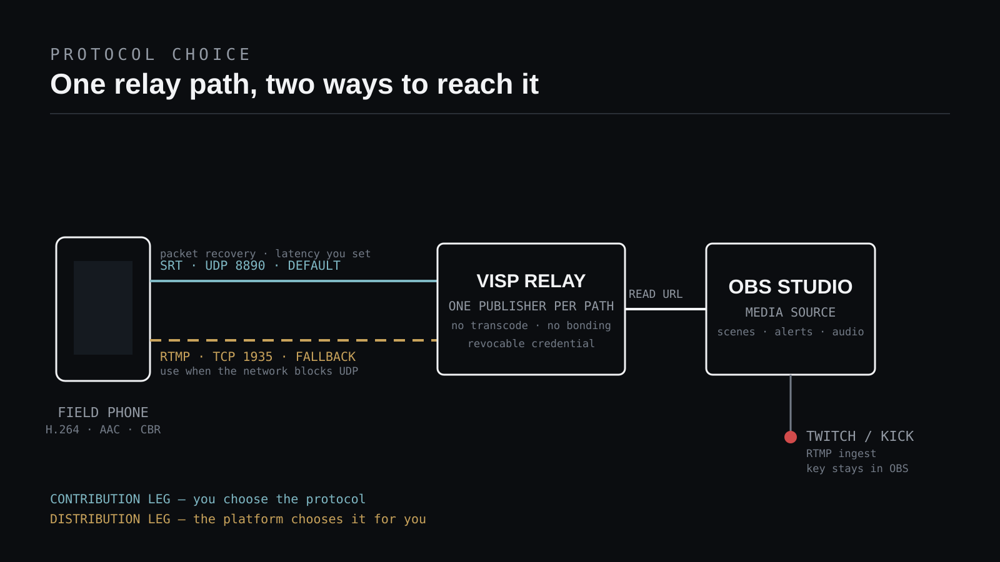

Kun puhelin tai kenttäenkooderi syöttää kuvaa kotistudion OBS:ään, **julkaise
oletuksena SRT:llä ja jätä RTMP varavaihtoehdoksi verkkoihin, jotka estävät
UDP:n.** SRT antaa pakettien korjauksen ja itse valitsemasi korjausikkunan; RTMP
antaa TCP-yhteyden, jonka lähes jokainen enkooderi ja palomuuri hyväksyy.

Kysymys on suppeampi kuin miltä se aluksi näyttää, koska se koskee vain yhtä
osuutta ketjussa. **Tuotantosyötteen** osuus puhelimelta relaylle on sinun
valintasi. **Jakelun** osuus OBS:stä palveluun ei ole: Twitch
[dokumentoi RTMP-vastaanoton](https://dev.twitch.tv/docs/video-broadcast/), ja
Kickin oma striimausohje antaa `rtmps://`-palvelinosoitteen. Kysymys ei siis ole
"SRT vai RTMP" koko lähetykselle. Kysymys on siitä, kumpi kuljettaa kenttäkameran
siihen tuotantoon, joka puhuu palvelulle joka tapauksessa RTMP:tä.

## Protokollat on rakennettu eri tehtäviin

RTMP on näistä vanhempi, ja se suunniteltiin
[sovellustason protokollaksi](https://github.com/veovera/enhanced-rtmp), joka on
tarkoitettu "for the multiplexing and packetizing of multimedia streams — such as
audio, video, and interactive content, for transmission over network protocols
like TCP". Juuri tuo on sen ydin: se multipleksoi virran yhden luotettavan
TCP-yhteyden yli, mikä on täsmälleen se, mitä palvelun vastaanottopää haluaa.
Veovera-yhteisön ylläpitämä enhanced RTMP -spesifikaatio, joka on kehitetty
Adoben kanssa, toteaa RTMP:n olleen "pivotal and continue to be vital especially
in live broadcasting" ja laajentaa sitä uudemmilla koodekeilla, kuten HEVC, AV1,
VP9 ja Opus.

SRT rakennettiin matkan sotkuisempaa puoliskoa varten.
[Virallinen SRT-projekti](https://github.com/Haivision/srt) kuvaa sen näin: "a
transport protocol for ultra low (sub-second) latency live video and audio
streaming", jossa "Automatic Repeat reQuest (ARQ) is the primary method" korjata
tilanne, kun "a receiver detects that a packet is missing". Olennaisinta on, että
"SRT's stream error correction is configurable to accommodate a user's deployment
conditions" — lähettävä ja vastaanottava pää sopivat siitä, kuinka paljon viivettä
ne hyväksyvät hävinneiden pakettien korjaamiseksi.

Tämä yksi ero selittää suurimman osan siitä, mitä mobiiliyhteydellä oikeasti
tapahtuu. Molemmat protokollat korjaavat hävinnyttä dataa. RTMP korjaa sen TCP:n
tavalla: tiukasti järjestyksessä eikä sovellukselle näkyvää ylärajaa korjauksen
kestolle ole, joten huono verkkopätkä näkyy kasvavana jonona ja pysähtyneenä
syötteenä. SRT korjaa sen ennalta valitun ikkunan sisällä ja luopuu paketeista,
jotka saapuvat liian myöhään ollakseen hyödyllisiä. Kumpikaan tapa ei ole
yleisesti parempi: toinen suojaa virran ajoitusta, toinen jokaista tavua.

## Kumpi kuljettaa kenttäkameraasi?

| Tilanteesi | Käytä | Miksi |
| --- | --- | --- |
| Mobiiliverkko tai tapahtumapaikan jaettu WiFi | SRT | Pakettien korjaus verkolle valitsemasi viivebudjetin sisällä |
| Kaapeli tai vakaa koti-WiFi | SRT | RTMP:stä ei ole hyötyä, ja viiveen hallinta säilyy |
| Vierasverkko, yritysverkko tai hotelli, joka estää UDP:n | RTMP | SRT toimii UDP:n varassa, joten yhteys ei ehkä muodostu lainkaan |
| Enkooderi tai sovellus ilman SRT-tukea | RTMP | Yhteensopivuus voittaa säädön, johon et pääse käsiksi |
| OBS:stä OBS:ään kulkevat ohjelmasyötteet | SRT | Sama päättely kuin puhelimella, yleensä paremmassa verkossa |

VISPin oma dokumentaatio sanoo säännön suoraan: käytä
[SRT:tä oletuksena ja RTMP:tä vain, kun verkko estää UDP:n](https://docs.visp-stream.com/docs/broadcaster-setup).
Molemmat ovat relaylla täysivaltaisia. SRT kuuntelee UDP-portissa 8890 ja RTMP
TCP-portissa 1935, ja kumpi tahansa voi toimia polun julkaisu- tai lukupuolena.

## Molemmat reitit ovat ulospäin, joten kumpikaan ei vaadi porttiohjausta

Yksi yleinen syy tavoitella "yksinkertaisempaa" protokollaa on reitittimen
säätäminen, ja tässä kohdassa protokollat ovat relay-työnkulussa
samanarvoisia. Puhelin ottaa yhteyden ulospäin relaylle ja OBS ottaa yhteyden
ulospäin relaylle, joten kotiverkkoon ei tarvita saapuvaa sääntöä. SRT-projekti
tekee kädenpuristuksestaan saman huomion: se "supports outbound connections
without the potential risks and dangers of permanent exterior ports being
opened".

Jos siis valitset SRT:n ja RTMP:n väliltä siksi, että haluat välttää portin
avaamista studioosi, protokolla ei ole ratkaiseva tekijä — välissä oleva relay
on. Sama pätee etäohjaukseen:
[VISPin OBS-lisäosa kyselee ulospäin HTTPS:llä](/blog/control-obs-phone-without-port-forwarding),
joten show'n ohjaaminen kentältä ei myöskään lisää saapuvaa porttia.

## Aseta SRT-viive mittauksen, ei arvauksen perusteella

SRT:n etu toteutuu vain, jos annat sille realistisen korjausikkunan. OBS:n
[SRT-ohje](https://obsproject.com/kb/srt-protocol-streaming-guide) kertoo
oletuksen olevan "120 ms = 120 000 μs" ja suosittelee "at least 2.5 * (the
round-trip time between encoder and ingest server, in ms)".

Haivisionin protokolladokumentaatio on tarkempi siitä, miten pakettihäviö
muuttaa lukua. Se määrittelee suhteen muodossa
`SRT Latency = RTT Multiplier * RTT` ja sanoo, että
[kohtuullisen hyvässä verkossa](https://doc.haivision.com/SRT/1.5.3/Haivision/rtt-multiplier)
eli "0.1 to 0.2% loss, with no burst loss, a 'rule of thumb' for this value would
be approximately 4". Sen taulukko nostaa kerrointa häviön kasvaessa, koska sekä
uudelleenlähetykset että ohjausliikenne lisääntyvät ruuhkan myötä.

VISPin hallintanäkymä tekee tästä mittauksen arvauksen sijaan. Sen luotain
lähettää seitsemän peräkkäistä pyyntöä relaylle, ottaa kiertoajan mediaanin ja
soveltaa verkkoprofiilin kerrointa:

| Verkkoprofiili | Kerroin | Vähintään |
| --- | ---: | ---: |
| Kaapeli | 3× RTT | 120 ms |
| WiFi | 4× RTT | 300 ms |
| Mobiili | 6× RTT | 600 ms |

Aja luotain siinä verkossa, jota enkooderi todella käyttää, äläkä säädä
mobiilisuositusta alemmaksi — mobiiliverkon värinä tulee purskeina, ei siistinä
keskiarvona. Tätä säätöä RTMP ei anna, ja siksi huolellisesti viritetty
SRT-syöte kestää olosuhteet, joissa RTMP-syöte alkaa jonottaa ja pysähtyy.

## Mitä relay ei korjaa puolestasi

VISP **ei transkoodaa videota eikä yhdistä verkkoyhteyksiä.** Se tunnistaa
julkaisevan laitteen, välittää sen lähettämän yksittäisen virran ja tarjoaa
OBS:lle erillisen lukuosoitteen. Tästä seuraa kaksi asiaa, ja ne pätevät
samalla tavalla SRT:hen ja RTMP:hen:

- **Enkooderin asetukset ovat lopullisia.** Määritä lähteessä H.264-video,
  AAC-ääni, vakiobittinopeus ja kahden sekunnin avainkuvaväli. Relay ei voi
  laskea bittinopeutta, jota lähetyskaistasi ei kanna, ja Kickin ohjekeskus
  sanoo suoraan, että sen vastaanotto haluaa H.264:n ja CBR:n eikä VBR:ää.
- **Yksi yhteys on yksi yhteys.** SRT:n valinta ei yhdistä WiFiä ja
  mobiiliverkkoa. Jos tarvitset useamman yhteyden toimivan yhtenä, se kuuluu
  VISPin alle — esimerkiksi [Speedifyn kaltaiseen yhdistävään tunneliin](/blog/bond-cellular-wifi-visp-speedify)
  tai erilliseen yhdistävään enkooderiin, kuten artikkelissa
  [VISP vs BELABOX vs LiveU Solo](/blog/visp-vs-belabox-vs-liveu-solo).

Vain yksi julkaisija voi omistaa relay-polun kerrallaan, joten protokollan
vaihtaminen ei myöskään ole saumaton vaihto. Katkaise SRT-julkaisijan yhteys,
ennen kuin RTMP-julkaisija yhdistyy saman laitteen polkuun.

## Käsittele molempia julkaisuosoitteita salaisuuksina

SRT tukee vahvaa salausta: projekti kuvaa "128/192/256-bit AES encryption",
joka suojaa sisältöä päästä päähän. Suojaus on kuitenkin voimassa vain, kun
molemmat päät määrittävät salauslauseen, eikä VISPin luomissa osoitteissa ole
sellaista. SRT-julkaisuosoite kuljettaa laitteen tunnuksen `streamid`-kentässä,
ja RTMP-varaosoite kuljettaa sen `user`- ja `pass`-kyselyparametreina tavallisessa
`rtmp://`-osoitteessa.

Älä siis lue tästä, että "SRT on se turvallinen" ilmaisena ominaisuutena. Käytännön
turvamalli on molemmille sama: osoite *on* tunnus, jokaisella julkaisevalla
laitteella on omansa, ja yhden laitteen kierrättäminen tai peruminen ei häiritse
muita. Älä koskaan liitä julkaisuosoitetta julkiseen Discordiin, tukipyyntöön tai
näkyville striimissä. Jos osoite vuotaa, kierrätä kyseinen laite sen sijaan, että
rakentaisit studion uudelleen. Relay hallinnoi OBS:n lukutunnuksia erikseen, ja
Twitchin tai Kickin lähetysavain ei poistu OBS:stä lainkaan.

## Laitteen vaihtaminen RTMP-varaosoitteeseen

1. Avaa [hallintanäkymä](https://visp-stream.com/dashboard) ja etsi laite
   kohdasta **Video sources**.
2. Vaihda näkymä tilaan **Advanced**, jolloin laitteen RTMP-osoite paljastuu.
3. Liitä se lähettävään sovellukseen **Custom**- tai **Custom RTMP**
   -palvelimeksi ja jätä stream key tyhjäksi.
4. Varmista, että laiterivi näyttää **Live**, ja lisää tai päivitä sitten
   vastaava lukuosoite OBS:ssä medialähteeksi.

Sama paljastus koskee lukupuolta, joten OBS voi käyttää kumpaa tahansa
protokollaa. Täydelliset osoitemuodot ja enkooderikohtaiset vaiheet löytyvät
sivulta [Add a video source](https://docs.visp-stream.com/docs/video-source);
[Larix](/blog/larix-broadcaster-obs-srt)- ja
[Moblin](/blog/moblin-remote-camera-obs-srt)-oppaat käsittelevät nämä kaksi
sovellusta alusta loppuun.

## Valinnan vianetsintä

### SRT ei koskaan yhdisty, mutta RTMP yhdistyy

Tämä on tyypillinen merkki verkosta, joka pudottaa tai suodattaa UDP:n.
Vierasverkot, hotelliverkot ja tiukasti rajatut yritysverkot ovat tavallisimpia
syyllisiä. Käytä kyseisessä sessiossa RTMP-varaosoitetta sen sijaan, että
laskisit SRT-viivettä — siitä ei ole apua.

### Syöte yhdistyy, mutta nykii tai jäätyy mobiiliverkossa

Viivebudjettisi on todennäköisesti liian pieni todelliselle kiertoajalle ja
värinälle. Aja luotain uudelleen oikeassa verkossa, käytä mobiiliprofiilia ja
laske enkooderin bittinopeutta ennen kuin säädät muuta. Ota myös adaptiivinen
bittinopeus käyttöön, jos lähettävä sovellus tarjoaa sen.

### RTMP kestää WiFissä mutta romahtaa, kun lähdet liikkeelle

Tämä on TCP:tä suunnitellusti. Luotettavalla järjestyksessä toimitetulla
liikenteellä ei ole takarajaa, joten jatkuva häviö muuttuu puskuroinniksi eikä
hallituksi laadun laskuksi. Siirrä laite SRT:lle, jos verkko sen sallii, ja lisää
kummassakin tapauksessa
[paikallinen OBS-varascene](/blog/keep-stream-live-bad-mobile-network)
uudelleenyhdistämisen ajaksi.

### OBS näyttää lähteen, mutta ääntä ei tule

Tarkista, että enkooderi lähettää AAC:ta. Koska matkalla ei transkoodata mitään,
poikkeava äänikoodekki, jonka puhelinsovellus hyväksyi mukisematta, voi silti
saapua muodossa, jota OBS ei soita.

## Usein kysytyt kysymykset

### Voinko lähettää SRT:n suoraan Twitchiin tai Kickiin?

Ei niiden dokumentoituun vastaanottoon. Twitchin kehittäjädokumentaatio kuvaa
lähetysten saapuvan "through the open Internet, into Twitch using *Real-Time
Messaging Protocol (RTMP)*", ja Kick dokumentoi `rtmps://`-palvelinosoitteen. SRT
on tarkoitettu tuotantosyötteen osuudelle omaan tuotantoosi; OBS puhuu sen
jälkeen palvelun protokollaa.

### Onko SRT aina RTMP:tä matalaviiveisempi?

Ei. SRT kykenee alle sekunnin viiveeseen, mutta lisäät tarkoituksella
korjausikkunan verkon kiertoajan päälle. Hyvin toimiva RTMP-syöte puhtaassa
kaapeliyhteydessä voi olla vertailukelpoinen. SRT:n etu on ennustettava
toiminta, kun verkko *ei* ole puhdas.

### Vähentääkö kumpikaan protokolla tarvittavaa kaistaa?

Ei. Molemmat kuljettavat sen bittinopeuden, jonka enkooderi tuottaa, ja SRT:n
uudelleenlähetykset lisäävät hieman ylimääräistä liikennettä häviöllisellä
yhteydellä. Jos lähetyskaista ei kanna bittinopeutta, laske bittinopeutta.

### Voiko OBS lukea RTMP-syötteen medialähteenä?

Kyllä. Luotu scene collection käyttää `ffmpeg_source`-lähdettä pienellä
puskuroinnilla ja automaattisilla uudelleenyhdistämisillä, ja tämä lähdetyyppi
osaa toistaa polun RTMP-lukuosoitteen SRT-osoitteen tavoin. Lähdetyypin yleinen
toiminta on kuvattu
[OBS:n medialähdeohjeessa](https://obsproject.com/kb/media-sources).

### Kannattaako valita RTMP, koska puhelimen akku kuluu SRT:llä?

Akun kulutus on enkoodaus- ja radiokysymys, ei protokollakysymys. Laske
resoluutiota, ruudunopeutta tai bittinopeutta ja pidä puhelin viileänä ja
latauksessa pitkillä IRL-lähetyksillä.

## Lähteet ja seuraavat askeleet

- [VISPin enkooderit, viiveluotain ja varascene](https://docs.visp-stream.com/docs/broadcaster-setup)
- [VISPin videolähteen osoitteet](https://docs.visp-stream.com/docs/video-source)
- [VISPin arkkitehtuuri](https://docs.visp-stream.com/docs/architecture)
- [Virallinen SRT-projekti (Haivision)](https://github.com/Haivision/srt)
- [Haivisionin RTT-kerroin ja SRT-viive](https://doc.haivision.com/SRT/1.5.3/Haivision/rtt-multiplier)
- [OBS:n SRT-protokollaohje](https://obsproject.com/kb/srt-protocol-streaming-guide)
- [Enhanced RTMP -spesifikaatio (Veovera)](https://github.com/veovera/enhanced-rtmp)
- [Twitchin video broadcast -dokumentaatio](https://dev.twitch.tv/docs/video-broadcast/)
- [Kickin striimausohje](https://help.kick.com/en/articles/7066931-how-to-stream-on-kick-com)

Jos haluat viritetyn version tästä ilman relayn ylläpitoa käsin,
[kokeile VISPiä](https://visp-stream.com): luo videolähde, aja viiveluotain siinä
verkossa, jota todella käytät, julkaise SRT:llä ja pidä RTMP-osoite taskussa sitä
tapahtumapaikkaa varten, joka estää UDP:n.
