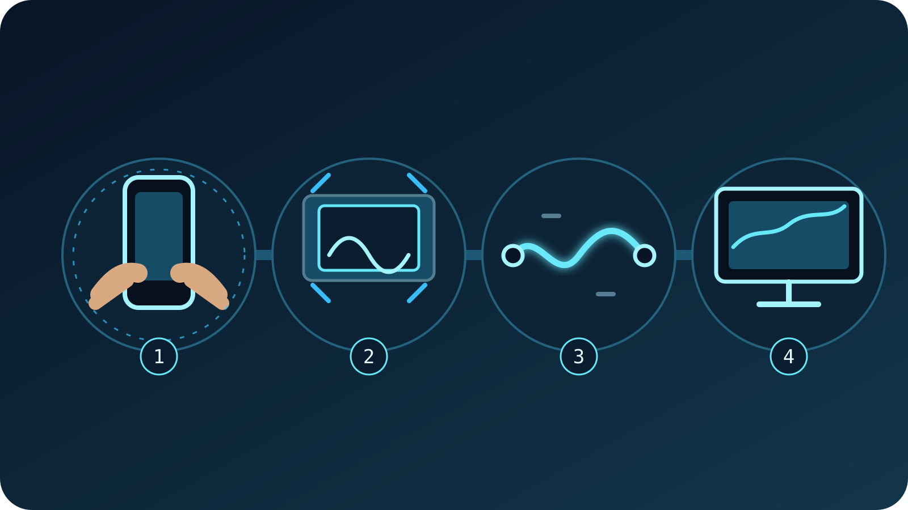

A stable IRL picture starts at the phone, before SRT, the VISP relay, or OBS
touches the feed. Use a supported camera, resolution, and frame-rate combination,
enable **Settings → Camera → Image stabilization** in the VISP native app, and
then test the real walking route. If the result still bounces, improve the grip
or mount before changing network settings. A tripod solves a fixed shot; a
gimbal can help a walking shot; neither SRT latency nor OBS upload bitrate can
remove physical camera movement.

The useful goal is not a perfectly floating picture. It is a frame that viewers
can follow without losing the subject, while preserving enough field of view and
keeping capture delay acceptable. Phone stabilization can crop the image, add
some capture latency, or look unnatural with certain movement. Treat it as one
layer in the camera rig, not a magic switch.

## First, identify shake instead of a network problem

Camera shake moves the whole scene from frame to frame. A tilted horizon,
repeated footstep bounce, and small hand tremors remain visible even when the
picture is otherwise sharp and continuous. Network trouble looks different:
the image may freeze, skip forward, become blocky, or disappear while VISP
reports loss or a reconnect.

Record a short section in OBS and inspect it frame by frame. If the horizon and
background shift together in consecutive frames, work on camera stability. If
frames are missing or corrupted, check the transport path instead. The
[OBS dropped-frames guide](/blog/obs-dropped-frames-irl-streaming) separates
phone-to-relay loss from relay-to-OBS trouble and the final OBS-to-platform
upload.

Do not raise SRT latency to fix visible footsteps. SRT latency gives lost
packets time to be retransmitted; it cannot change the motion already captured
by the camera. Likewise, changing the Twitch or Kick bitrate in OBS affects the
finished platform output, not the physical movement in the phone source.

## Build stability from the simplest layer

Start with the operator, because this costs nothing and works with every phone:

1. Hold the phone with two hands or use a grip that keeps the wrists neutral.
2. Keep elbows relaxed and close to the body instead of extending the phone at
   arm's length.
3. Walk with shorter, softer steps and bend the knees slightly over uneven
   ground.
4. Turn the torso rather than snapping the phone from the wrists.
5. Begin and end pans deliberately, with a short still moment at each end.
6. Keep the horizon in view so drift is easy to notice.

Avoid unnecessary zoom. A narrow view makes small angular movement occupy more
of the picture. Start at the camera's normal wide view, frame the subject by
moving the operator when safe, and add zoom only after the stability test. VISP
shows the zoom levels the selected native camera exposes, so the available
choices vary by device.

For a stationary interview, performance, cooking setup, or venue-wide shot,
stop hand-holding entirely. A tripod, clamp, or firmly supported monopod is the
shorter solution. Make sure the support cannot be knocked over, does not block
airflow around a hot phone, and leaves microphone and charging cables without
tension. The [phone overheating guide](/blog/prevent-phone-overheating-irl-streaming)
covers the thermal side of a mounted outdoor rig.

## Enable stabilization in the VISP native app

Open the camera preview, then go to **Settings → Camera**. The **Image
stabilization** switch appears only when the selected camera, resolution, and
frame rate report a supported stabilization path. VISP checks that combination
on the device instead of promising one setting for every iPhone or Android
phone.

When enabled, VISP requests the native platform's supported stabilization
before the phone encodes the H.264 contribution. On iOS it requests Apple's
standard video stabilization mode. On Android it first requests camera video
stabilization and can use the camera's optical stabilization path when that is
the supported option. The app does not stack both Android modes.

That placement matters: OBS receives the already stabilized camera picture.
The VISP relay authenticates and forwards the SRT contribution but does not
transcode or stabilize it again. Direct may create destination encodes on the
server, but that still cannot reconstruct field of view lost before the phone
encode.

The browser publisher does not currently expose VISP's native stabilization
switch. Browser and device camera behavior may still vary, but the control
described in this guide is for the iOS and Android apps. See the current
[VISP phone app documentation](https://docs.visp-stream.com/docs/phone-app)
for supported clients and the complete publishing workflow.

## Choose a format the camera can stabilize

If the switch disappears after changing the camera, resolution, or frame rate,
that combination did not report stabilization support. Return to a simpler
baseline rather than assuming the app is broken:

1. select the rear camera;
2. choose 1280×720;
3. choose 30 fps;
4. confirm that **Image stabilization** appears;
5. enable it and start the preview;
6. move upward one setting at a time only if the stream needs it.

VISP prefers 720p when available and prefers 30 fps for the selected format.
That is a practical starting point for mobile IRL production, not a claim that
every phone stabilizes 720p30 equally well. The app uses the capabilities
reported by the actual camera and encoder.

Android's official
[Camera2 stabilization documentation](https://developer.android.com/reference/android/hardware/camera2/CaptureRequest#CONTROL_VIDEO_STABILIZATION_MODE)
explains why capability checks matter: video stabilization warps consecutive
frames and may change the crop region, and not every recording size or frame
rate is supported on every device. Apple likewise documents that its
[standard stabilization mode](https://developer.apple.com/documentation/avfoundation/avcapturevideostabilizationmode/standard)
reduces field of view and may add latency to the capture pipeline.

Those are camera tradeoffs, not VISP relay behavior. Leave extra room around a
face or important object, and do not position critical action against the edge
of the preview until you have seen the stabilized output in OBS.

The [mobile IRL bitrate guide](/blog/best-bitrate-irl-streaming-phone-obs)
helps choose a contribution bitrate after the camera format is stable. Keep the
questions separate: resolution and frame rate decide the captured format;
stabilization changes motion and crop; bitrate decides how much compressed data
the route must carry.

## Know when a gimbal or tripod is the right fix

On-device stabilization is well suited to small hand movement and ordinary
walking, but the real limit depends on the phone, lens, pace, light, and chosen
format. It cannot keep a badly swinging arm level or make a running shot look
like a fixed studio camera.

Use a tripod or clamp when the camera should not move. Use a hand grip when the
operator needs quick, modest movement and the phone's result is already good.
Consider a powered gimbal when a long walking segment still bounces after good
handling and supported stabilization are in place.

Do not assume that more stabilization layers always produce the better shot.
With a gimbal, make two test recordings: one with VISP stabilization enabled
and one with it disabled. Compare horizon drift, corner warping, delayed pans,
and the crop in the final OBS canvas. Keep the cleaner result for that exact
phone and rig. This test is faster and more reliable than a universal rule
about combining a particular phone with a particular gimbal.

Balance the complete rig before going live. Attach the case, microphone
receiver, cable, and any small light before balancing a gimbal. Confirm that a
cable cannot pull the phone during a pan and that the motors do not fight a
blocked axis. Then rehearse the same walking pace and camera moves planned for
the broadcast.

## Judge the result in OBS, not only on the phone

The phone preview is useful for composition, but the viewer sees the decoded
source inside an OBS scene and then the platform encode. Inspect all three
levels:

- **Phone preview:** Is the horizon stable? Is the subject still inside the
  cropped frame? Does a pan begin and stop naturally?
- **OBS source:** View the phone source full-screen. Look for corner warping,
  repeated bounce, delayed movement, and audio that no longer feels aligned.
- **OBS program:** Put the source in its real scene with overlays and other
  cameras. Make sure the crop still leaves space for graphics and captions.
- **Short platform test:** Watch a brief destination test from a second device
  and confirm the final encode preserves the intended motion.

OBS can crop, scale, and position the source, but those transforms do not undo
camera movement that was encoded in the field. Excessive scaling can also make
small motion easier to notice. Build the phone source at the size it actually
needs in the scene, then leave the transform unchanged during the comparison.

Use the generated Media Source and fallback settings from the
[VISP broadcaster documentation](https://docs.visp-stream.com/docs/broadcaster-setup).
Keep a local fallback scene ready so the producer can cut away while the field
operator remounts the phone or restarts capture.

## Run one repeatable stabilization test

Use a five-minute route that includes the motion your real show contains. Keep
every other variable fixed while comparing stabilization off and on.

| Segment | What to do | What to inspect in OBS |
| --- | --- | --- |
| 30 seconds | Hold a static medium shot | Horizon drift, hand tremor, crop |
| 60 seconds | Walk straight at normal pace | Vertical footstep bounce and subject framing |
| 30 seconds | Pan left and right slowly | Delayed starts, overshoot, or warped edges |
| 30 seconds | Turn a corner | Horizon recovery and sudden crop changes |
| 60 seconds | Walk on the roughest planned surface | Whether handling or a mechanical support is still needed |
| 30 seconds | Stop and hold again | How quickly the picture settles |

Record the OBS source, not just the phone screen. Repeat the route with the same
camera, resolution, frame rate, zoom, grip, and walking speed. The only first
change should be the stabilization switch. If enabled wins, keep it. If it
adds an unacceptable crop or motion artifact, turn it off and improve the
physical support. If neither pass is usable, the next step is a mount or
gimbal—not random SRT settings.

After choosing the camera setup, run the route once more while streaming over
the real Wi-Fi or cellular connection. That final pass tests stability and
transport together without confusing their symptoms.

## When should you turn stabilization off?

Disable it when the stabilized result is worse for the intended shot. Common
reasons discovered in testing include:

- a locked tripod shot is already steady and the extra crop has no value;
- the subject no longer fits after the field of view narrows;
- a controlled pan feels delayed or settles poorly;
- a gimbal and the phone's processing produce an unnatural correction;
- the required camera, resolution, or frame rate does not support the mode;
- the browser publisher is being used and the native VISP control is not
  available.

There is no penalty for choosing the off position when the physical rig already
does the job. The correct setting is the one that wins the recorded OBS
comparison for the planned movement.

## Frequently asked questions

### Why is the Image stabilization switch missing?

VISP shows it only when the selected native camera, resolution, and frame rate
report support. Try the rear camera at 720p30, then test other formats one at a
time. The browser publisher does not expose this switch.

### Can OBS stabilize a shaky phone source live?

The standard VISP workflow stabilizes at the phone. OBS can transform the
received source, but it does not restore a stable camera path from already
encoded shake. Fix the grip, mount, gimbal, or supported phone setting first.

### Does more SRT latency make the camera smoother?

It can make delivery more resilient by allowing retransmissions more time, but
it does not remove camera motion. Use link statistics for SRT tuning and the
recorded horizon for stabilization tuning.

### Should every walking stream use a gimbal?

No. Good handling plus the phone's supported stabilization may be sufficient.
Use a gimbal when the recorded route still fails the quality target and the
extra equipment is practical for the operator.

### Does stabilization change the framing?

It can. Apple says standard stabilization reduces field of view, and Android
documents that video stabilization may alter the crop region. Leave framing
margin and verify the actual device in OBS.

## Sources and next steps

- [Apple: AVCaptureVideoStabilizationMode.standard](https://developer.apple.com/documentation/avfoundation/avcapturevideostabilizationmode/standard)
- [Android: CaptureRequest video stabilization](https://developer.android.com/reference/android/hardware/camera2/CaptureRequest#CONTROL_VIDEO_STABILIZATION_MODE)
- [VISP phone and browser app](https://docs.visp-stream.com/docs/phone-app)
- [VISP encoders and fallback](https://docs.visp-stream.com/docs/broadcaster-setup)

If you want a phone to remain a managed field camera while OBS owns the Twitch
or Kick production at home, [try VISP](https://visp-stream.com/download).
Start at 720p30, compare stabilization off and on over the same five-minute
route, and keep the simplest rig that produces the steadier OBS recording.
