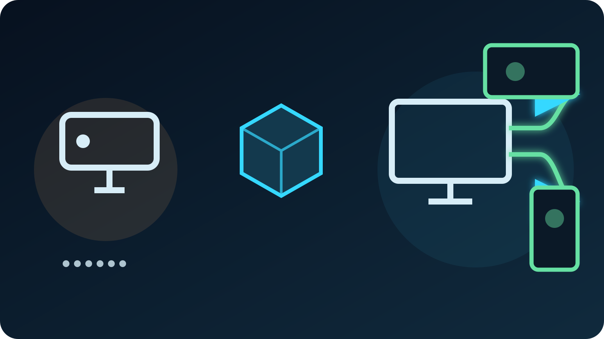

Twitch viewers no longer have to receive the same frame on every screen. With
Dual Format Streaming, OBS can send a traditional horizontal program and a
separate vertical program in the same Twitch broadcast. Desktop and TV viewers
keep the 16:9 version, while viewers holding a phone vertically can receive a
9:16 composition built for that screen.

For an IRL creator, the cleanest architecture is not to make the field phone
encode and upload two programs. Send **one landscape camera contribution** from
the phone through VISP to OBS, then build the horizontal and vertical versions
on the home computer. The phone still has one mobile upload. OBS and the home
connection take on the extra canvas, encoding, and Twitch upload work.

This guide follows Twitch's current OBS and Aitum workflow as of August 5,
2026. Dual Format requirements are changing faster than ordinary OBS source
setup, so recheck Twitch's
[official Dual Format guide](https://help.twitch.tv/s/article/dual-format-vertical-video?language=en_US)
before a major event.

## The short answer

Use this signal path:

1. Hold the VISP phone in landscape and send one H.264/AAC contribution to its
   normal relay path.
2. Read that path as a standard Media Source in OBS.
3. Keep the source in the regular horizontal scene.
4. Reuse the same source in an Aitum Vertical scene and crop or reposition it
   for 9:16.
5. Link the matching horizontal and vertical scenes.
6. Enable Twitch Enhanced Broadcasting and choose **Aitum Vertical** as the
   Additional Canvas.
7. Start streaming once from the main OBS controls and verify both views on a
   phone.

The VISP relay does not create the vertical version and does not transcode the
normal relay-to-OBS feed. It gives OBS one authenticated field-camera source.
OBS and Twitch's Enhanced Broadcasting workflow create and deliver the two
viewer formats.

## Check compatibility before rebuilding your scenes

Twitch currently lists OBS Studio 32.0.0 or newer, the latest Aitum Vertical
plugin, Windows or macOS, Enhanced Broadcasting, and a supported graphics
encoder among its Dual Format requirements. The same guide lists a 1080×1920
vertical canvas and currently recommends at least 12.5 Mbps of upstream
bandwidth for a 1080p setup. Those are home-studio requirements, not the
required upload speed of the field phone.

There is one important VISP version boundary. The current
[VISP OBS plugin documentation](https://docs.visp-stream.com/docs/obs-remote-control)
targets OBS Studio 31, while Twitch's current Dual Format instructions start at
OBS 32. This tutorial therefore uses VISP's generated **standard Media Source**
path, which does not depend on claiming that the current VISP plugin package is
compatible with OBS 32. Check the VISP release notes before installing both
plugins into the same OBS version.

You need:

- a phone signed in to VISP and assigned its own publishing device;
- a stable VISP contribution visible in OBS as a Media Source;
- OBS 32 or newer on a computer that meets Twitch's current requirements;
- the current
  [Aitum Vertical plugin](https://github.com/Aitum/obs-vertical-canvas);
- a Twitch account connected in OBS;
- enough home upload and encoder headroom for Enhanced Broadcasting;
- a second phone or tablet for checking the real mobile viewer experience.

Do not enable VISP Direct to Twitch for this publishing device while OBS is
also sending the Twitch program. Direct and OBS would then compete as two
publishers for the same destination. In this workflow, the phone contributes
to OBS and OBS owns the Twitch broadcast.

## 1. Prepare one clean landscape phone source

Open the VISP phone app before going live. Choose the rear or front camera,
resolution, frame rate, microphone, and **landscape orientation**. The app
selects orientation before the encoder starts and prevents changing it during
an active stream, so decide before pressing Go Live.

Landscape is the useful master frame for this workflow because it preserves a
normal Twitch desktop composition. The vertical canvas can crop that source
around the creator. Starting with portrait would force the horizontal scene to
fill a wide frame from a narrow source or surround it with designed space.

Frame the field shot with both outputs in mind:

- keep the creator near the horizontal center;
- leave room above the head and around hand gestures;
- avoid placing a second important subject at the far left or right edge;
- keep burned-in captions or graphics away from the outer quarters;
- rehearse the widest movement expected during the stream.

The vertical output cannot reveal picture that the phone never captured. A
centered, slightly wider field shot gives the home producer room to crop without
cutting off faces whenever the creator turns or walks.

Follow the [VISP phone app guide](https://docs.visp-stream.com/docs/phone-app)
for sign-in and capture settings. If this is the first remote source in the
studio, complete
[How to Use Your Phone as a Remote Camera in OBS](/blog/use-phone-as-remote-camera-obs)
before adding a second canvas.

## 2. Add the VISP feed to OBS without duplicating credentials

On the VISP dashboard, open **Advanced → OBS read credentials** and download a
fresh scene collection, or reveal the read URL and add the path as a Media
Source manually. The generated scene collection already uses OBS's
`ffmpeg_source`, MPEG-TS, low buffering, and automatic reconnection settings.
The [encoders and fallback guide](https://docs.visp-stream.com/docs/broadcaster-setup)
documents that path.

Give the source a stable name such as `IRL phone`. Keep one underlying Media
Source and reuse it in scenes rather than creating several sources with copies
of the read URL. That makes credential rotation, audio filters, and reconnect
settings easier to maintain.

Before touching the vertical layout, make a short OBS recording and verify:

1. the phone picture has the expected landscape orientation;
2. speech reaches the correct OBS mixer channel;
3. the horizontal scene fits the full source without stretching;
4. a brief phone disconnect causes the Media Source to reconnect;
5. the fallback scene is ready if the contribution disappears.

Fix the contribution first. Two canvases will reproduce the same frozen frame,
audio fault, or reconnect problem twice. The
[IRL dropped-frames guide](/blog/obs-dropped-frames-irl-streaming) separates
phone-to-relay trouble from OBS-to-Twitch trouble if the health indicators
disagree.

## 3. Install Aitum Vertical and create only the scenes you need

Close OBS, install the latest Aitum Vertical package from its official project,
and reopen OBS. Twitch says a set of Vertical docks should appear; if they do
not, enable them from **Docks → Vertical**.

Do not recreate the entire scene collection on day one. Start with three
vertical scenes:

| Horizontal scene | Vertical partner | Purpose |
| --- | --- | --- |
| IRL live | IRL live vertical | Centered crop of the phone camera, essential alerts only |
| IRL fallback | IRL fallback vertical | Holding image or local studio content while the phone reconnects |
| Ending | Ending vertical | A clean end state that matches the horizontal program |

In the vertical live scene, add the existing `IRL phone` source. Preserve its
aspect ratio. Scale it until the 9:16 canvas is filled, then crop the left and
right sides and move the frame so the creator stays inside Twitch's current
vertical safe area. Never stretch 16:9 into 9:16; faces and circles immediately
show the distortion.

If a center crop removes too much context, use a designed vertical layout
instead: keep the full horizontal feed in the middle and use the remaining
space for a neutral background, title-safe graphics, or a second production
element. The right choice depends on whether the location or the person is the
story.

Twitch says a separate chat overlay is unnecessary on the vertical canvas
because its mobile player can place chat over the video. VISP's **Floating**
chat remains private on the operator's phone. VISP's **Embedded in stream**
mode becomes part of the camera picture before OBS, so a tight vertical crop
can cut it off. The
[phone chat guide](/blog/twitch-kick-chat-phone-obs) explains that distinction.

## 4. Link horizontal and vertical scene changes

Use Aitum's scene-linking controls to pair each horizontal scene with its
vertical partner. Twitch recommends switching through the primary horizontal
scene menu after the links are created. One operator action should then move
both programs to their matching scene.

Test every link in both directions you expect to use:

1. switch from fallback to the live phone scene;
2. switch to a local studio or intermission scene;
3. return to fallback;
4. disconnect the phone and confirm both canvases remain intentional;
5. reconnect and wait for stable playback before cutting back.

The fallback matters more in Dual Format, not less. If the one phone
contribution fails, both viewer layouts lose the same source. Create a real
vertical fallback instead of allowing a missing-source box, an empty crop, or
a landscape holding card squeezed into 9:16.

If the field creator controls scenes remotely, validate the complete linked
pair from the real control surface before the event. Do not assume a scene name
that looks correct in the horizontal dock automatically selected the intended
vertical partner.

## 5. Enable Twitch Dual Format in OBS

Follow Twitch's current order:

1. Open **Settings → Stream** in OBS.
2. Enable **Enhanced Broadcasting** under Multitrack Streaming.
3. Choose **Aitum Vertical** as the Additional Canvas.
4. In Aitum settings, disable **Backtrack** as Twitch currently instructs.
5. Preview the vertical canvas and confirm the correct scene, framing, alerts,
   and audio.
6. Start streaming from the main OBS control once. Do not separately press the
   green Go Live control on the vertical canvas.

Twitch's
[Enhanced Broadcasting guide](https://help.twitch.tv/s/article/enhanced-broadcasting?language=en_US)
explains that the feature sends multiple video encodes from supported broadcast
software. That is why this workflow changes the home computer and home upstream
budget even though the phone continues sending one VISP contribution.

Treat Twitch's bandwidth figure as a preflight threshold, not a guarantee.
Run a private or low-stakes test for at least as long as the planned event's
most demanding section. Watch OBS CPU/GPU load, network dropped frames, and
encoder warnings. Twitch advises reducing the Multitrack maximum bandwidth or
maximum video-track count if encoder limits appear.

## 6. Verify what viewers actually receive

Pressing Start Streaming is not the test result. Check three separate places:

| Checkpoint | What it proves |
| --- | --- |
| VISP live status | The phone contribution reaches the relay |
| Both OBS previews | The horizontal and vertical scene pairs contain the intended source and audio |
| Twitch Stream Manager, Inspector, and a real phone | Twitch receives the formats and mobile viewers get the intended vertical composition |

Open [Twitch Inspector](https://inspector.twitch.tv/) for stream health. Then
watch the channel on a muted phone held vertically and horizontally. Twitch's
current viewer behavior defaults to the vertical program when the device is
upright and lets the viewer switch to the classic view. A desktop or TV viewer
should still receive the regular horizontal program.

Check content, not just connectivity:

- the creator remains visible after walking to each edge of the rehearsal area;
- captions, alerts, and sponsor-safe graphics stay inside the vertical safe
  area;
- the vertical program has the same intended microphone and program audio;
- scene changes remain paired;
- reconnects end on the correct live scene rather than a stale fallback;
- the horizontal program was not weakened merely to make the crop easy.

Twitch currently keeps the vertical version of a Dual Format VOD for a shorter
period than the classic version, while clips remain available in both formats.
If the vertical archive matters to the production, read the current retention
details in Twitch's guide instead of assuming both VOD versions have identical
lifetime.

## A practical preflight checklist

Before the real IRL stream:

1. disable Twitch Direct for the phone path so OBS is the only Twitch publisher;
2. set the phone to landscape before going live;
3. confirm one stable VISP Media Source and clean audio in OBS;
4. install an OBS and Aitum combination that meets Twitch's current checklist;
5. create only the necessary vertical live, fallback, and ending scenes;
6. reuse the existing phone source and crop without stretching;
7. link every vertical scene to its horizontal partner;
8. enable Enhanced Broadcasting and select Aitum Vertical as Additional Canvas;
9. test the home encoder and upstream under sustained load;
10. inspect both formats in Twitch Stream Manager and on a real phone;
11. rehearse a phone disconnect and recovery;
12. save or back up the tested OBS scene collection.

This setup does not make VISP a dual-format encoder. VISP supplies one managed,
revocable phone contribution to the studio. OBS keeps the platform connection,
Aitum supplies the additional canvas, and Twitch delivers the two viewer
formats. That division is useful for IRL creators because the mobile device can
keep doing the smallest reliable job: capture once and upload once.

If your phone source is not yet stable, start with the
[phone-to-OBS guide](/blog/use-phone-as-remote-camera-obs) and the
[mobile bitrate guide](/blog/best-bitrate-irl-streaming-phone-obs). Then try
VISP with one centered landscape source, build one matching vertical scene in
OBS, and prove the complete Dual Format path in a test broadcast before taking
it into the field.
