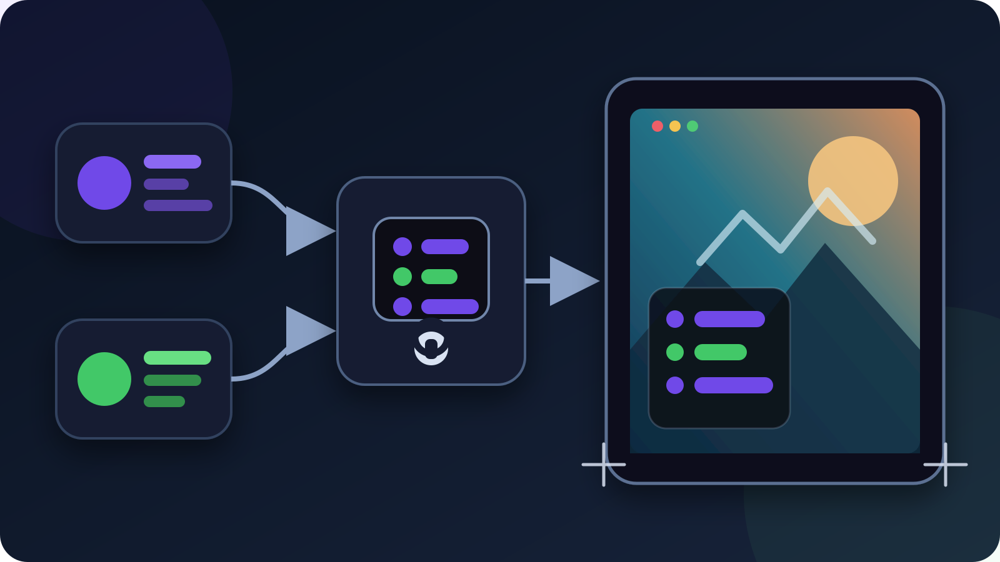

To show Twitch or Kick chat on your OBS program with VISP, **enable the chat
connection you want, generate an OBS chat overlay URL in the VISP dashboard,
and paste it into a full-canvas Browser Source**. The page stays transparent
when there are no messages and adds a compact chat panel when new messages
arrive.

The URL is a credential, not a public link. VISP shows its plaintext once so
you can put it in OBS, stores only a hash of its secret, and lets you rotate or
revoke it without changing your media source or platform stream key.

This is different from reading chat in an OBS dock or on the field phone. A
**dock** is private to the producer. A **Browser Source** is part of the scene
and can be seen by viewers, recorded in VODs, and captured in clips. The
[VISP phone chat guide](/blog/twitch-kick-chat-phone-obs) explains the separate
Floating and Embedded phone modes.

## Decide which audience should see the overlay

Make this decision before enabling every available chat connection:

| Broadcast | Safe starting point |
| --- | --- |
| Twitch only | Enable Twitch chat and put the overlay in the Twitch program |
| Kick only | Enable Kick chat and put the overlay in the Kick program |
| Twitch and Kick are live at different times | Enable only the platform currently on air |
| Twitch and Kick simulcast the same OBS program | Do not show their merged chat in that Twitch program |
| Producer needs both chats privately | Use private monitoring instead of putting the combined Browser Source on air |

The last two rows matter. Twitch's current
[Simulcasting section](https://www.twitch.tv/p/terms-of-service)
does not allow a third-party service to merge activity from other platforms,
such as chat, into the Twitch stream during a simulcast. Twitch's
[Simulcasting FAQ](https://help.twitch.tv/s/article/simulcasting-guidelines)
allows combined tools for personal use, but a Browser Source visible in the
program is not personal use.

VISP's current overlay shows every chat connection enabled for the account. It
does not offer a per-URL provider filter. If Twitch and Kick are enabled
together, treat that URL as a combined overlay. For one OBS program sent to
both platforms, keep it off air or disable the non-Twitch chat connection
before the simulcast. Do not rely on cropping away a provider badge; the next
message can still come from the other service.

If you are in the Kick Partner Program and simulcast to another long-form live
platform, also follow Kick's current
[Multistreaming instructions](https://help.kick.com/en/articles/11091744-multistreaming-on-the-kick-partner-program),
including its dashboard toggle. Platform rules can change independently of
OBS or VISP, so recheck them before an important broadcast.

## What you need

- a VISP account with the Twitch or Kick channel linked;
- read-only chat enabled separately for the platform you intend to show;
- OBS with a scene that has room for a chat panel;
- a second account or moderator who can send a test message;
- a moderation and fallback plan for text that appears live.

You do not need to copy your Twitch or Kick stream key into the overlay. Chat,
the phone contribution, and the final platform output remain separate paths.
The overlay also does not make OBS multistream; it only renders the live chat
connections you enabled.

## 1. Link and enable the correct chat connection

Open the VISP dashboard and find **Chat connections**. Each platform has two
separate decisions:

1. **Link** identifies the channel under your VISP account.
2. **Authorize chat** or **Enable chat** opts into read-only live messages.

For Twitch, VISP requests the chat permission needed for the
[`channel.chat.message` EventSub subscription](https://dev.twitch.tv/docs/eventsub/eventsub-subscription-types/#channel-chat-message).
Twitch lists the underlying permissions in its official
[scope reference](https://dev.twitch.tv/docs/authentication/scopes/). If the
dashboard says **Authorize chat**, complete the consent flow again rather than
assuming ordinary sign-in granted chat access.

For Kick, enabling chat creates a subscription for its
[`chat.message.sent` event](https://github.com/KickEngineering/KickDevDocs/blob/main/events/event-types.md).
Kick delivers those messages to the VISP app host by signed webhook. VISP then
forwards accepted live messages to authenticated clients, including the OBS
overlay.

Enable only the providers that should appear in this program. Send one new
message from a second account and confirm the dashboard connection is healthy
before generating the overlay URL. The overlay receives live events; it does
not load earlier chat history.

## 2. Generate and protect the Browser Source URL

Expand **OBS chat overlay** below the connection list and select **Generate
overlay URL**. Copy the complete URL immediately and paste it into a password
manager or directly into OBS. The dashboard does not reveal the same plaintext
again after that page state is gone.

Treat the URL like a scene credential:

- do not show it in setup screenshots, screen shares, videos, or support logs;
- do not paste it into public chat or a shared scene-collection description;
- rotate it after accidental exposure;
- revoke it when that OBS installation should no longer receive chat.

Selecting **Rotate overlay URL** replaces the current secret. After its next
reload or reconnect, the old Browser Source shows a revoked-URL error until you
paste the new URL into OBS. **Revoke overlay URL** blocks new overlay tickets
without unlinking Twitch or Kick and without changing the phone or OBS media
credentials. To stop an overlay that is already connected, revoke the URL and
then refresh or remove that Browser Source.

## 3. Add one full-canvas Browser Source in OBS

In the scene that should display chat:

1. Select **Sources → + → Browser**.
2. Name the source `VISP chat overlay`.
3. Leave **Local file** off and paste the generated URL.
4. Set **Width** and **Height** to the OBS base canvas, such as 1920×1080.
5. Place the source at position 0,0 so its transparent page covers the canvas.
6. Move it above the camera or layout sources in the Sources list.
7. Leave **Shutdown source when not visible** off for the first rehearsal.

OBS's official
[Browser Source guide](https://obsproject.com/kb/browser-source)
documents URL sources, viewport dimensions, transparent custom CSS, and the
shutdown and refresh options. VISP supplies its own transparent page, so no
custom CSS is required for the default layout.

A full-canvas Browser Source makes the overlay's corner setting predictable.
The source itself remains transparent outside the compact message panel. If
you instead use a small 400×700 viewport, position that source manually and
remember that `top-right` means the top right of that smaller source, not the
top right of the stream canvas.

Keep the overlay below permanent safety notices or sponsor disclosures that
must never be covered. Do not place it over captions, a face, the phone-camera
focus area, or game HUD information the audience needs.

## 4. Choose the corner, row count, and fade behavior

The generated URL works without editing. Its current defaults are:

- bottom-left corner;
- up to eight recent messages;
- messages remain until newer rows push them out.

Append query parameters to the URL to change only what the current overlay
supports:

| Goal | Append to the URL |
| --- | --- |
| Move to the top right | `&corner=top-right` |
| Show three rows | `&rows=3` |
| Fade messages after about 12 seconds | `&fade=1` |
| Combine all three | `&corner=top-right&rows=3&fade=1` |

The available corners are `bottom-left`, `bottom-right`, `top-left`, and
`top-right`. The row count accepts 1 through 20. An invalid corner or row value
falls back to the default instead of breaking the stream page.

Use fewer rows for a phone-first vertical composition and more only when the
chat panel has deliberate space. Fade is useful for an IRL scene where the
picture should clear between conversations. Leaving fade off can help a quiet
channel retain context, but the newest messages will continue replacing older
rows.

## 5. Rehearse content, moderation, and scene changes

The overlay shows platform initials, sender names, supported badges, text, and
emotes. It is a display surface, not a reply or moderation tool. A message can
become visible before a moderator acts, so the same moderation risk applies as
with any live chat box.

Run a short local-recording or low-stakes rehearsal:

1. Send a recognizable Twitch or Kick test message from a second account.
2. Confirm the panel appears in the intended corner and remains readable.
3. Send an emote and a long message to check wrapping and panel width.
4. Switch away from and back to the scene without refreshing the page.
5. Record locally and verify the chat is present only in scenes that should
   contain it.
6. Hide the source and confirm the clean camera remains available.
7. Rotate the URL, refresh the source, observe the old-source error, and update
   OBS with the new URL.
8. Revoke the URL, refresh the source, and confirm it no longer receives
   messages.

If several scenes need the same chat, add the existing Browser Source to those
scenes instead of creating several sources with copied credentials. One source
is easier to rotate, hide, and inspect. For a clean recording, put the overlay
only in the program scene or use OBS recording/source workflows that preserve
the clean camera separately.

## Troubleshooting

### The Browser Source is completely blank

That is the normal idle state. The page is fully transparent until a new live
message arrives. Confirm the intended provider is linked and chat is enabled,
then send a new message after the source has loaded. Earlier messages are not
replayed.

### One platform appears and the other does not

Check **Chat connections**. The silent platform must be linked, authorized,
and enabled. If you are simulcasting on Twitch, pause before enabling both:
the combined on-stream overlay is restricted by Twitch's current simulcast
rules.

### The overlay says its URL was revoked

Someone rotated or revoked the credential. Generate a fresh URL and replace
the entire URL in the OBS Browser Source. Refreshing the old URL cannot restore
a secret that no longer authenticates.

### The panel does not reach the selected stream corner

Check the Browser Source dimensions and transform. Set the viewport to the
base-canvas size and position it at 0,0, or deliberately position a smaller
source. The URL corner is relative to the Browser Source viewport.

### Messages disappear unexpectedly

Remove `&fade=1` if you want rows to remain until newer messages replace them.
Also check whether OBS unloads the source when hidden. The overlay is live-only
and does not restore a backlog after a reload.

## Preflight checklist

Before the public stream:

1. decide whether chat is private or viewer-facing;
2. enable only the platform chat allowed in the current program;
3. recheck Twitch and Kick rules if simulcasting;
4. generate the overlay URL and store it as a credential;
5. add one full-canvas Browser Source above the camera layout;
6. choose corner, rows, and fade with URL parameters;
7. test messages, emotes, long names, and scene changes;
8. verify the overlay in a local recording;
9. confirm moderators are present and the clean scene is one click away;
10. rotate or revoke the URL if it was exposed during setup.

VISP keeps this workflow intentionally small: provider chat arrives through a
revocable web credential, OBS decides when the transparent layer is on air,
and the camera source stays reusable underneath it. The normal VISP
relay-to-OBS path still does not transcode the phone feed or combine network
capacity.

If you already use a VISP phone as an IRL camera, follow the
[phone-to-OBS guide](/blog/use-phone-as-remote-camera-obs), then generate one
overlay URL and test it in a duplicate scene. You can try VISP with a
Twitch-only or Kick-only chat overlay first, prove the clean and viewer-facing
scenes, and add the layer to the real production only after the policy and
moderation checks pass.

## Sources

- [VISP phone and browser app](https://docs.visp-stream.com/docs/phone-app)
- [VISP chat and media architecture](https://docs.visp-stream.com/docs/architecture)
- [OBS Browser Source](https://obsproject.com/kb/browser-source)
- [OBS chat overlay FAQ](https://obsproject.com/kb/faq-stream-chat)
- [Twitch EventSub channel chat messages](https://dev.twitch.tv/docs/eventsub/eventsub-subscription-types/#channel-chat-message)
- [Twitch access-token scopes](https://dev.twitch.tv/docs/authentication/scopes/)
- [Twitch Terms of Service: Simulcasting](https://www.twitch.tv/p/terms-of-service)
- [Twitch Simulcasting Guidelines FAQ](https://help.twitch.tv/s/article/simulcasting-guidelines)
- [Kick developer event types](https://github.com/KickEngineering/KickDevDocs/blob/main/events/event-types.md)
- [Kick event subscriptions](https://github.com/KickEngineering/KickDevDocs/blob/main/events/subscribe-to-events.md)
- [Kick webhook security](https://github.com/KickEngineering/KickDevDocs/blob/main/events/webhook-security.md)
- [Kick Partner multistreaming](https://help.kick.com/en/articles/11091744-multistreaming-on-the-kick-partner-program)
