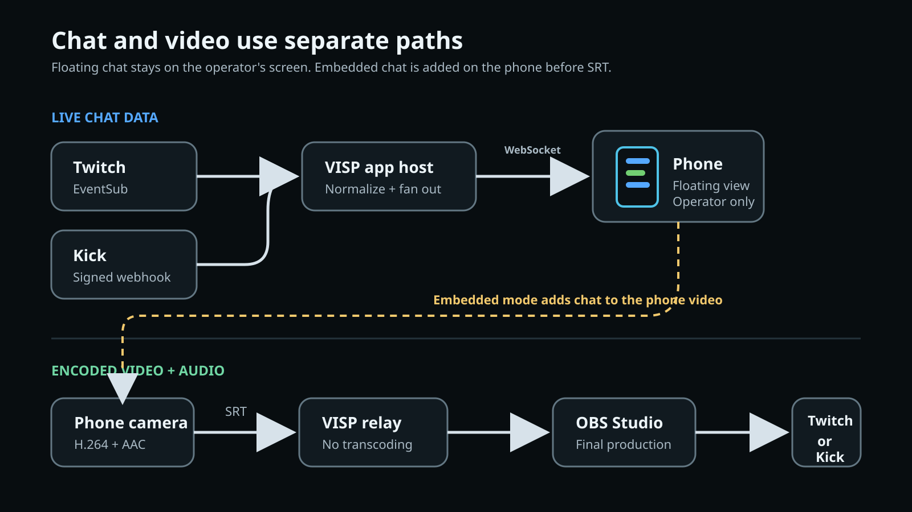

Voit seurata Twitchin ja Kickin chatteja yhdellä puhelimella OBS-lähetyksen
aikana näin: **yhdistä molemmat palvelutilit VISPiin, ota kummankin chat
käyttöön ja valitse puhelinsovelluksesta kelluva Floating-chat.** Molempien
kanavien viestit näkyvät silloin samassa siirrettävässä näkymässä kameran
esikatselun päällä, vaikka varsinainen tuotanto pyörii kotikoneen OBS:ssä.

Kelluva näkymä on vain kuvaajan apuväline. Se ei näy kameralähteessä eikä
valmiissa lähetyksessä. VISPin Embedded-tila voi haluttaessa piirtää chatin
pysyvästi puhelimen lähettämään kuvaan, mutta kyseessä on eri tuotantovalinta.

## Valitse ensin, kenen pitää nähdä chat

Chat-overlay voi tarkoittaa useaa eri asiaa. Päätä yleisö ennen asetusten
muuttamista.

| Tavoite | Paras lähtökohta | Kuka näkee chatin? |
| --- | --- | --- |
| Seuraa molempia chatteja käyttäessäsi puhelinta kamerana | VISPin **Floating**-tila | Vain kenttäkuvaaja |
| Pidä kameran esikatselu täysin puhtaana | VISPin **Hidden**-tila | Ei kukaan puhelimella |
| Liitä uusimmat viestit pysyvästi puhelimen kuvasignaaliin | VISPin **Embedded in stream** -tila | OBS ja katsojat aina lähteen ollessa lähetyksessä |
| Seuraa Kick-chattia tuotantokoneella | Kickin oma selainpaneeli OBS:ssä | Vain OBS-operaattori |
| Rakenna lähetykseen muokattava chat-grafiikka | Erillinen OBS Browser Source | Katsojat, erillisenä OBS-lähteenä |

Tämä opas käsittelee ensimmäistä vaihtoehtoa: yksityistä, yhdistettyä
mobiilinäkymää VISP-puhelinta etäkamerana käyttävälle sisällöntuottajalle. Jos
kamerapolku on vielä tekemättä, aloita oppaasta
[puhelimen käyttäminen OBS:n etäkamerana](/fi/blog/use-phone-as-remote-camera-obs).

OBS:ssä operaattorin paneeli ja ohjelmaan lisätty lähde ovat eri asioita.
Kickin [virallinen OBS-chat-paneelin ohje](https://help.kick.com/en/articles/7978574-how-to-create-a-kick-chat-dock-in-obs)
lisää chatin ponnahdusosoitteen kohtaan **Docks → Custom Browser Docks**. OBS:n
oma [chat-UKK](https://obsproject.com/kb/faq-stream-chat) puolestaan kertoo,
että katsojille näytettävä chat lisätään Browser Source -lähteenä. Paneeli on
tuottajalle; lähde voi päätyä lähetykseen.

## Mitä tarvitset?

- VISPin natiivisovelluksen kenttäpuhelimeen
- Twitch- tai Kick-tunnuksella luodun VISP-tilin
- toisen palvelutilin yhdistettynä VISPiin, jos haluat molemmat chatit
- chatin erikseen käyttöön jokaiselle seurattavalle palvelulle
- OBS:n vastaanottamaan puhelimen VISP-medialähteenä
- kuulokkeet ja testatun varakohtauksen kenttäsyötteelle

Kummankaan palvelun lähetysavainta ei tarvitse siirtää puhelimeen. Tässä
työnkulussa puhelin julkaisee kenttäsyötteen, VISP välittää sen ja OBS hallitsee
lopullista Twitch- tai Kick-kohdetta. Kahden chatin lukeminen ei myöskään
määritä OBS:ää monilähetykseen; kohdepalvelut pysyvät OBS:n vastuulla.

## 1. Yhdistä Twitch ja Kick muuttamatta lähetyskohdetta

Kirjaudu VISPiin tuotannon nykyisellä tunnuksella. Avaa puhelinsovelluksen
asetukset, laajenna **Advanced** ja etsi kohta **Connections**. Twitch ja Kick
näyttävät jonkin seuraavista tiloista:

- **Not linked**: palvelua ei ole yhdistetty tähän VISP-tiliin;
- **Linked · chat off**: kirjautuminen on käytettävissä, mutta chatin välitys
  ei ole päällä;
- **Chat connected**, **connecting**, **disconnected** tai **error**: chat on
  käytössä ja sovellus näyttää välitysyhteyden nykytilan.

Valitse toisen palvelun kohdalta **Link** ja viimeistele tunnistus selaimessa.
Tilin yhdistäminen ei kopioi lähetysavainta VISPiin eikä muuta OBS:n
suoratoistopalvelua. Vähintään yksi yhdistetty tili jää VISP-tilin
kirjautumistunnukseksi.

Ero kannattaa muistaa: yhdistäminen kertoo VISPille oikean kanavan, kun taas
chatin käyttöönotto käynnistää vain lukuun tarkoitetun viestipolun.

## 2. Anna Twitch-chatille lukuoikeus

Jos Twitch näyttää **Authorize**-painikkeen, valitse se ja hyväksy pyydetty
chat-oikeus. VISP pyytää tätä toimintoa varten Twitchin `user:read:chat`-scopea.
Twitch määrittelee sen oikeudeksi vastaanottaa chat-huoneen viestejä ja niihin
liittyviä ilmoituksia. Nykyinen
[EventSub-viite](https://dev.twitch.tv/docs/eventsub/eventsub-subscription-types/#channel-chat-message)
käyttää kanavalle lähetetyille viesteille `channel.chat.message`-tilausta.

VISP näyttää tämän lukupolun kautta viestit ja emotet. Mobiilin chat-näkymä ei
lähetä viestejä, anna aikakatkaisuja, estä käyttäjiä tai korvaa
moderointinäkymää. Erillinen lupa on tarkoituksellinen: pelkkä VISPiin
kirjautuminen ei ota chatin lukemista huomaamatta käyttöön.

Palaa hyväksynnän jälkeen **Connections**-kohtaan ja kytke Twitch-chat päälle.
Odota connected-tilaa ja lähetä vaaraton testiviesti toisella tunnuksella.
Tee testi ennen julkista lähetystä, jotta vanhentunut tai vaihtunut oikeus ei
paljastu vasta kentällä.

## 3. Ota Kick-chat käyttöön

Yhdistä Kick, jos sitä ei ole vielä liitetty, ja kytke chat päälle. VISP luo
Kickin `chat.message.sent`-tapahtumalle tilauksen. Kick toimittaa tapahtumat
VISP-palvelimelle allekirjoitettuina webhook-pyyntöinä. Palvelin tarkistaa
allekirjoituksen, aikaleiman ja viestitunnisteen ennen hyväksytyn viestin
välittämistä kirjautuneelle puhelimelle.

Kick kuvaa tapahtuman ja sen tietosisällön virallisessa
[kehittäjädokumentaatiossaan](https://github.com/KickEngineering/KickDevDocs/blob/main/events/event-types.md).
Tilauksen toimitustapa ja tarkistaminen löytyvät ohjeista
[Subscribe to events](https://github.com/KickEngineering/KickDevDocs/blob/main/events/subscribe-to-events.md)
ja [Webhook security](https://github.com/KickEngineering/KickDevDocs/blob/main/events/webhook-security.md).

Odota Kickin connected-tilaa ja lähetä toinen testiviesti. Kun sekä Twitch että
Kick ovat käytössä, niiden viestit voivat näkyä samassa tiiviissä
VISP-näkymässä. Overlay ei korvaa kummankaan palvelun koko
moderointikontekstia, ja yleisöillä voi olla erilaiset tavat sekä säännöt.

## 4. Pidä chat yksityisenä Floating-tilalla

Avaa **Settings → Chat overlay → Position** ja valitse **Floating**. Uudet
viestit ilmestyvät kameran esikatselun päälle tiiviiseen tummaan paneeliin.
Vedä paneeli pois kasvojen, kamerasäätimien, äänimittarin ja tarkennuksen
arviointiin käytetyn kuva-alueen päältä.

VISP muistaa kelluvan paneelin paikan erikseen pysty- ja vaaka-asennossa. Käännä
puhelin tuotannossa käytettävään asentoon ja sijoita paneeli. Jos kuvan suunta
voi vaihtua, tee sama myös toisessa asennossa. Tarkista molemmat asettelut
sovelluspäivityksen tai merkittävän näyttökoon muutoksen jälkeen.

Näkymässä säilyy vain pieni määrä uusimpia viestejä, jotka häipyvät lyhyen ajan
kuluttua. Näin kamera pysyy käyttökelpoisena, mutta ominaisuus ei ole haettava
chat-arkisto. Vilkkaassa keskustelussa palvelun omia työkaluja käyttävä
moderaattori on turvallisempi ratkaisu kuin jokaisen rivin lukemisen jättäminen
kuvaa sommittelevalle kenttäoperaattorille.

Floating-tila on tarkoituksella enkoodatun kamerakuvan ulkopuolella. OBS saa
puhtaan kuvalähteen, jota tuottaja voi rajata, vaihtaa, tallentaa ja käyttää
uudelleen ilman viestitekstiä.

## 5. Käytä Embedded-tilaa vain, jos chat kuuluu videokuvaan

iOS- ja Android-sovelluksissa on myös **Embedded in stream** -vaihtoehto sekä
kulman valinta. Tässä tilassa puhelin piirtää uusimmat viestit enkoodattuihin
kameraruutuihin ennen SRT-julkaisua. VISP välittää ruudut muuttamatta, eikä OBS
voi poistaa chattia jälkikäteen.

Embedded-tila voi sopia rentoon IRL-asetteluun, jossa chat on tarkoituksella osa
kenttäkameran kuvaa. Se on huono oletus yleiskäyttöiselle kameralähteelle,
koska:

- jokainen samaa lähdettä käyttävä OBS-kohtaus saa saman overlayn;
- overlay tallentuu ohjelmasta tehtyihin tallenteisiin ja klippeihin;
- asiaton viesti voi näkyä ennen moderaattorin toimia;
- kuvan rajaus voi leikata viestipaneelin;
- tuottaja ei voi muotoilla, piilottaa tai siirtää yksittäisiä viestejä OBS:ssä.

Jos valmis ohjelma tarvitsee suunnitellun chat-paneelin, pidä VISP **Floating**-
tai **Hidden**-tilassa ja rakenna katsojille näkyvä kerros erillisenä OBS Browser
Source -lähteenä. Silloin kohtauskohtainen hallinta säilyy ja puhdas kamera on
edelleen käytettävissä.

Embedded-tila toimii vain natiivisovelluksessa. VISPin selainjulkaisija voi
käyttää kelluvaa operaattorinäkymää, mutta se ei piirrä chattia WebRTC-videoon.

## Näin chat- ja videopolku pysyvät erillään

Puhelin vastaanottaa chatin ja julkaisee median eri reittejä pitkin:

1. Twitch-viestit saapuvat VISPin sovelluspalvelimelle Twitch EventSubin kautta,
   kun tunnistettu VISP-chatin katselija on aktiivinen.
2. Kick-viestit saapuvat sovelluspalvelimelle käyttöön otetun, allekirjoitetun
   webhook-tilauksen kautta.
3. VISP yhdenmukaistaa hyväksytyt viestit ja lähettää live-tapahtumat
   tunnistetulla WebSocket-yhteydellä puhelimeen.
4. Erikseen puhelin enkoodaa H.264-videon ja AAC-äänen ja julkaisee ne SRT:llä
   VISP-relaylle.
5. OBS lukee mediapolun ja lähettää valmiin ohjelman määritettyyn
   kohdepalveluun.

VISP ei tallenna tässä työnkulussa chat-historia-arkistoa. Uusimpia viestejä
pidetään vain aktiivisen asiakasnäkymän tarpeisiin. Siksi chat-yhteyden virhe ei
pysäytä SRT-julkaisua eikä mediayhteyden uudelleenmuodostus muuta palvelujen
käyttöoikeuksia.

Erottelu tekee myös rajat näkyviksi: VISP **ei transkoodaa** kamerasyötettä eikä
**bondaa verkkoyhteyksiä**. Floating-chat ei lisää pikseleitä lähtevään
videoon. Embedded-chat sommitellaan puhelimessa, ei relaylla. Jos kenttäyhteys
katkeaa kokonaan, chat ja puhelinkamera eivät voi käyttää sitä ennen yhteyden
palautumista. Suunnittele bittinopeus, SRT-palautus, varakohtaukset ja tarvittaessa
oikea bonding [mobiiliverkon kestävyysoppaan](/fi/blog/keep-stream-live-bad-mobile-network)
avulla.

## Testaa koko OBS-työnkulku

Tee yksi yksityinen harjoitus molemmilla palveluilla ennen yhdistetyn näkymän
käyttöä:

1. Käynnistä puhelimen esikatselu ja valitse chatille **Floating**.
2. Varmista, että Twitch ja Kick näyttävät connected-tilaa.
3. Lähetä kummassakin palvelussa helposti tunnistettava viesti toiselta tililtä.
4. Tarkista, että molemmat näkyvät eivätkä emotet peitä kamerasäätimiä.
5. Käynnistä puhelimen VISP-kamerasyöte ja varmista puhdas kuva OBS:ssä.
6. Tallenna lyhyt OBS-näyte ja varmista, ettei chat näy tallenteessa.
7. Käännä puhelinta ja tarkista tallennetut sijainnit pysty- ja vaaka-asennossa.
8. Poista toinen chat-yhteys käytöstä ja varmista, että toinen jatkaa.
9. Katkaise puhelimen verkko lyhyesti, palauta se ja seuraa chatin sekä median
   palautumista.
10. Varmista, että OBS-varakohtaus toimii kenttäkuvan ollessa poissa.

Usean kenttäpuhelimen tuotannossa päätä, tarvitseeko jokainen kuvaaja chatin.
Jokaisella puhelimella pitää silti olla oma VISP-julkaisulaite
[usean puhelimen IRL-oppaan](/fi/blog/multi-phone-irl-stream-obs) mukaisesti.
Chat-yhteydet kuuluvat kirjautuneelle sisällöntuottajatilille, mutta
mediatunnukset ovat laitekohtaisia.

## Ongelmatilanteet

### Twitch on yhdistetty, mutta näyttää Authorize-painikkeen

Yhdistetty Twitch-tunnus ei tällä hetkellä sisällä `user:read:chat`-oikeutta.
Valitse **Authorize** ja käy Twitchin hyväksyntä uudelleen läpi. Palaa
sovellukseen, ota Twitch-chat käyttöön ja odota connected-tilaa.

### Toinen palvelu toimii ja toinen on hiljaa

Tarkista ensin **Connections**, älä overlay-tilaa. Hiljaisen palvelun pitää olla
sekä yhdistetty että käytössä. Lähetä uusi viesti vasta connected-tilan jälkeen,
sillä näkymä välittää live-viestejä eikä vanhaa historiaa.

### Viestit katoavat liian nopeasti

Tämä on tiiviin live-näkymän normaali toiminta. Uusimmat viestit häipyvät,
etteivät ne peitä kameran esikatselua pysyvästi. Käytä palvelun omaa chat- tai
moderointityökalua, kun tarvitset historiaa.

### Chat näkyy OBS:ssä, vaikka Floating on valittu

Varmista, ettei OBS kaappaa puhelimen koko näyttöä tai erillistä chat Browser
Source -lähdettä. Floating-tila ei itsessään piirry VISP-kamerasyötteeseen.
Tallenna eristetty VISP-medialähde ja selvitä, mistä kerroksesta chat tulee.

### Embedded-chat ei näy selainjulkaisijassa

Embedded-tilan toteuttaa iOS- tai Android-sovelluksen videoenkooderi. Käytä
natiivisovellusta tai pidä kamera puhtaana ja lisää erillinen Browser Source
OBS:ään.

## Usein kysyttyä

### Voiko VISP näyttää Twitch- ja Kick-chatin yhtä aikaa?

Kyllä. Yhdistä ja ota käyttöön molemmat palvelut ja valitse Floating- tai
Embedded-tila. Tämä yhdistää live-viestit puhelinnäkymässä; se ei saa OBS:ää
lähettämään molempiin palveluihin.

### Voinko käyttää opasta vain Twitchillä tai vain Kickillä?

Kyllä. Jätä toinen yhteys pois käytöstä. Overlay toimii myös yhden palvelun
viesteillä.

### Voinko vastata tai moderoida VISP-chatista?

Et. Overlay on vain lukuun tarkoitettu live-näkymä. Käytä vastauksiin,
estoihin, aikakatkaisuihin ja chat-historiaan Twitchin tai Kickin omia
sisällöntuottaja- ja moderointinäkymiä.

### Näkyykö Floating-chat lähetyksessä tai tallenteessa?

Ei. Floating on operaattorin overlay sovelluksen esikatselun päällä.
Embedded-tila liitetään puhelimen enkoodattuun videoon, joten se voi näkyä
OBS:ssä, lähetyksessä ja tallenteissa.

## Lähteet ja seuraavat vaiheet

- [VISPin puhelin- ja selainsovellus](https://docs.visp-stream.com/fi/docs/phone-app)
- [VISPin chat- ja media-arkkitehtuuri](https://docs.visp-stream.com/fi/docs/architecture)
- [VISPin OBS-etäohjaus](https://docs.visp-stream.com/fi/docs/obs-remote-control)
- [Twitch EventSubin chat-viestit](https://dev.twitch.tv/docs/eventsub/eventsub-subscription-types/#channel-chat-message)
- [Twitchin käyttöoikeudet](https://dev.twitch.tv/docs/authentication/scopes/)
- [Kickin kehittäjädokumentaation tapahtumatyypit](https://github.com/KickEngineering/KickDevDocs/blob/main/events/event-types.md)
- [Kick-chat-paneeli OBS:ssä](https://help.kick.com/en/articles/7978574-how-to-create-a-kick-chat-dock-in-obs)
- [OBS:n chat-UKK](https://obsproject.com/kb/faq-stream-chat)

Jos kenttäpuhelimesi syöttää jo kuvaa OBS-studioon ja haluat molemmat live-chatit
kamerasäätimien viereen, [kokeile VISPiä](https://visp-stream.com): yhdistä
palvelut, aloita Floating-tilasta ja varmista puhdas OBS-tallenne ennen seuraavaa
lähetystä.
