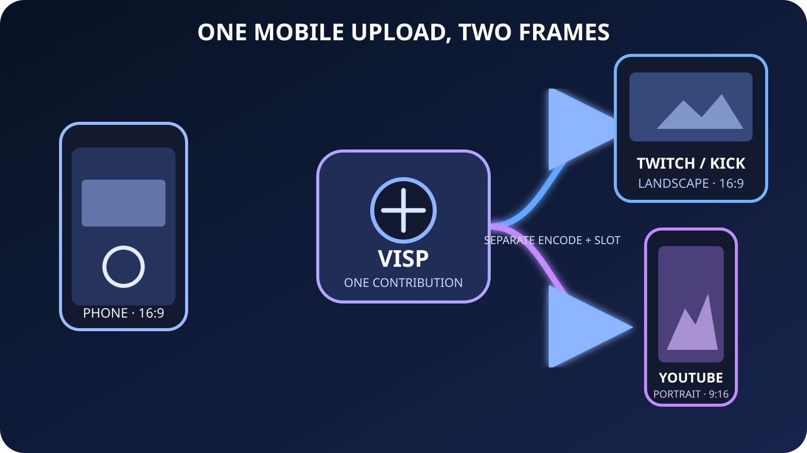

A landscape IRL stream still fits Twitch and Kick well. YouTube offers a
different opportunity. Its vertical live feed fills a phone screen and can
surface live broadcasts while people browse Shorts. Sending the same untouched
16:9 picture everywhere wastes that portrait canvas, but asking the field phone
to encode and upload two feeds makes a fragile mobile setup harder to run.

VISP Portrait Direct output takes a simpler route. The phone sends one
landscape contribution. The relay keeps that full frame for Twitch or Kick,
then makes a separate 9:16 crop for YouTube. You choose the crop before going
live, and each destination starts, retries, and reports errors independently.

This guide is for a Twitch or Kick creator who wants a separate vertical
YouTube broadcast without running OBS. It is not Twitch Dual Format and it does
not create YouTube's two-format broadcast on one channel. Those differences
matter, so the setup starts with the signal path rather than the crop controls.

## The short answer

Use this workflow:

1. Hold the phone in landscape and frame the person or main action near the
   center.
2. Enable one landscape Direct destination, either Twitch or Kick.
3. Add YouTube as the portrait destination.
4. Move and size the 9:16 crop in VISP, then save it.
5. Go live once from the phone.
6. Check the landscape platform and YouTube's mobile vertical live feed from
   separate muted devices.

The phone still uploads one H.264/AAC contribution. VISP runs a separate
H.264/stereo-AAC distribution encode for each selected destination. The
landscape output keeps the original frame, while the portrait output crops and
scales the selected area to 1080×1920. Each output consumes one Direct
forwarder slot and uses relay CPU and outbound bandwidth.

Read the [Portrait Direct output documentation](https://docs.visp-stream.com/docs/portrait-direct-output)
before a major event. The feature is available only on accounts where Portrait
Direct output is enabled.

## Know what the platforms will receive

This setup creates two separate broadcasts on two providers. It does not send
two formats under one stream page or combine their chats.

| Destination | Video | Viewer experience |
| --- | --- | --- |
| Twitch or Kick | Full landscape program | The normal channel stream and chat |
| YouTube | Saved 9:16 crop | A separate public YouTube live broadcast that may appear in the vertical live feed |

YouTube says vertical live streams can appear to people browsing Shorts, not
only to existing subscribers. Its [current live-streaming guide](https://support.google.com/youtube/answer/2474026?hl=en)
also says the vertical feed is mobile-first. Scheduled live streams and
Premieres do not appear there, and the [viewer guide](https://support.google.com/youtube/answer/13822251?hl=en)
currently limits the vertical live feed to the YouTube phone app rather than
tablets.

VISP Direct creates a new public YouTube broadcast when publishing starts and
uses automatic start and stop. Set the YouTube title in VISP before the test.
Then verify the public watch page instead of assuming that a successful relay
status proves discovery or playback.

For the landscape side, choose the provider where the existing community
lives. Twitch permits simulcasting under its current
[Simulcasting Guidelines](https://help.twitch.tv/s/article/simulcasting-guidelines?language=en_US),
but the Twitch experience cannot be worse than another service and the stream
must not push viewers away to the concurrent broadcast. Keep platform-specific
chat or calls to action out of the shared camera picture.

Kick's [May 2026 multistreaming guide](https://help.kick.com/en/articles/11091744-multistreaming-on-the-kick-partner-program)
says Partner Program streamers must use Kick's multistreaming control for other
long-form services. The same guide treats vertical services such as YouTube
Shorts separately. Check the live Kick guidance and your own agreement before
the event because program rules can change.

## 1. Compose one useful landscape master

Portrait Direct crops the landscape source. It cannot follow a face, reveal
picture outside the captured frame, or build a second camera angle. The useful
master is therefore a slightly wider landscape shot with the main action kept
inside the middle of the frame.

Before starting the encoder:

- lock the phone in landscape;
- choose the camera, resolution, frame rate, and microphone;
- keep faces and hands away from the far left and right edges;
- keep burned-in captions inside the future portrait crop;
- rehearse turns, walking, and two-person conversations at the widest expected
  spacing.

The default full-height 9:16 crop uses only the central part of a 16:9 picture.
A landmark at the edge may look good on Twitch and disappear completely on
YouTube. Centering everything is not always good cinematography, but it is a
practical starting point when one camera must serve both frames.

Do not rotate the phone while live. The native app fixes orientation when the
capture session starts. Stop, change orientation, reframe both outputs, and
start again if the physical setup changes.

The [VISP phone app guide](https://docs.visp-stream.com/docs/phone-app) covers
camera and microphone selection. For a conservative starting resolution and
frame rate, use the [IRL bitrate guide](/blog/best-bitrate-irl-streaming-phone-obs)
and [30 FPS versus 60 FPS guide](/blog/30-vs-60-fps-irl-streaming). The extra
Direct destination does not add a second phone upload, but it does not rescue
a contribution that is already too ambitious for the route.

## 2. Authorize the two providers

Open **Direct output** in the VISP dashboard or phone settings. Authorize
streaming for the landscape provider and YouTube. VISP asks the providers for
the required permission. It does not ask you to paste a stream key into the
phone.

Enable Twitch or Kick as the normal landscape destination. Do not also enable
YouTube as a normal landscape destination if YouTube will be the portrait
destination. VISP assigns one role per provider in this workflow, so the same
provider cannot be both the landscape and portrait output.

This is also why the setup is not a replacement for YouTube's own dual-stream
feature. YouTube can accept horizontal and vertical encoder feeds under one
shared broadcast when configured in YouTube Studio. VISP Portrait Direct
instead sends a landscape broadcast to one provider and a separate portrait
broadcast to another. Use YouTube's documented dual-stream workflow when one
YouTube page, one notification, and one shared chat are requirements.

If OBS is open for monitoring or local recording, it may read the VISP
contribution. Do not let OBS publish to Twitch or Kick while Direct owns that
same destination. Two publishers using one channel destination can interrupt
each other. The [Direct output guide](https://docs.visp-stream.com/docs/direct-output)
explains the difference between the untouched relay-to-OBS feed and Direct's
per-destination encodes.

## 3. Add and save the portrait output

Beside YouTube, choose **Add portrait output**. VISP opens the latest landscape
preview with a movable 9:16 box and a simulated portrait preview.

Move the box until the main subject stays inside it. Resize only when a tighter
or looser crop helps the real scene. A smaller crop makes the subject larger in
the 1080×1920 output, but it also throws away more source pixels and gives the
operator less room to move. A full-height crop is the safest first test for a
walking IRL stream.

Choose **Save framing**. The save is explicit. Closing the editor without a
successful save does not apply an unfinished crop. Framing controls work in the
web dashboard and native phone settings, including keyboard and accessibility
input in the web editor.

The crop stays fixed until you edit and save it again. There is no automatic
subject tracking. If the creator walks from one side of a market stall to the
other, the portrait viewer may lose the action while the landscape viewer still
sees it. Rehearse the actual movement or assign someone to keep the action in
the shared safe area.

## 4. Check capacity before the real broadcast

Landscape and portrait each consume one forwarder slot. VISP lets you save the
portrait setup while the relay is full and warns about capacity. At Go Live, a
full relay may start the landscape output while marking portrait as failed.
That behavior protects the main broadcast, but it is still a failed test if the
goal was vertical discovery.

Start a private or low-stakes rehearsal and check the status shown for each
destination. Confirm that both reach **live**, then leave them running long
enough to cover the most difficult part of the expected route. A setup that
survives one minute on Wi-Fi has not proved a walking cellular stream.

Because Direct performs two distribution encodes, also watch for relay-capacity
errors and platform-specific failures. One destination retry does not stop the
other. That isolation is useful, but it means the creator must look at both
statuses rather than treating one green badge as proof of the whole show.

## 5. Verify the two real viewer paths

Use separate muted playback devices so audio does not feed back into the phone
microphone. Check these points:

1. **VISP contribution.** The phone reports a stable live connection and the
   expected bitrate, loss, and reconnect state.
2. **Twitch or Kick channel.** The landscape frame is complete, audio is in
   sync, and no YouTube-only message is burned into the picture.
3. **YouTube watch page.** VISP created the intended public broadcast with the
   saved title and live audio.
4. **YouTube phone app.** The stream fills the portrait viewer and important
   action stays clear of chat and player controls.
5. **Recovery.** A brief contribution loss, provider retry, or portrait error
   does not leave the creator unaware that only one destination recovered.

YouTube discovery is not guaranteed. A correct 9:16 stream can be eligible for
the vertical feed without being shown to a particular viewer. Verify the
format and watch page you control. Do not promise reach based on one technical
setting.

Chat also remains separate. VISP can show Twitch, Kick, and YouTube messages in
the phone's private Floating chat, but viewers on each service use that
service's own chat. Keep the combined chat private during a Twitch simulcast.
The [phone chat guide](/blog/twitch-kick-chat-phone-obs) explains the difference
between private Floating chat and chat burned into the video.

## When this is the wrong workflow

Use another path when the goal is different:

- **Both formats on Twitch.** Use Twitch Dual Format with a compatible OBS and
  Aitum setup. Follow the [Twitch horizontal and vertical guide](/blog/twitch-dual-format-phone-obs).
- **Both formats on one YouTube broadcast.** Configure YouTube's native dual
  stream with its two encoder keys so viewers share one page and chat.
- **Different scenes, graphics, or audio per platform.** Use OBS or another
  production system that can build two complete programs. Portrait Direct is a
  manual crop of one program, not a second scene collection.
- **Automatic face tracking.** Use a camera or production tool that provides
  tracking. VISP saves a fixed crop.
- **No spare relay capacity.** Publish the main landscape destination first and
  add portrait only after capacity is confirmed.

Portrait Direct is useful because it stays narrow. One phone upload remains the
source of truth, while the relay makes a full landscape output and one fixed
portrait output. There is no second field encoder to operate and no home OBS
computer to keep running.

To try it, [set up VISP Direct](https://docs.visp-stream.com/docs/direct-output),
authorize Twitch or Kick plus YouTube, and run a short two-device rehearsal.
If the portrait control is not present on your account, keep the landscape
workflow and wait until the feature is enabled rather than building a live
show around an unavailable switch.

## Sources

- [YouTube Help: Get started with live streaming](https://support.google.com/youtube/answer/2474026?hl=en)
- [YouTube Help: Watch and interact with vertical live streams](https://support.google.com/youtube/answer/13822251?hl=en)
- [Twitch: Simulcasting Guidelines FAQ](https://help.twitch.tv/s/article/simulcasting-guidelines?language=en_US)
- [Kick: Multistreaming on the Kick Partner Program](https://help.kick.com/en/articles/11091744-multistreaming-on-the-kick-partner-program)
- [VISP: Portrait Direct output](https://docs.visp-stream.com/docs/portrait-direct-output)
- [VISP: Direct output](https://docs.visp-stream.com/docs/direct-output)
- [VISP: Phone and browser app](https://docs.visp-stream.com/docs/phone-app)
