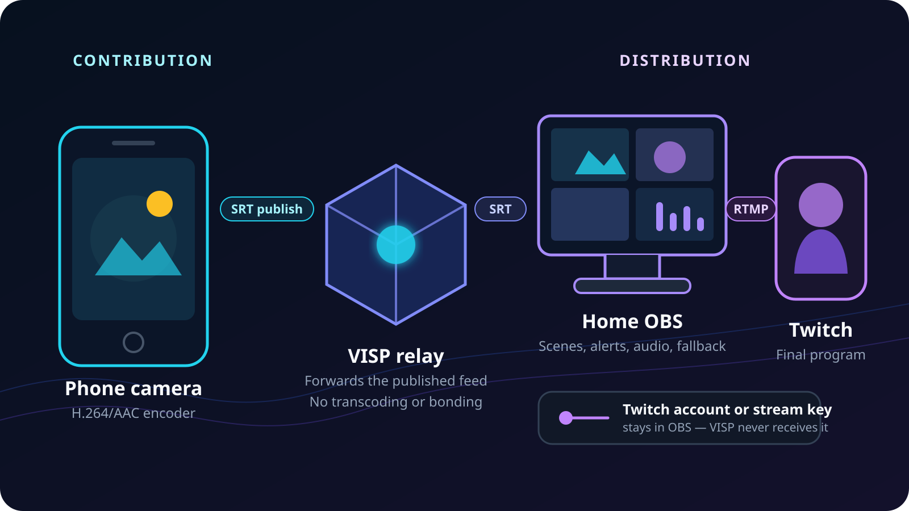

To stream on Twitch from your phone **through OBS**, treat the phone as a
remote camera rather than the final Twitch encoder. The phone sends its camera
and microphone to VISP, OBS receives that feed as a source, and OBS sends the
finished program to Twitch.

This route makes sense when you want to keep your existing scenes, alerts,
local microphones, recordings, and fallback content at home. It also keeps the
Twitch stream key off the field phone. If one phone camera is the whole show,
Twitch's direct mobile workflow is shorter and usually the better starting
point.

## Choose direct mobile streaming or the OBS route

Twitch's official
[mobile IRL guide](https://www.twitch.tv/creatorcamp/en/level1/going-live/stream-on-mobile-irl/)
shows the direct route: open the Twitch app, allow the camera and microphone,
set the stream information, and go live. Twitch's broader
[mobile-streaming guide](https://help.twitch.tv/s/article/getting-started-on-twitch?language=en_US)
also lists dedicated mobile encoders. Those options are a good fit when the
phone owns the whole production.

The VISP route solves a different problem. It turns the phone into one managed
source inside an OBS studio:

| Production need | Better starting route |
| --- | --- |
| One phone, no home computer, fastest setup | Twitch app or a direct mobile encoder |
| Existing OBS scenes, alerts, graphics, and studio audio | Phone → VISP → OBS → Twitch |
| Local fallback while the field phone reconnects | Phone → VISP → OBS → Twitch |
| Twitch stream key must stay off the field phone | Phone → VISP → OBS → Twitch |
| Several independent field cameras | One VISP device per phone, mixed in OBS |

The OBS route is not automatically more reliable. It adds a relay, a home
computer, and a home internet connection. Choose it because those pieces give
you production control you need, not because a longer signal path is
inherently safer.

## Understand the two independent streams

There are two encoder connections in this workflow:

1. **Contribution:** the phone encodes its camera and microphone as H.264/AAC
   and publishes over SRT to its authenticated VISP path.
2. **Distribution:** OBS reads that source, composes the scene, encodes the
   final program, and sends it to Twitch.

VISP handles only the contribution leg. It relays the phone feed into OBS and
manages access to that path. It does not receive or proxy the Twitch stream
key. Twitch documents that its ingest authorizes the final RTMP broadcast with
a [stream key](https://help.twitch.tv/s/article/twitch-stream-key-faq?language=en_US);
that authorization belongs in OBS, not in the VISP phone app or dashboard.

The two legs also have separate bandwidth budgets. The phone can reach VISP
cleanly while OBS drops frames on the way to Twitch. The opposite can happen
too: OBS can maintain a healthy Twitch broadcast while the field camera
reconnects and a local fallback remains on air. The
[phone-to-OBS bitrate guide](/blog/best-bitrate-irl-streaming-phone-obs)
shows how to size these budgets independently.

## What you need

- An iPhone or Android phone supported by the
  [VISP phone app](https://docs.visp-stream.com/docs/phone-app)
- OBS Studio 31 on the home computer for the current VISP plugin, or a manual
  OBS Media Source created from the dashboard
- A VISP account signed in with Twitch
- A Twitch channel configured for broadcasting
- Enough phone upload for the contribution, home download for that feed, and
  home upload for the final Twitch program
- Headphones and a second muted device for the final check

Keep the credentials separate. A VISP publish URL authorizes one camera path.
The Twitch stream key authorizes a broadcast to the channel. Twitch says not
to share or display that key; VISP does not need it.

## 1. Sign in with Twitch and create the phone source

Open the VISP app on the field phone and choose **Continue with Twitch**. The
app creates a publishing device for that installation and stores its SRT
publish URL in protected platform storage. You normally do not copy the URL by
hand.

Give the device a durable name such as “roaming phone” or “stage left.” Each
phone should have its own VISP device and revocable credential. Reusing one
device between phones makes access harder to revoke and does not create a
backup: only one publisher can own a VISP path at a time.

If you prefer Larix, Moblin, or another mobile encoder, create the device in
the dashboard and copy its sending URL into that app. The
[video-source documentation](https://docs.visp-stream.com/docs/video-source)
covers the manual SRT and RTMP paths.

Signing in with Twitch identifies the VISP account. It does not make the phone
the Twitch destination and it does not give VISP the channel's stream key.

## 2. Add the phone feed to OBS

Install the VISP plugin, restart OBS, then open **Tools → VISP Remote
Control**. Choose **Sign in with browser**, approve the device code, select the
phone, and add it to the intended scene. The plugin creates or refreshes an OBS
Media Source with the authenticated read URL.

The plugin makes outbound HTTPS and WSS connections. It does not expose an
inbound OBS control port. Its machine token is limited to device and
OBS-control operations; the
[OBS remote-control documentation](https://docs.visp-stream.com/docs/obs-remote-control)
explains pairing, revocation, and recovery.

You can instead download the generated scene collection from the VISP
dashboard and import it with **Scene Collection → Import**. It includes one
Media Source per current device plus a fallback scene. Treat any revealed read
URL like a password: rotating the account-wide read credential invalidates all
existing VISP Media Sources in OBS.

## 3. Set the phone contribution quality

Choose the phone camera, orientation, microphone, resolution, and frame rate
before starting the public broadcast. For moving IRL video on cellular,
720p30 is a practical first test. Raise the format only after the actual route
holds the contribution bitrate with margin.

These settings describe the phone-to-VISP feed, not the OBS-to-Twitch output.
VISP does not transcode the incoming video to a different resolution or
bitrate. VISP Native can duplicate packets over cellular and Wi-Fi, but it does
not combine their capacity. If neither network can carry the feed, the relay
cannot create the missing bandwidth.

Start the phone contribution and wait for its dashboard row to show **Live**.
Watch the source in OBS for several minutes, move as you will during the real
stream, and speak into the actual microphone. If the field and studio both
capture the same sound, mute or align one path deliberately; two delayed
copies create an echo.

## 4. Connect OBS to Twitch

In OBS, open **Settings → Stream**, select **Twitch**, and use **Connect
Account** when available. Twitch currently recommends this account connection
for its OBS Enhanced Broadcasting setup. A manual stream key also works, but
it should still remain only in OBS.

Twitch's
[video-broadcast documentation](https://dev.twitch.tv/docs/video-broadcast/)
describes the final path: a software encoder sends the program by RTMP to a
Twitch ingest endpoint, where the stream key authorizes it. That is separate
from the SRT contribution entering OBS through VISP.

Run OBS's **Tools → Auto-Configuration Wizard** for the home computer and
connection instead of copying another creator's output profile. The
[official OBS quick-start guide](https://obsproject.com/kb/quick-start-guide)
explains that the wizard considers the computer's resources and network
conditions, and recommends recording or streaming a short test before the real
broadcast.

If you enable
[Twitch Enhanced Broadcasting](https://help.twitch.tv/s/article/enhanced-broadcasting?language=en_US),
leave its automatic configuration enabled for the first test. It can make OBS
send multiple viewer renditions and therefore changes the home computer's
encoding and upload load. It does not change the bitrate or reliability of the
phone's separate VISP contribution.

## 5. Set the Twitch title and category

Update the title and category before the public start. You can do that in the
Twitch Creator Dashboard. The VISP phone app can also search Twitch categories
and update those fields after you grant the
`channel:manage:broadcast` permission documented by Twitch's
[Modify Channel Information API](https://dev.twitch.tv/docs/api/reference/#modify-channel-information).

That permission is limited to channel metadata. It does not reveal the Twitch
stream key to VISP. Media publishing, chat access, metadata editing, and the
final Twitch destination are separate permissions and connections.

If you follow chat on the field phone, use VISP's private **Floating** view
when messages are only for the operator. Use **Embedded** only when you
deliberately want chat composited into the phone video. The
[Twitch and Kick mobile-chat guide](/blog/twitch-kick-chat-phone-obs)
explains the privacy and production difference.

## 6. Test the whole path before viewers arrive

Use this order so a failure points to one stage:

1. Start the phone's VISP contribution.
2. Confirm the device is **Live** in VISP and visible in the correct OBS scene.
3. Check the phone microphone in the OBS mixer with headphones.
4. Record a short local OBS sample and inspect framing, motion, and sync.
5. Disconnect the phone briefly and confirm the local fallback appears.
6. Reconnect the phone and confirm the Media Source recovers.
7. Set the Twitch title and category.
8. Start a bandwidth test with
   [Twitch Inspector](https://inspector.twitch.tv/) before a public broadcast.
9. Start the real Twitch output from OBS only after both legs are healthy.
10. Check the public channel from a second muted device.

Twitch's broadcast documentation supports a bandwidth-test flag that keeps a
test out of the public viewing path while Inspector measures it. Do not append
anything to a key from memory; follow Twitch Inspector's current instructions
for the connected OBS profile.

The
[encoders and fallback documentation](https://docs.visp-stream.com/docs/broadcaster-setup)
includes an Advanced Scene Switcher recipe that waits before cutting to a
recovered source and before returning to fallback. That delay avoids rapid
scene changes during a shaky reconnect.

## Troubleshoot the stage that failed

**The phone says live, but OBS is blank:** check whether the device is
**Live** in the VISP dashboard. If not, troubleshoot the phone-to-relay
connection. If it is live, verify OBS has the current read URL and no second
publisher is competing for the same path.

**OBS preview works, but Twitch stays offline:** the VISP leg is already
healthy. Recheck the Twitch account or key under **Settings → Stream**, then
test the OBS-to-Twitch connection with Inspector.

**OBS reports dropped network frames:** that points to the home-to-Twitch
upload. OBS's
[connection troubleshooting guide](https://obsproject.com/kb/stream-connection-troubleshooting/)
defines dropped frames as an unstable connection or one that cannot sustain
the configured bitrate. Lower or cap the final output bandwidth and test the
home route; changing the phone's SRT latency will not repair this leg.

**The phone feed freezes while Twitch remains live:** that points to the
contribution leg. Lower the phone bitrate, run VISP's relay latency probe, and
test the field network. The
[bad-mobile-network guide](/blog/keep-stream-live-bad-mobile-network) shows how
SRT recovery, reconnection, and an OBS fallback work together.

**OBS rendering or encoding lag rises:** that is a local processing problem,
not proof of network loss. The computer is decoding the remote source,
rendering the scene, and encoding the final output. Reduce scene or output
load and retest before changing unrelated network settings.

## Know what VISP does not do

VISP is an authenticated SRT/RTMP relay and control plane for contribution
feeds. It does not host OBS, mix scenes on the server, send the finished
program to Twitch, transcode video, or bond network connections. The phone
encodes the field feed, OBS builds and encodes the show, and Twitch receives
the final output directly from OBS.

That separation is the point of the workflow: the phone becomes a managed
camera inside your existing Twitch production without becoming the owner of
the channel output.

If that is the production you need, follow the
[VISP getting-started guide](https://docs.visp-stream.com/docs/get-started),
add the phone to a test scene, and prove both network legs and the fallback
before your next Twitch stream.
