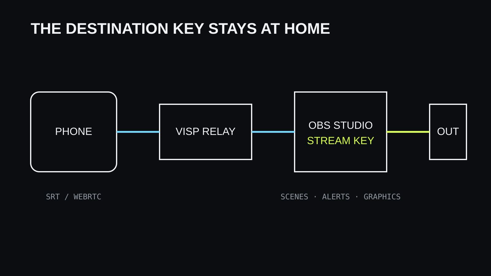

Voit käyttää puhelinta OBS:n etäkamerana julkaisemalla sen kameran ja
mikrofonin VISP-laitteeseen, lisäämällä laitteen OBS:n medialähteeksi ja
lähettämällä valmiin ohjelman OBS:stä Twitchiin tai Kickiin. Puhelin ei tarvitse
kohdepalvelun lähetysavainta, ja nykyiset kohtaukset, hälytykset, grafiikat sekä
enkoodausasetukset pysyvät kotikoneella.

VISPin oletuslähtö on Direct, jossa relay lähettää puhelimen kuvan suoraan
Twitchiin, Kickiin tai YouTubeen ilman OBS:ää. Tämä opas käsittelee
valinnaista OBS-työnkulkua, kun haluat puhelimen osaksi olemassa olevaa
OBS-tuotantoa.

## Mitä tarvitset

- Twitch-, Kick- tai Google-tunnuksella luodun VISP-tilin
- OBS Studion kotikoneella
- helpointa käyttöönottoa varten VISP Remote Control -lisäosan tai käsin
  määritetyn medialähteen
- vähintään iOS 16.4:ää tai Android 7:ää käyttävän puhelimen tai modernin selaimen
- vakaan lähetysyhteyden puhelimelle ja vakaan yhteyden OBS:lle

Ylläpidetty beta on nopein tapa aloittaa. VISPin voi myös ylläpitää itse, mutta
palvelinten, relay-yhteyden, TLS:n, palomuurin ja kirjautumisen hoitaminen on
erillinen infrastruktuuritehtävä.

## Ymmärrä signaaliketju

Puhelin on kuvalähde, ei lopullinen lähettäjä. VISP-sovellus enkoodaa H.264-kuvan
ja AAC-äänen ja julkaisee ne SRT:llä. Selainjulkaisija käyttää WebRTC:tä. Relay
tunnistaa laitteen ja antaa OBS:lle suojatun lukuosoitteen.

OBS yhdistää kameran paikallisiin lähteisiin ja lähettää valmiin ohjelman
suoratoistopalveluun. Siksi puhelimen lyhyt verkkokatko ei automaattisesti päätä
lähetystä: OBS voi näyttää paikallista varakohtausta yhteyden palautuessa.

Tällä polulla relay ei transkoodaa syötettä. Valitse tarkkuus, kuvataajuus ja
bittinopeus, jotka puhelin ja mobiiliyhteys kestävät. VISP-sovelluksen
valinnainen **Network bonding** voi käyttää Wi-Fiä ja mobiiliyhteyttä yhdessä;
lue [mobiiliverkon kestävyysopas](/fi/blog/keep-stream-live-bad-mobile-network),
jos reitillä on heikkoa peittoa.

## 1. Kirjaudu ja luo puhelimelle laite

Kirjaudu VISPiin tuotannossa käyttämälläsi Twitch-, Kick- tai Google-tunnuksella.
Käyttöönotto kysyy, missä lähetät suorana. Twitch, Kick ja YouTube käyttävät
Directiä; **Muu kohde** ohjaa syötteen OBS:n kautta. Jos kävit käyttöönoton jo
Directillä, vaihda hallintapaneelin **Tila**-valikosta (**Tila: Suora ·
vaihda**) **Puhelimesta omaan OBS:ään**, jotta vain OBS lähettää alustalle. Kun
VISP-sovellus kirjautuu samalla tilillä, se luo tai ottaa käyttöön puhelimen
julkaisulaitteen.
Jokainen laite vastaa yhtä kuvalähdettä ja saa oman peruutettavan tunnuksen.

Anna laitteelle kuvaava nimi, kuten ”liikkuva puhelin”, ”lava vasen” tai
”vieraskamera”. Nimet helpottavat työskentelyä, kun OBS:ssä on useita lähteitä.

## 2. Yhdistä OBS-lisäosa

Asenna käyttöjärjestelmääsi sopiva VISP Remote Control -lisäosa. Avaa OBS:ssä
**Tools → VISP Remote Control**, valitse **Sign in with browser** ja hyväksy
näytetty laitekoodi selaimessa.

Lisäosa käyttää rajattua satunnaista konetunnusta. HTTPS noutaa kertakäyttölipun,
ja reaaliaikainen ohjaus käyttää ulospäin suuntautuvaa WSS-yhteyttä. OBS ei avaa julkista etäohjausporttia. Valitse
puhelin ja lisää se haluttuun kohtaukseen; lisäosa luo medialähteen oikealla
lukuosoitteella ja palautumisasetuksilla.

## 3. Määritä puhelimen kamera

Salli kameran ja mikrofonin käyttö ja valitse objektiivi. Aloita asetuksilla,
joille verkossa jää riittävästi marginaalia. Mobiilikäytössä 720p tai maltillinen
1080p on usein luotettavampi kuin sensorin suurin tarkkuus.

Tarkista kuvan suunta, mikrofoni ja äänitaso ennen lähetystä. SRT tarvitsee
riittävän viiveikkunan pakettien uudelleenlähetykseen, kun mobiiliverkon viive
vaihtelee. VISP-sovellus käyttää kiinteää kahden sekunnin SRT-viivettä ja säätää
bittinopeutta itse. Kolmannen osapuolen enkooderille mittaa viive
hallintapaneelin **Edistynyt**-välilehdellä kentällä käytettävästä verkosta.

## 4. Testaa ennen julkista lähetystä

Käynnistä puhelimen julkaisu ennen kuin OBS lähettää Twitchiin tai Kickiin.
Varmista OBS:ssä, että:

1. oikea kamera näkyy oikeassa kohtauksessa;
2. liike pysyy tasaisena useita minuutteja;
3. ääni päätyy oikealle mikserikanavalle;
4. ääni ja kuva pysyvät synkronissa;
5. puhelimen pysäytys ja uudelleenkäynnistys palauttavat lähteen;
6. pakotettu verkkokatko käynnistää suunnitellun varatoiminnon.

Käytä ääntä tarkistaessasi kuulokkeita. Jos sama tila kuuluu kahden mikrofonin
kautta, mykistä tai viivästä toinen lähde kaiun poistamiseksi.

## 5. Aloita lähetys ja ohjaa etänä

Kun puhelimen kuva toimii vakaasti OBS:ssä, aloita varsinainen lähetys.
VISP-sovellus voi näyttää chatin ja lähetyksen tilan sekä lähettää tunnistettuja
käynnistys-, pysäytys- ja kohtauskomentoja yhdistetylle lisäosalle.

Vahvista aina sovelluksen näyttämä OBS-tila sen sijaan, että painaisit komentoa
toistuvasti. Nimeä live-, vara- ja muut kohtaukset yksiselitteisesti.

## Selain ja muut enkooderit

Selainjulkaisija sopii vieraalle tai laitteelle, johon sovellusta ei haluta
asentaa. Se julkaisee H.264-mediaa WHIP/WebRTC:llä. Jos verkko estää sekä UDP-
että TCP-pohjaisen WebRTC-median, käytä natiivia SRT-sovellusta.

Larix Broadcaster ja Moblin voivat julkaista VISPiin generoidulla SRT-osoitteella:
valitse **Laitteet**-välilehdellä **Lisää laite** ja kopioi lähetysosoite.
RTMP kannattaa jättää varavaihtoehdoksi tilanteisiin, joissa sovellus ei tue
SRT:tä tai verkko estää UDP:n (osoite näkyy asetuksella **Näytä RTMP- ja
SRTLA-vara-osoitteet**).

## Ongelmatilanteet

### Puhelin näyttää live-tilaa, mutta OBS on tyhjä

Varmista VISPistä, että sama laite on aktiivinen ja OBS käyttää sen
lukuosoitetta. Odota seuraavaa avainruutua. Jos tunnukset on vaihdettu, päivitä
medialähde tai tuo uusi kohtauskokoelma.

### Kuva jäätyy mobiiliverkossa

Pienennä bittinopeutta, ota mukautuva bittinopeus käyttöön ja kasvata SRT-viivettä
todellisessa käyttöverkossa tehdyn mittauksen perusteella.

### Ääni kaikuu

Etsi päällekkäinen äänireitti. Tavallisia syitä ovat OBS-paluuääni puhelimen
kaiuttimessa, kaksi samassa tilassa olevaa puhelinta tai yhtä aikaa avoinna oleva
paikallinen ja etämikrofoni.

## Usein kysyttyä

### Tarvitseeko puhelimeen asentaa OBS?

Ei. OBS toimii kotikoneella. Puhelin julkaisee vain kameran ja mikrofonin ja voi
haluttaessa lähettää etäkomentoja.

### Voiko kaksi puhelinta käyttää samaa VISP-laitetta?

Ei samanaikaisesti. Yksi julkaisija omistaa yhden polun. Luo jokaiselle
puhelimelle oma laite.

### Lähettääkö VISP suoraan Twitchiin tai Kickiin?

Voi: oletuksena oleva Direct lähettää puhelimen kuvan relaylta Twitchiin,
Kickiin tai YouTubeen. Tämän oppaan OBS-työnkulussa OBS lähettää valmiin
ohjelman kohteeseen, joten kohtaukset, grafiikat ja lähetysavain pysyvät
kotona.

## Lisätietoja

- [VISP: aloita tästä](https://docs.visp-stream.com/fi/docs/get-started)
- [Direct-lähtö](https://docs.visp-stream.com/fi/docs/direct-output)
- [Puhelin- ja selainsovellus](https://docs.visp-stream.com/fi/docs/phone-app)
- [OBS-etäohjaus](https://docs.visp-stream.com/fi/docs/obs-remote-control)
