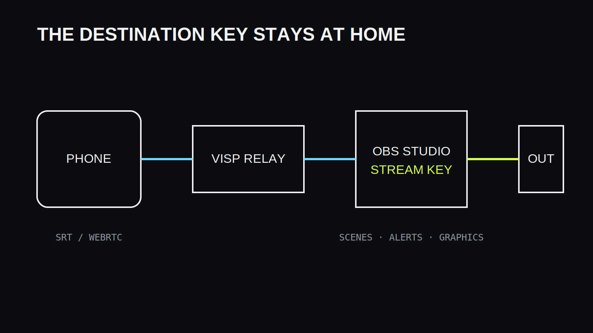
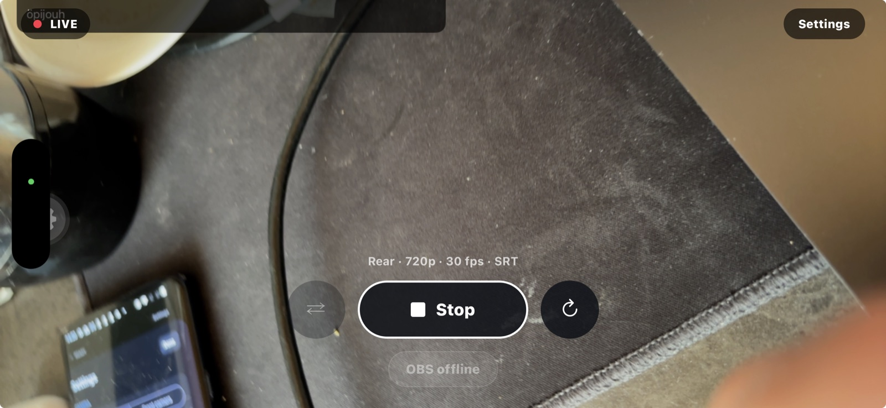

To use a phone as a remote OBS camera over the internet, **publish the phone's
camera and microphone to a VISP device, add that device to OBS as a media
source, and let OBS send the finished show to Twitch or Kick.** The phone does
not need your destination stream key, and your existing OBS scenes, alerts,
graphics, and encoder settings remain at home.

This is different from using a phone as a USB or local Wi-Fi webcam. The field
phone can be in another building or city as long as it can reach the VISP
relay, and the home OBS computer can read the authenticated feed.

## What you need

- A VISP account signed in with Twitch or Kick
- OBS Studio on the home computer
- The VISP Remote Control plugin for the simplest OBS setup, or a media source
  configured manually
- An iPhone running iOS 16.4 or newer, an Android device running Android 7 or
  newer, or a modern browser with camera access
- A stable upload connection for the phone and a stable connection for OBS

The hosted beta is the fastest place to begin. VISP can also be self-hosted,
but operating the application, relay, TLS, authentication callbacks, and
firewall is a separate infrastructure task.

## Understand the signal path

The phone is a source, not the final broadcaster. In the native VISP app it
encodes H.264 video and AAC audio and publishes over SRT. The browser publisher
uses WebRTC. The relay authenticates the publishing device and makes the feed
available to OBS.

OBS receives that camera, combines it with local sources, and publishes the
program to the destination. This separation is useful because a phone outage
does not automatically end the platform broadcast. OBS can show a local
fallback while the camera reconnects.

VISP does not transcode the incoming feed. Choose a resolution, frame rate, and
bitrate the phone and mobile connection can sustain. It also does not bond
networks; read the [mobile-network resilience
guide](/blog/keep-stream-live-bad-mobile-network) if the route has weak
coverage.

## Step 1: Sign in and choose the phone workflow

Open VISP and sign in with the Twitch or Kick identity used for the production.
During setup, choose the phone-to-OBS use case and the VISP app as the publisher.
The setup flow creates or claims a publishing device for the phone.

Each device represents one feed and owns an independent publish credential.
Use a descriptive name such as “roaming phone,” “stage left,” or “guest
camera.” Names matter once several sources appear in OBS.

The app receives its destination after authentication, so the normal workflow
does not require copying a long SRT URL. Manual URLs remain available for
third-party encoders and self-hosted setups.

## Step 2: Pair the OBS plugin

Install the VISP Remote Control plugin that matches the OBS platform. In OBS,
open **Tools → VISP Remote Control**, select **Sign in with browser**, and
approve the displayed device code after signing in.

The plugin stores a limited random machine credential. VISP stores only its
hash, and the pairing uses outbound HTTPS. OBS does not listen on a public
remote-control port.

Once paired, select the phone device and add it to the desired OBS scene. The
plugin creates a media source with the correct authenticated read URL and
reconnection behavior. If you prefer manual setup, download the generated OBS
scene collection from the VISP dashboard and import it through **Scene
Collection → Import**.

## Step 3: Configure the phone camera

Open the VISP phone app, grant camera and microphone access, and select the
camera. Start with settings the network can comfortably sustain rather than
the maximum the sensor offers. For mobile use, 720p or a conservative 1080p
bitrate is often a better starting point than high-resolution video with no
upload margin.

Check orientation before going live. OBS can crop or frame portrait video, but
rotating after a scene is composed may produce the wrong layout. Confirm the
selected microphone, speak at expected volume, and watch the app's audio level.

Run the VISP latency probe from the field network. SRT needs enough latency for
packet retransmission when mobile jitter occurs. The recommendation is based on
round-trip measurements and the selected network profile; cellular uses a
larger safety margin than wired connections.

## Step 4: Test before starting the destination stream

Start publishing from the phone while OBS is not yet live to Twitch or Kick.
Allow a few seconds for the relay connection and decoder to start. In OBS,
verify:

1. the correct camera appears in the intended scene;
2. motion remains smooth for at least several minutes;
3. audio reaches the correct mixer channel;
4. audio and video remain acceptably synchronized;
5. stopping and restarting the phone restores the same source;
6. a forced network interruption activates the fallback plan.

Use headphones while checking audio to avoid feedback. If OBS receives both a
phone microphone and another copy of the same room audio, mute or delay one
source rather than leaving an echo in the production.

## Step 5: Go live and operate remotely

With the phone feed stable in OBS, start the destination broadcast. The VISP
app can show chat and stream state, and the paired plugin can accept
authenticated start, stop, and scene commands. The field creator can therefore
operate a solo production while OBS remains on the home computer.

Treat remote commands like broadcast controls. Confirm the OBS state shown in
the app instead of repeatedly tapping start. Prepare scenes with clear names so
the phone operator knows whether they are selecting the live camera, fallback,
or another source.

The Twitch or Kick stream key never needs to enter VISP or the phone. OBS owns
the final output exactly as it did before the remote camera was added.

## Browser and third-party alternatives

The VISP browser publisher is useful for a guest or device where installing the
native app is undesirable. It publishes H.264 media over WHIP/WebRTC after the
user grants camera and microphone access. A network that blocks both the UDP
and TCP WebRTC paths cannot use that workflow.

Larix Broadcaster and Moblin can publish to VISP with a generated SRT URL. This
is useful when their camera controls, adaptive-bitrate options, overlays, or
other encoder features better fit the job. In the dashboard, create a device,
reveal or copy its publishing destination, and paste it into the encoder.

Use RTMP only when the sending application cannot use SRT or the network blocks
UDP. RTMP over TCP can work through restrictive networks, but it does not offer
the same latency-window packet recovery as SRT.

## Troubleshooting

### The phone says live but OBS is blank

Confirm the matching device is live in VISP, then check that OBS uses the read
URL for that device. Wait for a keyframe after connecting. If credentials were
rotated, replace the old media source URL or import a fresh scene collection.

### Video freezes on mobile data

Lower the publishing bitrate, enable adaptive bitrate when available, and
increase SRT latency based on a probe from the real network. A speed test result
from another location is not useful capacity planning.

### Audio echoes

Find the duplicated route. Common causes are monitoring the OBS return on the
phone speaker, capturing the same room from two phones, or leaving both a local
and remote microphone unmuted.

### The browser publisher cannot connect

Check camera permission, H.264 browser support, and whether the network allows
WebRTC media on the configured UDP or TCP port. Try the native SRT app when the
browser path is blocked.

## Frequently asked questions

### Can I use an old phone?

Yes if it meets the supported operating-system version, can encode the chosen
settings without overheating, and has a reliable camera, battery, and network.
Test it for the full expected stream duration.

### Does the phone need OBS installed?

No. OBS runs on the home computer. The phone only publishes its camera and
microphone and optionally sends remote commands.

### Can I use the front and rear cameras?

The native app exposes supported cameras and camera settings. Choose and test
the lens before composing the source in OBS.

### Can two phones use one VISP device?

Not simultaneously. One publisher owns a path at a time. Create one device per
phone for a [multi-phone OBS stream](/blog/multi-phone-irl-stream-obs).

### Does VISP stream directly to Twitch or Kick?

No. OBS sends the final program to the destination, keeping scenes, overlays,
and the destination key at home.

## Sources and further reading

- [VISP get started](https://docs.visp-stream.com/docs/get-started)
- [VISP phone and browser app](https://docs.visp-stream.com/docs/phone-app)
- [VISP OBS remote control](https://docs.visp-stream.com/docs/obs-remote-control)
- [OBS smartphone camera guide](https://obsproject.com/kb/smartphone-camera-guide)
