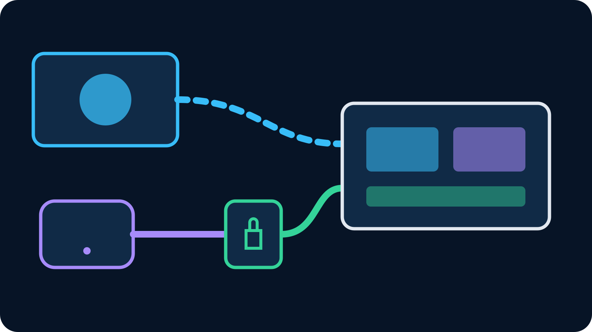

VDO.Ninja is difficult to replace with one universal alternative because its
best feature is its low-friction browser workflow. A guest opens a link,
publishes camera and microphone through WebRTC, and OBS receives the view link
as a Browser Source. When that is the job, VDO.Ninja may still be the best
choice.

Look for an alternative when the remote camera is not a one-time guest but a
named device you expect to use repeatedly. VISP fits that different requirement:
each phone or encoder gets a persistent, independently revocable publishing
path, sends SRT or RTMP through a relay, and appears in OBS as a Media Source.

## The short comparison

| Need | Better starting point |
| --- | --- |
| Invite a guest with one browser link | VDO.Ninja |
| Two-way, very-low-latency conversation | VDO.Ninja |
| Reuse the same field phone across broadcasts | VISP |
| Give every camera a separate revocable credential | VISP |
| Publish from an SRT or RTMP encoder | VISP |
| Keep a browser guest and field cameras in one show | Use both in OBS |

This is not a winner-takes-all comparison. VDO.Ninja is a WebRTC contribution
tool with strong interactive qualities. VISP is a self-hosted relay and control
plane for persistent publishing devices. The right alternative is the one whose
operating model matches the person or camera on the other end.

## Is VDO.Ninja secure?

VDO.Ninja's official [privacy and security documentation](https://docs.vdo.ninja/help/privacy-and-security-details)
says media is normally peer to peer and that it does not store call content.
It also states that connected peers may be able to see one another's IP
addresses, that minimal technical logging exists, and that infrastructure
providers such as Cloudflare may log complete URLs and query parameters. Those
details do not make VDO.Ninja inherently unsafe. They define what must be
protected.

Treat room names, stream IDs and director links as secrets. Use the password
controls rather than making a public link merely hard to guess. VDO.Ninja's
[password documentation](https://docs.vdo.ninja/advanced-settings/setup-parameters/and-password)
explains that a password entered through the interface can remain in the URL
fragment, which browsers do not send to the web server. A password placed in a
normal query string can appear in server logs.

For a fully isolated deployment, VDO.Ninja documents self-hosting not only the
web app but also the supporting signaling and traversal services, including
STUN, TURN and WSS. Self-hosting only the visible page does not automatically
remove every third-party network dependency.

The practical answer is therefore: VDO.Ninja offers a defensible encrypted
WebRTC workflow when links, room names and passwords are handled correctly, but
its peer-to-peer design has different privacy properties from a relay that
terminates authenticated device connections. Choose with those properties in
mind rather than relying on the word “secure” alone.

## Why creators look for a VDO.Ninja alternative

The most common reason is not video quality. It is operational continuity. A
guest link is excellent for a person who appears once. A weekly roaming camera
needs a stable name, a credential that can be rotated without changing every
other source, and an OBS scene that remains ready between sessions.

Other reasons include:

- the field encoder already supports SRT but cannot run a browser reliably;
- the producer wants one-way contribution rather than a call interface;
- every camera should have a separate credential and audit boundary;
- a phone should control selected OBS actions without an exposed inbound port;
- the home studio should keep the Twitch or Kick key away from contributors;
- the source should reconnect to the same OBS Media Source after a network drop.

None of these requirements proves VDO.Ninja is deficient. They describe a
different camera lifecycle.

## How VISP changes the source model

In VISP, the producer creates a video source and gives the publishing device its
send URL. The VISP native app can claim that source automatically, while Moblin,
Larix, IRL Pro and other encoders can use the generated SRT, SRTLA or RTMP URL.
OBS receives a separate read URL. The sender never needs the destination
platform's stream key.

Each device can be revoked independently. If one contributor's publishing URL
leaks, rotate that device rather than rebuilding every camera source. The
account-wide OBS read credential is separate and should be rotated only when
all receiving URLs need replacement.

VISP relay-to-OBS does not transcode. The phone or encoder determines codec,
resolution, frame rate, keyframe interval and contribution bitrate. SRT adds a
packet-recovery window for unreliable networks, but it cannot create bandwidth
through a dead zone. The [video-source documentation](https://docs.visp-stream.com/docs/video-source)
and [encoder setup](https://docs.visp-stream.com/docs/broadcaster-setup) contain
the current settings.

This model is useful for a persistent outdoor phone, venue camera or recurring
contributor. It is less convenient for a spontaneous panel where participants
need to see and hear one another immediately.

## Browser Source versus Media Source

The OBS source type reflects the transport. VDO.Ninja's
[basic workflow](https://docs.vdo.ninja/getting-started/vdo.ninja-basics)
creates a view link that goes into an OBS Browser Source. The browser runs the
WebRTC client and renders the remote media. Each additional peer may create more
encoding or forwarding work depending on the selected room mode.

VISP's SRT path goes into an OBS Media Source. The official
[OBS SRT guide](https://obsproject.com/kb/srt-protocol-streaming-guide) explains
the manual method: clear Local File, put the SRT caller or listener URL in the
Input field, and use MPEG-TS as the input format when required. VISP can also
generate an importable scene collection or add the source through its OBS
plugin.

Neither source type is automatically better. Browser Source gives VDO.Ninja the
web app and interactive controls it needs. Media Source keeps a dedicated video
transport path small and predictable. Use the source type that belongs to the
workflow instead of trying to force every contributor into one technology.

## Latency and reliability are different decisions

WebRTC commonly prioritizes interaction, often preferring a current frame over
waiting to recover older missing data. That behavior suits conversations,
interviews and remote direction. VDO.Ninja's peer-to-peer route can also avoid a
central media relay when both endpoints connect directly.

SRT is designed for contribution across unreliable networks. It uses a latency
window to allow retransmission of lost packets. A larger recovery window can
improve the picture on a jittery mobile path but also adds field-to-studio
delay. For a roaming camera where the producer does not need natural two-way
conversation, that trade can be worthwhile.

Do not compare advertised protocol latency without measuring the whole chain.
Camera capture, encoder queues, network transport, OBS buffering, final encode
and the platform player all add delay. The [SRT versus RTMP guide](/blog/srt-vs-rtmp-phone-camera-obs)
shows how recovery and delay trade against one another.

## When VDO.Ninja is still the right choice

Keep VDO.Ninja when the production values instant onboarding and interaction:

- a guest has only a laptop or phone browser;
- the guest should see or hear the host with conversational timing;
- a producer needs a temporary camera without provisioning an encoder;
- the source will not be reused after the appearance;
- the team understands and protects the room, director and view links.

VDO.Ninja is also free and open source, with a documented self-hosting path.
Those are meaningful advantages. Switching to SRT purely because it sounds more
“professional” can add setup and delay without solving a real problem.

## When VISP is the stronger alternative

Use VISP when the camera behaves more like managed field equipment than a call
participant:

- the same phone returns every week;
- OBS scenes should remain stable between broadcasts;
- each camera needs its own revocable access;
- the contributor should never receive the Twitch or Kick key;
- SRT, SRTLA or RTMP is already available in the encoder;
- the field operator needs selected OBS controls without opening a home port.

VISP's remote controls are intentionally narrower than full OBS WebSocket
automation: start or stop the active stream and switch program scenes through
the paired plugin. That narrower surface is useful for a remote camera operator,
but it is not a replacement for a full production-control system.

## A hybrid show is often the best answer

OBS can receive both source types in the same scene collection. Use VDO.Ninja
for the host and guest conversation. Use VISP for the persistent phone outside
the venue. The producer can cut between them, mix audio and keep the final
Twitch or Kick destination entirely inside OBS.

This hybrid avoids a false migration. The guest keeps the easy link; the field
camera gets a durable credential and transport tuned for mobile contribution.
Only add audio return paths deliberately, with headphones, or the two systems
can create echo.

For a deeper direct comparison, read [VDO.Ninja vs VISP](/blog/vdo-ninja-vs-visp).
If the recurring-device model matches your show, [try VISP](https://app.visp-stream.com)
with one test camera. If a browser link already solves the job, keep VDO.Ninja
and spend the saved setup time on the broadcast.
