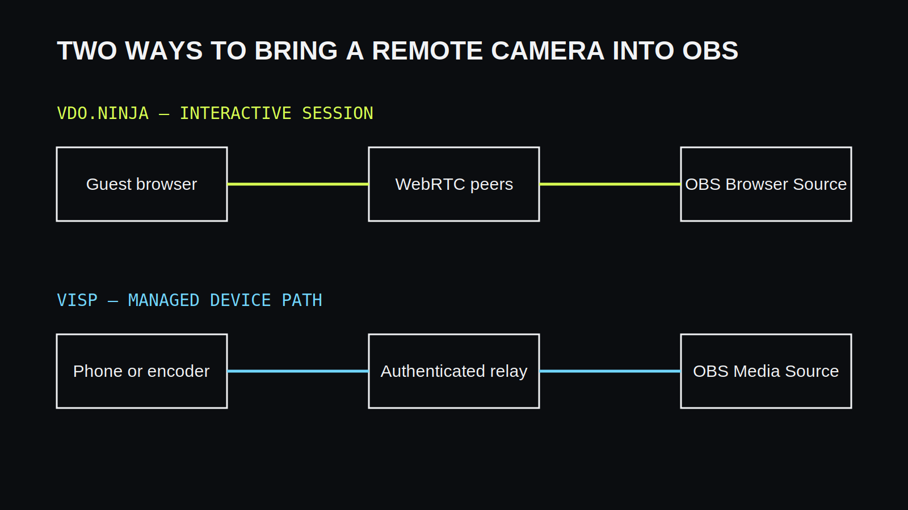

VDO.Ninja ja VISP tuovat molemmat etäkameran OBS:ään, mutta ne painottavat eri
asioita. **VDO.Ninja sopii nopeaan, pieniviiveiseen selainvierailuun. VISP sopii
toistettavaan puhelinkameratuotantoon, jossa laitteilla on pysyvät peruutettavat
polut, SRT-vaihtoehto ja OBS-etäohjaus.**

## Lyhyt vertailu

| Ominaisuus | VDO.Ninja | VISP |
| --- | --- | --- |
| Tavallisin lähettäjä | Selain | VISP-sovellus, selain tai SRT/RTMP-enkooderi |
| Siirtotapa | WebRTC | SRT tai WHIP/WebRTC, tarvittaessa RTMP |
| Painotus | Pieni viive ja tilapäiset vieraat | Toistettavat etäkamerat ja OBS-työnkulku |
| Käyttöoikeus | Huone- ja linkkikohtainen | Käyttäjä- ja laitekohtainen, peruutettava |
| OBS-ohjaus | Erillinen ratkaisu | VISP OBS -lisäosassa |
| Verkkobonding | Ei | Ei |

## Näin VDO.Ninja toimii

VDO.Ninja muodostaa selainten välisiä WebRTC-yhteyksiä ja tarjoaa OBS:lle
selainlähteessä käytettävän linkin. Vieras voi liittyä nopeasti ilman asennusta,
ja suora yhteys voi tuottaa hyvin pienen viiveen. Huoneet, ohjaajanäkymä ja
useiden vieraiden asettelut sopivat keskustelu- ja haastattelutuotantoihin.

WebRTC:n toiminta riippuu kuitenkin verkon sallimista yhteyksistä. Palomuuri tai
rajoitettu mobiiliverkko voi pakottaa liikenteen relay-palvelimen kautta tai
estää sen. Pitkäaikaisen laitteen käyttöoikeus ja sen elinkaari jäävät tuottajan
linkki- ja salasanasuunnittelun varaan.

## Näin VISP toimii

VISP luo jokaiselle kameralle oman tunnistetun julkaisupolun. Natiivisovellus ja
kolmannen osapuolen enkooderit voivat käyttää SRT:tä, selain WHIP/WebRTC:tä ja
rajoitetussa verkossa RTMP:tä. OBS lukee lähteen omilla erillisillä tunnuksillaan.

Laite voidaan nimetä, sen tila näkyy hallintapaneelissa ja sen tunnus voidaan
kierrättää vaikuttamatta muihin kameroihin. VISP OBS -lisäosa lisää lähteitä ja
tarjoaa tunnistetun kohtaus- sekä lähetysohjauksen. Kohdepalvelun lähetysavain
pysyy OBS:ssä.

## Viive ja luotettavuus ovat eri tavoitteita

VDO.Ninjan WebRTC-yhteys pyrkii hyvin pieneen viiveeseen, mikä on tärkeää
keskustelussa. Se saattaa pudottaa laatua tai ruutuja nopeasti verkon
heiketessä. VISPin SRT-polku hyväksyy tarkoituksella suuremman viiveen, jotta
kadonneita paketteja voidaan lähettää uudelleen asetetun ikkunan sisällä.

Kumpikaan ei tee huonosta verkosta hyvää eikä yhdistä Wi-Fiä ja mobiilidataa.
Valitse ratkaisu sen mukaan, onko tärkein tavoite reaaliaikainen keskustelu vai
kenttäkameran tasainen syöte OBS-tuotantoon.

## Turvallisuus ja toistuva käyttö

Tilapäiseen vierailuun kertakäyttöinen huonelinkki voi olla juuri oikea malli.
Toistuvassa tuotannossa pysyvästi nimetty laite, erilliset julkaisu- ja
lukuoikeudet sekä yhden tunnuksen kierrätys helpottavat käyttöoikeuksien hallintaa.

Älä jaa kummassakaan mallissa Twitchin tai Kickin lähetysavainta etäkameralle.
OBS:n pitää omistaa lopullinen jakelu ja valmiin ohjelman asetukset.

## Kumpi kannattaa valita?

Valitse **VDO.Ninja**, kun:

- vieras liittyy selaimella vain yhteen ohjelmaan;
- kaksisuuntainen keskustelu ja pieni viive ovat tärkeimpiä;
- haluat huone- tai ohjaajapohjaisen vierastyönkulun.

Valitse **VISP**, kun:

- sama puhelin tai kuvaaja palaa tuotantoon toistuvasti;
- haluat SRT:n palautusikkunan mobiiliverkkoon;
- tarvitset laitekohtaiset peruutettavat tunnukset;
- haluat lisätä ja ohjata OBS-lähteitä samalla järjestelmällä.

Ratkaisuja voi myös käyttää rinnakkain: VDO.Ninja keskusteluvieraille ja VISP
liikkuville kenttäkameroille.

## Usein kysyttyä

### Korvaako VISP VDO.Ninjan?

Ei kaikissa käyttötapauksissa. VDO.Ninja on vahva selainkeskusteluissa, VISP
toistettavissa etäkamerapoluissa ja OBS-ohjauksessa.

### Kummassa on pienempi viive?

Suora WebRTC-yhteys on tavallisesti pieniviiveisempi. SRT käyttää enemmän
viivettä pakettihäviöstä palautumiseen.

### Tekeekö kumpikaan verkkobondingia?

Ei. Bonding tarvitsee erillisen usean yhteyden lähetys- ja vastaanottoratkaisun.

### Voinko kokeilla VISPiä muuttamatta OBS-tuotantoani?

Kyllä. Lisää VISP-kamera uutena medialähteenä; kohtaukset, grafiikat ja
kohdepalvelun lähetysavain pysyvät ennallaan.

## Lisätietoja

- [VDO.Ninja-dokumentaatio](https://docs.vdo.ninja/)
- [VISP: aloita tästä](https://docs.visp-stream.com/fi/docs/get-started)
