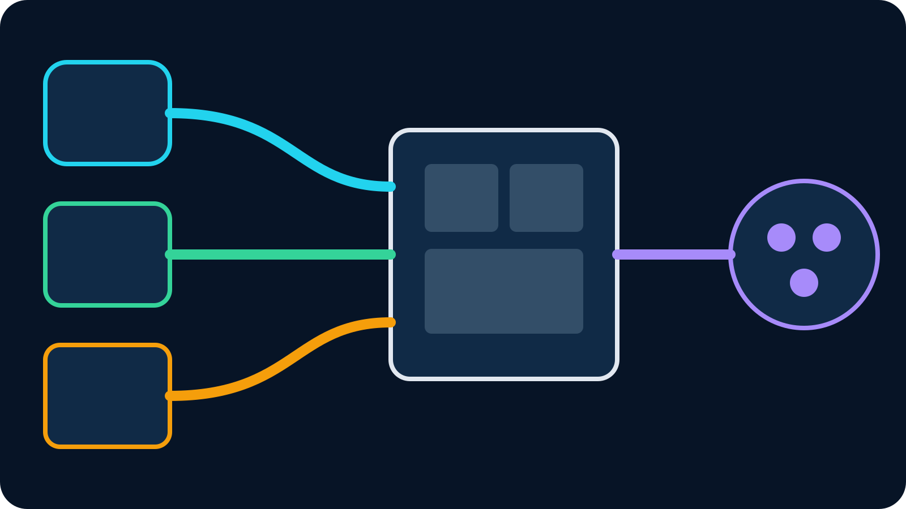

**Videolähde** on yksi suoran tuotannon rakentamiseen käytetty syöte. Se voi olla
puhelimen kamera, kaappauskortti, etävieras, mediatiedosto, verkkosivu tai toisen
tietokoneen ohjelmakuva. OBS yhdistää lähteet sceneihin, miksaa äänen, lisää
grafiikat ja lähettää yhden valmiin ohjelman Twitchiin, Kickiin tai YouTubeen.

“Lähdemateriaali” tarkoittaa yleensä alkuperäistä kameratallennetta tai
kuvalähdettä ennen lopullista leikkausta ja grafiikkaa. “Video src” puolestaan
viittaa usein verkkosivun src-attribuuttiin, joka kertoo videoelementille
ladattavan tiedoston. Puhelinta OBS:ään tuova tekijä tarvitsee tavallisesti
suoran videolähteen, ei HTML-asetusta.

## Videolähde, lähdemateriaali ja valmis ohjelma

Seuraa yhtä kuvaa tuotannon läpi. Puhelin kuvaa katusoittajaa. Puhelimen
enkoodattu kamera- ja mikrofonisyöte on suora lähde. OBS rajaa kuvan, lisää
nimigrafiikan, miksaa musiikin ja leikkaa puhelimen sekä studiokameran välillä.
OBS:n canvas on valmis ohjelma. Puhelimen tai OBS:n tallentamasta tiedostosta
tulee myöhemmin leikattavaa lähdemateriaalia.

| Termi | Merkitys suorassa tuotannossa | Esimerkki |
| --- | --- | --- |
| Videolähde | Yksi tuotanto-ohjelman käytettävissä oleva syöte | Puhelinkamera OBS Media Sourcena |
| Lähdemateriaali | Alkuperäinen tallenne tai syöte ennen lopullista leikkausta | Kameratiedosto tai puhdas etäkuva |
| Scene | Yhden tai usean lähteen tallennettu asettelu | Puhelin koko ruudulla ja chat-grafiikka |
| Ohjelmalähtö | Katsojille lähetettävä valmis miksaus | OBS-striimi Twitchiin tai Kickiin |
| Video src | Verkkokehityksen mediatiedoston osoite | HTML-videoelementille annettu tiedosto |

Ero auttaa vianhaussa. Jos lähde pysähtyy ennen OBS:ää, alustan lähtöbittinopeus
ei korjaa sitä. Jos OBS-esikatselu on tasainen mutta katsojilla puskuroi, lähde
voi olla kunnossa ja vika lopullisessa lähtöosuudessa.

## Miten etäpuhelimesta tulee OBS-lähde

Kaappauskortti toimii, kun kamera ja OBS-kone ovat vierekkäin. Etäpuhelin
tarvitsee kentän ja studion väliin verkosta tavoitettavan pisteen. Puhelin
enkoodaa H.264-videon ja AAC-äänen, julkaisee ne esimerkiksi SRT:llä, ja OBS
vastaanottaa striimin internetin yli.

VISP tarjoaa välipolun. Luo Video sources -näkymässä nimetty laite. Puhelin saa
julkaisuosoitteen ja OBS erillisen lukuosoitteen. Molemmat yhdistävät releelle
ulospäin, joten kotireitittimeen ei avata SRT-porttia. Twitch- tai Kick-avain
pysyy OBS:ssä.

Ajantasainen [VISPin videolähdedokumentaatio](https://docs.visp-stream.com/docs/video-source)
käsittelee lähteen ja tunnusten luomisen. [Enkooderiohje](https://docs.visp-stream.com/docs/broadcaster-setup)
kattaa kolmannen osapuolen sovellukset, SRT-viiveen, SRTLA:n ja OBS-varakuvan.

## Valitse lähettävä laite

Neljä käytännöllistä vaihtoehtoa kattaa useimmat etäkamerat.

**VISPin oma sovellus** on lyhin polku sisäiselle kameralle, striimin tilalle,
chatille ja rajatuille OBS-ohjauksille. Laite otetaan käyttöön ilman koko URL:n
manuaalista kopiointia. Kahden linkin tila kahdentaa paketit Wi-Fi- ja
mobiiliverkkoon vikasietoisuutta varten, mutta ei laske niiden kapasiteettia
yhteen.

**Moblin** on avoimen lähdekoodin iOS-enkooderi, joka tukee SRT:tä, SRTLA:ta ja
muita protokollia. Käytä sitä, kun haluat sen kameraohjaukset tai SRTLA-
monitieyhteyden. [Moblin–OBS-opas](/blog/moblin-remote-camera-obs-srt) näyttää
VISP-lähteen työnkulun.

**Larix Broadcaster** on pitkälle kehitetty mobiilienkooderi, jossa on SRT,
RTMP ja mukautuva bittinopeus. Se sopii yksityiskohtaisia enkoodausasetuksia
tarvitsevalle. Seuraa [Larix SRT -ohjetta](/blog/larix-broadcaster-obs-srt).

**IRL Pro** on Androidin IRL-enkooderi, jolle on dokumentoitu SRTLA-työnkulkuja.
Se voi käyttää VISPin SRT- tai SRTLA-julkaisuosoitetta. Katso
[IRL Pro -opas](/blog/irl-pro-obs-srt).

Myös toinen OBS-tietokone voi toimia lähettäjänä. Silloin se tuottaa yhden
litteän ohjelmakuvan erillisten kameroiden sijaan. [OBS:stä OBS:ään SRT:llä](/blog/obs-to-obs-over-internet-srt)
avaa vaihtokaupan.

## Luo videolähde VISPissä

Kirjaudu sisään, avaa **Video sources**, valitse **Add device** ja nimeä lähde
pysyvän roolin mukaan: “liikkuva Android”, “lavan yleiskamera” tai “vieraan
sisäänkäynti”. Vältä tämän päivän tapahtuman nimeä, jos sama kamera palaa ensi
viikolla.

Hallintapaneeli luo eri tunnukset julkaisuun ja lukemiseen. Kopioi **Add this to
video source** lähettävään enkooderiin. Pidä koko osoite salassa, koska sen
stream ID antaa oikeuden julkaista polkuun. Älä näytä sitä ruutukaappauksissa tai
julkisissa tukiviesteissä.

SRT on oletus, koska se voi lähettää kadonneita UDP-paketteja uudelleen valitun
viiveikkunan sisällä. Käytä Advanced-näkymän RTMP:tä, jos verkko estää UDP:n tai
enkooderi ei tue SRT:tä. Protokollan vaihtaminen ei korjaa yhteyttä, jonka
jatkuva upload on valittua bittinopeutta pienempi.

Vain yksi aktiivinen julkaisija voi omistaa laitepolun. Anna jokaiselle
puhelimelle tai enkooderille oma lähde. Erilliset polut tekevät perumisesta,
seurannasta, OBS-asettelusta ja vianhausta selkeitä.

## Aseta lähde ennakoitavaa välitystä varten

Käytä H.264-videota, AAC-ääntä, vakiobittinopeutta ja kahden sekunnin
keyframe-väliä, ellei ajantasainen enkooderi- tai kohdeohje vaadi muuta. Valitse
resoluutio ja kuvataajuus oikean puhelimen ja reitin testin jälkeen. Vakaa
720p30-lähde on parempi kuin epävakaa 1080p60-lupaus.

VISPin rele–OBS-polku ei transkoodaa. Rele välittää enkooderin lähettämän datan,
joten yhteensopivuus korjataan lähettimessä. Jos OBS ei dekoodaa kuvaa, tarkista
koodekki ja kontti ennen scene-asetusten muuttamista.

Jätä uploadiin marginaalia. Nopeustesti näyttää hetkellisen maksimin, ei
taattua kapasiteettia liikkeessä. Testaa samassa paikassa ja kellonaikaan ja
aseta bittinopeus toistettavan tuloksen alle. [Mobiilibittinopeuden opas](/blog/best-bitrate-irl-streaming-phone-obs)
erottaa kentän uploadin, kodin downloadin ja OBS:n lopullisen uploadin.

## Lisää lähde OBS:ään

Helpoin tapa on VISPin luoma scene collection. Lataa se ja valitse OBS:ssä
**Scene Collection → Import**. Se sisältää varascenen sekä uudelleen yhdistävän
Media Source -scenen jokaiselle aktiiviselle laitteelle.

Manuaalisesti:

1. Näytä ja kopioi laitteen OBS-lukuosoite.
2. Valitse OBS:ssä **Add Source → Media Source**.
3. Poista **Local File**.
4. Liitä lukuosoite **Input**-kenttään.
5. Käytä tarvittaessa **mpegts**-muotoa Input Format -kentässä.
6. Käynnistä puhelin ja varmista kuva sekä ääni OBS:ssä.

Vaiheet noudattavat virallista [OBS:n SRT-ohjetta](https://obsproject.com/kb/srt-protocol-streaming-guide).
OBS-osoite ei ole julkaisuosoite. Väärän tunnuksen antaminen väärälle päälle
aiheuttaa sekavan vian ja rikkoo tarkoitetun erottelun.

VISPin OBS-lisäosa voi myös lisätä nimetyn laitteen ja vastaanottaa rajattuja
etäohjauksia. Se kysyy komennot ulospäin HTTPS:llä, joten studio ei avaa
ohjausporttia internetiin. Puhelin voi vaihtaa ohjelmascenen tai käynnistää ja
pysäyttää aktiivisen OBS-striimin saamatta alustan avainta.

## Sijoita lähde sceneen sen rajat huomioiden

Rajaa ja skaalaa toimiva syöte omassa lähdescenessä. Upota se ohjelmasceneihin
sen sijaan, että sama raaka Media Source kopioidaan moneen paikkaan. Näin väri-,
viive- ja äänimuutokset pysyvät yhdessä.

Pidä vain yksi tarkoitettu äänipolku. Jos sekä Media Source että erillinen
äänikaappaus kuljettavat puhelimen mikrofonia, tuloksena voi olla kaiku. Testaa
kuulokkeilla ja varmista lopullisesta tallenteesta. [Puhelinäänen vianhaku](/blog/fix-phone-audio-obs)
erottaa kaappaus-, rele- ja miksausongelmat.

## Rakenna varakuva puuttuvaa lähdettä varten

Internetlähde yhdistää joskus uudelleen. Katsojalähetyksen ei tarvitse päättyä.
Pidä OBS käynnissä ja näytä paikallinen BRB- tai studioscene lähteen ollessa
pysähtynyt. Advanced Scene Switcher voi reagoida Media Sourcen toistotilaan
pienen viiveen jälkeen.

Testaa katkos ennen lähetystä: käynnistä puhelin, katkaise sen verkko, varmista
paikallinen varakuva, palauta verkko ja odota kuvan sekä äänen vakautumista ennen
takaisin leikkaamista. SRT voi korjata lyhyttä hävikkiä, mutta ei lähetä täydestä
katveesta.

## Suojaa ja ylläpidä lähde

Käsittele julkaisu- ja lukuosoitteita salasanoina. Vaihda yhden laitteen
julkaisuoikeus, kun laite vaihtaa omistajaa tai osoite vuotaa. Vaihda koko tilin
OBS-lukutunnus vain, kun aiot päivittää kaikki sitä käyttävät OBS-lähteet.

Dokumentoi lähteen nimi, lähetyssovellus, koodekki, bittinopeus, suunta ja
palautumistesti, mutta älä salaista osoitetta yhteiseen ajolistaan. Vakaa lähde
ei ole vain kerran toiminut linkki, vaan polku, jonka tiimi osaa tunnistaa,
perua, testata ja palauttaa.

## Koko signaalipolku

Koko ketju on **puhelinkamera → H.264/AAC-enkooderi → SRT- tai SRTLA-julkaisu →
VISP-rele → OBS Media Source → scenet ja äänimiksaus → Twitch, Kick tai YouTube**.

Jos puhelin ja OBS-studio ovat valmiina, [kokeile VISPiä](https://app.visp-stream.com)
luomalla yksi nimetty videolähde. Tallenna ensimmäinen testi OBS:llä, katkaise
verkko kerran ja varmista saman lähteen palaavan. Silloin sinulla on uudelleen
käytettävä videolähde eikä vain olohuoneessa kerran toiminut linkki.
