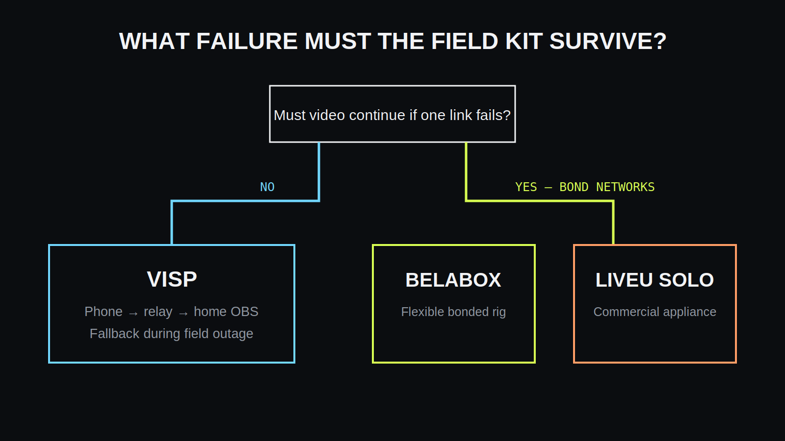

VISP, BELABOX ja LiveU Solo ratkaisevat eri osia IRL-suoratoistosta. **VISP on
ohjelmistopohjainen etäkamerapolku omaan OBS-studioon. BELABOX on rakennettava
lähetin- ja bonding-ekosysteemi. LiveU Solo on valmis kaupallinen
bonding-enkooderi pilvipalveluineen.**

## Mitä kukin järjestelmä ratkaisee?

VISP tunnistaa puhelimen tai enkooderin, välittää syötteen relay-palvelun kautta
OBS:ään ja voi ohjata OBS:ää etänä. Se säilyttää nykyisen kotistudion mutta ei
yhdistä useita verkkoyhteyksiä.

BELABOX yhdistää tyypillisesti pienen Linux-lähettimen, videokaappauksen,
useita modeemeja tai yhteyksiä sekä vastaanottavan Belaboxin tai oman palvelimen.
Se on joustava ja korjattavissa, mutta vaatii laite- ja Linux-osaamista.

LiveU Solo on valmis laite, joka enkoodaa HDMI- tai SDI-kuvan ja jakaa liikenteen
tuettujen yhteyksien yli LiveU-palveluun. Se vähentää rakentamista, mutta lisää
laite-, tilaus- ja palveluriippuvuutta.

## Vertailu rinnakkain

| Ominaisuus | VISP | BELABOX | LiveU Solo |
| --- | --- | --- | --- |
| Päämuoto | Ohjelmisto ja relay | Rakennettava lähetin | Valmis enkooderilaite |
| Verkkobonding | Ei | Kyllä, kokoonpanosta riippuen | Kyllä, tuetulla palvelulla |
| Kamera | Puhelin, selain tai SRT/RTMP-enkooderi | HDMI/USB-kaappaus tai tuettu lähde | HDMI/SDI mallista riippuen |
| OBS-työnkulku | Suora etäkameralähde ja ohjaus | Vastaanotin tuottaa lähteen OBS:lle | Pilvipalvelun ulostulo tai suora kohde |
| Käyttöönotto | Kevyt | Teknisesti vaativa | Valmistajan ohjaama |
| Kustannusrakenne | Palvelu tai itse ylläpito | Osat, modeemit ja palvelin | Laite, yhteydet ja palvelutilaus |

## Miksi bonding muuttaa valintaa?

Bonding ei ole sama asia kuin SRT. SRT voi lähettää yhden yhteyden kadonneita
paketteja uudelleen, mutta jos yhteys katoaa kokonaan, sillä ei ole toista reittiä.
Bonding käyttää useita toisistaan riippumattomia yhteyksiä ja kokoaa liikenteen
vastaanottavassa palvelussa.

Jos kuvaat reitillä, jolla yhden operaattorin peitto katoaa usein, bonding voi
olla ratkaiseva vaatimus. Jos käytössä on yleensä hyvä yhteys ja tärkein tavoite
on saada puhelin nykyiseen OBS-tuotantoon, yksinkertaisempi VISP-polku voi riittää.

## Missä VISP on yksinkertaisempi?

VISP ei vaadi erillistä HDMI-enkooderia, jos puhelin toimii kamerana. Käyttäjä
kirjautuu, luo laitteen ja lisää sen OBS:ään. Kohtaukset, hälytykset, tallennus,
grafiikat ja kohdepalvelun lähetysavain pysyvät kotikoneella.

Sopivia käyttötapoja ovat liikkuva puhelinkamera, etävieras, usean puhelimen
kevyt tuotanto ja tilanne, jossa OBS:ää halutaan ohjata kentältä.

## Missä BELABOX sopii paremmin?

BELABOX sopii rakentajalle, joka haluaa valita kaappauslaitteen, modeemit,
virtaratkaisun ja vastaanottimen itse. Se voi tarjota tehokkaan bonding-polun ja
hyvän korjattavuuden, mutta käyttöönotto, päivitykset ja vianmääritys jäävät
operaattorille.

## Missä LiveU Solo sopii paremmin?

LiveU Solo sopii tuotantoon, joka haluaa valmiin laitteiston, tuetun palvelun ja
ennustettavan käyttömallin. Se on usein perusteltu, kun lähetyksen arvo tekee
kaupallisesta tuesta ja usean yhteyden jatkuvuudesta tärkeämpiä kuin pienestä
alkukustannuksesta.

## Käytännön valintaprosessi

1. **Tarvitsetko oikeasti verkkobondingia?** Jos kyllä, vertaa BELABOXia ja LiveUta.
2. **Haluatko rakentaa ja ylläpitää laitteiston itse?** Jos kyllä, BELABOX voi sopia.
3. **Haluatko valmiin tuetun laitteen?** LiveU Solo on lähempänä tätä tavoitetta.
4. **Onko puhelin kamera ja OBS tuotannon keskus?** VISP on suorin vaihtoehto.
5. **Testaa koko reitti.** Mittaa verkko, lämpö, akku, ääni, palautuminen ja varakohtaus todellisessa ympäristössä.

Voit aloittaa VISPillä ja siirtyä myöhemmin bonding-lähettimeen. OBS-tuotannon
pitämisen kotona ei tarvitse muuttua, jos uusi vastaanotin voidaan lisätä
medialähteeksi.

## Usein kysyttyä

### Voiko VISP yhdistää mobiilidatan ja Wi-Fin?

Ei. VISP välittää yhden julkaisuyhteyden. Bonding vaatii sitä tukevan lähettimen
ja vastaanottavan palvelun.

### Voiko BELABOX lähettää kuvan OBS:ään?

Kyllä, kun vastaanottava pää tuottaa OBS:n tukeman syötteen. Tarkka työnkulku
riippuu valitusta Belabox-kokoonpanosta.

### Korvaako LiveU Solo OBS:n?

Ei välttämättä. Se voi lähettää suoraan kohteeseen tai syöttää tuotantoa, mutta
OBS:ää tarvitaan edelleen, jos haluat sen kohtaukset, grafiikat ja paikalliset lähteet.

### Onko SRT sama asia kuin bonding?

Ei. SRT parantaa yhden reitin kestävyyttä; bonding käyttää useita reittejä.

## Lisätietoja

- [BELABOX-dokumentaatio](https://belabox.net/)
- [LiveU Solo](https://www.liveu.tv/products/create/liveu-solo)
- [VISP: aloita tästä](https://docs.visp-stream.com/fi/docs/get-started)
