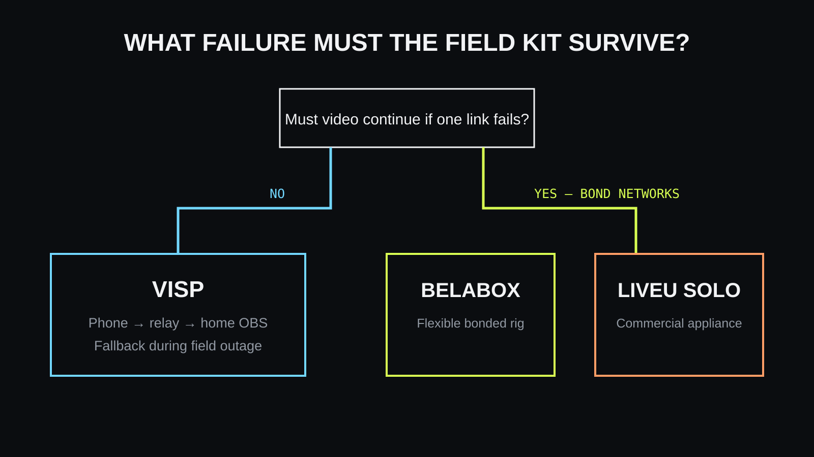

VISP, BELABOX, and LiveU Solo can all carry a field camera toward a live
production, but they are not equivalent products. **Choose VISP when you want a
phone to go live directly or feed an existing home OBS studio. Choose BELABOX when you want a
configurable bonded IRL encoder ecosystem. Choose LiveU Solo when dedicated
commercial hardware and a managed bonding workflow justify the investment.**

The decisive question is how many independent links you need. VISP's native
app has optional network bonding: its SRTLA mode combines the phone's Wi-Fi and
cellular, and the relay also accepts SRTLA from BELABOX or Moblin. A phone still
has only those two links. BELABOX and LiveU are designed around several modems
or interfaces so the encoder can keep sending when one link degrades.

## What each system is trying to solve

VISP is a self-hosted SRT/RTMP relay and control plane with phone and browser
publishers. It authenticates remote cameras, brings their feeds into OBS, and
lets the field operator send commands to the home OBS plugin. By default, VISP
Direct encodes the feed on the relay for Twitch, Kick, or YouTube with no OBS in
the path. In the optional relay-to-OBS workflow, OBS continues to own scenes,
graphics, alerts, encoding to the destination, and the stream key.

[BELABOX](https://belabox.net/) is an IRL encoding system for supported
single-board computers and dedicated hardware. Its defining capabilities are
efficient hardware encoding, SRTLA bonding across several connections,
dynamic bitrate, and remote management. BELABOX Cloud can relay the bonded
feed to OBS. The project serves creators who are willing to assemble or buy a
field encoder and want more control than a phone-only workflow.

[LiveU Solo](https://solohelp.liveu.tv/hc/en-us/articles/16672822061339-Overview-of-the-Solo-PRO)
is a purpose-built hardware encoder used with LiveU's cloud service. Solo PRO
can use several network interfaces with LiveU Reliable Transport to aggregate
bandwidth and improve resiliency. The appliance accepts a camera over HDMI or
SDI depending on model, encodes it, and sends the result through the bonded
uplink.

## Side-by-side comparison

| Question | VISP | BELABOX | LiveU Solo |
| --- | --- | --- | --- |
| Primary field device | iOS/Android phone, browser, or compatible encoder | Supported DIY board or BELABOX hardware | Dedicated LiveU appliance |
| Multiple-network behavior | Optional phone Wi-Fi + cellular bonding (SRTLA or duplicate packets); relay accepts SRTLA senders | SRTLA bonding across several modems | LiveU managed bonding |
| Dynamic bitrate | Depends on publishing app; supported by encoders such as Larix | Core feature | Managed by the LiveU workflow |
| Feed into OBS | SRT/RTMP media source or VISP plugin | SRT from relay to OBS | Cloud workflow to configured destination |
| Existing OBS production stays home | Yes, optionally; Direct needs no OBS | Yes, when relaying to OBS | Possible, depending on chosen destination workflow |
| Remote scene/start controls | VISP OBS plugin | Usually paired with separate production automation | Not VISP-style OBS control |
| Self-hosting | VISP application and relay can be self-hosted | Encoder software is available; cloud capabilities have their own service model | Commercial service |
| Transcoding in VISP path | Direct: one relay encode per destination; relay-to-OBS: none | Encoder handles encoding; cloud capabilities vary | Hardware encoder handles encoding |

This table describes product roles, not a reliability ranking. A phone on one
carrier and a dedicated encoder using several independent carriers are not
operating under the same network constraints.

## Why bonding changes the answer

A normal phone may have Wi-Fi and cellular available, but an application using
one active path is not automatically bonding them. If that path enters a dead
zone, packets cannot reach the relay until connectivity returns. SRT can
retransmit lost packets inside its latency window, and adaptive bitrate can
lower demand, but neither creates a second route to the internet.

Bonding splits or duplicates traffic across independent links and recombines it
at another endpoint. A BELABOX setup might use modems from different carriers,
Wi-Fi, and Ethernet. LiveU Solo similarly uses supported network interfaces
with its cloud transport. When one path becomes poor, the remaining paths may
still carry enough data to keep the stream useful.

Bonding is not magic. Several modems on the same congested tower are not truly
independent, and every link still needs coverage. It also adds hardware,
power, data plans, cables, cooling, and a remote service. Pay that complexity
cost when the production risk calls for it, not because a larger rig looks
more professional.

## Where VISP is simpler

VISP starts with hardware a creator already owns: a phone in the field and a
computer running OBS at home. The phone app receives its publishing destination
after sign-in, while the OBS plugin can add the device to a scene. A browser
publisher is available when installing a native app is not practical.

That is a smaller field kit. It works well for city walks, venue coverage,
remote guests, second cameras, and events where one mobile connection is
usually adequate. If a brief field drop occurs, the home studio can show a
fallback scene, or Direct can hold the platform output on the optional
**Never drop again** BRB card, rather than the destination stream ending.

The limitation is equally simple: the field feed itself can still disappear
until the phone reconnects. Optional bonding in the app can combine or
duplicate the phone's Wi-Fi and cellular, but a phone offers at most those two
links and no external modems. VISP also does not transcode the relay-to-OBS
feed or host the final OBS production. If those are requirements, add the
appropriate layer instead of expecting a relay to imitate it.

## Where BELABOX fits

BELABOX is attractive to technically confident IRL creators who want bonded
uplinks without stepping straight to a traditional broadcast appliance. The
software supports specific hardware platforms, external modems, HDMI capture,
hardware H.265 encoding, SRTLA, and dynamic bitrate. BELABOX Cloud provides
relays and remote control as described by its official site.

This flexibility comes with system ownership. A DIY builder chooses the board,
capture device, modems, antennas, power, enclosure, and cooling, then tests the
whole rig in real conditions. Dedicated BELABOX hardware reduces assembly, but
the creator still manages a more involved kit than a phone.

For a streamer whose content depends on walking through inconsistent coverage,
that work can be justified. For a remote guest sitting on reliable Wi-Fi, it is
probably unnecessary.

## Where LiveU Solo fits

LiveU Solo packages field encoding and bonded transport into commercial
hardware and service. That is useful when a producer wants a supported
appliance, standard camera inputs, known operational controls, and fewer DIY
decisions. It is also easier to specify as part of a professional event kit
where repeatability and support matter.

The trade is commitment to dedicated hardware and the associated service
workflow. A creator should compare the current model, inputs, supported
modems, service terms, output destinations, and local availability directly
with LiveU before purchasing. Those details change more often than the basic
architecture.

Do not choose LiveU only because it is the most appliance-like option. Choose
it because the cost of a failed contribution exceeds the cost and operational
weight of the system.

## A practical decision process

1. **Define the failure you must survive.** Is a fallback scene during a short
   phone outage acceptable, or must live field video continue through one
   carrier failing?
2. **Decide where production happens.** If OBS at home already owns the show,
   all three approaches can contribute to it, but VISP is explicitly built
   around that model.
3. **Count truly independent networks.** Two connections only help when they
   do not share the same failure.
4. **Price the complete field kit.** Include power, mounts, modems, data plans,
   capture, support, and the operator's setup time—not just the encoder.
5. **Test the route before the real stream.** Measure coverage, heat, battery,
   audio, reconnect behavior, and the OBS fallback.

If one good connection and graceful fallback are enough, start with VISP. If
the stream repeatedly enters marginal coverage and you enjoy controlling the
whole rig, evaluate BELABOX. If the production needs an integrated commercial
field encoder and support path, evaluate LiveU Solo.

## Frequently asked questions

### Can VISP bond cellular and Wi-Fi?

Yes, as an option. Under **Settings → Network → Network bonding** in the VISP
app, the default **SRTLA (aggregating)** mode combines both links,
**Broadcast** duplicates every packet over both for failover at roughly double
the data use, and **Main + backup** prefers Wi-Fi. The relay also accepts SRTLA
from BELABOX or Moblin. For more than two links, external modems, or a managed
bonding service, BELABOX or LiveU remain the stronger fit.

### Can BELABOX send video into OBS?

Yes. BELABOX documents cloud relays that receive bonded SRTLA and provide SRT
for OBS or other software. A BELABOX can also send SRTLA to a VISP relay on UDP
5000, which then feeds OBS or Direct.

### Does LiveU Solo replace OBS?

It can send an encoded field feed toward configured destinations, but whether
it replaces or feeds OBS depends on the production design. Keep OBS when you
need its scenes, graphics, alerts, and operator workflow.

### Is SRT the same as bonding?

No. SRT recovers packets and handles jitter over a transport path. Bonding uses
multiple network paths. They can be used together.

### Can I start with VISP and upgrade later?

Yes. OBS remains the production center, so a future bonded encoder can become
another source. Read [how to keep a stream live on a bad mobile
network](/blog/keep-stream-live-bad-mobile-network) before buying hardware.

## Sources and further reading

- [BELABOX official overview](https://belabox.net/)
- [BELABOX Cloud](https://cloud.belabox.net/)
- [LiveU Solo PRO overview](https://solohelp.liveu.tv/hc/en-us/articles/16672822061339-Overview-of-the-Solo-PRO)
- [VISP architecture](https://docs.visp-stream.com/docs/architecture)
- [VISP encoders and fallback](https://docs.visp-stream.com/docs/broadcaster-setup)
