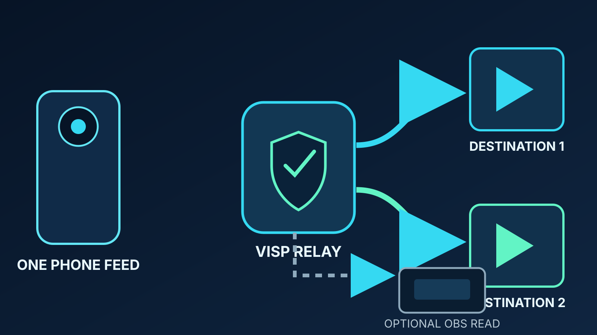

**VISP Direct** sends one publishing device to Twitch, Kick, or both without
putting OBS in the distribution path. Your phone still captures, compresses,
and uploads one feed to VISP. The relay then decodes that contribution and
creates a separate H.264 and stereo AAC distribution encode for every selected
platform.

That makes Direct useful when the phone is the whole production, especially
for a Twitch-and-Kick simulcast. It is not a better version of every VISP
workflow. If your show depends on OBS scenes, alerts, local microphones,
recording, color correction, or a fallback scene, the normal
phone-to-VISP-to-OBS route remains the better fit.

Direct checks relay encoder capacity before Go Live because each destination
consumes one full distribution encode.

## What changes when you turn on VISP Direct?

The ordinary VISP workflow treats the phone as a remote camera:

1. The phone encodes camera and microphone as H.264 and AAC.
2. It publishes one authenticated SRT feed to the VISP relay.
3. OBS reads that feed without VISP transcoding it.
4. OBS mixes the show, encodes the finished program, and sends it to Twitch or
   Kick.

Direct keeps the first two steps and changes the distribution side. The relay
reads the contribution locally, creates a platform-ready encode, and publishes
it with the stream key that VISP retrieves after you authorize that provider.
OBS is no longer required to make the public stream happen.

If you select **Both**, the phone still sends only one contribution. The relay
runs two independent forwarding processes: one for Twitch and one for Kick.
One destination can retry without stopping the other.

The distinction matters. Direct is not stream copying, and it is not a switch
that makes the phone send its existing bits unchanged to a platform. VISP
deliberately re-encodes every destination as H.264 video and 48 kHz stereo AAC.
That gives the relay a consistent distribution format even when phone clients
produce different audio layouts.

## Direct versus the OBS workflow

| Question | VISP Direct | VISP through OBS |
| --- | --- | --- |
| Where is the finished program built? | On the phone; the relay only prepares distribution encodes | In OBS, from the phone feed plus every other source |
| Does the phone make one upload? | Yes, including when Direct targets both platforms | Yes |
| Who encodes for Twitch or Kick? | The VISP relay, once per destination | OBS |
| Can OBS still monitor or record the feed? | Yes, but it reads the original contribution | Yes; OBS also owns the public output |
| Are OBS scenes, alerts, graphics, and local audio included? | Only if they were already composed into the phone feed | Yes |
| Can one platform fail without stopping the other? | Yes; destinations run independently | Depends on the OBS or multistream setup |
| Does VISP bond mobile connections? | No | No |
| Is Direct generally available? | Yes, for Twitch and Kick | OBS remains available as an optional read path |

OBS can continue reading a Direct-enabled device for confidence monitoring or
recording. What it sees is the phone's contribution, not the distribution
encode sent to viewers. Check the actual channel when validating picture,
audio, and platform status.

Do not also send OBS to a platform that Direct already owns. That would create
two publishers using the same platform stream key, and one connection may be
rejected or interrupt the other.

## Who benefits from VISP Direct?

Direct is a strong fit for a creator who wants a simple mobile production and
does not want to keep a home broadcast computer running. A walking stream, a
quick venue update, a practice session, or a single-camera event can all be
complete on the phone.

It becomes more useful for a two-platform stream. A phone does not need to run
two destination encoders or maintain two separate uploads. It sends one
contribution while the relay performs the platform-specific work. The
[battery guide](/blog/visp-direct-mobile-streaming-battery) explains exactly
what this can and cannot save on the phone.

Direct also removes a fragile dependency when nobody is available to operate
the home studio. There is no OBS computer that must remain awake, no scene
collection to load, and no second home upload to the destination. That shorter
operational chain can be attractive for an intentionally simple stream.

Choose Direct when all of these are true:

- one phone or encoder already contains the complete picture and audio;
- Twitch, Kick, or both should receive that same program;
- you do not need OBS to add production elements;
- you accept that the relay performs the destination encodes;
- you have tested the actual field network, temperature, audio, and reconnect
  behavior.

## Who should keep OBS in the path?

Keep the ordinary VISP-to-OBS workflow when the home studio adds something
viewers need. Common examples include alerts, a local host microphone, music,
browser sources, sponsor graphics, multiple cameras, replay, local recording,
or a carefully designed fallback scene.

OBS is also the clearer choice when a producer needs to inspect and correct the
field camera before it becomes public. Direct forwards the program supplied by
the device. It does not provide a server-side scene editor, audio mixer, color
grade, caption system, or moderation delay.

The normal workflow is particularly useful for mobile-network recovery. OBS
can keep the destination broadcast online with a holding scene while the phone
reconnects. Direct retries each destination when the output process fails, but
it cannot invent a replacement picture when the contribution itself is gone.
The [mobile-network resilience guide](/blog/keep-stream-live-bad-mobile-network)
shows how an OBS fallback protects the viewer-facing program.

Choose OBS when any of these are true:

- the phone is one source rather than the complete show;
- a fallback scene must remain public during a field outage;
- someone needs to switch scenes or mix several microphones;
- you need the final local program recording;
- you need per-platform layouts or content rather than the same phone program;
  or
- relay-side distribution encoding is not appropriate for your deployment.

For a detailed phone-as-camera setup, use the
[remote-camera guide](/blog/use-phone-as-remote-camera-obs).

## How provider authorization works

Direct needs permission that the normal VISP relay path never needs: access to
the destination stream key.

When you select **Authorize streaming**, VISP opens the provider's consent
screen. Twitch documents its
[Get Stream Key endpoint](https://dev.twitch.tv/docs/api/reference#get-stream-key)
and requires the `channel:read:stream_key` user scope. Kick exposes the
authenticated channel through its
[public Channels API](https://api.kick.com/swagger/index.html) after the
required channel and stream-key permissions are granted.

At stream start, VISP retrieves the key, constructs the destination URL in
memory, and passes it to the relay forwarding process. The key is not returned
to the web or phone app and is not stored as a separate database value. When
the forwarding process ends, that in-memory destination is discarded.

This is an important boundary: the ordinary relay-to-OBS path still never
touches a Twitch or Kick stream key. Direct is an explicit, per-device option
with additional consent.

Provider permissions can still be revoked at the provider. If that happens,
the affected destination fails and VISP asks you to authorize it again. The
other destination can continue.

## Practical limits to understand before choosing Direct

**Capacity is reserved before publishing.** A Direct destination consumes one
relay forwarding slot and Twitch plus Kick consumes two. If the relay is full,
Go Live is blocked instead of silently starting without a platform output.

**One device owns each provider.** The newest device takes the account's
selected outputs when the previous owner is offline. A running owner is never
interrupted automatically.

**Outputs change only while the device is offline.** Stop publishing before
switching between Off, Twitch, Kick, and Both. This avoids changing
destinations under a live contribution.

**Direct does not bond networks.** SRT can recover packets within its latency
window, but VISP does not combine cellular and Wi-Fi into one resilient
connection. If the mobile uplink disappears, Direct has no media to forward.
Creators who need bonding should add an appropriate network layer; the
[VISP and Speedify guide](/blog/bond-cellular-wifi-visp-speedify) explains one
option without pretending it is built into VISP.

**Direct still encodes on the phone.** The camera, microphone, phone video
encoder, and mobile radio remain active. Direct moves the destination encodes
to the relay; it does not turn live video capture into a low-power task.

**The two platform encodes use relay resources.** Streaming to both doubles
the relay's Direct CPU work and outbound media bandwidth. It does not double
the phone upload.

## Platform rules still apply

Technology does not override platform policy. Twitch permits simulcasting
subject to its
[Simulcast Guidelines](https://help.twitch.tv/s/article/simulcasting-guidelines?language=en_US).
Among other requirements, the Twitch experience must not be worse than the
experience elsewhere, and combined cross-platform activity must not be shown
to Twitch viewers. A private floating chat view on the phone is different from
burning combined chat into the public video.

Kick's current
[Partner Program multistreaming guide](https://help.kick.com/en/articles/11091744-multistreaming-on-the-kick-partner-program)
says partners must enable its Multistreaming toggle for other long-form
platforms and that partner payout is reduced by 50% for the duration of that
session. VISP does not change the toggle for you. Recheck both providers'
current rules before a simulcast because policies can change independently of
VISP.

## How to try VISP Direct

To use Direct:

1. Create or sign in to VISP with Twitch or Kick.
2. Add the phone as its own publishing device.
3. Open **Direct output** in the dashboard.
4. Authorize Twitch, Kick, or both for streaming.
5. While the device is offline, choose **Twitch**, **Kick**, or **Both**.
6. Start the phone contribution and watch each destination's state.
7. Verify the public channel from a second muted device.
8. Stop once, reconnect, and confirm the behavior before relying on it at an
   event.

Use the
[VISP Direct documentation](https://docs.visp-stream.com/docs/direct-output)
for the current controls, states, failure messages, and credential details.

The short decision is this: choose Direct for a complete single-device program
that should reach Twitch or Kick without OBS. Keep OBS when the studio is part
of the show. If the Direct case matches your production, [try VISP](https://visp-stream.com),
create a test device, and validate one private rehearsal before your next live
session.
